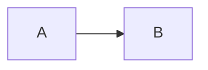

# Agent instructions — prep-bootcamp & reference-site

The same playbook lives in **Cursor**:

- **[`.cursor/rules/reference-topics.mdc`](.cursor/rules/reference-topics.mdc)** (`alwaysApply`) — **Written** reference pages under `reference-site/topics/`.
- **[`.cursor/rules/interactive-teaching.mdc`](.cursor/rules/interactive-teaching.mdc)** (`alwaysApply`) — **Chat** teaching (“teach me X”): roadmap first, one concept per beat, check-in questions—no encyclopedic dumps unless asked.

**Written docs vs chat:** Use **reference-topics** when editing Markdown tutorials. Use **interactive-teaching** when the user is learning in the conversation without requesting a single code fix; both rules can apply in one session if you later capture the chat in a topic page.

## How this relates to other docs

- **[`coordination/PARALLEL_PREP_PLAN.md`](coordination/PARALLEL_PREP_PLAN.md)** + **[`coordination/agent-prep-state.json`](coordination/agent-prep-state.json)** — Parallel-agent rituals, session log, backlog items; append **`sessions[]`** (with **`topicsCovered`** when useful) even for learn-only chats that only touch rules or coordination.
- **[`reference-site/README.md`](reference-site/README.md)** — Canonical **file layout**, **YAML frontmatter** fields, **sidebar / config.ts** registration, **JavaScript lesson URLs** (`/lessons/...` vs `/learnings/...`), symlink note for `lesson-sidebar`, and LeetCode patterns. Follow it for structure and links.
- **[`reference-site/how-to-use-this-repo.md`](reference-site/how-to-use-this-repo.md)** — **Lessons vs reference** mental model and **bidirectional links** (e.g. from `NOTES.md` to a topic folder). When you add a topic, consider a “See also” from the relevant lesson and link from the hub page.
- **This file** — **Body** conventions for interview-oriented topics: **problem-first** opening, rich **Mermaid**, **interview Q&A** closing. Use alongside the README templates (below).

**Opening line:** Prefer leading with the **problem or motivation** (“why this exists”). If the README template says “one sentence — what the concept is,” treat that as a **crisp hook** that can be problem-framed (e.g. “You need X when…”).

When you **add or substantially edit** reference material (especially under `reference-site/topics/`), follow this playbook so every topic reads like a **self-contained tutorial** and stays useful for **interviews**.

## Default shape: tutorial, not a glossary

1. **Start with the problem** — What pain does this idea remove? Who needs it and when? One short paragraph + bullets if helpful. Avoid opening with a definition unless the topic is purely definitional.
2. **Then mechanics** — Mental model, terminology, and **how it works** in order of dependency (simple → nuanced). Add **concrete worked examples** wherever they clarify a distinct step (not only one “hero” example per page): numbers for addressing and math, **traced scenarios** for faults/handshakes/lifecycles, **before/after** for state changes (e.g. COW, remapping). If a section is still abstract after a diagram, that is a signal to add a small table or walkthrough.
3. **Then practice** — Links to LeetCode / exercises when relevant; minimal **working** snippets.
4. **End with interview Q&A** — A dedicated section: **common questions**, crisp answers, and “gotchas” interviewers like (tradeoffs, UB, complexity, when *not* to use X).

If the topic is cross-language, say **when each language’s approach wins** and keep comparisons honest (no strawmen).

## Mermaid diagrams

Use **Mermaid** liberally where it beats prose:

- **Flowcharts** — Control flow, dispatch, pipelines, algorithm steps.
- **Sequence diagrams** — Caller/callee, async handoffs, layered systems.
- **State / timeline** — Lifecycles, parsing phases, protocol states.
- **Simple graphs** — Data structures, hierarchies, memory layout relationships.

Keep diagrams **small and readable** (few nodes per diagram). Prefer **two focused diagrams** over one giant chart.

This site uses VitePress with Mermaid enabled; use fenced blocks:

````markdown

````

## Code snippets

- Prefer **short, copy-pasteable** snippets that compile or run in context; label language on the fence (` ```cpp `, ` ```python `, etc.).
- Show **one minimal example** before a “fuller” variant if the topic is heavy.
- For interviews: include **at least one** “how you’d explain this on a whiteboard” fragment (pseudocode or tiny real code).
- Match **existing pages** in this repo for tone and depth unless the user asks otherwise.

## Interview Q&A section

Every substantial topic page should include a section like **“Common interview questions”** (or equivalent) with:

- **What / why / tradeoffs** — Not only “what is X?” but “when would you avoid X?”
- **Failure modes** — UB, performance cliffs, wrong API usage.
- **Comparison hooks** — “X vs Y,” “how does language A do what B does?”
- **Implementation angle** — “How would you implement…?” when it fits the topic (e.g. vtables, hash tables, iterators).

Answers should be **scannable**: short paragraphs or bullets, not essay walls.

## Reference-site housekeeping

When adding a **new** topic page:

1. Create `reference-site/topics/<slug>/index.md` with YAML frontmatter (`title`, optional `sidebar_order`, `languages`, etc.) consistent with sibling pages.
2. Register the page in **`reference-site/.vitepress/config.ts`** (sidebar entry under the right group — e.g. language hub or “Cross-language topics”).
3. Link it from the relevant **hub** (e.g. `topics/cpp/index.md`, `topics/python/index.md`) and, if it’s a flagship explainer, consider a **one-line link** from `reference-site/index.md` features.
4. Verify the site: from repo root **`npm run dev:reference`** (see root [`README.md`](README.md)) or **`cd reference-site && npm run dev`**; run **`npm run build`** in `reference-site/` before finishing and fix any broken links or build errors.

**Mermaid:** Topic Markdown supports fenced **`mermaid`** blocks (`vitepress-plugin-mermaid`). Confirm diagrams render in dev or build (see [`how-to-use-this-repo.md`](reference-site/how-to-use-this-repo.md)).

## What to skip unless asked

- Long historical essays or standards archaeology unless the user wants depth.
- Drive-by refactors of unrelated files.
- Replacing clear diagrams or code with vague prose.

---

**Summary:** Lead with **the problem**, teach **the idea**, support with **Mermaid + code**, close with **interview Q&A** — then wire the page into **VitePress** and hubs.
