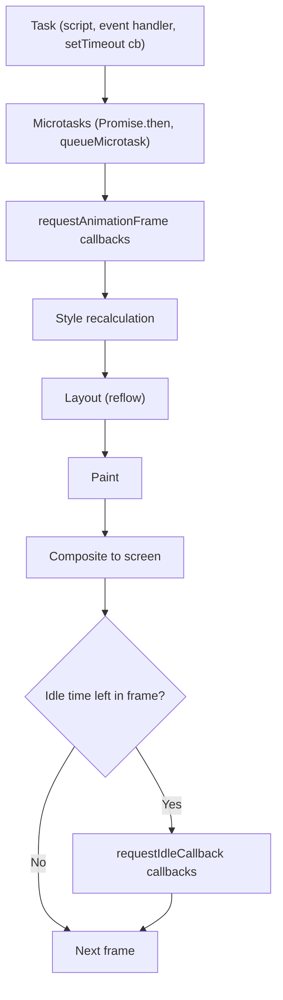
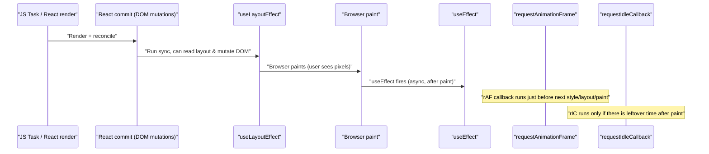
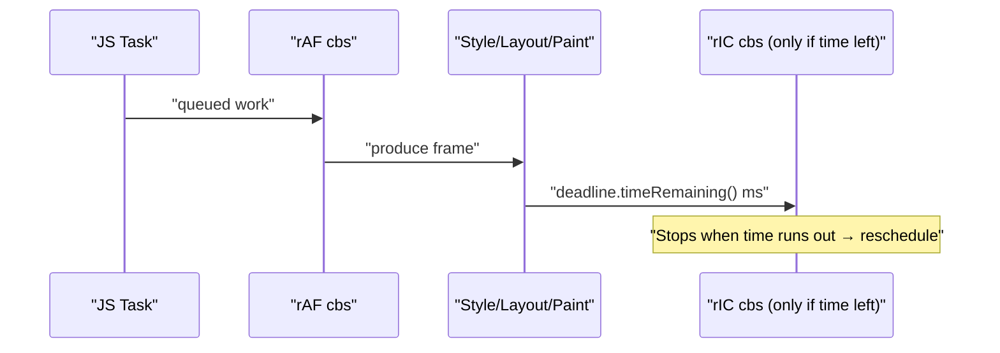
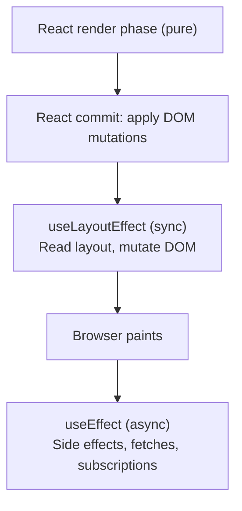
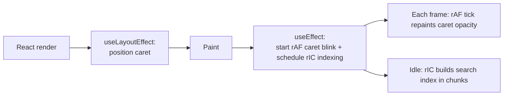

# Lesson 3 — Frame Scheduling: `requestAnimationFrame`, `requestIdleCallback`, `useLayoutEffect`

> Three APIs, one timeline. Learn where each one lives in the browser's per-frame pipeline and you stop guessing about jank, flicker, and "why didn't my measurement work?"
>
> Companion reference page: [`browser-frame-pipeline`](../../../../reference-site/topics/browser-frame-pipeline/index.md). Foundations: [Lesson 1 — async generators & event loop](../01-async-generators/NOTES.md).

---

## 1. The mental model — one frame, in order

Browsers aim for ~60fps → one frame ≈ **16.67ms**. Per tick the browser does roughly:



- **`requestAnimationFrame` (rAF)** — fires **right before** style/layout/paint. Use for **visual** updates that must hit the next frame.
- **`requestIdleCallback` (rIC)** — fires **after paint** *only if there's slack*. Use for **non-urgent background work**.
- **`useLayoutEffect`** — React's hook that runs **after DOM mutation, before paint**. Use to **measure & fix layout** without flicker.



---

## 2. `requestAnimationFrame` — animations & DOM read/write batching

### Why it exists
`setInterval(fn, 16)` guesses at the refresh rate. `rAF` syncs your callback to the browser's *actual* paint cadence (60/120/144 Hz, paused when tab hidden).

### Smooth motion (frame-rate independent)

```js
let last = performance.now();
let x = 0;
function step(now) {
  const dt = (now - last) / 1000;  // seconds
  last = now;
  x += 100 * dt;                   // 100 px/sec, regardless of fps
  box.style.transform = `translateX(${x}px)`;
  requestAnimationFrame(step);
}
requestAnimationFrame(step);
```

### Batching reads/writes (avoiding layout thrashing)

```js
// BAD — interleaved read/write forces layout each iteration
items.forEach(el => {
  const w = el.offsetWidth;            // READ → forces layout
  el.style.width = (w * 2) + 'px';     // WRITE → invalidates layout
});

// GOOD — read all, then write inside one rAF
const widths = items.map(el => el.offsetWidth);
requestAnimationFrame(() => {
  items.forEach((el, i) => { el.style.width = (widths[i] * 2) + 'px'; });
});
```

### When to reach for it
- Canvas / WebGL / game loops
- JS-driven scroll, drag, parallax
- Coalescing many DOM mutations into a single paint

### Gotchas
- Heavy rAF callbacks still block the frame.
- Doesn't fire when the tab is hidden — fall back to `setTimeout` for background ticks.
- Setting a style inside `rAF` doesn't paint *immediately*; it's just included in the upcoming paint.

---

## 3. `requestIdleCallback` — "do this when the browser is bored"

### Why it exists
For work that's **important but not urgent**: prefetching, telemetry, indexing, idle hydration. You get a `deadline` so you can yield before stealing time from user input.

### Chunked work

```js
const bigList = /* 100,000 items */;
let i = 0;

function processChunk(deadline) {
  while (i < bigList.length && deadline.timeRemaining() > 1) {
    doExpensiveWork(bigList[i]);
    i++;
  }
  if (i < bigList.length) requestIdleCallback(processChunk);
}

requestIdleCallback(processChunk, { timeout: 2000 });
// timeout: if 2s pass without idle time, run anyway
```

### Lifecycle vs `rAF`



### Gotchas
- **Not in Safari** — polyfill with `setTimeout(cb, 1)` and a synthetic `deadline` object.
- Mutating the DOM here triggers another layout/paint cycle.
- Use the `timeout` option to avoid starvation on busy pages.

---

## 4. `useLayoutEffect` vs `useEffect`

| Hook              | Fires when                                     | Blocks paint? |
|-------------------|------------------------------------------------|---------------|
| `useEffect`       | **After** the browser paints                   | No (async)    |
| `useLayoutEffect` | After DOM mutation, **before** the browser paints | Yes (sync) |

### React's place in the timeline



### The flicker problem (and the fix)

```jsx
// BAD: useEffect → user sees tooltip jump from (0,0) to correct position
useEffect(() => {
  const t = targetRef.current.getBoundingClientRect();
  const me = ref.current.getBoundingClientRect();
  setPos({ top: t.top - me.height, left: t.left });
}, []);

// GOOD: useLayoutEffect → measurement & re-render happen before paint
useLayoutEffect(() => {
  const t = targetRef.current.getBoundingClientRect();
  const me = ref.current.getBoundingClientRect();
  setPos({ top: t.top - me.height, left: t.left });
}, []);
```

### When `useLayoutEffect` is the right tool
- Measuring DOM (`getBoundingClientRect`, `offsetHeight`) and adjusting size/position.
- Synchronizing with imperative libraries that mutate the DOM (canvas, charting).
- FLIP animations whose start state depends on measured layout.

### Gotchas
- Sync + blocks paint → keep work minimal.
- SSR warns (no DOM); guard with `typeof window !== 'undefined'` or use `useEffect`.
- In concurrent React, avoid using it for non-layout work.

---

## 5. Putting them together — a worked example

```jsx
function MagicInput({ corpus }) {
  const inputRef = useRef(null);
  const caretRef = useRef(null);

  // 1. useLayoutEffect: measure input & position caret BEFORE paint
  useLayoutEffect(() => {
    const { left, top, height } = inputRef.current.getBoundingClientRect();
    caretRef.current.style.transform = `translate(${left}px, ${top}px)`;
    caretRef.current.style.height = `${height}px`;
  });

  // 2. requestAnimationFrame: smooth caret blink
  useEffect(() => {
    let raf, visible = true, last = performance.now();
    const tick = (now) => {
      if (now - last > 500) { visible = !visible; last = now; }
      caretRef.current.style.opacity = visible ? '1' : '0';
      raf = requestAnimationFrame(tick);
    };
    raf = requestAnimationFrame(tick);
    return () => cancelAnimationFrame(raf);
  }, []);

  // 3. requestIdleCallback: build a search index without blocking typing
  useEffect(() => {
    const handle = requestIdleCallback((deadline) => {
      const idx = {};
      let i = 0;
      while (i < corpus.length && deadline.timeRemaining() > 1) {
        idx[corpus[i].id] = corpus[i].text.toLowerCase();
        i++;
      }
      window.__searchIndex = idx;
    }, { timeout: 3000 });
    return () => cancelIdleCallback(handle);
  }, [corpus]);

  return (
    <>
      <input ref={inputRef} />
      <span ref={caretRef} className="caret" />
    </>
  );
}
```



---

## 6. Interview Q&A (cheat-sheet)

- **`useLayoutEffect` vs `useEffect`?** — Layout effect runs sync **before paint**, regular effect runs async **after paint**. Use layout effect only when needed (measuring/positioning) to avoid flicker.
- **`rAF` vs `setInterval(fn, 16)`?** — rAF is synced to the actual refresh, paused when the tab is hidden, gives a high-res timestamp, and runs before paint atomically with the frame.
- **`rAF` vs `rIC`?** — rAF = before paint (visual, urgent). rIC = after paint, only if idle (background, non-urgent).
- **Why does `useLayoutEffect` warn in SSR?** — There's no layout in Node; the hook's whole point (measure + sync mutate before paint) is meaningless server-side.
- **Layout thrash, and how do these APIs help?** — Interleaving DOM reads with writes forces multiple layouts per frame. Batch reads, then writes, in one `rAF` (or `useLayoutEffect`) callback.
- **Polyfilling `requestIdleCallback`?** — `setTimeout(cb, 1)` with a synthetic `deadline = { timeRemaining: () => Math.max(0, 50 - (performance.now() - start)) }`.
- **Can `useLayoutEffect` cause perf problems?** — Yes; it blocks paint. Keep it minimal — measure + tweak, no fetches or heavy compute.

---

## What comes next

- **FLIP animations** — `getBoundingClientRect` + `useLayoutEffect` + `rAF` to animate from any layout change.
- **Concurrent React + paint timeline** — how `useTransition` / Suspense interact with the commit phase.
- **Worker offloading vs `requestIdleCallback`** — when to fully escape the main thread (see [`02-workers`](../02-workers/README.md)).
