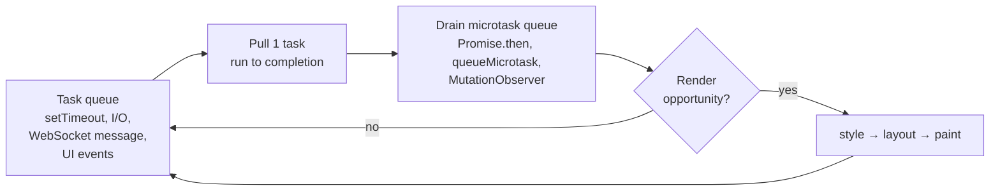
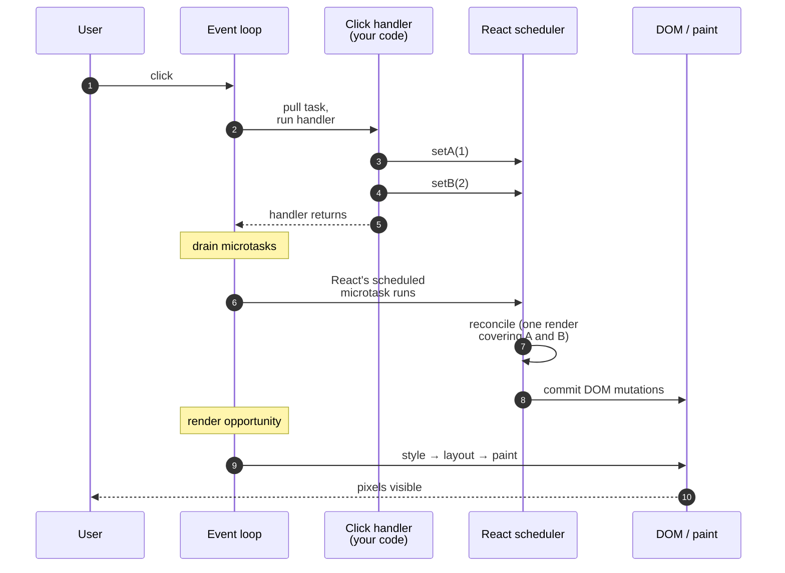

# Browser event loop — microtasks, render, real-time UIs

> One thread. Two queues. One render step. Every freeze, every "why didn't my DOM update?", every React batching question collapses into this picture.

## The problem

You're building a price grid for traders. The backend pushes ticks over WebSocket. Each tick is tiny:

```js
{ symbol: "AAPL", px: 187.42, ts: 1714512345 }
```

You wire it up the obvious way:

```jsx
ws.onmessage = (e) => {
  const tick = JSON.parse(e.data);
  setPrices(prev => ({ ...prev, [tick.symbol]: tick.px }));
};
```

Locally with 10 ticks/sec the UI is gorgeous. In production, 5000 symbols update at ~200 ticks/sec aggregate. The page **freezes**. Scrolling stutters. Clicks feel like the tab is dead. CPU pegged.

Each `setState` is microseconds of work. The handler does nothing expensive. The network is fine. There is no infinite loop. So **what is the browser doing for the seconds it's unresponsive?**

The answer is not "too many re-renders." That's a symptom. The cause is how the browser **schedules work** between your code and the screen. Once you see the schedule, you understand:

- Why `Promise.then` runs **before** `setTimeout(0)` even when the timer was set first.
- Why React 18 batches state updates "automatically" — and what triggers a flush.
- Why `requestAnimationFrame` exists at all.
- Why every real-time UI eventually grows a **coalescing layer**.

That's the topic.

## Mental model — one thread, two queues, one render

The browser runs **one** JavaScript thread per tab. That thread does, in a loop, forever:

1. Grab one **task** from the **task queue** (a.k.a. macrotask queue) and run it to completion.
2. Drain the **microtask queue** to empty (microtasks can enqueue more microtasks; keep going until empty).
3. If it's time to render, do **render work** (style → layout → paint), then commit pixels to the screen.
4. Go back to step 1.



Three rules fall out of the picture:

- **One task = one atomic unit of "blocking" the UI.** If your task takes 800 ms, nothing else happens for 800 ms — no clicks, no paint, no other timers. That's the freeze.
- **Microtasks run *before* the browser even considers rendering.** A microtask that schedules another microtask delays paint indefinitely. (This is real — `Promise` chains can starve the UI.)
- **Render is *opportunistic*, not guaranteed every loop.** The browser usually targets ~60 fps (a render every ~16.7 ms), and only renders if it has time and the page is visible.

The "task queue" is technically several queues — timers, network, DOM events — but for interview purposes treating it as one is fine.

### What goes where

| Source | Queue |
| --- | --- |
| `setTimeout`, `setInterval` | task |
| `setImmediate` (Node only) | task |
| Click / keydown / input | task |
| `WebSocket.onmessage`, `XHR` callbacks, `fetch` resolution | task |
| `Promise.then` / `.catch` / `.finally` callbacks | **microtask** |
| `await` continuations | **microtask** |
| `queueMicrotask(fn)` | **microtask** |
| `MutationObserver` callback | **microtask** |
| `requestAnimationFrame` callback | **render step** (just before paint) |
| `requestIdleCallback` | render-adjacent, only when idle |

## Order of operations — a trace that surprises people

Here's the canonical interview snippet:

```js
console.log('A');

setTimeout(() => console.log('B'), 0);

Promise.resolve().then(() => console.log('C'));

console.log('D');
```

Output: `A D C B`.

Trace it through the model:

1. The script itself is the current task. Run it top-to-bottom.
2. `console.log('A')` → prints **A**.
3. `setTimeout(..., 0)` → enqueues "log B" on the **task queue** (with a 0 ms minimum delay; "0" is a lower bound, not a guarantee).
4. `Promise.resolve().then(...)` → enqueues "log C" on the **microtask queue**.
5. `console.log('D')` → prints **D**.
6. The current task ends. **Drain microtasks** → run "log C" → prints **C**.
7. Loop iteration ends. (Maybe a render here. Nothing visible changed, so no paint cost.)
8. Next task pulled from the task queue → "log B" → prints **B**.

Variation: what if the microtask schedules another microtask?

```js
console.log('A');
Promise.resolve().then(() => {
  console.log('C1');
  Promise.resolve().then(() => console.log('C2'));
});
setTimeout(() => console.log('B'), 0);
console.log('D');
```

Output: `A D C1 C2 B`. The microtask queue drains **to empty** before the loop moves on. C2 enqueued during C1 is still drained before B (the next task) runs. This is the lever you pull when something must happen "right after the current task, but before paint."

It's also the lever you can **abuse**: an infinite chain of `Promise.resolve().then(loop)` will starve the render step and freeze the page even though nothing is "blocking" in the synchronous sense.

## Where rendering fits in

Render is **not** a queue you enqueue into. It's a step the loop optionally performs between tasks, throttled to (roughly) the display refresh rate. Three things to know:

### `requestAnimationFrame` runs **just before** paint

```js
function tick() {
  // runs after microtasks of the previous task,
  // and just before the browser paints.
  drawCanvas();
  requestAnimationFrame(tick);
}
requestAnimationFrame(tick);
```

That timing makes rAF the correct place to:

- Read current layout (it's stable; nothing else is mutating).
- Write batched DOM updates (they'll be picked up by the very next paint, no extra reflow).

### React 18 batching — what the loop sees

In React 17, only events React owned (synthetic events, lifecycle methods) batched updates. State updates inside a `setTimeout` or `Promise.then` each triggered a re-render.

In React 18 (with `createRoot`), **automatic batching** wraps any state update set during the same task — including timeouts, promises, and native event handlers. React schedules the actual render via a microtask. The full handler-to-pixel timeline:



Read it left-to-right: one click = one task = one handler = one microtask-scheduled render = one paint. Two `setState` calls in the same task collapse into one render. That's automatic batching.

Code shape:

```jsx
function handleClick() {
  setA(1);          // schedules a render
  setB(2);          // coalesced
  setTimeout(() => {
    setC(3);        // also batched (R18) within this task
    setD(4);
  }, 0);
}
```

That's one render for `A`/`B`, one render for `C`/`D` — not four. Important interview answer: "React doesn't render synchronously inside `setState`. It schedules the render and flushes during the microtask drain (or sooner if you call `flushSync`)."

### `flushSync` — the escape hatch

If you must read DOM after a state update *now*:

```js
import { flushSync } from 'react-dom';

flushSync(() => setOpen(true));
modalRef.current.focus(); // DOM is committed by the time we get here
```

It forces a synchronous render-and-commit, breaking batching. Use sparingly; it defeats the optimization.

## Layout thrash — sync read after sync write

Read this loop and predict its cost:

```js
const items = document.querySelectorAll('.row');
for (const el of items) {
  el.style.width = (el.offsetWidth + 10) + 'px';
}
```

For 1000 rows you'd guess ~milliseconds. Reality: hundreds of milliseconds, sometimes a full second. Why?

`offsetWidth` is a **layout-forcing read**. The browser must give you a *correct* answer, which means flushing any pending style/layout invalidations. The previous iteration just *wrote* `width`, invalidating layout. So every read forces a full layout pass. 1000 iterations × full layout = quadratic-ish work.

**The fix: separate reads from writes.**

```js
const items = document.querySelectorAll('.row');
const widths = Array.from(items, el => el.offsetWidth); // all reads first
for (let i = 0; i < items.length; i++) {
  items[i].style.width = (widths[i] + 10) + 'px';        // then all writes
}
```

Same number of reads and writes. One layout pass instead of 1000. This is "layout thrashing" and it appears under names like *forced synchronous layout* in DevTools.

Layout-forcing reads include: `offsetTop/Left/Width/Height`, `clientTop/...`, `scrollTop/...`, `getBoundingClientRect()`, `getComputedStyle()`, `el.focus()` in some cases.

## The HRT pattern — coalescing high-frequency events

Back to the freezing price grid. The fix is not "make `setState` faster." It's "**don't render more often than the screen refreshes**." The screen does 60 fps. Rendering 200 times per second is 140 wasted renders per second, every one of them eating the main thread.

Pattern: **coalesce ticks per animation frame**.

```jsx
import { useEffect, useRef, useState } from 'react';

function usePriceGrid(ws) {
  const [prices, setPrices] = useState({});
  const buffer = useRef({});
  const scheduled = useRef(false);

  useEffect(() => {
    function flush() {
      scheduled.current = false;
      const next = buffer.current;
      buffer.current = {};
      setPrices(prev => ({ ...prev, ...next }));
    }

    function onMessage(e) {
      const tick = JSON.parse(e.data);
      buffer.current[tick.symbol] = tick.px;       // merge by symbol
      if (!scheduled.current) {
        scheduled.current = true;
        requestAnimationFrame(flush);              // at most one flush per frame
      }
    }

    ws.addEventListener('message', onMessage);
    return () => ws.removeEventListener('message', onMessage);
  }, [ws]);

  return prices;
}
```

What changed:

- 200 ticks/sec arrive as 200 task-queue events (we can't change that).
- **Inside** each task we mutate a ref-held buffer (cheap, no render).
- We schedule **one** rAF per frame; the flush merges everything since the last frame into one `setState`.
- Steady state: ~60 renders/sec instead of ~200, and each render touches every changed symbol exactly once.

If a symbol gets two ticks in the same frame, the **latest price wins** by virtue of the object-key overwrite. For prices that's correct (you want the latest); for an event log you'd append to an array instead.

**Tradeoff to flag in interview:** coalescing introduces up to ~16 ms of latency between tick and pixel. For HFT-class displays you might prefer a bigger buffer (say, render every 5th frame) for more CPU headroom; for "trader monitoring a watchlist" 16 ms is invisible. Name the tradeoff explicitly.

### Variants worth knowing

| Scheduler | When it flushes | Latency floor | Use when |
|---|---|---|---|
| `requestAnimationFrame` | just before next paint | up to ~16 ms (one frame) | the **default** for visual updates; pixel-aligned, never wastes a render |
| `queueMicrotask` | end of current task, before paint | sub-millisecond | the update **must** be visible **this** frame (e.g. cleanup before user sees an inconsistent state) |
| `setInterval(fn, 50)` | every 50 ms wall-clock | up to 50 ms | predictable cadence, but pixel-misaligned and may render twice in one frame or skip a frame |
| `requestIdleCallback` | when main thread is idle | unbounded (could be seconds) | non-critical UI like badge counts, prefetch — never competes with rendering |

The right answer for the price-grid is **`requestAnimationFrame`**: it's pixel-aligned by definition (one flush per frame, never more), and the up-to-16 ms latency is invisible to a human watching prices. Reach for `queueMicrotask` only when you need *this* frame; reach for `requestIdleCallback` only for things the user won't notice if they're late.

## Practice

- **LeetCode-style**: write `debounce(fn, ms)` and `throttle(fn, ms)` from scratch. Then write `coalesceByKey(fn)` (the rAF pattern above) — it's the same shape with a different scheduler.
- **DevTools drill**: open the Performance tab on any busy site, record 5 seconds, look for purple "Recalculate Style" / "Layout" bands stacked under one task. That's layout thrash in the wild.
- **Repo bridge**: clone the repo and run `apps/shared-rpc-ticker` (the v0 streaming UI). Watch how it calls `setState` per tick — predict where it would freeze under 200 ticks/sec, then apply the coalescing hook above and measure the difference. Pair with the [Web Workers exercises](/lessons/javascript/02-workers/README) once you want to push parsing off the main thread.

## Interview Q&A

### What's the difference between microtasks and macrotasks?

A *task* (macrotask) is one unit of work pulled from the task queue and run to completion — script execution, timer callbacks, I/O, UI events. After each task completes, the engine drains the **microtask** queue to empty before considering rendering or pulling the next task. Microtasks come from `Promise.then`, `await` continuations, `queueMicrotask`, and `MutationObserver`.

The practical consequence: code in `Promise.then` runs **before** code in `setTimeout(0)` even when the timeout was scheduled first, because microtasks drain before the loop pulls the next task.

### When does the DOM actually update on the screen?

It commits to pixels during the **render step**, which the loop performs *between tasks*, throttled to roughly the display refresh rate. So a `setState` or a direct DOM mutation **does not** repaint synchronously. It marks layout/paint as dirty; the next render opportunity flushes it.

If you need to read DOM after an update, your options are: wait for the next `requestAnimationFrame`, await a microtask boundary that gives React a chance to commit, or call `flushSync` to force a synchronous render.

### Why does a `Promise` chain freeze my UI even though it's "async"?

Microtasks run **before** the browser paints, and the queue drains until it's *empty*. If each microtask schedules another microtask, the queue is never empty. The render step never runs. The page freezes despite no synchronous loop. The fix is to break the chain with a real task — `setTimeout(fn, 0)` — which yields to the loop and lets a render happen.

### What's a "long task" and why does Lighthouse flag >50 ms?

Anything > 50 ms of blocking work on the main thread. The threshold comes from the **input-response budget**: at 60 fps you have ~16.7 ms per frame, and the user expects clicks/keys to feel instant (<100 ms). A 50 ms task means at least one frame is dropped and any input that arrives during the task waits at least that long. Real-time UIs accumulate long tasks if they don't coalesce.

### How would you render 1000 ticks/sec without freezing the UI?

Coalesce: write each tick into a ref-held buffer keyed by symbol; schedule **one** `requestAnimationFrame` flush per frame; in the flush, do a single `setState` with the merged delta. Steady state is ~60 renders/sec regardless of input rate. Mention the latency tradeoff (one frame ≈ 16 ms) and that for very large grids you should also virtualize the row list (`react-window` etc.) so the renderer doesn't reconcile thousands of off-screen rows.

If pressed, layer in: backpressure on the WS (stop reading or drop intermediate ticks), worker offload (parse JSON in a Worker via [`learnings/javascript/lessons/02-workers/`](/lessons/javascript/02-workers/README)), and `transferable` `ArrayBuffer` if the tick stream is binary.

### What does `flushSync` do and when would you use it?

`flushSync(() => setX(...))` forces React to render-and-commit synchronously inside the call instead of scheduling. Use it when the next line of code must read the *post-update* DOM (focus management after opening a modal, scrolling to a freshly-rendered element). It defeats automatic batching, so it's noticeably more expensive — never wrap it around an event handler globally.

### What's "layout thrashing"?

A pattern where you alternate writes (e.g. `el.style.width = ...`) and layout-forcing reads (e.g. `el.offsetWidth`) in a loop. Each read must return correct values, which forces a synchronous layout pass after the previous write. Linear loops become quadratic-ish in time. Fix: do all reads first, then all writes (the "read-then-write" or "rAF read / write" pattern).

### Are timers accurate?

No. `setTimeout(fn, 50)` is a **lower bound**: at least 50 ms before `fn` becomes eligible to run. Actual delivery depends on the task queue length, current task duration, throttling on background tabs (browsers clamp `setTimeout` to ≥1 s when the tab is hidden), and minimum nesting clamps (≥4 ms after several nested timeouts). For high-frequency UI work, prefer `requestAnimationFrame` (vsync-aligned) over `setInterval`.

### Microtask vs `setTimeout(0)` — pick one for "run after current task but soon"

`queueMicrotask(fn)` if the work must happen **before paint** of the current frame (e.g. cleanup that the user must not see an intermediate state for). `setTimeout(fn, 0)` if you want to **yield** to the renderer and any pending input — i.e. specifically *let the page paint and respond before you continue*. Microtask = "right after this." `setTimeout(0)` = "after this, after a paint, after any waiting input."

## See also

- [Frame pipeline — `rAF`, `rIC` & `useLayoutEffect`](../browser-frame-pipeline/) — the next layer above this: where each scheduling API sits in the per-frame pipeline, flicker-free measurement, and idle background work.
- [`this` binding](../javascript-this-binding/) — how event-handler `this` interacts with the task that fired it.
- [Iterators & generators](../iterators-and-generators/) — `for await` consumes microtasks per yield.
- [Web Workers lessons](/lessons/javascript/02-workers/README) — when offloading the parse/dedupe step out of the main thread is the right answer.
- [Python asyncio — loop, tasks, cancellation, queues](../python-asyncio/) — the **same shape** on the server: one event loop, cooperative `await`, no preemption. If you grok this page, that one is a 30-minute read.
- [`apps/shared-rpc-ticker`](https://github.com/) (in this repo) — the v0 streaming UI this page is written against.
