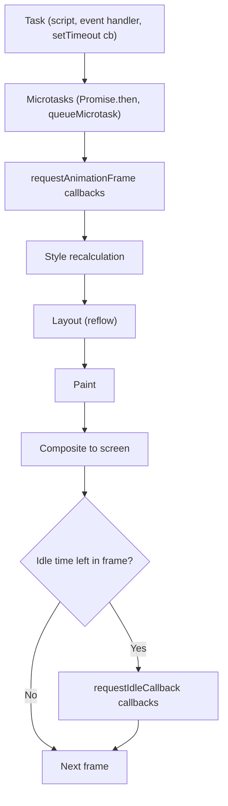
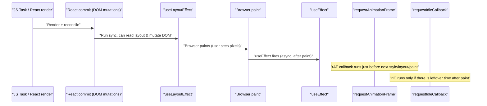
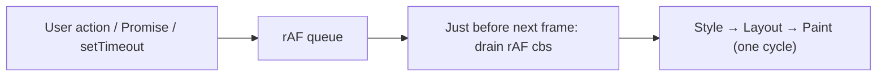
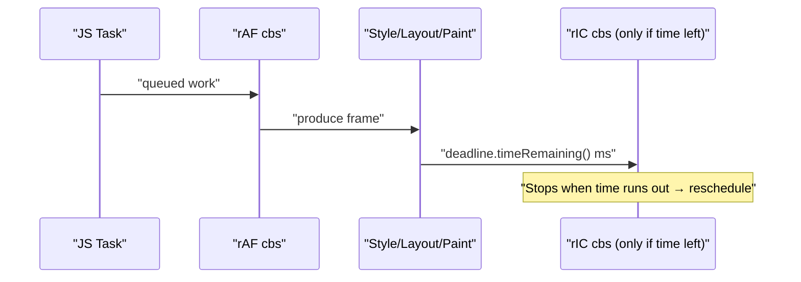
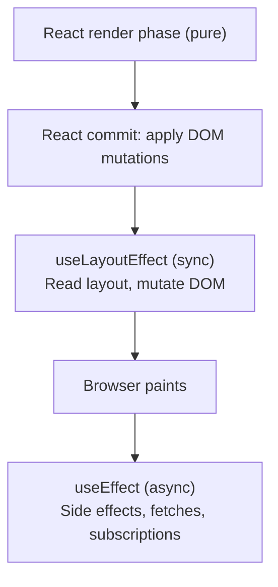
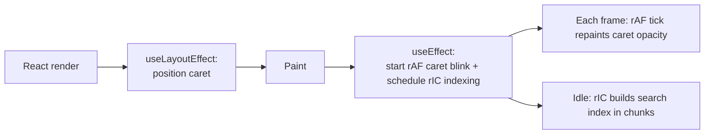
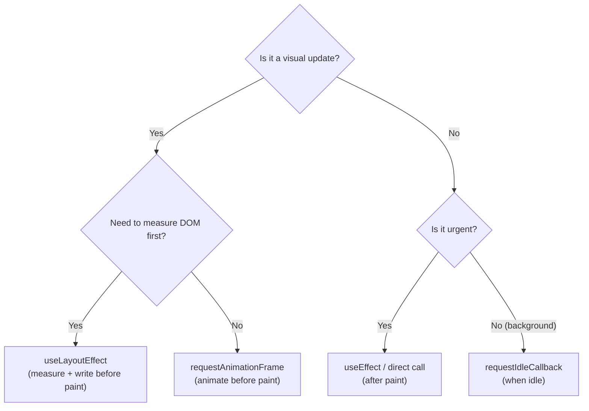

# Browser frame pipeline — `requestAnimationFrame`, `requestIdleCallback`, `useLayoutEffect`

> Three scheduling APIs, one timeline. Pick the wrong one and you get jank, flicker, or background work that fights the user. Pick the right one and your UI feels native.
>
> Sibling page: [Event loop, microtasks & real-time UIs](../browser-event-loop/) — the foundation this page builds on. Lesson companion: [`learnings/javascript/lessons/03-frame-scheduling/NOTES.md`](../../../learnings/javascript/lessons/03-frame-scheduling/NOTES.md).

## The problem

You need to do three different kinds of work in a UI:

1. **Move pixels** — animate a card, drag a handle, redraw a canvas. It must land **in sync with the next paint**, not "soon-ish."
2. **Measure & adjust the DOM** — position a tooltip above its trigger, size a virtualized row to its content. If you do this *after* paint, the user sees a flicker.
3. **Background chores** — prefetch the next route, build a search index, flush analytics. Important, but the user must **never** notice them.

`setTimeout` can technically do all three — and that's exactly why people misuse it. The platform offers three precise tools instead: **`requestAnimationFrame`**, **`useLayoutEffect`**, and **`requestIdleCallback`**, each slotted into a specific point of the per-frame pipeline.

## Mental model — one frame, in order

Browsers aim for ~60fps → one frame ≈ **16.67ms**. Per tick, in order:



Where each API lives:

| API                   | Slot in the frame                                    | Use it for                                  |
|-----------------------|------------------------------------------------------|---------------------------------------------|
| `requestAnimationFrame` | Just before style/layout/paint                     | Visual updates that must hit the next frame |
| `useLayoutEffect`     | After React commit, **before** browser paint         | Measure DOM & adjust without flicker        |
| `useEffect`           | **After** browser paint (async)                      | Subscriptions, fetches, side effects        |
| `requestIdleCallback` | After paint, only if slack time remains              | Non-urgent background work                  |



---

## `requestAnimationFrame` — the paint-synced tick

### Why not `setInterval(fn, 16)`?

- Doesn't know your monitor's actual refresh (could be 60, 120, 144 Hz).
- Keeps firing when the tab is hidden (battery cost).
- Can land *between* paints → tearing/jitter.

`rAF` schedules your callback for the **next frame, just before paint**. The callback receives a **`DOMHighResTimeStamp`** so you can write **time-based** motion (frame-rate independent).

### Frame-rate-independent animation

```js
let last = performance.now();
let x = 0;
function step(now) {
  const dt = (now - last) / 1000;             // seconds
  last = now;
  x += 100 * dt;                              // 100 px/sec at any fps
  box.style.transform = `translateX(${x}px)`; // landing in *this* frame
  requestAnimationFrame(step);
}
requestAnimationFrame(step);
```

### Coalescing reads & writes (anti-thrash)

```js
// BAD — interleaved read/write forces layout each iteration
items.forEach(el => {
  const w = el.offsetWidth;            // READ → forces layout
  el.style.width = (w * 2) + 'px';     // WRITE → invalidates layout
});

// GOOD — read all first, then write inside one rAF
const widths = items.map(el => el.offsetWidth);
requestAnimationFrame(() => {
  items.forEach((el, i) => { el.style.width = (widths[i] * 2) + 'px'; });
});
```



### Gotchas

- A heavy `rAF` callback still blocks the frame — keep it lean.
- Doesn't fire when the tab is hidden — fall back to `setTimeout` if you need background ticks (timers, polling).
- Setting a style inside `rAF` doesn't paint *immediately*; it's just included in the upcoming paint.

---

## `requestIdleCallback` — "do this when the browser is bored"

### Why it exists

Some work is **important but not urgent**: prefetching the next route, flushing telemetry, building a search index, hydrating off-screen components. You don't want it competing with input or animation.

`rIC` runs your callback during the **idle tail of a frame**, and gives you a **`deadline`** so you know how much budget you have.

### Chunked work that never janks

```js
const bigList = /* 100,000 items */;
let i = 0;

function processChunk(deadline) {
  while (i < bigList.length && deadline.timeRemaining() > 1) {
    doExpensiveWork(bigList[i]);
    i++;
  }
  if (i < bigList.length) requestIdleCallback(processChunk);
}

requestIdleCallback(processChunk, { timeout: 2000 });
// timeout: if 2s pass without idle time, run anyway (anti-starvation)
```

### Lifecycle vs `rAF`



### Gotchas

- **Not in Safari** — polyfill with `setTimeout(cb, 1)` and a synthetic `deadline` object.
- Mutating the DOM in `rIC` triggers another layout/paint cycle (you ran *after* paint).
- Always pass a `timeout` so the callback can't be starved forever on a busy page.

### Polyfill sketch

```js
window.requestIdleCallback ??= function (cb, opts) {
  const start = performance.now();
  return setTimeout(() => cb({
    didTimeout: false,
    timeRemaining: () => Math.max(0, 50 - (performance.now() - start)),
  }), 1);
};
window.cancelIdleCallback ??= clearTimeout;
```

---

## `useLayoutEffect` vs `useEffect`

Same API. Wildly different timing.

| Hook              | Fires when                                       | Blocks paint? |
|-------------------|--------------------------------------------------|---------------|
| `useEffect`       | **After** the browser paints                     | No (async)    |
| `useLayoutEffect` | After DOM mutation, **before** the browser paints | Yes (sync)   |

### React's place in the timeline



### The flicker problem

A tooltip that needs to position itself **above** its trigger has to be rendered *first* to be measured.

```jsx
// BAD: useEffect runs after paint → user sees tooltip jump from (0,0)
useEffect(() => {
  const t = targetRef.current.getBoundingClientRect();
  const me = ref.current.getBoundingClientRect();
  setPos({ top: t.top - me.height, left: t.left });
}, []);

// GOOD: useLayoutEffect runs before paint → second render lands in the same frame
useLayoutEffect(() => {
  const t = targetRef.current.getBoundingClientRect();
  const me = ref.current.getBoundingClientRect();
  setPos({ top: t.top - me.height, left: t.left });
}, []);
```

### When `useLayoutEffect` is the right tool

- Measuring DOM (`getBoundingClientRect`, `offsetHeight`) and adjusting size/position based on the result.
- Synchronizing with imperative libraries that mutate the DOM (canvas, charting, virtualizers).
- **FLIP animations** — capture First/Last layouts in `useLayoutEffect`, Invert with a transform, Play with `rAF`.

### Gotchas

- It's **synchronous and blocks paint** → keep work minimal. Heavy code here delays every frame the component updates in.
- **SSR warns** because there's no layout in Node. Either use `useEffect` or guard with `typeof window !== 'undefined'`.
- In **concurrent React**, prefer `useEffect` for non-layout work — otherwise you defeat React's ability to interrupt rendering.

---

## Putting them together — a worked example

A self-positioning input with a smoothly blinking caret, plus a search index built lazily during idle time.

```jsx
function MagicInput({ corpus }) {
  const inputRef = useRef(null);
  const caretRef = useRef(null);

  // 1. useLayoutEffect: measure input & position caret BEFORE paint
  useLayoutEffect(() => {
    const { left, top, height } = inputRef.current.getBoundingClientRect();
    caretRef.current.style.transform = `translate(${left}px, ${top}px)`;
    caretRef.current.style.height = `${height}px`;
  });

  // 2. requestAnimationFrame: smooth caret blink, paint-synced
  useEffect(() => {
    let raf, visible = true, last = performance.now();
    const tick = (now) => {
      if (now - last > 500) { visible = !visible; last = now; }
      caretRef.current.style.opacity = visible ? '1' : '0';
      raf = requestAnimationFrame(tick);
    };
    raf = requestAnimationFrame(tick);
    return () => cancelAnimationFrame(raf);
  }, []);

  // 3. requestIdleCallback: build a search index without blocking typing
  useEffect(() => {
    const handle = requestIdleCallback((deadline) => {
      const idx = {};
      let i = 0;
      while (i < corpus.length && deadline.timeRemaining() > 1) {
        idx[corpus[i].id] = corpus[i].text.toLowerCase();
        i++;
      }
      window.__searchIndex = idx;
    }, { timeout: 3000 });
    return () => cancelIdleCallback(handle);
  }, [corpus]);

  return (
    <>
      <input ref={inputRef} />
      <span ref={caretRef} className="caret" />
    </>
  );
}
```



Each API is doing exactly the job that fits its **slot in the frame**.

---

## Decision tree



---

## Common interview questions

### `useLayoutEffect` vs `useEffect` — when do you reach for each?

- **Default to `useEffect`** for subscriptions, data fetching, logging, anything not visible.
- **Reach for `useLayoutEffect`** only when the effect must read or mutate the DOM **before paint** to avoid flicker — e.g. measuring an element to position another, or syncing an imperative library.
- The trade-off: `useLayoutEffect` blocks paint, so heavy work delays every frame the component updates in.

### Why `requestAnimationFrame` over `setInterval(fn, 16)`?

- Synced to the actual display refresh (60/120/144 Hz).
- Pauses when the tab is hidden (saves battery).
- Runs **before paint** so visual updates are atomic with the frame.
- Provides a high-resolution timestamp for time-based motion.

### `requestAnimationFrame` vs `requestIdleCallback`?

- `rAF` fires **before paint** — for visual work that must hit the next frame.
- `rIC` fires **after paint, only if idle** — for background work that must not block the user.

### Why does `useLayoutEffect` warn under SSR?

There's no DOM/layout in Node. The hook's whole purpose (measure + sync mutate before paint) is undefined server-side, so React warns to push you toward `useEffect` or a `typeof window !== 'undefined'` guard.

### What is layout thrashing, and how do these APIs help?

Interleaving DOM **reads** (`offsetWidth`, `getBoundingClientRect`) with **writes** (`style.x = …`) forces the browser to re-run layout repeatedly. Batch reads, then writes, in a single `rAF` (or `useLayoutEffect`) callback — collapses many layouts into one.

### How do you polyfill `requestIdleCallback` for Safari?

`setTimeout(cb, 1)` with a synthetic `deadline = { timeRemaining: () => Math.max(0, 50 - (performance.now() - start)) }`. Not as accurate, but preserves the API.

### Can `useLayoutEffect` cause performance problems?

Yes — it runs **synchronously and blocks paint**. Heavy work here delays every frame the component updates in. Keep it minimal: measure + tweak. No fetches, no expensive computation.

### When would you reach for a Web Worker instead of `requestIdleCallback`?

`rIC` still runs on the main thread — it just yields when the budget runs out. If the work is genuinely CPU-bound (parsing, crypto, image processing) and would saturate even short idle slices, move it to a Worker (see [`learnings/javascript/lessons/02-workers`](../../../learnings/javascript/lessons/02-workers/README.md)).

---

## See also

- [Browser event loop & real-time UIs](../browser-event-loop/) — the macrotask/microtask/render foundation under all of this.
- [Iterators & generators](../iterators-and-generators/) — for the streaming-data side of UI work.
- Lesson: [`03-frame-scheduling/NOTES.md`](../../../learnings/javascript/lessons/03-frame-scheduling/NOTES.md) — interactive lesson notes that mirror this page.
