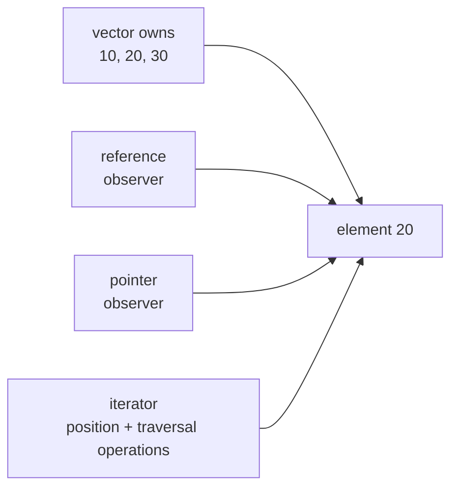
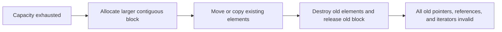
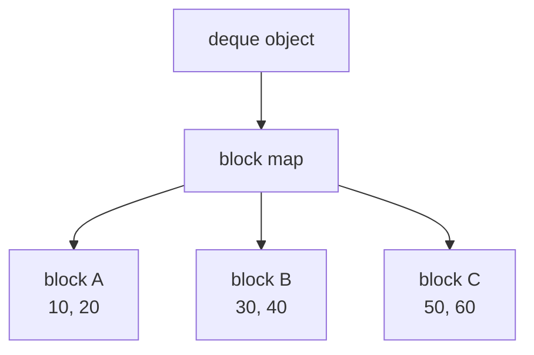
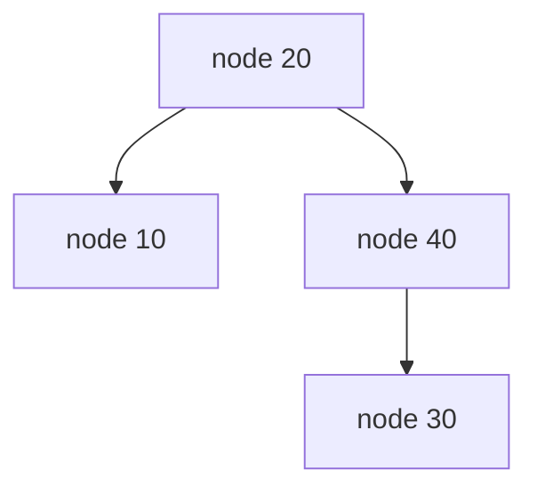
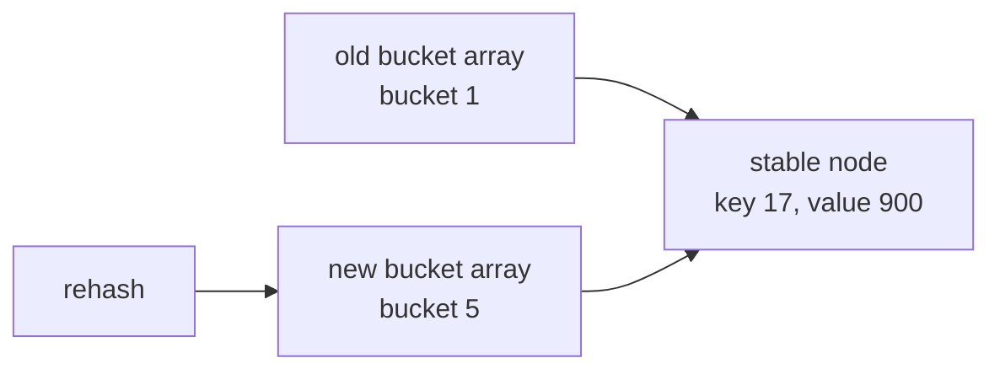
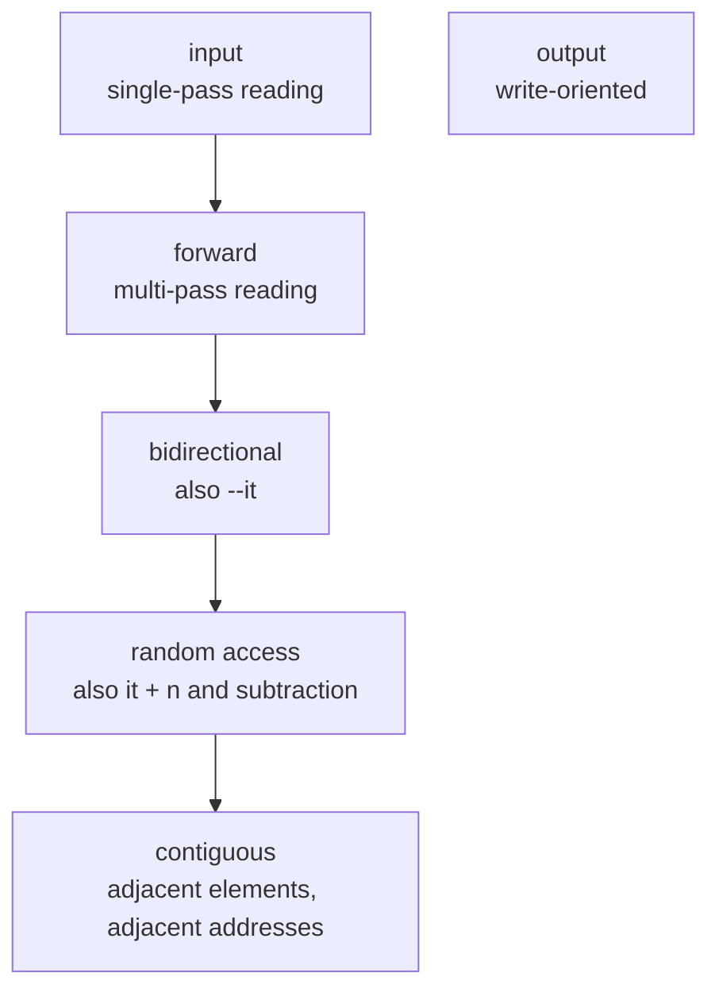

# C++ containers, ownership & iterator invalidation

A saved iterator can look perfectly usable after a container mutation and still make the program undefined. To reason about that safely, separate three questions: **who owns the element, where does it live, and what traversal metadata does the handle depend on?**

Use this tutorial when you need to:

- predict whether a pointer, reference, or iterator survives a mutation;
- choose between `vector`, `deque`, linked lists, trees, and hash tables;
- erase safely while iterating;
- explain iterator categories and algorithm requirements;
- use `string_view` and `span` without creating dangling views.

## The owner and the observers

A standard container owns its elements. A pointer, reference, or iterator into that container normally **observes** an element; it does not prolong the element's lifetime.

```cpp
#include <vector>

std::vector<int> values{10, 20, 30};

int& reference = values[1];
int* pointer = &values[1];
auto iterator = values.begin() + 1;
```



Destroying `values` destroys its elements. All three handles then dangle.

### What “invalidated” means

An invalidated handle must be discarded. The container no longer guarantees that it identifies the same live element. Dereferencing or advancing an invalid iterator is generally undefined behavior; unchanged bytes or a plausible debugger value do not restore validity.

An iterator is not an identity tag that follows an element:

```text
before insertion: address 1004 contains 20  <- saved iterator
after insertion:  address 1004 contains 15  <- same bytes, revoked iterator
                              1008 contains 20
```

Reacquire a handle from the container after the mutation when its rules require it.

## `vector`: size, capacity, and relocation

A `vector` stores its live elements contiguously in one allocation.

- `size()` is the number of live elements.
- `capacity()` is how many elements fit in the current allocation before growth needs another allocation.

```cpp
std::vector<int> v;
v.reserve(3);
v.push_back(10);
v.push_back(20);
```

```text
size = 2, capacity = 3

address     1000   1004   1008
storage    [ 10 ] [ 20 ] [unused]
```

Capacity is allocated room, not constructed objects. `v[2]` is invalid until a third element exists.

### Growth without reallocation

```cpp
int* first = &v[0]; // contains address 1000
v.push_back(30);    // fits inside capacity 3
```

```text
address     1000   1004   1008
storage    [ 10 ] [ 20 ] [ 30 ]
              ^
              first remains valid
```

If `push_back` fits inside the current capacity, existing element pointers, references, and iterators remain valid. The old `end()` iterator does not: the end position changed.

### Growth with reallocation

The next insertion cannot fit. The vector obtains a larger allocation, moves or copies existing elements, constructs the new element, destroys the old elements, and releases the old allocation:

```text
old allocation                         new allocation
1000   1004   1008                     5000   5004   5008   5012
[dead] [dead] [dead]                  [ 10 ] [ 20 ] [ 30 ] [ 40 ]
  ^
  first still contains 1000, but no live vector element is there
```



When reallocation occurs, **every** pointer, reference, and iterator into the vector—including the old `end()`—is invalidated. The growth factor is implementation-dependent; the invalidation guarantee is not.

`reserve(n)` can prevent growth reallocation until the vector needs more than `n` elements. Calling `reserve` may itself reallocate when `n > capacity()`.

### Middle insertion shifts elements

Reallocation is not the only danger:

```cpp
std::vector<int> v{10, 20, 30};
v.reserve(8); // ensure the following insert does not reallocate

int* first = &v[0];
int* second = &v[1];

v.insert(v.begin() + 1, 15);
```

```text
before:
address     1000   1004   1008
value       10     20     30
            first  second

after, without reallocation:
address     1000   1004   1008   1012
value       10     15     20     30
            first
```

`first` remains valid because it is before the insertion point. `second` is invalidated: it neither safely identifies the new `15` nor follows the original `20`.

The rule for `vector::insert` is:

- if reallocation occurs, invalidate everything;
- otherwise, invalidate handles at or after the insertion point.

### Erasure shifts elements left

```cpp
std::vector<int> v{10, 20, 30, 40};

auto before = v.begin();      // 10
auto erased = v.begin() + 1;  // 20
auto after = v.begin() + 2;   // 30

auto next = v.erase(erased);
```

```text
before: [10] [20] [30] [40]
              ^    ^
           erased after

after:  [10] [30] [40]
              ^
              next: fresh iterator returned by erase
```

`before` remains valid. Both `erased` and the old `after` are invalidated. `next` is a new valid iterator to `30`. Ordinary erasure does not reduce capacity or reallocate.

### `vector` invalidation table

| Operation | What becomes invalid |
|---|---|
| `push_back`, `emplace_back` | Everything if reallocated; otherwise old `end()` |
| Middle `insert`, `emplace` | Everything if reallocated; otherwise at and after insertion |
| `erase` | At and after the erased position |
| `pop_back` | Handles to the erased last element and old `end()` |
| `clear` | All element handles |
| `reserve(n)` | Everything if capacity changes; otherwise nothing |
| Grow with `resize(n)` | Everything if reallocated; otherwise old `end()` |
| Shrink with `resize(n)` | Handles to erased elements and old `end()` |
| `shrink_to_fit()` | A non-binding request; if it reallocates, everything |

`clear()` normally leaves capacity unchanged: the allocation can remain while all objects in it are destroyed.

## Sequence containers: storage shape explains the tradeoffs

```text
vector:
[10][20][30][40]       one contiguous allocation

deque:
[10][20] -> [30][40]   several indexed blocks

list:
[10] <-> [20] <-> [30] separately allocated, doubly linked nodes

forward_list:
[10] -> [20] -> [30]   separately allocated, singly linked nodes
```

### `deque`: indexed blocks

`deque` means double-ended queue. A typical implementation owns several element blocks and a separate block map:



A pointer to `30` needs only the element address. A deque iterator also needs enough bookkeeping to cross block boundaries. Appending may replace the block map without moving existing element blocks:

```text
old map: [A][B][C]
new map: [ ][A][B][C][D][ ]

pointer/reference to 30 -> unchanged block B -> still valid
iterator -> old block-map context -> invalid
```

This yields the standard end-insertion guarantee:

- `push_front` and `push_back` invalidate existing iterators;
- pointers and references to existing elements remain valid.

Middle insertion can move elements between blocks and invalidates all iterators and references. Middle erasure is similarly broad. Erasing at an end affects handles to erased elements; erasing the last element also changes the past-the-end iterator.

`deque` supports constant-time indexed access and random-access iterators, but it is not one globally contiguous range. It has no `data()` member for treating the whole container as an array.

### `list`: doubly linked nodes

A `list` node has links in both directions:

```text
null <- [10] <-> [20] <-> [30] -> null
```

Insertion changes links instead of relocating existing nodes:

```text
before: [10] <----------> [30]
after:  [10] <-> [20] <-> [30]
```

Existing iterators, pointers, and references survive insertion. Erasure invalidates only handles to erased nodes. Bidirectional iterators support both `++it` and `--it`.

### `forward_list`: minimal singly linked nodes

```text
[10] -> [20] -> [30] -> null
```

There is no backward link, so its iterators move only forward. Its API exposes the predecessor-oriented operations `insert_after` and `erase_after`.

`forward_list` does not provide `size()`. A singly linked list **could** store a counter; the standard container deliberately chooses a minimal representation. Counting requires a traversal:

```cpp
auto count = std::distance(xs.begin(), xs.end()); // O(n)
```

Not storing a count also avoids count maintenance during link-only operations. By contrast, modern `list::size()` is constant time and some cross-container range-splice cases pay linear work to account for transferred nodes.

Like `list`, `forward_list` preserves handles to existing nodes during insertion and invalidates only handles to erased nodes.

### Why not always use a linked list?

Stable handles and constant-time insertion are not free:

- finding a position is still linear unless an iterator is already available;
- no constant-time indexing exists;
- every node has link and allocation overhead;
- pointer chasing commonly loses to `vector`'s cache-friendly traversal.

Choose a linked list only when its mutation and stability guarantees matter enough to pay those costs.

## Ordered associative containers: stable tree nodes

`map`, `multimap`, `set`, and `multiset` are ordered associative containers, typically implemented as balanced trees:



A tree rotation changes links but does not relocate existing nodes. An iterator typically identifies a node and navigates through links stored in the nodes themselves. This differs from a deque iterator's dependence on a replaceable external block map.

Therefore:

- insertion preserves existing iterators, pointers, and references;
- erasure invalidates only handles to the erased node;
- traversal remains sorted by key.

```cpp
#include <map>
#include <string>

std::map<int, std::string> names{{10, "ten"}, {30, "thirty"}};
auto thirty = names.find(30);

names.emplace(20, "twenty");
names.erase(10);

// Still valid: the node for key 30 was neither destroyed nor relocated.
thirty->second = "THIRTY";
```

Map keys are immutable through ordinary iterators because changing one in place could violate tree order. The mapped value remains mutable. C++17 `extract` provides a node-handle path for removing a node, changing its key while detached, and inserting it again.

## Unordered containers: stable nodes, replaceable buckets

`unordered_map` and `unordered_set` use hashing. A typical structure has a bucket array that refers to separately allocated nodes:

```text
bucket 0 -> null
bucket 1 -> [key 9] -> [key 17]
bucket 2 -> [key 2]
bucket 3 -> null
```

The load factor is approximately:

```text
load_factor = size / bucket_count
```

When it becomes too high, the container may rehash. Nodes are redistributed under a new bucket organization:



Rehashing:

- invalidates every iterator;
- preserves pointers and references to existing elements;
- does not copy an `int` mapped value into a bucket slot—the element remains in its node.

If insertion does not trigger rehashing, existing iterators remain valid. Erasure invalidates only handles to the erased element.

```cpp
#include <unordered_map>

std::unordered_map<int, int> scores;
scores.reserve(1'000); // prepare for roughly 1,000 elements

scores.emplace(17, 900);
int* value = &scores.at(17);
auto it = scores.find(17);

scores.rehash(2'000);

// value remains valid; it was invalidated by rehash.
```

`reserve(n)` prepares for approximately `n` elements under the maximum load factor. `rehash(n)` requests at least `n` buckets. Neither makes iteration order a contract.

## Invalidation summary

| Container | Storage model | Insertion | Erasure |
|---|---|---|---|
| `vector` | One contiguous allocation | Reallocation: all; otherwise at/after middle insertion | At/after erased position |
| `deque` | Indexed blocks | Ends: iterators invalid, existing references/pointers stable; middle: all handles | Middle: broad invalidation; ends: erased elements, with past-the-end caveats |
| `list` | Doubly linked nodes | Existing handles stable | Only erased nodes |
| `forward_list` | Singly linked nodes | Existing handles stable | Only erased nodes |
| `map` / `set` families | Ordered tree nodes | Existing handles stable | Only erased nodes |
| `unordered_*` | Nodes plus bucket array | Iterators invalid only if rehash; references/pointers stable | Only erased nodes |

`clear()` destroys all elements in every container and therefore invalidates every element handle.

## Erase safely while iterating

For containers whose `erase(iterator)` returns the successor, use that fresh iterator:

```cpp
for (auto it = values.begin(); it != values.end();) {
    if (should_remove(*it)) {
        it = values.erase(it);
    } else {
        ++it;
    }
}
```

Do not write `values.erase(it++)` for a vector. Post-increment advances `it` first, then erasure invalidates that advanced iterator. The valid return value from `erase` is discarded.

Do not increment after assigning the returned iterator either: it already identifies the next element to inspect.

### `forward_list` needs the predecessor

```cpp
auto before = values.before_begin();
auto it = values.begin();

while (it != values.end()) {
    if (should_remove(*it)) {
        it = values.erase_after(before);
    } else {
        before = it;
        ++it;
    }
}
```

When only a predicate matters, C++20 offers `std::erase_if(container, predicate)`. For pre-C++20 vector-like containers, the erase-remove idiom is common:

```cpp
values.erase(
    std::remove_if(values.begin(), values.end(), should_remove),
    values.end()
);
```

`remove_if` compacts retained values and returns a new logical end; it does not itself destroy the unwanted tail or reduce the container's size.

## Iterator categories: capability and complexity contracts

Iterator categories tell algorithms which operations and complexity guarantees are available:



| Category | Key promise | Standard examples |
|---|---|---|
| Input | Read once while advancing | `istream_iterator` |
| Output | Write while advancing | `back_insert_iterator` |
| Forward | Multi-pass forward traversal | `forward_list`, unordered containers |
| Bidirectional | Forward plus `--it` | `list`, ordered associative containers |
| Random access | Constant-time jumps and distance | `deque` |
| Contiguous | Random access plus adjacent memory | `vector`, `array`, `string`, `span` |

`deque` proves that random access does not imply global contiguity:

```cpp
auto it = deque.begin() + 100; // valid constant-time jump
// deque.data() does not exist: the whole deque is not one array
```

Categories affect both availability and complexity:

```cpp
std::advance(it, 100);
```

- `vector`/`deque`: constant-time arithmetic;
- `list`/`forward_list`: walk 100 links, linear time.

`std::sort` needs random-access iterators, so it accepts vector and deque iterators but not list iterators. `list::sort()` instead sorts by relinking nodes.

The interview explanation is:

> Iterator categories are compile-time capability and complexity contracts—not labels chosen merely from a container's name.

For the cross-language pull-protocol perspective, see [Iterators & generators](../iterators-and-generators/).

## `string_view` and `span`: non-owning views

Both types borrow storage:

```text
string_view = character pointer + length
span        = element pointer + length
```

They avoid copies, but they do not keep the source alive or detect invalidation.

### `string_view` lifetime traps

```cpp
#include <string>
#include <string_view>

std::string text = "hello";
std::string_view view = text;

text += " — enough text to reallocate";
// If text reallocated, view still contains the old pointer and now dangles.
```

Borrowing from a temporary is worse:

```cpp
std::string_view bad = std::string{"temporary"};
// The temporary string dies at the semicolon; bad dangles immediately.
```

Returning a view into a local string also dangles:

```cpp
std::string_view make_name() {
    std::string name = "Rachit";
    return name; // wrong: name is destroyed on return
}
```

A view of a string literal is safe for the program's lifetime because the literal has static storage duration:

```cpp
std::string_view stable = "literal";
```

### `span` views contiguous elements

```cpp
#include <span>
#include <vector>

int sum(std::span<const int> values);

int array[] = {1, 2, 3};
std::vector<int> vector{4, 5, 6};

sum(array);
sum(vector);
```

`span<const int>` lets one function read many contiguous sources without copying. A mutable `span<int>` can modify its source:

```cpp
std::span<int> view = vector;
view[1] = 99; // vector is now {4, 99, 6}
```

If the vector reallocates, the span's stored pointer becomes stale:

```cpp
std::span<const int> view = vector;
vector.push_back(7); // if this reallocates, view dangles
```

A local array has the same lifetime problem:

```cpp
std::span<const int> bad_span() {
    int local[] = {1, 2, 3};
    return local; // wrong: local dies on return
}
```

The common rule is:

> A non-owning view must not outlive—or survive an invalidating mutation of—the storage it observes.

## Two ownership layers: `vector<T>` versus `vector<unique_ptr<T>>`

With `vector<Job>`, each `Job` is a direct vector element. Reallocation moves the jobs and invalidates pointers to them.

With `vector<unique_ptr<Job>>`, the direct elements are small owning pointers; each `Job` lives in a separate allocation:

```text
vector storage at 1000:
[unique_ptr containing address 9000] ---> Job at 9000

after vector reallocation:
[new unique_ptr element at 5000] --------> same Job at 9000
```

The iterator to the `unique_ptr` element is invalidated, but a raw observer pointing directly to the `Job` remains valid. Erasing that `unique_ptr` destroys the `Job` and makes the raw observer dangle.

This can provide stable pointee addresses, but heap allocation and indirection have costs. See [RAII, ownership & smart pointers](../cpp-raii-smart-pointers/) for the full ownership model and [move semantics](../cpp-move-semantics/#why-noexcept-changes-container-behavior) for how vector chooses between moving and copying during growth.

## Container-choice exercises

### Exercise 1: sorted price levels

Requirements:

- lookup, insertion, and deletion by price;
- sorted traversal;
- iterators to unaffected levels must remain valid;
- indexed access is unnecessary.

**Choice: `map<Price, Level>`.** It supplies sorted keys, logarithmic operations, and stable node handles. A sorted vector has good locality but shifts elements; an unordered map has no sorted traversal; a list has linear lookup unless paired with another index.

### Exercise 2: work at both ends

Requirements:

- frequent push/pop at front and back;
- constant-time indexed access is useful;
- pointers/references to existing jobs must survive end insertion;
- global contiguity is unnecessary.

**Choice: `deque<Job>`.** End operations match its segmented layout. Existing pointers/references survive end insertion, but saved iterators do not.

### Exercise 3: bidirectional editing cursor

Requirements:

- insert/erase at a position already identified by an iterator;
- handles to all other elements must remain valid;
- move both forward and backward;
- no indexing requirement.

**Choice: `list<Entry>`.** `forward_list` cannot move backward; vector/deque mutations have broader invalidation.

### Exercise 4: hot numeric scan

Requirements:

- millions of numeric elements;
- repeated full scans and indexed access dominate;
- mutation happens mainly at the end;
- no long-lived element handles.

**Choice: `vector<Number>`.** Contiguous locality and low overhead dominate. Reserve an estimate when useful; do not pay linked-node costs for stability the problem does not require.

### Exercise 5: key lookup with no ordering requirement

Requirements:

- average constant-time lookup;
- iteration order is irrelevant;
- references to existing values must survive growth;
- saved iterators can be reacquired.

**Choice: `unordered_map<Key, Value>`.** Reserve an expected size to reduce rehash frequency, and never make iteration order part of the program's behavior.

## Common failure modes

| Mistake | Why it fails | Safer approach |
|---|---|---|
| Keep a vector iterator across possible growth | Reallocation revokes the old buffer | Reserve, use an index when appropriate, or reacquire |
| Treat an invalid iterator as pointing to the new occupant | Iterators do not track element identity | Discard and reacquire |
| Write `erase(it++)` | The incremented vector iterator is invalidated; erase result is discarded | `it = container.erase(it)` |
| Assume erasure shrinks vector capacity | `erase` destroys/shifts elements but keeps the allocation | Use capacity as a separate concept |
| Expect deque pointers and iterators to share rules | Iterators depend on block-map traversal metadata | Memorize the end-insertion distinction |
| Retain unordered iterators across rehash | Bucket organization changed | Retain references/pointers if appropriate or reacquire |
| Return `string_view`/`span` into a local | Owner dies at return | Return an owning value or borrow caller-owned storage |
| Choose list for “O(1) insertion” without an iterator | Finding the position is still O(n) | Include lookup and locality in the decision |

## Common interview questions

### What is iterator invalidation?

The operation revokes the guarantee that a saved iterator still identifies a valid element or position. Do not dereference, advance, or otherwise reuse it; reacquire a valid iterator.

### What is the difference between vector size and capacity?

Size counts live objects. Capacity counts how many objects fit in the current allocation before growth requires reallocation. Reserved-but-unused slots are not elements.

### When does `vector::push_back` invalidate existing element handles?

When it reallocates. Without reallocation, existing element handles survive, but the old `end()` iterator is invalidated.

### Can vector insertion invalidate handles without reallocation?

Yes. Middle insertion shifts elements and invalidates handles at or after the insertion point. Middle erasure similarly invalidates at or after the erased position.

### Why does deque end insertion invalidate iterators but not references?

Existing element blocks stay put, preserving addresses, while a replaceable block map used for iterator traversal may change.

### Why are list and map iterators stable across insertion?

Their elements live in separate nodes. Insertion and tree rotations relink nodes rather than relocating existing nodes.

### What invalidates unordered-container iterators?

Rehashing invalidates all iterators. It preserves pointers and references to existing elements because their nodes remain alive. Erasing a node invalidates its own handles.

### How do you erase safely during iteration?

Assign the return value: `it = container.erase(it)`. Increment only when no erasure occurs. For `forward_list`, retain the predecessor and call `erase_after`.

### Why does `std::sort` accept deque but not list?

Deque iterators are random access, so the algorithm can jump and subtract in constant time. List iterators are only bidirectional; use `list::sort`, which can relink nodes.

### Random access versus contiguous—what is the difference?

Random access promises constant-time positional jumps. Contiguous additionally promises adjacent elements occupy adjacent addresses. Deque is random access but not contiguous; vector is both.

### Why can a `string_view` dangle even though it stores a length?

The length does not own or validate the character storage. If the source dies or reallocates, the saved pointer is stale.

### When should a function accept `span<const T>`?

When it needs a read-only view of caller-owned contiguous elements and should accept arrays, vectors, and spans without copying. The function must not retain the span past the source lifetime.

### Why not always choose list for iterator stability?

It loses constant-time indexing and contiguous locality, adds links and allocations, and still needs linear work to find an insertion position unless an iterator is already available.

### How do you solve an unfamiliar invalidation question?

Ask in order:

1. Was the observed element destroyed?
2. Was it relocated or shifted?
3. Did the iterator's traversal metadata change?

Then apply the container's documented guarantee rather than trusting a plausible memory address.

## One-minute revision

Containers own elements; iterators, pointers, references, `string_view`, and `span` usually observe. Vector reallocation invalidates everything, and middle mutation invalidates at or after the mutation. Deque separates address stability from iterator stability because iterators depend on a block map. Linked lists and ordered trees preserve unaffected node handles. Unordered rehash preserves element references and pointers but invalidates iterators. Erase with the returned iterator. Iterator categories are capability and complexity contracts. Choose a container from access, mutation, ordering, locality, and stability requirements—not from one attractive Big-O entry.
