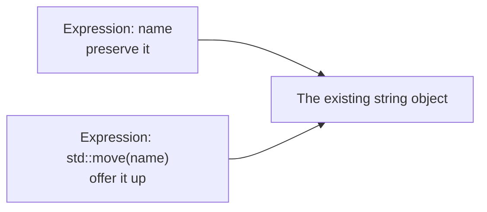
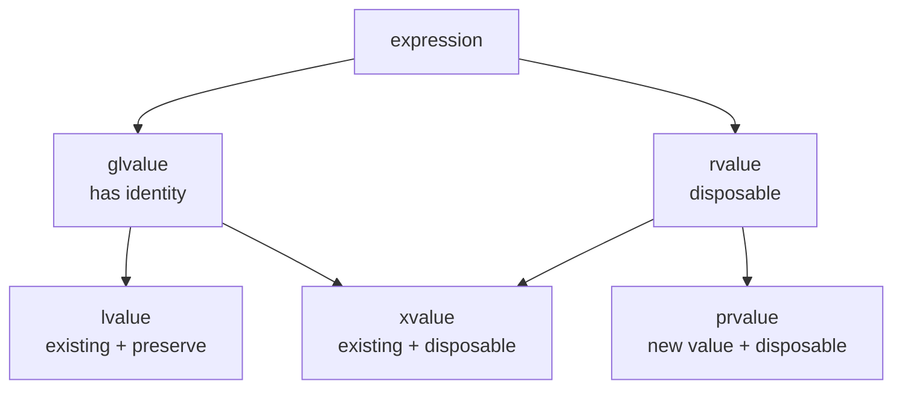
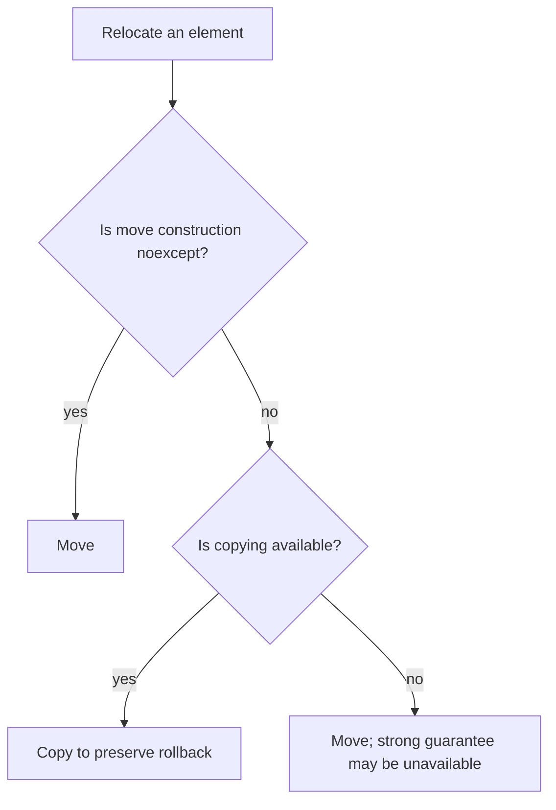

# C++ move semantics & value categories

Copying a resource-owning object can duplicate megabytes of data even when the source is about to die. Move semantics lets C++ transfer that resource cheaply—but only after the language has answered two questions: **what kind of expression did the caller provide, and which operation is allowed to consume it?**

Use this page when you need to:

- explain why `std::move` sometimes moves, sometimes copies, and sometimes does nothing;
- implement or review a resource-owning type;
- predict which overload receives a named object, temporary, or forwarded argument;
- explain why `noexcept` changes `std::vector` reallocation behavior;
- distinguish C++17 guaranteed copy elision from optional NRVO.

## Start with three situations

Ignore the formal taxonomy for one minute. At a call site, C++ mainly needs to distinguish these situations:

| Situation | Example | Caller’s intent |
|---|---|---|
| Existing object to preserve | `name` | “I may use its current value again.” |
| Existing object offered up | `std::move(name)` | “You may reuse its resources.” |
| New temporary value | `std::string("Ada")` | “This value is about to expire.” |

That maps directly to the three specific value categories:

| Expression | Specific category | Usable mental model |
|---|---|---|
| `name` | **lvalue** | keep an identifiable object |
| `std::move(name)` | **xvalue** | give away an identifiable object |
| `std::string("Ada")` | **prvalue** | produce a new temporary value |

The categories describe **expressions**, not objects. `name` and `std::move(name)` designate the same object; only the expression presented to overload resolution differs.

```cpp
std::string name = "Ada";

name;             // lvalue expression
std::move(name);  // xvalue expression designating the same object
```



## The complete taxonomy—without the mystery

The two umbrella terms answer separate questions:

- A **glvalue** identifies an object: lvalue or xvalue.
- An **rvalue** represents a disposable value: xvalue or prvalue.

An xvalue belongs to both groups: it identifies an existing object **and** offers that object’s value for reuse.



For most interviews, classify an expression with this small table:

| | Not disposable | Disposable |
|---|---|---|
| Identifies an existing object | lvalue | xvalue |
| Produces a new value | — | prvalue |

Modern C++17 wording is more precise: a class prvalue initializes its destination directly when possible and is materialized as a temporary only when a context needs an object. The practical classification above remains the useful starting point.

## References select policy; they do not transfer resources

Two overloads can distinguish “preserve” from “disposable”:

```cpp
void inspect(const std::string&) {
    std::cout << "preserve\n";
}

void inspect(std::string&&) {
    std::cout << "disposable\n";
}
```

Trace the calls:

| Call | Argument category | Selected overload |
|---|---|---|
| `inspect(name)` | lvalue | `const std::string&` |
| `inspect(std::move(name))` | xvalue | `std::string&&` |
| `inspect(std::string("Ada"))` | prvalue | `std::string&&` |

Binding an rvalue reference does **not** construct a new object and does not move anything:

```cpp
void inspect(std::string&& text) {
    // text is another name for the caller's object.
}

inspect(std::move(name));
```

By contrast, a by-value parameter is a new object, so initializing it may invoke a move constructor:

```cpp
void take(std::string text) {
    // text is a distinct std::string object.
}

take(std::move(name)); // constructs text from name
```

### A named rvalue reference is an lvalue expression

The declared type and the expression category are different properties:

```cpp
void relay(std::string&& text) {
    inspect(text);            // text has a name: lvalue → preserve
    inspect(std::move(text)); // xvalue → disposable
}
```

This rule prevents a function from accidentally consuming the same parameter every time its name appears.

### `const` blocks the usual move path

```cpp
const std::string fixed = "Ada";
inspect(std::move(fixed)); // selects const std::string&, not std::string&&
```

`std::move` preserves `const`, so the expression has type `const std::string&&`. A typical move constructor needs a mutable `T&&` because it changes the source. When a copy overload taking `const T&` exists, moving a `const` object therefore usually copies.

## `std::move` is an unconditional cast

Conceptually, `std::move` is approximately:

```cpp
template<class T>
std::remove_reference_t<T>&& move(T&& value) noexcept {
    return static_cast<std::remove_reference_t<T>&&>(value);
}
```

It does not transfer a pointer, clear the source, or invoke a move constructor by itself. It changes the expression category so that an rvalue-taking overload can be selected.

```text
std::move(source)
  → offers source as an xvalue
  → overload resolution may select a move operation
  → that operation may transfer the resource
```

Consequently, this can copy:

```cpp
Legacy destination(std::move(source));
```

If `Legacy` has no usable move constructor but has `Legacy(const Legacy&)`, the `const&` overload can bind to the rvalue and copy it.

## What a move operation actually does

Suppose a `Buffer` owns a million-byte allocation:

```text
source object ──► [1,000,000 bytes]
```

A copy allocates another million bytes and duplicates the contents—**O(n)** work. A move can transfer a pointer and size—normally **O(1)** work:

```text
before: source ──► [1,000,000 bytes]    destination ──► nothing
after:  source ──► null                 destination ──► [1,000,000 bytes]
```

Here is a compact, complete owner showing all five ownership operations:

```cpp
#include <algorithm>
#include <cstddef>
#include <utility>

class Buffer {
    char* data_ = nullptr;
    std::size_t size_ = 0;

public:
    explicit Buffer(std::size_t size)
        : data_(size ? new char[size]{} : nullptr), size_(size) {}

    ~Buffer() {
        delete[] data_;
    }

    Buffer(const Buffer& other)
        : Buffer(other.size_) {
        if (size_ != 0) {
            std::copy_n(other.data_, size_, data_);
        }
    }

    Buffer& operator=(const Buffer& other) {
        if (this != &other) {
            Buffer copy(other);
            swap(copy);
        }
        return *this;
    }

    Buffer(Buffer&& other) noexcept
        : data_(std::exchange(other.data_, nullptr)),
          size_(std::exchange(other.size_, 0)) {}

    Buffer& operator=(Buffer&& other) noexcept {
        if (this != &other) {
            delete[] data_;
            data_ = std::exchange(other.data_, nullptr);
            size_ = std::exchange(other.size_, 0);
        }
        return *this;
    }

    void swap(Buffer& other) noexcept {
        std::swap(data_, other.data_);
        std::swap(size_, other.size_);
    }
};
```

`std::exchange` both obtains the old value and replaces it. Nulling the source pointer prevents two destructors from deleting the same allocation.

## Rule of Zero, Three, and Five

The ownership-related special members are:

1. destructor;
2. copy constructor;
3. copy assignment;
4. move constructor;
5. move assignment.

### Rule of Zero—prefer this

Compose types that already manage their resources:

```cpp
class Document {
    std::string title_;
    std::vector<std::string> paragraphs_;
};
```

The compiler-generated operations correctly copy, move, and destroy each member. No ownership special member needs to be written.

### Rule of Three

Before C++11, a type manually managing a resource generally needed to consider the destructor, copy constructor, and copy assignment together. If shallow copying would double-delete the resource, all three policies matter.

### Rule of Five

In modern C++, a manually managed resource also requires an intentional decision about move construction and move assignment. “Consider all five” does not mean every operation must be enabled: a type may explicitly delete copying and allow moving.

```cpp
class UniqueOwner {
public:
    UniqueOwner(const UniqueOwner&) = delete;
    UniqueOwner& operator=(const UniqueOwner&) = delete;
    UniqueOwner(UniqueOwner&&) noexcept = default;
    UniqueOwner& operator=(UniqueOwner&&) noexcept = default;
};
```

## Suppressed versus implicitly deleted operations

These terms describe different failures:

- **Not implicitly declared (suppressed):** another user-declared special member prevents the compiler from declaring the move operation.
- **Defined as deleted:** the operation is declared, but a base or member makes its generated implementation impossible.

### When implicit moves are suppressed

The compiler implicitly declares a move constructor or move assignment only when the class has no user-declared:

- copy constructor;
- move constructor;
- copy assignment;
- move assignment;
- destructor.

`= default` and `= delete` still count as user declarations. A user-declared destructor is the classic trap:

```cpp
struct Payload {
    Payload() = default;
    Payload(const Payload&) { std::cout << "copy\n"; }
    Payload(Payload&&) noexcept { std::cout << "move\n"; }
};

struct Wrapper {
    Payload payload;
    ~Wrapper() {} // suppresses Wrapper's implicit move constructor
};

Wrapper a;
Wrapper b(std::move(a)); // copies Payload through Wrapper's implicit copy
```

The rvalue can bind to `const Wrapper&`, so the absence of a move constructor does not necessarily produce an error—it may silently copy.

### When generated operations are deleted

An explicitly defaulted or implicitly declared special member is defined as deleted when a required base/member operation is unusable. Common examples:

```cpp
struct Job {
    std::mutex lock; // mutex is neither copyable nor movable
};

struct Owner {
    std::unique_ptr<int> value; // moveable, not copyable
};
```

- `Job` cannot be copied or moved by the generated operations.
- `Owner` can be moved when move generation is otherwise eligible, but its generated copy operations are deleted.
- Reference and `const` data members commonly delete generated **assignment** operators because those members cannot be rebound or assigned.

Declaring either move operation also causes implicitly declared copy operations to be defined as deleted. This avoids silently copying a type whose author explicitly chose move-only behavior.

## Moved-from objects: valid, value usually unspecified

After a move, the source object still exists. Unless a type documents a stronger guarantee, standard-library types are generally left in a **valid but unspecified state**:

```cpp
std::string source = "large value";
std::string destination = std::move(source);

source.clear();        // safe
source = "reusable";  // safe
// Do not require source.empty() after the move.
```

Safe operations include destruction, assignment, and operations whose preconditions are known to hold. Do not read a moved-from value as though its old contents were preserved.

Some types document stronger guarantees:

```cpp
auto source = std::make_unique<int>(42);
auto destination = std::move(source);

assert(source == nullptr); // guaranteed specifically by unique_ptr
```

That guarantee belongs to `unique_ptr`; it is not a universal move-semantics rule.

## Why `noexcept` changes container behavior

When a vector grows, it must relocate existing elements:

```text
old storage: [A][B]
new storage: [A][B][ ][ ]
```

If copying `B` throws, the vector can discard the new copy of `A`; the original `A` and `B` remain unchanged. If moving `A` consumes its old value and moving `B` then throws, rolling back the original vector may be impossible.

Therefore, vector-like containers generally use this policy during reallocation:



Declare a move operation `noexcept` only when its implementation truly cannot throw:

```cpp
Buffer(Buffer&& other) noexcept;
Buffer& operator=(Buffer&& other) noexcept;
```

`std::move_if_noexcept` expresses roughly this choice. A potentially throwing move may make `std::vector<T>` copy during growth even though `T` has a move constructor.

## Forwarding references and `std::forward`

A wrapper often needs to preserve the caller’s original intent:

```cpp
void consume(const std::string&); // preserve
void consume(std::string&&);      // disposable

template<class T>
void relay(T&& value) {
    consume(std::forward<T>(value));
}
```

Here `T&&` is a **forwarding reference** because `T` is a cv-unqualified template parameter deduced from this argument. It can receive either an lvalue or an rvalue.

The deduction trace is:

| Call | Deduced `T` | Parameter after collapsing | `std::forward<T>(value)` |
|---|---|---|---|
| `relay(name)` | `std::string&` | `std::string&` | lvalue |
| `relay(std::string("Ada"))` | `std::string` | `std::string&&` | rvalue |

Reference collapsing follows one rule: **`&` wins unless both inputs are `&&`.**

```text
&  + &  → &
&  + && → &
&& + &  → &
&& + && → &&
```

Inside `relay`, the expression `value` is an lvalue because it has a name. `std::forward<T>` conditionally restores the caller’s category:

- `std::move(value)` always offers `value` up;
- `std::forward<T>(value)` offers it up only if the caller did.

This is not a forwarding reference:

```cpp
void consume(std::string&&);       // fixed type: ordinary rvalue reference

template<class T>
void consume(const T&&);           // const prevents the forwarding-reference rule
```

Nor is `T&&` a forwarding reference when `T` was already fixed by an enclosing class template rather than deduced by that function call.

## Copy elision: guaranteed prvalues versus optional NRVO

### Guaranteed in the relevant C++17 prvalue cases

```cpp
Widget make_widget() {
    return Widget{};
}

Widget result = make_widget();
```

In C++17 and later, the same-type prvalue initializes its destination directly. The language does not model this as “construct a temporary, then optimize away its move”; there is no intermediate `Widget` requiring a copy or move constructor.

```cpp
class Widget {
public:
    Widget() = default;
    Widget(const Widget&) = delete;
    Widget(Widget&&) = delete;
};

Widget make_widget() {
    return Widget{}; // valid in C++17+
}
```

The same principle applies to direct initialization such as `Widget result = Widget{};`. It does not universally eliminate every temporary—for example, initialization of potentially overlapping subobjects such as base-class subobjects has different restrictions.

### NRVO remains optional

```cpp
Widget make_widget() {
    Widget local;
    return local;
}
```

Named Return Value Optimization allows `local` to be constructed directly in the caller’s destination, and production compilers commonly do so. The standard still permits the compiler not to perform NRVO. If NRVO is not performed, eligible local return variables receive implicit-move treatment before copying is considered.

Prefer:

```cpp
return local;
```

Avoid:

```cpp
return std::move(local);
```

The explicit cast normally prevents NRVO because the returned expression is no longer the plain name of the local. `return local;` already permits NRVO and provides the move fallback.

## A runnable overload trace

Use this small program to predict the output before compiling:

```cpp
#include <iostream>
#include <utility>

struct Widget {};

void inspect(const Widget&) { std::cout << "preserve\n"; }
void inspect(Widget&&) { std::cout << "disposable\n"; }

int main() {
    Widget item;
    Widget&& alias = Widget{};
    const Widget fixed;

    inspect(item);             // preserve: named lvalue
    inspect(std::move(item));  // disposable: xvalue
    inspect(Widget{});         // disposable: prvalue
    inspect(alias);            // preserve: named expression
    inspect(std::move(alias)); // disposable: xvalue
    inspect(std::move(fixed)); // preserve: const cannot bind to Widget&&
}
```

When tracing an unfamiliar call, use this order:

1. Classify the **argument expression**, not the variable’s declared type.
2. List the reference bindings that are legal with the argument’s `const` qualification.
3. Choose the best viable overload.
4. Only then ask whether the selected function constructs or assigns another object.

## Failure modes and design tradeoffs

| Failure mode | Consequence | Better approach |
|---|---|---|
| Writing `std::move` and assuming a transfer occurred | May merely bind a reference or select a copy | Identify the constructor/assignment that owns the transfer |
| Moving from `const` | Usually copies | Do not make a value `const` when ownership must be transferred |
| Reading a moved-from value | Depends on unspecified state | Destroy it, assign to it, or use only documented-safe operations |
| Omitting `noexcept` from a non-throwing move | Containers may copy during growth | Declare and verify `noexcept` |
| Writing `return std::move(local)` | Usually blocks NRVO | Write `return local` |
| Using `std::move` in a forwarding wrapper | Consumes caller lvalues | Use `std::forward<T>` |
| Adding a destructor “for logging” | Suppresses implicit moves | Prefer Rule of Zero, or explicitly default the intended operations |
| Defaulting special members without inspecting members/bases | Operations may become deleted | Check ownership and copy/move capabilities member by member |

Move semantics is not always faster. Small-object optimization may make a short `std::string` move copy a few inline bytes; types with different allocators may need element-wise work; and copy elision can make both copy and move irrelevant. Treat “move is O(1)” as a type-specific contract, not a language guarantee.

## Practice

1. Add logging copy/move constructors to a `Tracer` type. Pass named objects, temporaries, `std::move` expressions, and named `Tracer&&` variables to overloaded functions.
2. Put `Tracer` into a `std::vector`, first with a potentially throwing move constructor and then with `noexcept`. Force reallocation and compare the log.
3. Write `relay(T&&)` first with `std::move`, then with `std::forward<T>`. Call it with both a named object and a temporary.
4. Compile `return Widget{};` and `return local;` using `-std=c++17 -fno-elide-constructors`. The former remains guaranteed; the flag can expose the optional NRVO path for the latter.

## Common interview questions

### Does `std::move` move an object?

No. It is an unconditional cast that produces an xvalue. A subsequently selected constructor, assignment operator, or function may transfer resources.

### What is the simplest useful explanation of the three value categories?

An lvalue identifies an existing object to preserve; an xvalue identifies an existing object offered up; a prvalue produces a new disposable value. Glvalue means “has identity,” while rvalue means “disposable.”

### Why is a named `T&&` variable an lvalue?

The expression has a stable name and can be used repeatedly. Its declared type remains `T&&`, but expression category is a separate property. Apply `std::move` or `std::forward` when intentionally passing it onward as an rvalue.

### Does binding a `T&&` parameter transfer ownership?

No. A reference parameter aliases an existing object. A transfer occurs only when another object is move-constructed or move-assigned, or when function logic explicitly transfers some resource.

### Why can `std::move(x)` call a copy constructor?

If no usable move overload exists, an rvalue can still bind to `const T&`. This happens with legacy types, suppressed/deleted moves, and commonly with `const` sources.

### What is the Rule of Zero?

Classes that compose resource-owning members such as `std::string`, `std::vector`, and smart pointers should usually declare none of the five ownership special members. Member-wise generated behavior is safer and easier to maintain.

### What suppresses implicit move generation?

A user-declared destructor, copy constructor, copy assignment, move constructor, or move assignment prevents implicit move declaration. `= default` and `= delete` still count as declarations.

### Why might a defaulted move operation be deleted?

A base or data member may not support the required move. For example, `std::mutex` is non-copyable and non-movable. `const` or reference members commonly make generated assignment operators impossible.

### What may code do with a moved-from object?

It may always destroy it or assign a new value. Other operations are safe only when their preconditions are known to hold. Do not assume a particular value unless the type documents one, as `unique_ptr` does by guaranteeing null after a move.

### Why should a move constructor often be `noexcept`?

Containers can relocate elements by move while preserving exception guarantees only when moving cannot fail partway. If a move may throw and copying exists, `std::vector` commonly copies instead.

### What is a forwarding reference?

It is `T&&` where `T` is a cv-unqualified template parameter deduced in that call context. Reference collapsing lets it bind to lvalues and rvalues, and `std::forward<T>` restores the caller’s original category.

### `std::move` versus `std::forward`?

`std::move(x)` always offers `x` up. `std::forward<T>(x)` conditionally offers it up only when the original template argument was an rvalue.

### What changed about copy elision in C++17?

In specified same-type prvalue cases such as `return Widget{};`, the result is constructed directly in its destination; this is guaranteed language behavior. NRVO for `return local;` remains optional.

### Should you write `return std::move(local)`?

Usually no. It inhibits NRVO while `return local;` already allows the compiler to use NRVO and, when elision is not performed, to consider moving the eligible local.

## Revision summary

- Value categories classify expressions: lvalue = preserve existing, xvalue = offer existing, prvalue = produce temporary.
- `std::move` is a cast; a move constructor or move assignment implements a transfer.
- `T&&` reference binding does not construct anything, and a named `T&&` expression is an lvalue.
- Prefer the Rule of Zero; understand suppression and deletion when special members are declared.
- Treat moved-from objects as valid with unspecified values unless their type promises more.
- Mark truly non-throwing moves `noexcept`; use `std::forward` for forwarding references.
- C++17 guarantees specified prvalue elision, while NRVO for a named local remains optional.

## See also

- [C++ topic hub](../cpp/)
- [Interview syllabus — C++ types, lifetimes, and safety](../interview-syllabus/#types-lifetimes--safety)
- [C++ struct layout, padding, and alignment](../cpp-struct-layout/)
- [Dynamic dispatch and object models](../dynamic-dispatch-and-object-model/)
