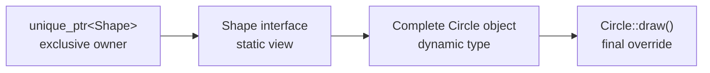
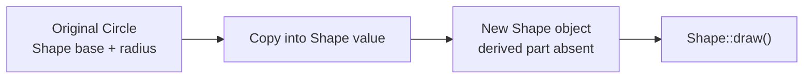
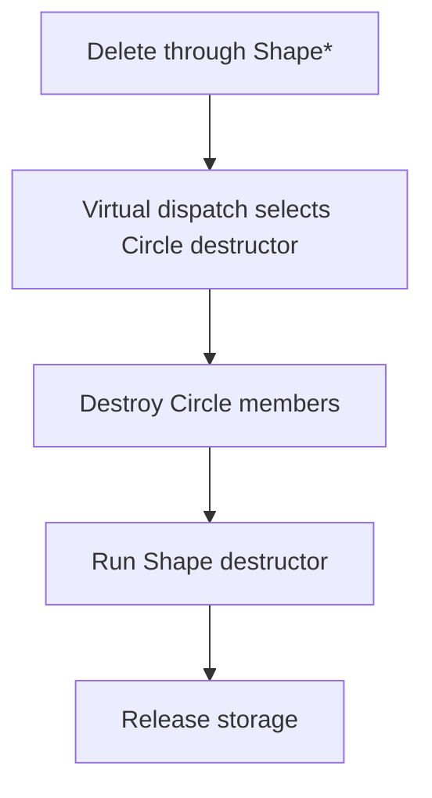

# C++ polymorphism & ownership pitfalls

Runtime polymorphism becomes dangerous when three separate questions blur together: **which interface can this expression use, which concrete object exists, and who keeps that object alive?** A call may dispatch correctly yet still slice an object, leak derived state, or use a dangling pointer.

This tutorial develops one reliable model:

> The static type controls which operations are available, the dynamic type controls the final virtual override, and the ownership type controls lifetime.

Use runtime polymorphism when callers need a stable interface while concrete types vary at runtime. Prefer ordinary values, templates, `std::variant`, or composition when the set of types is closed or runtime substitution is unnecessary.

## The three-type mental model

Start with a complete object and a base-class view:

```cpp
struct Shape {
    virtual ~Shape() = default;
    virtual void draw() const = 0;
};

struct Circle final : Shape {
    void draw() const override {}
    double radius = 10.0;
};

std::unique_ptr<Shape> shape = std::make_unique<Circle>();
```

Three facts coexist:

| Question | Answer in this example | Consequence |
|---|---|---|
| What interface does the expression expose? | `Shape`, through `unique_ptr<Shape>::operator->` | `shape->draw()` is valid; `shape->radius` is not |
| What complete object exists? | `Circle` | A virtual `draw()` call reaches `Circle::draw()` |
| Who controls lifetime? | `shape`, exclusively | Moving it transfers ownership; destruction deletes the object |



Dynamic dispatch does not reveal every `Circle` member. The compiler must first find the operation in `Shape`; only then can a virtual call select an override at runtime.

## Virtual functions: the bridge to runtime behavior

```cpp
#include <iostream>

struct Shape {
    virtual ~Shape() = default;
    virtual void draw() const {
        std::cout << "Shape\n";
    }
};

struct Circle : Shape {
    void draw() const override {
        std::cout << "Circle\n";
    }
};

void render(const Shape& shape) {
    shape.draw();
}

int main() {
    Circle circle;
    render(circle); // Circle
}
```

Trace the call:

1. `render` can use only the `Shape` interface because the expression has static type `const Shape&`.
2. The reference still denotes the complete `Circle`; no new object was created.
3. `draw` is virtual, so the dynamic type selects `Circle::draw()`.

Implementations normally realize this with a vptr and vtable. The language guarantees the dispatch semantics, not a particular layout. Continue with [Virtual tables (vtables)](../cpp-vtables/) for vtable slots, ABI caveats, multiple inheritance, and hand-rolled dispatch.

Without `virtual`, a call through `Shape&` selects `Shape::draw()` statically. Keep `override` on derived functions: if the base stops being virtual or a signature accidentally changes, the compiler reports the mismatch.

## Abstract classes, pure virtual functions, `override`, and `final`

If a generic shape has no meaningful default drawing behavior, make the operation pure virtual:

```cpp
struct Shape {
    virtual ~Shape() = default;
    virtual void draw() const = 0;
};
```

`= 0` makes `draw` a **pure virtual function** and `Shape` an **abstract class**. `Shape shape;` is ill-formed; a concrete derived class must supply the operation.

```cpp
struct Circle final : Shape {
    void draw() const override {}
};
```

The specifiers express compiler-checked intent:

| Specifier | Promise |
|---|---|
| `override` | This function must override a base virtual function |
| `final` on a function | No further derived override is allowed |
| `final` on a class | No further inheritance is allowed |

This mistake fails immediately because the base operation is `const`:

```cpp
struct Square : Shape {
    void draw() override {} // error: does not override draw() const
};
```

Without `override`, the mismatch can hide the intended virtual function and leave `Square` abstract—or silently introduce an unrelated overload when the base function is not pure.

## Object slicing: a value cannot preserve an unknown derived part

Copying a derived object into a base **value** creates a separate base object:

```cpp
struct Shape {
    virtual ~Shape() = default;
    virtual void draw() const { std::cout << "Shape\n"; }
};

struct Circle : Shape {
    void draw() const override { std::cout << "Circle\n"; }
    double radius = 10.0;
};

void render_badly(Shape shape) {
    shape.draw();
}

Circle circle;
render_badly(circle); // Shape
```

Failure trace:



The source `Circle` remains intact. The problem is that the destination has room and type only for the `Shape` subobject. Its dynamic type is now `Shape`.

Use a reference or pointer to observe the existing object:

```cpp
void render(const Shape& shape) {
    shape.draw();
}
```

Containers have the same trap:

```cpp
std::vector<Shape> shapes;
shapes.push_back(Circle{}); // sliced
```

For heterogeneous owned objects, use indirection such as `std::vector<std::unique_ptr<Shape>>`. If you want value semantics, consider a closed `std::variant<Circle, Square>` or a deliberate type-erasure wrapper instead of accidental slicing.

## `unique_ptr<Base>` can own a complete `Derived`

```cpp
std::unique_ptr<Shape> shape = std::make_unique<Circle>();
shape->draw(); // Circle::draw()
```

The converting move changes the **handle type**, not the allocated object:

```text
unique_ptr<Circle>  --move-convert-->  unique_ptr<Shape>
       null afterward                    owns the same Circle
```

`unique_ptr` is non-copyable for every pointee type because two exclusive owners would contradict its contract:

```cpp
auto first = std::make_unique<Circle>();
// auto second = first;                  // error
std::unique_ptr<Shape> second = std::move(first);
// first is empty; second owns the Circle
```

Polymorphism does not require shared ownership. Start with `unique_ptr`; use `shared_ptr` only when independent owners genuinely need to prolong the same lifetime.

## Virtual destructors: dispatch must cover deletion too

This hierarchy is unsafe:

```cpp
struct Shape {
    virtual void draw() const = 0;
    ~Shape() = default; // non-virtual
};

struct Circle : Shape {
    std::unique_ptr<int[]> pixels = std::make_unique<int[]>(1024);
    void draw() const override {}
};

std::unique_ptr<Shape> shape = std::make_unique<Circle>();
```

When `shape` dies, `unique_ptr<Shape>` deletes through a `Shape*`. Deleting a derived object through a base pointer whose destructor is non-virtual is **undefined behavior**. It is not merely “the derived destructor might be skipped”; the whole deletion expression lacks a valid guarantee.

The fix is part of the interface:

```cpp
struct Shape {
    virtual ~Shape() = default;
    virtual void draw() const = 0;
};
```



Having another virtual function does not make the destructor virtual automatically. A practical guideline is:

- If clients may destroy objects through `Base*`, use a public virtual destructor.
- If destruction through `Base*` must be forbidden, use a protected non-virtual destructor and a different ownership protocol.

## Factories return ownership through the interface

A factory can hide construction while making ownership explicit:

```cpp
#include <memory>
#include <stdexcept>
#include <string_view>

std::unique_ptr<Shape> make_shape(std::string_view kind) {
    if (kind == "circle") {
        return std::make_unique<Circle>();
    }
    if (kind == "square") {
        return std::make_unique<Square>();
    }
    throw std::invalid_argument{"unknown shape"};
}
```

The caller receives a `unique_ptr<Shape>` even when a branch creates `unique_ptr<Circle>`. The temporary converting move preserves the complete object and transfers ownership. A raw `Shape*` return would not state who must delete it.

Choose and document the unknown-kind policy: throw, return `nullptr`, or return an expected/error type. Do not make callers guess.

## Downcasting and `dynamic_cast`

Sometimes a boundary genuinely needs a concrete-only operation:

```cpp
Shape* shape = lookup_selection();

if (auto* circle = dynamic_cast<Circle*>(shape)) {
    circle->set_radius(20.0);
}
```

For a pointer cast, failure returns `nullptr`. For a reference cast, failure throws `std::bad_cast`:

```cpp
try {
    Circle& circle = dynamic_cast<Circle&>(*shape);
} catch (const std::bad_cast&) {
    // The object was not a Circle.
}
```

The source hierarchy must be polymorphic, normally by containing at least one virtual function. `dynamic_cast` uses RTTI and may traverse runtime hierarchy metadata; its exact cost is implementation- and hierarchy-dependent, but it is more work than a single ordinary virtual dispatch.

The larger tradeoff is often design coupling. Repeated type tests duplicate dispatch manually:

```cpp
if (auto* circle = dynamic_cast<Circle*>(shape)) {
    circle->draw();
} else if (auto* square = dynamic_cast<Square*>(shape)) {
    square->draw();
}
```

Prefer `shape->draw()` when the operation belongs to every shape. A downcast is reasonable at integration boundaries, for optional capabilities, or when concrete-type recovery is truly part of the requirement. If every new subtype forces edits to a long cast chain, reconsider the interface, a visitor, or `std::variant`.

Never replace a checked downcast with `static_cast<Circle*>` unless an invariant proves the dynamic type. Getting that invariant wrong creates undefined behavior rather than a clean failed cast.

## Cloning polymorphic objects

Copying through `Shape` slices, while `unique_ptr` itself cannot be copied. A virtual clone operation asks the dynamic type to copy itself:

```cpp
struct Shape {
    virtual ~Shape() = default;
    virtual void draw() const = 0;
    virtual std::unique_ptr<Shape> clone() const = 0;
};

struct Circle final : Shape {
    explicit Circle(double radius) : radius_{radius} {}

    void draw() const override {}

    std::unique_ptr<Shape> clone() const override {
        return std::make_unique<Circle>(*this);
    }

private:
    double radius_;
};
```

```cpp
std::unique_ptr<Shape> original = std::make_unique<Circle>(10.0);
std::unique_ptr<Shape> copy = original->clone();
```

Virtual dispatch reaches `Circle::clone()`, where `*this` has type `const Circle&`. The result is a second independent `Circle` with its own owner.

Smart-pointer return types are not covariant: the override must return `std::unique_ptr<Shape>`, not `std::unique_ptr<Circle>`. The `unique_ptr<Circle>` constructed inside the function can still move-convert to the declared result.

Decide what “clone” means for owned members. Copying `vector` creates independent contents; copying `shared_ptr` shares a pointee; copying a raw observer preserves the observation and its lifetime risk. Deep versus shallow copy is a class invariant, not something the pattern decides automatically.

## Ownership and polymorphism are independent axes

API types should say whether they borrow or own:

```cpp
void render(const Shape& shape);               // required borrow
void select(const Shape* shape);               // nullable borrow
void add(std::unique_ptr<Shape> shape);         // consume ownership
std::unique_ptr<Shape> load_shape();            // return ownership
void share(std::shared_ptr<const Shape> shape); // retain shared ownership
```

Do not accept a smart pointer merely because the caller happens to use one. If a function only operates during the call, a reference or pointer communicates that no ownership transfer occurs.

### Worked design: a drawing document

```cpp
#include <memory>
#include <vector>

class Document {
public:
    void add(std::unique_ptr<Shape> shape) {
        shapes_.push_back(std::move(shape));
    }

    void duplicate(std::size_t index) {
        shapes_.push_back(shapes_.at(index)->clone());
    }

    void draw_all() const {
        for (const auto& shape : shapes_) {
            shape->draw();
        }
    }

private:
    std::vector<std::unique_ptr<Shape>> shapes_;
};
```

Ownership flows downward from `Document` into the vector and then each `unique_ptr`. Calls use the `Shape` interface, while the complete `Circle` or `Square` remains alive at a stable heap address even if the vector reallocates its pointer elements.

## Failure traces

### 1. Returning an observer to a dead object

```cpp
Shape* make_bad_shape() {
    auto owner = std::make_unique<Circle>();
    return owner.get();
} // Circle destroyed; returned pointer dangles
```

Return `std::unique_ptr<Shape>` to transfer ownership.

### 2. Retaining a borrow after its owner erases the object

```cpp
std::vector<std::unique_ptr<Shape>> shapes;
shapes.push_back(std::make_unique<Circle>());

Shape* selected = shapes.front().get();
shapes.clear();
selected->draw(); // undefined behavior
```

The raw pointer was a valid observer only while an owner kept the pointee alive. Clearing the vector destroys its `unique_ptr`s and their shapes. Maintain an invariant that erasure clears observers, use stable IDs plus lookup, or use `weak_ptr` only when genuine shared lifetime semantics justify it.

### 3. Creating shared ownership twice from one raw pointer

```cpp
Circle* raw = new Circle;
std::shared_ptr<Shape> first{raw};
std::shared_ptr<Shape> second{raw}; // separate control block: double deletion
```

Create ownership once with `make_shared`, then copy the resulting `shared_ptr`. This failure belongs to ownership, not polymorphic dispatch.

### 4. Calling virtual functions during construction or destruction

During base construction and destruction, dispatch does not reach a not-yet-constructed or already-destroyed derived layer. Avoid designs that expect a base constructor or destructor to call derived overrides. Use a factory plus a separate post-construction operation when full dynamic behavior is required.

## Design exercises

1. A `Scene` exclusively owns heterogeneous shapes. Choose the element type for its vector and explain why `vector<Shape>` is wrong.
2. A renderer reads one shape only during the call. Choose between `const Shape&`, `unique_ptr<Shape>`, and `shared_ptr<Shape>` and state the lifetime contract.
3. A selection model must survive shape deletion and detect expiration. Draw the owner/observer graph before choosing stable IDs or `shared_ptr`/`weak_ptr`.
4. Add `Triangle` without changing the factory's callers. Then add a new operation `serialize()` and compare a virtual member, visitor, and `variant` design.
5. Implement `clone()` for a derived type containing `vector<int>`, `unique_ptr<Texture>`, and a non-owning `Renderer*`. State explicitly which parts are deep-copied, reconstructed, or merely observed.
6. Trace destructor output for `unique_ptr<Shape>` owning `Circle`, first with and then without a virtual base destructor. Label the latter undefined behavior rather than predicting one portable output.

## Common interview questions

### What is the difference between static and dynamic type?

The static type belongs to an expression and controls compile-time member lookup. The dynamic type is the most-derived object denoted by a polymorphic pointer or reference and selects the final virtual override.

### Why does passing a derived object by reference preserve polymorphism?

No new base object is created, so the reference still denotes the complete derived object. Dynamic dispatch additionally requires the called base operation to be virtual.

### What is object slicing?

Copying or assigning a derived object into a base value keeps only the base subobject. Derived state and derived dynamic identity are absent from the destination.

### Can `unique_ptr<Base>` own a `Derived`?

Yes. A `unique_ptr<Derived>` can move-convert when `Derived*` converts to `Base*`. The complete derived object remains unchanged; only the owning handle exposes the base interface.

### Why must a polymorphic owning base usually have a virtual destructor?

Deleting through `Base*` must destroy the most-derived object first. Without a virtual base destructor, deleting a derived object through that base pointer is undefined behavior.

### Does any virtual function make the destructor virtual?

No. The destructor must itself be declared virtual, although derived destructors are then virtual automatically.

### Why use `override` if the compiler can infer overriding?

It turns intent into a checked contract. A missing `const`, wrong parameter, changed base signature, or non-virtual base function becomes a compilation error.

### What does `final` buy besides documentation?

It rejects further overrides or inheritance. It can also help optimization by making devirtualization easier, though compilers may devirtualize without it when the dynamic type is otherwise provable.

### When should you use `dynamic_cast`?

Use it when runtime type recovery is genuinely required and the hierarchy is polymorphic. Prefer a virtual operation when behavior belongs to the interface; repeated cast chains usually increase coupling to every concrete subtype.

### How does failed `dynamic_cast` behave?

A pointer cast returns `nullptr`. A reference cast throws `std::bad_cast`.

### Why is polymorphic cloning virtual?

Only the dynamic type knows how to copy all of its derived state without slicing. Each override constructs its own concrete type and returns ownership through the base interface.

### Why can a virtual clone not override with `unique_ptr<Derived>`?

C++ covariance applies to raw pointer and reference return types, not class templates such as `unique_ptr`. Keep the interface result `unique_ptr<Base>` and construct a `unique_ptr<Derived>` inside the override.

### Does polymorphism imply heap allocation or shared ownership?

No. Base references can dispatch to stack objects, and exclusive heap ownership normally uses `unique_ptr`. `shared_ptr` answers a lifetime-sharing requirement, not a dispatch requirement.

### When would you avoid inheritance-based runtime polymorphism?

Prefer templates for compile-time substitution, `variant` for a small closed set of alternatives, ordinary values when identity and heterogeneous storage are unnecessary, and composition when behavior can be assembled without an is-a hierarchy.

## See also

- [Virtual tables (vtables)](../cpp-vtables/) — implementation bridge: vptrs, slots, RTTI metadata, and ABI caveats
- [RAII, ownership & smart pointers](../cpp-raii-smart-pointers/) — deeper ownership graphs, deleters, control blocks, cycles, and exception safety
- [Move semantics & value categories](../cpp-move-semantics/) — why transferring a `unique_ptr` uses a move rather than copying the owned object
- [Dynamic dispatch & object models](../dynamic-dispatch-and-object-model/) — compare C++ virtual dispatch with Python and JavaScript
- [C++ hub](../cpp/)
