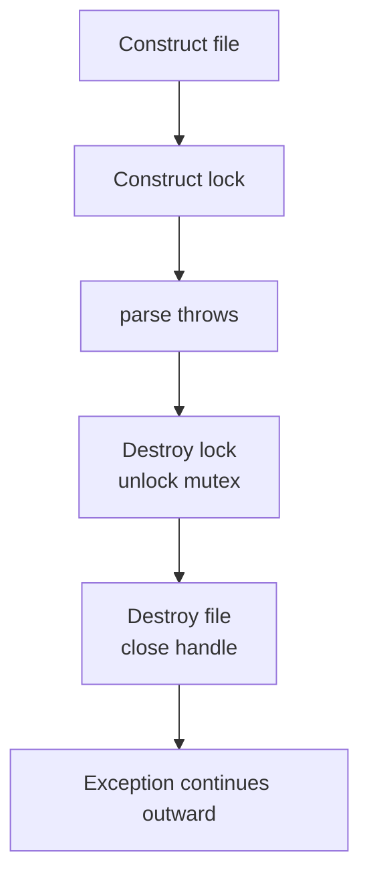
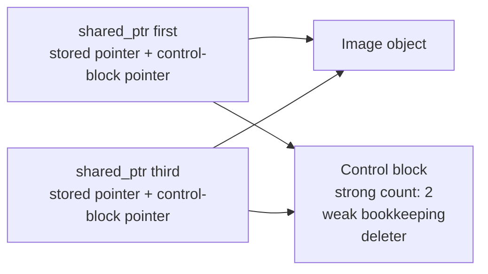
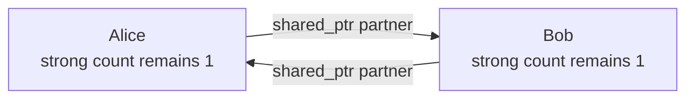

# C++ RAII, ownership & smart pointers

Resources fail when cleanup depends on remembering every exit path. A function that owns a file, lock, socket, or heap object may return early or throw; C++ solves this by expressing cleanup as object lifetime and ownership in types.

This tutorial builds one decision model:

> Prefer values. When dynamic lifetime is necessary, start with exclusive ownership. Share ownership only when independent components genuinely need to prolong the same lifetime.

## RAII: cleanup follows lifetime

**RAII** means *Resource Acquisition Is Initialization*: a successfully constructed object owns a resource, and its destructor releases that resource.

```cpp
#include <fstream>
#include <mutex>

std::mutex orders_mutex;

void process_orders() {
    std::ifstream file{"orders.txt"};   // opens a file
    std::lock_guard lock{orders_mutex}; // locks the mutex

    parse(file); // may throw
}
```

On normal return or exception-driven **stack unwinding**, fully constructed local objects are destroyed in reverse construction order:



This is **deterministic lifetime**: cleanup occurs at a language-defined boundary, not whenever a garbage collector eventually runs.

RAII is not limited to heap memory or to objects physically stored on the stack. It works for files, mutexes, transactions, sockets, and RAII members inside dynamically allocated objects. The key is that some owner eventually reaches the end of its lifetime and runs the destructor.

### Constructor failure

If a constructor throws, the enclosing object was never fully constructed, so its destructor does not run. Earlier local objects and already-constructed members are still destroyed:

```cpp
Trace a{"A"};
Trace b{"B"}; // if this constructor throws, ~Trace() runs for a, not b
```

Stack unwinding is not universal shutdown magic: destructors are not guaranteed after `std::abort`, `_Exit`, power loss, or an object that is deliberately leaked.

## Start with ownership, not pointer syntax

Ask one question before selecting a pointer:

> Who is responsible for eventually destroying this particular object?

An **owner** controls lifetime. An **observer** accesses an object whose lifetime is controlled elsewhere.

| Type | Typical lifetime meaning |
|---|---|
| `T` | Own the value directly |
| `std::unique_ptr<T>` | Exactly one owner; transferable |
| `std::shared_ptr<T>` | Several independent owners jointly prolong lifetime |
| `std::weak_ptr<T>` | Observe shared ownership without prolonging it |
| `T&` | Required non-owning observer |
| `T*` | Usually nullable/reseatable non-owning observer |

Raw pointers and references can therefore be correct. They are dangerous when ownership is ambiguous or their target can die too early—not merely because they are raw.

```cpp
void render(const Image& image); // required borrow
void select(const Image* image); // nullable borrow
```

Neither function should `delete` the image or retain the observer beyond the image's lifetime.

## Rule of Zero: delegate ownership to members

The best default is the **Rule of Zero**: compose a class from members that already manage themselves, then declare no destructor, copy/move constructor, or assignment operator.

```cpp
#include <memory>
#include <vector>

class Engine {};

class Car {
    std::unique_ptr<Engine> engine_;
    std::vector<int> diagnostics_;

public:
    Car() : engine_{std::make_unique<Engine>()} {}
};
```

The ordinary constructor does not suppress special-member generation. For `Car`:

- copying is implicitly deleted because `unique_ptr` is non-copyable;
- moving is implicitly generated because its members are movable;
- the generated destructor composes `unique_ptr` and `vector` cleanup.

A user-declared destructor—even `~Car() = default`—suppresses implicit move generation. If a class truly needs such a destructor, explicitly consider the move operations.

The older rules describe lower-level classes:

- **Rule of Three:** if a class directly manages a raw resource and needs a destructor, copy constructor, or copy assignment, it likely needs all three.
- **Rule of Five:** in modern C++, also consider move construction and move assignment.
- **Rule of Zero:** avoid that work by putting the resource in an established RAII member such as `unique_ptr`, `vector`, or a small custom handle wrapper.

## `unique_ptr`: exclusive ownership

`unique_ptr<T>` expresses exactly one lifetime owner:

```cpp
auto source = std::make_unique<Image>(1920, 1080);
```

It cannot be copied:

```cpp
auto copy = source; // error: two exclusive owners would be a contradiction
```

It can transfer ownership:

```cpp
auto destination = std::move(source);

// destination owns the same Image
// source is now empty
```

`std::move` does not move the `Image` itself. It permits the `unique_ptr` handle to transfer its stored pointer and deleter.

### Signatures communicate transfer

```cpp
void draw(const Image& image);              // borrow
void install(std::unique_ptr<Image> image); // take ownership
std::unique_ptr<Image> load();              // return ownership
```

```cpp
auto image = load();
draw(*image);               // caller retains ownership
install(std::move(image));  // ownership moves into install
```

A function that merely reads or serializes an image should accept `const Image&`, even if its caller happens to hold a `unique_ptr`. Accept `unique_ptr` by value only when the function consumes ownership.

### `get`, `release`, and `reset`

```cpp
Image* observer = image.get(); // image still owns the object

image.reset();                 // destroy the current object; become empty
```

`release()` is a specialized escape hatch: it returns the raw pointer and gives up ownership **without destroying it**. The caller must immediately transfer that pointer to another owner or compatible C API. Casual use leaks resources.

Never manually delete `image.get()`; the `unique_ptr` would later attempt a second destruction.

### Prefer `make_unique`

```cpp
auto image = std::make_unique<Image>(1920, 1080);
auto pixels = std::make_unique<int[]>(1024);
```

`make_unique` couples allocation with ownership, avoids repeating the type, handles arrays cleanly, and historically avoided a pre-C++17 argument-evaluation leak. It normally has no allocation-count advantage over constructing `unique_ptr` from `new`.

Named local return values need no explicit move:

```cpp
std::unique_ptr<Image> load() {
    auto image = std::make_unique<Image>();
    decode(*image); // may throw
    return image;   // NRVO, or implicit move if elision is not performed
}
```

Writing `return std::move(image)` is unnecessary and can inhibit NRVO.

### Custom deleters for non-`delete` resources

Some resources require a different release function:

```cpp
#include <cstdio>
#include <memory>

struct FileCloser {
    void operator()(std::FILE* file) const noexcept {
        if (file != nullptr) {
            std::fclose(file);
        }
    }
};

using FilePtr = std::unique_ptr<std::FILE, FileCloser>;

FilePtr open_file(const char* path) {
    return FilePtr{std::fopen(path, "r")};
}
```

The deleter is part of the `unique_ptr` type. `make_unique` targets ordinary `new`/`delete` ownership and does not accept a custom deleter, so construct the specialized `unique_ptr` directly.

## `shared_ptr`: shared lifetime responsibility

Use `shared_ptr` only when independent owners must all be able to prolong the object lifetime:

```cpp
auto first = std::make_shared<Image>(); // strong count: 1
auto second = first;                    // strong count: 2
auto third = std::move(second);         // strong count: still 2
```

Copying adds an owner; moving transfers an existing ownership handle. The managed object is destroyed when the last strong owner disappears.

### What the control block is

Copies must coordinate through shared metadata called the **control block**:



The control block typically contains strong and weak bookkeeping, the deleter, and sometimes allocator state. It is created once for one shared-ownership group.

Do not reconstruct shared ownership from an owner's raw pointer:

```cpp
auto owner = std::make_shared<Image>();
auto safe = owner; // copies the existing control-block pointer

auto dangerous = std::shared_ptr<Image>{owner.get()}; // new control block: wrong
```

The dangerous form creates two unrelated control blocks that may both attempt to delete the same object.

Reference-count bookkeeping is safe across separate `shared_ptr` handles, but the managed object is not thereby thread-safe. Concurrent mutation still requires synchronization.

### `make_shared`: usual win and retention tradeoff

`make_shared<T>` normally combines the control block and object into one allocation:

```text
make_shared:        [ control block | T object ]
shared_ptr{new T}:  [ control block ] [ T object ]
```

The usual benefit is one allocation and better locality. The tradeoff appears with long-lived `weak_ptr`s: when the strong count becomes zero, `T` is destroyed, but the combined allocation cannot be released until the weak bookkeeping is no longer needed. A separately allocated `T` can release its object allocation immediately while retaining only the smaller control block.

Prefer `make_shared` normally; consider separate allocation when custom deleters, allocator control, access restrictions, or significant weak-reference retention make it appropriate.

## `weak_ptr`: observe shared ownership

A `weak_ptr` refers to a `shared_ptr` control block without increasing the strong count:

```cpp
auto owner = std::make_shared<Image>(); // strong: 1
std::weak_ptr<Image> observer = owner;  // strong: 1
```

Two lifetimes now exist:

1. Strong count reaches zero: destroy the `Image`.
2. No weak observers remain: release the remaining control-block storage.

Because the object may already be dead, access it through `lock()`:

```cpp
if (auto image = observer.lock()) {
    draw(*image); // temporary strong owner keeps it alive here
} else {
    // The Image has already been destroyed.
}
```

If the object is alive, `lock()` atomically creates a `shared_ptr` and increments the strong count. Otherwise it returns an empty `shared_ptr`. `weak_ptr::use_count()` reports the **strong** count; the standard API exposes no direct weak-count accessor.

### Breaking ownership cycles

Strong ownership in both directions prevents counts from reaching zero:

```cpp
struct Person {
    std::shared_ptr<Person> partner;
};
```



Make a non-owning direction weak when it must observe a shared lifetime:

```cpp
struct Person {
    std::weak_ptr<Person> partner;
};
```

For a normal tree, shared ownership is unnecessary:

```cpp
struct Node {
    std::vector<std::unique_ptr<Node>> children; // owns downward
    Node* parent = nullptr;                      // observes upward
};
```

`weak_ptr` cannot observe an object owned only by `unique_ptr`; it requires a shared control block. The raw parent pointer is safe under the tree invariant: a child is destroyed as part of its parent, so a live attached child cannot outlive that parent.

## Advanced shared ownership: awareness level

These APIs are worth recognizing, but most ownership designs do not need them.

### `enable_shared_from_this`

Inside a member function, raw `this` contains no control-block address. Constructing `shared_ptr<T>{this}` therefore creates a dangerous second control block.

```cpp
struct Session : std::enable_shared_from_this<Session> {
    std::shared_ptr<Session> self() {
        return shared_from_this();
    }
};
```

`enable_shared_from_this<Session>` is the helper base; `shared_from_this()` is the method it supplies. A successful call returns another owner sharing the existing control block and increments the strong count. The object must already be managed by a suitable `shared_ptr`; calling it too early, such as from the constructor, throws `std::bad_weak_ptr`.

Prefer an ordinary `shared_ptr` copy whenever one is already available. This helper is mainly useful when an object must keep itself alive for an asynchronous callback.

### Aliasing constructor

An aliasing `shared_ptr` can expose a subobject while sharing ownership of its enclosing object:

```cpp
struct Packet {
    Header header;
    Payload payload;
};

auto packet = std::make_shared<Packet>();
std::shared_ptr<Header> header{packet, &packet->header};
```

`header.get()` points to the `Header`, but its control block keeps the complete `Packet` alive. When the last sharing owner disappears, the complete `Packet` is destroyed.

## Exception safety: prepare, then commit

Manual ownership leaks when an intermediate operation throws:

```cpp
Widget* build_badly() {
    Widget* widget = new Widget;
    validate(*widget); // a throw leaks widget
    return widget;
}
```

Acquire into a local RAII owner first:

```cpp
std::unique_ptr<Widget> build() {
    auto widget = std::make_unique<Widget>();
    configure(*widget); // may throw; widget is still cleaned up
    validate(*widget);  // may throw; widget is still cleaned up
    return widget;      // transfer only after success
}
```

The same prepare-then-commit shape can protect a larger operation:

```cpp
void add_widget(std::vector<std::unique_ptr<Widget>>& widgets) {
    auto candidate = build();
    widgets.push_back(std::move(candidate)); // commit ownership
}
```

Interview vocabulary:

| Guarantee | After an exception |
|---|---|
| None | State may be corrupt or resources leaked |
| Basic | No leaks; invariants remain valid; state may have changed |
| Strong | Externally visible state is unchanged |
| No-throw | Operation promises not to throw |

Destructors should normally be `noexcept`. If a destructor throws while another exception is already unwinding the stack, the program calls `std::terminate`.

## Ownership-design exercises

### 1. Tree with parent navigation

**Requirement:** A parent exclusively owns its children; a child can navigate upward.

```cpp
struct Node {
    std::vector<std::unique_ptr<Node>> children;
    Node* parent = nullptr;
};
```

The root's destruction recursively destroys the tree. The parent link observes rather than owns, so it creates no cycle.

### 2. Cache that should not prolong entries

**Requirement:** Clients may share a loaded asset, but the cache should not keep unused assets alive forever.

```cpp
class Cache {
    std::unordered_map<Key, std::weak_ptr<Asset>> entries_;

public:
    std::shared_ptr<Asset> find(const Key& key) {
        auto it = entries_.find(key);
        return it == entries_.end() ? nullptr : it->second.lock();
    }
};
```

Clients hold strong owners; the cache observes. An expired entry can be recreated and periodically removed.

### 3. C handle with one owner and many borrowers

**Requirement:** Exactly one service owns a C library handle; helper functions temporarily use it.

```cpp
using HandlePtr = std::unique_ptr<CHandle, HandleDeleter>;

class Service {
    HandlePtr handle_; // owner
};

void inspect(const CHandle& handle); // borrower
```

Do not upgrade borrowers to shared ownership merely for convenience.

### 4. Async callback lifetime

Ask whether the callback should keep its target alive:

- **Yes:** capture a `shared_ptr`; the callback prolongs lifetime.
- **No:** capture a `weak_ptr`, call `lock()`, and skip work if the target expired.

That is a product/lifetime decision, not a pointer-style preference.

## Practice prompts

1. Refactor a class containing `FILE*` and manual cleanup into a Rule-of-Zero class using `unique_ptr` with a custom deleter.
2. Trace strong counts for three `shared_ptr` copies, one move, and two resets.
3. Draw an ownership graph for a document tree, UI observer, cache, or async callback before selecting pointer types.
4. Find the cycle in two objects that store `shared_ptr`s to each other; decide which edge should become weak and justify why.
5. Implement a factory that constructs, validates, and returns `unique_ptr<T>` with the strong guarantee.

## Common interview questions

### What problem does RAII solve?

It binds resource release to deterministic object destruction, so normal returns and exception unwinding follow the same cleanup path.

### Is RAII only for memory?

No. Files, locks, sockets, database transactions, and other resources can all be represented by types whose destructors release them.

### Rule of Zero versus Rule of Five?

Prefer Rule of Zero by composing established RAII members. If a low-level class directly manages a raw resource and declares one ownership-related special member, examine all five copy/move/destruction operations.

### Why is `unique_ptr` the default dynamic owner?

It states one owner, has cheap move-based transfer, normally has no reference-count overhead, and forces lifetime handoffs to be explicit.

### When is a raw pointer correct?

When it is a clearly non-owning, often nullable observer and the surrounding lifetime rules guarantee that its target remains alive while accessed.

### `make_unique` versus `make_shared` allocation benefits?

`make_unique` mainly improves expression and ownership safety; it normally performs the same object allocation. `make_shared` normally combines object and control block into one allocation.

### What is a `shared_ptr` control block?

Shared metadata used by all owners: strong and weak bookkeeping, deleter, and possibly allocator state. Copies share one control block.

### Does `shared_ptr` make the object thread-safe?

No. Shared ownership bookkeeping is synchronized appropriately across handles; concurrent access to the object still needs its own synchronization.

### Why can `shared_ptr<T>{owner.get()}` double-delete?

`get()` provides only the object address, not the control-block address. Construction from that raw pointer creates a second ownership group for the same object.

### How does `weak_ptr` break a cycle?

It observes a shared control block without increasing the strong count, allowing strong ownership to reach zero even while the observer exists.

### What happens when the strong count reaches zero but weak observers remain?

The managed object's destructor runs. The control block remains so weak observers can detect expiration; its storage is released after weak bookkeeping is no longer needed.

### What is the `make_shared` weak-retention tradeoff?

The object and control block usually share one allocation. After object destruction, that combined allocation may remain reserved until long-lived weak observers disappear.

### Why should destructors not throw?

A destructor throwing during stack unwinding causes `std::terminate`. Cleanup should normally be no-throw, with fallible finalization exposed as a separate explicit operation when necessary.

### How would you choose pointers for a tree?

Use `unique_ptr` from parent to children and a non-owning `Node*` back-link. The tree already has a natural ownership direction; shared ownership adds no value.

### What are `enable_shared_from_this` and aliasing constructors?

Awareness answer: the former lets a shared-owned object safely obtain another owner using its existing control block; the latter exposes a different pointer, such as a member, while sharing an owner's lifetime.

## See also

- [C++ hub](../cpp/)
- [Python context managers](../python-context-managers/) — explicit `with` cleanup compared with scope-driven C++ RAII
- [Dynamic dispatch & object models](../dynamic-dispatch-and-object-model/) — ownership is separate from runtime polymorphism
