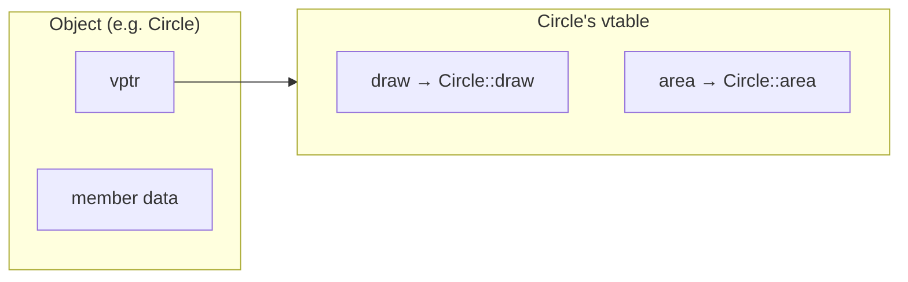

# Virtual tables (vtables) in C++

This page is a **self-contained tutorial**: what a vtable is, how C++ uses it at runtime, how you can mimic the idea in plain C, and **common interview questions** (including “implement a vtable by hand”).

## The problem vtables solve

You want **one interface, many implementations**:

- Call `draw()` on a `Shape*`, and get **circle** behavior if the object is really a `Circle`, **rectangle** behavior if it is a `Rectangle`.
- The compiler does **not** always know the concrete type at compile time (e.g. pointer from a factory, array of mixed subclasses).

**Static dispatch** picks the function at compile time (overload resolution on the static type). **Dynamic dispatch** picks the function **at runtime** based on the **actual** type of the object. In C++, `virtual` functions use dynamic dispatch; the usual implementation is a **vtable** (virtual function table) plus a **vptr** (pointer to that table).

## Mental model (two sentences)

1. Each **class** that has virtual functions gets a **vtable**: an array of function pointers (one slot per virtual function, in a fixed order).
2. Each **object** of such a class carries a **hidden pointer** (`vptr`) to its class’s vtable. A **virtual call** follows `object → vptr → vtable[slot] → correct override**.



## Minimal C++ example

```cpp
struct Shape {
  virtual ~Shape() = default;
  virtual void draw() const {}
};

struct Circle : Shape {
  void draw() const override { /* ... */ }
};

void foo(Shape* s) {
  s->draw();  // dynamic: calls Circle::draw if *s is a Circle
}
```

**What the implementation typically does** (ABI-dependent, but the idea is universal):

- `Shape` and `Circle` each have a vtable (unless the hierarchy is optimized).
- A `Circle` object’s `vptr` points at `Circle`’s vtable; `Shape` subobject might share or adjust — details belong to the **Itanium C++ ABI** (common on Linux/macOS) or MSVC’s ABI on Windows.
- `s->draw()` becomes something like: load `vptr` from `*s`, load function pointer from vtable slot for `draw`, call it (with `this` adjusted as needed).

## Key vocabulary

| Term | Meaning |
|------|---------|
| **vtable** | Per-class table of pointers to the **final overriders** of virtual functions (layout is compiler-defined). |
| **vptr** | Per-object pointer to the vtable (often at offset 0 of the polymorphic object). |
| **RTTI** | Run-time type info (`typeid`, `dynamic_cast`) — often stored **near** vtables (e.g. `type_info*`), not the same as “the vtable itself”. |
| **Pure virtual** | `virtual void f() = 0;` — no body in this class; class is abstract. Still gets a vtable slot (often with a **pure virtual stub** that aborts if called by mistake). |

## Pure virtual, abstract classes, destructors

- **Always make base destructors `virtual`** if you delete through a base pointer; otherwise you get **undefined behavior** (wrong destructor, wrong size passed to `delete` in some cases).
- **Pure virtual destructor**: you can declare `virtual ~Base() = 0;` but you **must still define it out of line** — linkers need one definition.

## Multiple inheritance (sketch)

With **multiple bases**, an object may have **multiple vptrs** (one per polymorphic subobject), and **thunks** may adjust `this` when jumping from a vtable entry. Interview answer: “vtable/vptr model gets more complex; offsets and `this` adjustments matter.”

## How C can do “something similar”

C has **no** `virtual` keyword. You simulate polymorphism with **explicit structure layout**:

1. **Function pointers in the struct** (“embedded vtable” per object), or  
2. **A pointer to a shared `ops` table** (vtable) + **a `void*` or typed pointer to “instance data”** — the **`opaque pointer`** idiom used in many C APIs.

### Pattern A: pointer to an `ops` struct (vtable-style)

```c
typedef struct Shape Shape;
typedef struct ShapeOps {
  void (*destroy)(Shape*);
  void (*draw)(const Shape*);
} ShapeOps;

struct Shape {
  const ShapeOps *ops;  /* like vptr */
  /* common fields */
};

typedef struct {
  Shape base;
  double radius;
} Circle;

static void circle_destroy(Shape *s) {
  (void)s; /* stack-allocated demo; heap objects would free(s) here */
}

static void circle_draw(const Shape *s) {
  const Circle *c = (const Circle *)s;
  (void)c->radius;
}

static const ShapeOps circle_ops = { .destroy = circle_destroy, .draw = circle_draw };

void circle_init(Circle *c, double r) {
  c->base.ops = &circle_ops;
  c->radius = r;
}

void shape_draw(const Shape *s) {
  s->ops->draw(s);  /* dynamic dispatch */
}
```

This mirrors **one vptr + one vtable per class**. Real C libraries (e.g. kernel-style, GTK-style) use the same idea with different naming (`class`, `vtable`, `iface`, etc.).

### Pattern B: tagged union (no function pointers)

If the set of types is **closed** and small, a `kind` enum + `union` avoids indirection; tradeoff: no open extension without editing the union.

## Implementing a vtable “by hand” (interview style)

**Prompt:** “Show how you’d implement dynamic dispatch without the compiler doing it.”

**Answer outline:**

1. Define a **struct of function pointers** for all “virtual” operations (`ShapeVTable`).
2. Define **one global const instance per concrete type** (`circle_vtable`, `rect_vtable`).
3. Put a **`const ShapeVTable *`** (or `ShapeVTable **`-style indirection) as the **first member** of each “object” struct so casting `Shape*` to `Circle*` stays predictable **only if** layout matches your discipline — in real C++ the compiler enforces layout; **in hand-rolled C you document it**.
4. “Virtual” call: `obj->vtable->draw(obj)`.

**C++ without `virtual` (same idea):**

```cpp
struct ShapeVTable {
  void (*draw)(const Shape*);
};

struct Shape {
  const ShapeVTable* vtable;
};

struct Circle {
  Shape base;
  double r;
};

static void circle_draw(const Shape* s) {
  const Circle* c = reinterpret_cast<const Circle*>(s);
  (void)c->r;
}

static const ShapeVTable circle_vtable = { circle_draw };

void draw_shape(const Shape* s) {
  s->vtable->draw(s);
}
```

This is **not** identical to compiler-generated code (no `this` adjustment thunks, no multiple inheritance), but it shows you understand **indirection through a function-pointer table**.

## Virtual calls vs inline / devirtualization

- **Virtual calls** have indirection cost; **final** / `final` classes or non-virtual functions allow **inlining**.
- Compilers **devirtualize** when they can prove the dynamic type (e.g. local variable of concrete type).

## Common interview questions

### 1. What is a vtable?

A **per-class** array of pointers to virtual functions (implementation detail). Objects hold a **vptr** to their class’s vtable; **virtual calls** index into that table.

### 2. Where does the vptr live?

Typically at a **fixed offset** in the object (often the beginning) for the **primary** polymorphic subobject — exact rules are **ABI-specific**.

### 3. Cost of `virtual`?

Extra memory per object (vptr); extra indirection per virtual call; **instruction cache** effects; sometimes prevents inlining unless devirtualized.

### 4. Why virtual destructor?

Deleting through `Base*` when the real object is `Derived` **must** call `Derived::~Derived`. Non-virtual `~Base()` is a classic bug.

### 5. `virtual` call mechanism step by step?

Load **vptr** from object → load **function pointer** from **vtable slot** for that function → call with correct **`this`** (possibly adjusted).

### 6. How does C do polymorphism?

**Function pointers** in structs, or a **shared ops/vtable table** per type + **opaque pointers**; sometimes **tagged unions**. Same **ideas**, no language support.

### 7. Implement a vtable.

See **“Implementing a vtable by hand”** above: **`ops` / `ShapeVTable` struct**, one **static table per type**, **dispatch** through `obj->vtable->method(obj)`.

### 8. Pure virtual class — vtable?

Yes; abstract classes still have vtables; undefined pure virtuals may point to **library-defined stubs** that terminate the program if invoked.

### 9. `dynamic_cast` / RTTI — same as vtable?

**Related but not the same.** RTTI often lives in **metadata** reachable from the same object model (e.g. **type_info**); **`dynamic_cast`** may walk **class hierarchies** (e.g. via **runtime link info**), which is heavier than a single virtual call.

### 10. Multiple inheritance — one vptr?

Often **more than one** vptr; **thunks** adjust pointers. High-level answer for interviews: **multiple vtables / multiple vptrs** and **pointer adjustment**.

---

## Further reading (spec / ABI)

- C++ standard defines **semantics** of virtual calls; **layout** is platform ABI (e.g. **Itanium C++ ABI**).

When studying for interviews, focus on: **vptr + vtable**, **virtual destructor**, **C analog (ops table)**, and **hand-rolled dispatch** — not every platform detail.

---

## See also (cross-language)

- [C++ polymorphism & ownership pitfalls](../cpp-polymorphism-ownership/) — apply virtual dispatch safely with slicing, virtual destructors, factories, downcasting, and cloning.
- [Dynamic dispatch & object models (C++, Python, JavaScript)](../dynamic-dispatch-and-object-model/) — compares **vtable** dispatch with **Python MRO** lookup and **JavaScript prototype** chains on the same “polymorphic call” problem.
