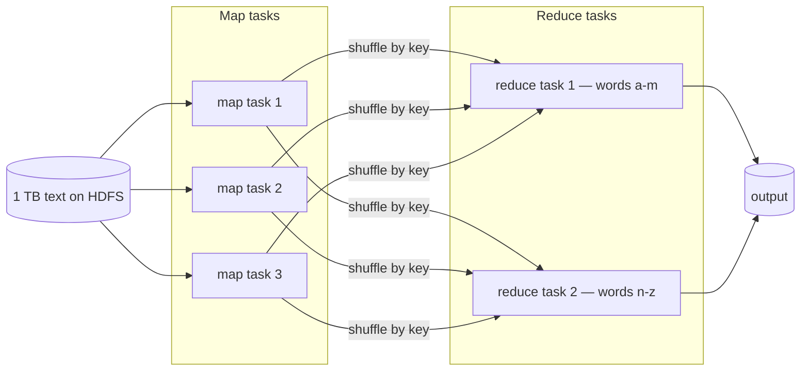
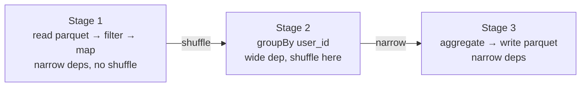
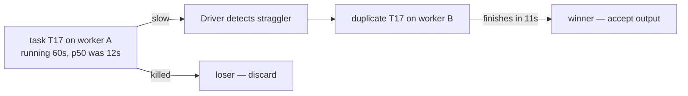

# Distributed batch & stream compute — MapReduce, Spark, worker failure

The class of system behind **Hadoop**, **Spark**, **Flink**, **Dask**, and most "in-house distributed-compute frameworks" you'll hear about at quant / trading firms. This page is about the **patterns**, not the products — once you understand task graphs, lineage, and shuffles, every product becomes the same idea with different defaults.

Companions: [Message queues](../distributed-message-queues/) and [Delivery semantics & idempotency](../distributed-delivery-and-idempotency/) — those handle event flow; this page handles the **compute** that consumes them.

---

## Why this matters

Pitches like "ingest and transform vast quantities of data" or "training complex models on a cluster" mean: **one logical job is split into hundreds of small tasks running on different machines**. The interviewer wants to know whether you can reason about:

- How the work gets **chopped up**.
- What happens when **one task fails**, **one worker dies**, or **one machine is just slow**.
- Why the answer to "are duplicates a problem?" is "no, because the tasks are pure functions" (and what happens when they aren't).
- When a **batch** answer is wrong and you actually need a **stream**.

---

## Terms in plain English

| Term | Plain meaning |
|------|---------------|
| **Driver / coordinator** | The single process that holds the plan, ships tasks to workers, tracks progress. The brain. |
| **Worker / executor** | A process on some machine that runs tasks the driver hands it. Many of these. |
| **Task** | One unit of work — typically "process partition K of dataset D with this function." Workers run thousands of these per job. |
| **Partition** | One slice of the input data. The number of partitions ≈ the parallelism. |
| **Stage** | A group of tasks that can run in parallel without talking to each other. Boundaries between stages are **shuffles**. |
| **Shuffle** | The expensive step where data is **redistributed across the network** so all rows with the same key land on the same worker. Joins and `groupBy` need this. |
| **Lineage / DAG** | The recipe of "how to recompute this dataset from its inputs." Spark calls it RDD lineage; SQL engines call it the query plan. The whole reason re-execution on failure is cheap. |
| **Narrow vs wide dependency** | **Narrow**: a child partition depends on a small fixed number of parent partitions (e.g. `map`, `filter`). No shuffle. **Wide**: a child partition depends on **many** parent partitions (e.g. `groupBy`, `join`). Triggers a shuffle. |
| **Speculative execution** | Driver notices task T is unusually slow on worker A; launches a duplicate of T on worker B; takes whichever finishes first; cancels the loser. |
| **Checkpoint** | Persist an intermediate dataset to durable storage so you don't have to recompute from raw inputs after a failure. |

---

## MapReduce — the original mental model

Hadoop popularised this. The whole world is two pure functions:

```text
map:    record  ->  (key, value) pairs
reduce: (key, list of values)  ->  output
```

The framework handles everything between them: partitioning, sorting by key, **shuffling values to the reducer that owns that key**, retrying on failure.

### Word-count, in 5 sentences

1. Input is a 1 TB text file, split into 10,000 partitions (HDFS blocks).
2. **Map phase**: 10,000 map tasks run in parallel. Each emits `(word, 1)` for every word in its partition.
3. **Shuffle**: all `(word, 1)` pairs with the same `word` are routed to the same reducer over the network.
4. **Reduce phase**: each reducer sums the `1`s for the words it owns.
5. Output: `(word, total_count)` pairs. Done.



The shape of every batch system is some variation on this. Spark adds **multiple stages** chained, **in-memory intermediates**, and a **DAG scheduler**. Flink turns it sideways into long-running stream operators. The primitive is the same.

---

## The DAG: Spark's mental model

A Spark job is a **DAG of stages**, where each stage is a bunch of parallel tasks and stage boundaries are shuffles.



**Why this matters in interviews:** the cost model is "stages cost CPU; shuffles cost the network." A senior answer to "this job is slow" is "where are the shuffle boundaries — can I push filters before them, can I broadcast a small side, can I pre-partition the input by the join key?"

### Narrow vs wide — concrete

```python
# Narrow: each output partition depends on exactly one input partition.
# No data crosses the network. Fast.
df.filter(df.amount > 100).select("user_id", "amount")

# Wide: every output partition for groupBy depends on rows with that user_id
# from EVERY input partition. The framework has to shuffle.
df.groupBy("user_id").sum("amount")

# Wide: join needs both sides co-located by key → shuffle (or broadcast).
big_df.join(small_df, on="user_id")

# Wide-but-cheap: broadcast join.
# Driver sends `small_df` to every worker; the join becomes narrow.
from pyspark.sql.functions import broadcast
big_df.join(broadcast(small_df), on="user_id")
```

Picking up "wide vs narrow" in conversation is one of the best signals you can give that you've actually used these systems.

---

## What happens when one worker fails?

This is the question. The answer has two layers.

### Layer 1 — A single task fails (transient)

Worker B is running task T17. The task throws (OOM, network glitch reading from S3, a bug, whatever). The worker reports failure to the driver. The driver:

1. Marks T17 as failed.
2. **Retries T17 on a different worker** (configurable retry count, e.g. 4 in Spark).
3. If it succeeds, the job continues as if nothing happened.
4. If T17 fails repeatedly (4 retries), the **whole stage** fails, which usually fails the whole job.

The cost is the time to re-run T17. **No data was lost** because T17 was a pure function of its input partition — re-running gives the same answer.

### Layer 2 — A whole worker dies

Worker B's host crashed. It was running tasks T17, T22, T31, **and held shuffle outputs from stage 1 for tasks T8 and T15**.

The driver:

1. Reschedules T17, T22, T31 on other workers — they re-read input and run.
2. Notices that the shuffle outputs from T8 and T15 are gone with B. It must **recompute T8 and T15 from their inputs** so that downstream stage tasks can re-fetch them. This is where **lineage** earns its keep — the DAG records exactly how to recompute every partition from its parents, all the way back to durable input if needed.

This is the part Hadoop got famous for and Spark improved on: **the system never asks you "what should I do?" after a failure; it just recomputes from lineage.** Workers come and go and the job still finishes.

### What if half the cluster dies at once?

Same logic, more recompute. The driver is the single point of failure here — if the **driver** dies, the job is gone (modern systems support driver checkpointing, but assume not in an interview unless asked).

---

## Why pure / idempotent tasks matter

Re-execution on failure only works because **tasks are deterministic functions of their input partition**. If your `map` function:

- writes to an external DB,
- sends an email,
- increments a counter in Redis,

…then a retry runs it twice. Now you're back in the territory of [delivery semantics & idempotency](../distributed-delivery-and-idempotency/) — your task body itself needs an idempotency key, or you need to defer side effects to a downstream sink that handles them.

A clean Spark job follows: **read → transform → write to one sink with bulk semantics**. If you find yourself making HTTP calls in a `mapPartitions`, that's an interview red flag and you should mention it.

---

## Speculative execution — the "stragglers" problem

Real clusters have **stragglers**: one worker is on a hot disk, or sharing a noisy neighbour, and its task is running 5× slower than the median.



The driver launches a **duplicate** of the slow task on a different worker. It takes whichever finishes first and cancels the loser. This works precisely because tasks are **pure** — running the same task twice is fine, you just pick a result.

**Interview line:** "Speculative execution is the *complement* of failure recovery — both rely on the same property: the task body is a deterministic function of its input. If your task body has external side effects, you must turn off speculative execution or accept doubled effects."

---

## Checkpointing — when lineage gets too long

Lineage-based recovery has one weakness: long pipelines. If your job is 50 stages deep and stage 47 fails, recomputing all the way from raw input is painful.

The fix is **checkpointing**: at strategic points, persist an intermediate dataset to durable storage (HDFS, S3). After that point, lineage is "read from the checkpoint" — short.

```python
# Pseudocode
intermediate = (
    raw
    .filter(...)        # stage 1
    .map(...)           # stage 1
    .groupBy(...)       # stage 2 (shuffle)
    .agg(...)
)
intermediate.checkpoint()   # write to HDFS / S3
# downstream stages read from the checkpoint, not from `raw`
```

You also do this for **iterative algorithms** (ML training loops) where each iteration depends on the previous one — without checkpoints, the lineage grows unboundedly with iteration count.

---

## Streaming variants — same shape, different ticking

For "real-time" answers to the same problem, you want a **streaming** engine: Flink, Spark Structured Streaming, Kafka Streams. Tasks become **long-running operators** that consume from a queue, hold state, and emit results.

Two new ideas you should be able to mention:

### Watermarks — handling late data

Stream data arrives **out of order** (network jitter, retries). If you're computing "events per minute," when do you finalise the 10:01 bucket — at 10:02? Or do you wait, in case a 10:01 event arrives late at 10:05?

A **watermark** is the engine's promise: "I won't see events older than this timestamp anymore." Once the watermark passes 10:01, the 10:01 bucket is closed and emitted. Late events after that are either dropped or fed into a "late-arrival" sink.

### Stateful operators

A stream's `groupBy(user_id).count()` cannot fit "all rows for that user since the dawn of time" in memory — instead the operator keeps **state** (the current counts) in a local store (RocksDB), and **checkpoints** that state to durable storage periodically. On failure, the operator restarts from the last checkpoint and replays the messages since.

This is where **Kafka + Flink** get you closest to actual exactly-once for streaming — the checkpoint includes the consumed offsets, so restarting from the checkpoint resumes from exactly the right point. (See: [delivery semantics](../distributed-delivery-and-idempotency/).)

---

## Concrete trace — word count with one worker dying

3 workers. Input split into 6 map partitions (M1–M6) and 2 reduce partitions (R1–R2).

| Step | Event | State |
|------|-------|-------|
| 1 | Driver schedules M1, M2 → A ; M3, M4 → B ; M5, M6 → C | all running |
| 2 | A finishes M1, M2 ; B finishes M3 | A idle ; C still on M5/M6 |
| 3 | Worker B **dies** mid-M4. M3's shuffle output is on B's local disk → also lost. | M3 and M4 must be redone |
| 4 | Driver reschedules M3 → A, M4 → C | A running M3, C running M4/M5/M6 |
| 5 | All map tasks done. Driver schedules R1, R2 | reducers run |
| 6 | Done | output written |

The job survived. The cost was redoing M3 (it had finished, but its output was on the dead worker) and the in-flight M4. **No correctness was lost** because the map function was a pure function of its input partition.

If, in step 3, the reduce phase had already started reading shuffle data from B, the affected reduce tasks would also be marked failed and rescheduled after the redone maps finished. Spark calls this **fetch failure**; it propagates back through the DAG.

---

## A tiny PySpark sketch

```python
from pyspark.sql import SparkSession

spark = SparkSession.builder.appName("orders-by-user").getOrCreate()

orders = spark.read.parquet("s3://data/orders/")    # input partitions = HDFS/S3 blocks

result = (
    orders
      .filter("status = 'completed'")               # narrow — runs in stage 1
      .groupBy("user_id")                           # wide — stage boundary, shuffle
      .agg({"amount": "sum"})
      .withColumnRenamed("sum(amount)", "total")
)

result.write.parquet("s3://data/user_totals/")      # writes one file per output partition
```

Things you can say about this 7 lines:

- "There are **two stages** here — one before the `groupBy` (filter, narrow), one after (aggregate, narrow). The `groupBy` is the shuffle boundary."
- "Parallelism is bounded by **input partition count** for stage 1 and `spark.sql.shuffle.partitions` (default 200) for stage 2."
- "If `user_id` is heavily skewed (one user has 90% of orders), one shuffle partition is huge and one task takes forever. Mitigations: salting the key, AQE skew handling, or a custom partitioner."
- "If a worker dies mid-job, the framework reruns its map tasks from input and the affected shuffle blocks. The result is the same."

---

## When this is the wrong tool

Don't say "I'd use Spark" for problems that don't earn it. Tell-tale signs:

- Data fits on one machine. A pandas / DuckDB / numpy answer is faster, simpler, and cheaper.
- Latency budget is sub-second. Spark batch is minutes; even Structured Streaming is in the seconds. Reach for Flink / Kafka Streams / a hand-written consumer instead.
- The transformation is a stateless event handler. A queue with a worker pool is enough.

A senior signal in interviews is **declining** distributed compute when it isn't needed.

---

## Common interview questions

### "What happens if a worker dies in the middle of a job?"

"The driver detects it via missed heartbeats. Tasks the worker was running are rescheduled on other workers. Crucially, **shuffle outputs** that were on the dead worker's local disk are gone, so the **map tasks that produced them are also rerun** — that's why Spark tracks lineage all the way back to durable input. The work is redone, not lost; correctness is intact because tasks are pure functions of their input partitions. The cost is the time to recompute the lost work."

### "Why isn't double-running a task a problem?"

"Because tasks are deterministic functions of their input partition — running the same task twice produces the same output bytes. Speculative execution actually depends on this: if a worker is slow, the driver launches a duplicate task elsewhere and takes whichever wins. Both failure recovery and stragglers are solved by the same property. The moment you put a side effect — DB write, HTTP call, email — inside a task body, you break the property and have to add idempotency yourself."

### "Why is `groupBy` expensive?"

"Because it's a **wide** dependency: the value for one output key can come from any input partition, so the framework must **shuffle** — rows are redistributed across the network so each output partition's key set lives in one place, then sorted/aggregated. Shuffles are the dominant cost in most Spark jobs. Mitigations include reducing data before the shuffle (filter early), using broadcast joins when one side is small, and pre-partitioning the input by the join/group key."

### "What's a stage?"

"A group of tasks that can run in parallel without talking to each other — i.e. a chain of narrow dependencies. Stage boundaries are exactly the shuffle boundaries. The DAG scheduler turns your code into stages, runs them in order, and parallelism within a stage is the number of partitions."

### "MapReduce vs Spark — what changed?"

"Three things, in order of impact. (1) **In-memory intermediates** — MapReduce wrote shuffle data to HDFS between stages; Spark keeps it in memory or local disk, so iterative algorithms (ML, graph) get orders-of-magnitude speedup. (2) **General DAGs** instead of strictly two phases — you can chain dozens of narrow operations and shuffles. (3) **Better APIs** — DataFrames + Catalyst optimiser do filter pushdown, projection pruning, broadcast-join detection automatically. The fault-tolerance story is the same: lineage-based recompute on partition loss."

### "What's the difference between batch and stream processing?"

"Batch processes a **bounded** input — you know when it ends. Stream processes an **unbounded** input — events keep arriving. The interesting consequence is that streaming engines need answers to questions batch doesn't: when to emit aggregates (**watermarks** and **windowing**), how to keep operator state across events without exhausting memory (**state stores + checkpoints**), and how to handle late-arriving data. The internals look similar — both are DAGs of operators on partitioned data — but the lifecycle is different."

### "How would you build something like an in-house distributed-compute framework?"

A safe shape to talk through:

1. **A scheduler / driver** that takes a job description (DAG of tasks).
2. **A task definition** with input partition + pure function. Serialised and shipped to workers.
3. **A worker pool** with heartbeats so the driver knows who's alive.
4. **A shuffle protocol** — workers expose a fetch endpoint for their intermediate outputs.
5. **Failure handling**: missed heartbeats → re-schedule tasks; lineage tracked so lost shuffle outputs get recomputed.
6. **Speculative execution**: launch duplicates for tasks beyond p95 runtime in their stage.
7. **Storage abstraction**: input/output go through some pluggable layer (HDFS, S3, internal store).
8. **Optional**: checkpointing for long lineages, accumulators for diagnostics, broadcast variables for small side data.

Then say: "Spark, Ray, Dask, and most in-house frameworks are variations on these eight pieces."

---

## See also

- **[Distributed message queues](../distributed-message-queues/)** — what feeds streaming jobs.
- **[Delivery semantics & idempotency](../distributed-delivery-and-idempotency/)** — why your task body shouldn't have side effects, and what to do when it must.
- **[Iterators & generators](../iterators-and-generators/)** — the local, single-process analogue of operator-style processing.
