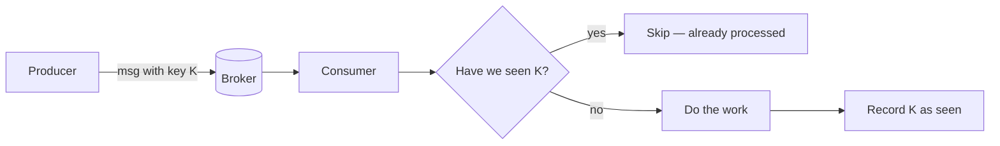
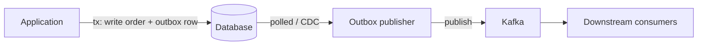

# Delivery semantics & idempotency — defeating double-processing

The most common follow-up to "I'd put a queue between them" is **"how do you make sure a message isn't processed twice?"** This page is the answer, with code, traces, and the honest version of "exactly-once."

Companion: [Distributed message queues](../distributed-message-queues/) — the broker / partitions / consumer group story this page builds on.

---

## The honest framing

There are exactly three kinds of delivery you can promise. Memorise this table.


| Semantic           | What it means                                  | What can go wrong                                                                  |
| ------------------ | ---------------------------------------------- | ---------------------------------------------------------------------------------- |
| **At-most-once**   | Each message is processed **0 or 1** times.    | Lost messages. Acceptable for telemetry, fire-and-forget metrics.                  |
| **At-least-once**  | Each message is processed **1 or more** times. | **Duplicates.** This is the default for real systems.                              |
| **"Exactly-once"** | Each message effectively takes effect once.    | Either limited to a closed system, or relies on **idempotency** at the boundaries. |


**Sentence to put on the whiteboard:** *"In any system that crosses a network and survives crashes, the wire gives you at-least-once. Exactly-once is something you build on top with idempotency, not something the broker hands you."*

That sentence alone is worth points.

---

## Where do duplicates come from?

Not "from the broker." Concrete spots:

1. **Producer retry.** Producer sends M, the network drops the ack, the producer retries — broker now has M and M'. (Defeated by the **idempotent producer** — Kafka assigns producer ID + sequence per partition and dedupes server-side. On by default in modern Kafka.)
2. **Consumer crash before commit.** Consumer pulled M, did the work, was about to commit the offset, and died. Restart → re-read M → work runs **again**.
3. **Rebalance during work.** A consumer group rebalance reassigns partitions while a message is mid-flight. The new owner re-reads from the last committed offset.
4. **At-least-once at HTTP boundaries.** Your handler calls `POST /charge` on a third-party API; the call succeeded but the response timed out; you retry; charge happens twice.
5. **Application bug.** Two services subscribe to the same topic and both write to the same downstream table. Not a broker problem — a design problem. Worth flagging because interviewers test whether you can distinguish.

**The first three** are the ones a queue introduces. **The last two** travel with you regardless of whether you use a queue.

---

## The truth about "exactly-once"

When a vendor says "exactly-once," they mean one of these things — make them say which:

### A. End-to-end exactly-once *within* the broker's world

Kafka's "exactly-once semantics" (EOS) covers the **read-process-write** loop **when both the read and the write live in Kafka**:

```text
consume from topic A → transform → produce to topic B → commit offsets
```

It works because Kafka can wrap the offset commit and the produce in one **atomic transaction**. Either both happen (next consumer sees the new committed offset *and* the new message in B) or neither does. If your "process" step also touches an external system (DB, HTTP), EOS does **not** save you — that part is yours to make idempotent.

### B. Exactly-once **effect** via idempotency

The message may arrive twice on the wire. Your handler treats the second arrival as a no-op. The **observable effect** is once.

This is the version you actually deliver in real systems. The rest of this page is how.

---

## Idempotency, the real definition

A handler `f(msg)` is **idempotent** if running it twice with the same input has the same effect as running it once.

```python
f(msg) == f(f(msg))   # in observable side-effects, not in return value
```

Three flavors, easiest to hardest:

1. **Naturally idempotent** — `SET user.email = "a@b.com"`. Run it 5 times, end state same.
2. **Made idempotent with a key** — `INSERT order WHERE id = "order-42" IF NOT EXISTS`. The second insert no-ops.
3. **Hard-to-make-idempotent** — "send an email to the user." Re-send and they get two emails. You usually solve this by **recording that you sent it** in your own DB *before* the side effect, so a retry sees the record and skips.

The thing interviewers want to hear: **idempotency is built around an idempotency key**, supplied by the producer, that uniquely identifies the *intent*, not the message instance.

---

## Recipe 1 — Idempotency key + dedupe store

The simplest, most common pattern. The producer attaches a unique key per **logical operation**. The consumer checks a dedupe store before doing the work.




**The key choice matters.** It must identify the *intent*, not the *delivery*. For a payment: `idempotency_key = client_request_id` (one per checkout button press), **not** `message_id` (changes on retry).

### Python: dedupe with Redis SETNX + TTL

```python
import json
import redis

r = redis.Redis()

def handle(msg_bytes: bytes) -> None:
    msg = json.loads(msg_bytes)
    key = f"dedupe:order:{msg['idempotency_key']}"

    # SET NX EX: set only if not exists, with a TTL.
    # Returns True only the first time. Atomic on the Redis side.
    first_time = r.set(key, "1", nx=True, ex=24 * 3600)
    if not first_time:
        return  # duplicate — skip

    do_the_work(msg)   # not necessarily idempotent on its own
```

**Why a TTL?** Otherwise the dedupe set grows forever. The TTL is the **dedupe window** — long enough to outlast the broker's retention + retry budget, short enough that the dataset stays small. 24h is a reasonable starting answer for queues with hours of retention.

**Race condition to mention out loud:** if the consumer crashes *between* `SETNX` and `do_the_work`, the key is set but the work didn't happen. Next delivery sees the key and skips → message **lost**.

The fix: do the work and the dedupe mark in the **same transaction** as the side-effect database. That's recipe 2.

### Python: dedupe in the same DB transaction as the write

```python
def handle(msg):
    with db.transaction():
        # 1) try to claim the key. UNIQUE constraint on processed_messages.id
        try:
            db.execute(
                "INSERT INTO processed_messages(id, processed_at) VALUES (%s, NOW())",
                [msg["idempotency_key"]],
            )
        except UniqueViolation:
            return  # already processed

        # 2) do the actual write
        db.execute(
            "INSERT INTO orders(id, user_id, amount) VALUES (%s, %s, %s)",
            [msg["order_id"], msg["user_id"], msg["amount"]],
        )
        # commit happens at the end of `with`. Either both rows land, or neither.
```

This is the **canonical** answer. Both writes commit atomically; a crash mid-transaction leaves nothing — next delivery does the work cleanly. If the side effect lives outside the DB (HTTP call, email), you fall back to recipe 3.

---

## Recipe 2 — Transactional outbox

The problem: you want to **update your DB** *and* **publish a message to Kafka**, both atomically. You can't — they're two systems.

The classic fix: write the message into a **table** in the same DB transaction. A separate process tails that table and publishes to Kafka. The DB write and the "intent to publish" are one transaction.




```sql
BEGIN;
  INSERT INTO orders(id, user_id, amount) VALUES ('o42', 'u1', 9.99);
  INSERT INTO outbox(id, topic, key, payload, published)
    VALUES ('o42', 'orders', 'u1', '{...}', false);
COMMIT;
```

A separate publisher reads `WHERE NOT published`, sends to Kafka, then sets `published = true` (or deletes the row). If the publisher crashes after sending but before marking published, **it sends again** — but that's fine if downstream consumers are idempotent.

**Two-line interview pitch:** "Outbox makes the DB write and the publish atomic. The publish itself is at-least-once, so consumers still need idempotency keys. The combination gives the **observable** exactly-once you wanted."

**CDC variant:** instead of a polling publisher, use **Change Data Capture** (Debezium tailing the WAL). Same idea, less polling.

---

## Recipe 3 — Side effects on third parties

Your handler calls `POST https://payments.example.com/charge`. You can't roll that back. Two patterns:

### a. Pass an idempotency key to the third party

Most modern payment APIs (Stripe, etc.) accept an `**Idempotency-Key`** header. They store it server-side and return the *same* result on retry. Pass `f"charge-{order_id}"` and you can retry as much as you like.

```python
import httpx

def charge(order):
    httpx.post(
        "https://api.stripe.com/v1/charges",
        headers={"Idempotency-Key": f"charge-{order['id']}"},
        data={"amount": order["amount"]},
    )
```

### b. Record-then-act, with reconciliation

If the third party doesn't support idempotency keys:

```text
1. Reserve a row: INSERT INTO outbound_calls(id='charge-42', status='pending')  -- if exists, skip
2. Make the HTTP call
3. Update the row to 'done' with the third-party's transaction id
```

If you crash between 2 and 3, the row stays `pending`. A janitor sweeps `pending` rows and **calls the third party's `GET /transactions?client_ref=charge-42`** to see if it actually went through, then either marks `done` or retries. This is the real-world pattern; it is messy, and saying so out loud signals seniority.

---

## Concrete trace — bank transfer, naive vs idempotent

**Naive, no idempotency.** Producer: "Transfer $50 from A to B."


| Step | Event                           | A's balance | B's balance |
| ---- | ------------------------------- | ----------- | ----------- |
| 0    | Start                           | 100         | 0           |
| 1    | Consumer pulls msg              | 100         | 0           |
| 2    | DB tx: A -= 50, B += 50, commit | 50          | 50          |
| 3    | Crash **before** offset commit  | 50          | 50          |
| 4    | Restart, re-read msg            | 50          | 50          |
| 5    | DB tx: A -= 50, B += 50, commit | **0**       | **100**     |


Double-debited. Classic.

**Idempotent.** Producer: "Transfer with `idempotency_key = transfer-xyz123`."


| Step | Event                                                                            | Outcome                 |
| ---- | -------------------------------------------------------------------------------- | ----------------------- |
| 1    | Consumer pulls msg                                                               | —                       |
| 2    | DB tx: INSERT processed_messages('transfer-xyz123') ; A -= 50 ; B += 50 ; commit | A=50, B=50              |
| 3    | Crash before offset commit                                                       | committed in DB         |
| 4    | Restart, re-read msg                                                             | —                       |
| 5    | DB tx: INSERT processed_messages('transfer-xyz123')                              | UNIQUE violation → skip |


Net effect: one transfer. The unique constraint on `processed_messages` is what makes this work; the **DB transaction** is what makes the dedupe insert atomic with the actual transfer.

---

## What if I can't put the dedupe in the same DB?

This comes up with multi-database systems, microservices, or anything where the side effect is HTTP. Honest answer:

- **Two-phase commit (2PC):** technically solves it, almost nobody uses it in practice — high latency, brittle under partition.
- **Saga / compensating actions:** model long workflows as a sequence of steps each with a "rollback" step. If step 3 fails, run rollbacks of 2 and 1. Doesn't give exactly-once; gives *eventually consistent* with explicit failure handling.
- **Idempotent receivers everywhere + reconciliation jobs:** the workhorse. You accept that anything can be retried, you make every step idempotent, and a periodic job catches inconsistencies.

In an interview, name 2PC, dismiss it as impractical, then describe the saga + idempotent-receivers approach. That's the textbook senior answer.

---

## Tiny code: an at-least-once consumer that does the right thing

```python
from kafka import KafkaConsumer
import psycopg2

consumer = KafkaConsumer(
    "orders",
    bootstrap_servers="broker:9092",
    group_id="billing",
    enable_auto_commit=False,        # we commit only after success
    auto_offset_reset="earliest",
)

conn = psycopg2.connect(...)

for msg in consumer:
    payload = json.loads(msg.value)

    with conn:                       # commit / rollback as a transaction
        with conn.cursor() as cur:
            try:
                cur.execute(
                    "INSERT INTO processed_messages(idempotency_key) VALUES (%s)",
                    [payload["idempotency_key"]],
                )
            except psycopg2.errors.UniqueViolation:
                conn.rollback()
                consumer.commit()    # already done — advance past it
                continue

            cur.execute(
                "INSERT INTO billing_events(order_id, amount) VALUES (%s, %s)",
                [payload["order_id"], payload["amount"]],
            )
        # `with conn` commits here

    consumer.commit()                # advance offset only after DB committed
```

What this code claims, said in plain English:

- "If I crash any time before the DB commits, the next delivery does the work."
- "If I crash *after* the DB commits but before `consumer.commit()`, the next delivery sees the unique-violation, no-ops, and *then* commits the offset."
- "I never commit an offset for work I did not finish."

That's the at-least-once + idempotent pattern. It is the answer 90% of system-design interviews are fishing for.

---

## Common interview questions

### "How do you avoid processing a message twice?"

"You don't avoid the redelivery — at-least-once is fundamental for any system that survives crashes. You make the **handler idempotent** with an **idempotency key** that identifies the logical operation. The handler checks a dedupe store (or unique constraint in the same DB transaction as the side effect) before doing the work. If the dedupe and the side effect can be in one transaction, you get clean exactly-once **effect** even though the wire gives you at-least-once."

### "What's the idempotency key?"

"A unique identifier of the **intent**. For a payment, it's something like `charge-{checkout_session_id}` — generated once when the user clicks Pay. It must be the **same** across producer retries, broker redeliveries, consumer crashes — anywhere the same logical operation might come back. Bad keys: message offset, broker-assigned message ID, current timestamp."

### "Is exactly-once a real thing?"

"Within a closed system, yes — Kafka transactions get you exactly-once on the read-process-write loop where both ends are Kafka. Across system boundaries (DB, HTTP, email) it isn't, because you can't atomically commit across them. What you build instead is exactly-once **effect** via idempotent receivers and dedupe windows. If someone says 'we have exactly-once' without those qualifiers, ask what they mean."

### "What is the transactional outbox pattern?"

"It solves the dual-write problem: you want to update your DB and publish a Kafka message atomically. You can't, so you write the message into an `outbox` table in the same DB transaction as your domain write. A separate publisher reads the outbox and sends to Kafka, marking rows published. The DB write and the intent to publish are atomic; the publish itself is at-least-once. Combined with idempotent consumers, you get reliable end-to-end delivery."

### "Why do duplicates appear at all?"

"Three main places: producer retry on a lost ack (broker now has two copies; idempotent producers fix this); consumer crash after work but before offset commit (next delivery re-runs the work); rebalances reassigning a partition mid-batch (new owner reads from last committed offset). The first is fixable at the broker level; the other two are inherent to at-least-once consumption."

### "What's the dedupe window for the dedupe store?"

"It needs to outlive the longest retry path. If the broker has 7 days of retention and the consumer can lag 24h, the dedupe window must be at least retention + max-lag + a buffer — call it 8–10 days. You set a TTL on the dedupe entries so the store doesn't grow forever. If you use a unique constraint in your domain DB instead, the 'window' is effectively forever, which is fine."

### "When would you skip a queue entirely?"

"Two cases. (1) **Synchronous user request** where you need a response now — the queue adds latency for no win; do it inline. (2) **Same machine, single process** — use an in-memory queue (`asyncio.Queue`, `concurrent.futures`). The queue earns its keep when (a) you have multiple consumers, (b) the producer can outpace the consumer, or (c) you need durability across restarts. If none of those, you're over-engineering."

---

## See also

- **[Distributed message queues](../distributed-message-queues/)** — the broker model these guarantees live on top of.
- **[Distributed batch & stream compute](../distributed-batch-and-stream-compute/)** — frameworks like Spark also lean on **idempotent task functions** for the exact same reason.

