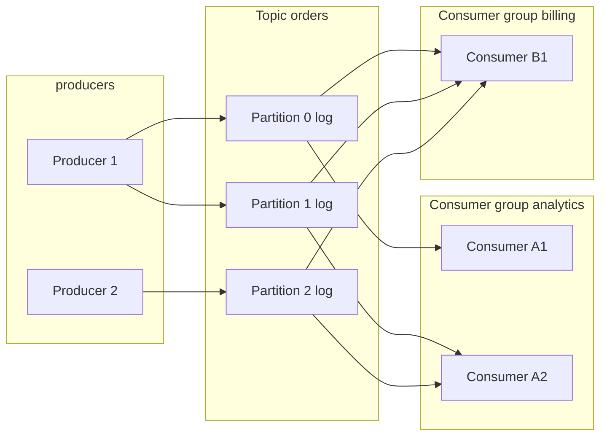
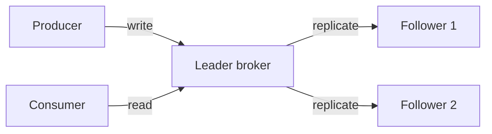

# Distributed message queues — log vs classic queue, partitions, consumer groups

Notes for **system-design and back-end interviews** at firms that ingest a lot of data: brokers like **Kafka**, **RabbitMQ**, **AWS SQS**, **Redis Streams**, and how to talk about them without confidently saying wrong things.

This page focuses on the **shape** of these systems and the **failure stories** interviewers love. The follow-up question — "great, but how do you avoid double-processing?" — has its own page: [Delivery semantics & idempotency](../distributed-delivery-and-idempotency/).

---

## Why this matters

If your job is "ingest fast-moving data and let multiple services act on it," you reach for a **broker** — a server (or cluster) that **buffers** events between producers and consumers so:

- The producer is not blocked on any one consumer being alive or fast.
- A new consumer can be added later without changing the producer.
- A crashed consumer can be restarted and **resume** roughly where it left off.

A broker is the **single thing** that unblocks all three.

---

## Terms in plain English

Read once; the rest of the page reuses these.


| Term                       | Plain meaning                                                                                                                                                                                                      |
| -------------------------- | ------------------------------------------------------------------------------------------------------------------------------------------------------------------------------------------------------------------ |
| **Broker**                 | The server that holds messages. A **cluster** is multiple brokers.                                                                                                                                                 |
| **Topic**                  | A named stream of messages. Producers write to it; consumers read from it.                                                                                                                                         |
| **Partition**              | A topic is sliced into N **partitions**. Each partition is an **append-only log** stored on one broker (with copies on others). Partitions exist so a topic can be **parallelized** across machines and consumers. |
| **Offset**                 | The integer position of a message inside a partition. `0, 1, 2, …` — never reused. The *de facto* "where am I" cursor for log-based brokers.                                                                       |
| **Producer**               | Anything writing messages. May choose the partition (by key hash, round-robin, or explicit).                                                                                                                       |
| **Consumer**               | Anything reading messages. Tracks which offset it has processed.                                                                                                                                                   |
| **Consumer group**         | A set of consumers cooperating to read **one topic**. Each partition is assigned to **exactly one consumer in the group at a time**. Add more consumers → more parallelism, up to `partitions`.                    |
| **Replication factor**     | How many brokers each partition is copied to. `RF=3` means one **leader** + two **followers**.                                                                                                                     |
| **ISR (in-sync replicas)** | The followers currently caught up to the leader. Only ISR members are eligible to be promoted on failover.                                                                                                         |
| **Retention**              | How long the broker keeps messages (e.g. 7 days, or until size hits a cap). Log-based brokers keep messages **even after they are read**.                                                                          |
| **Backpressure**           | The story of what happens when producers are faster than consumers — does the broker push back, drop, or keep buffering?                                                                                           |


---

## Two flavors: log vs classic queue

Interviewers will not always say "Kafka" — they'll say "a queue." Be precise about which kind.


|                              | **Log-based** (Kafka, Redis Streams, Kinesis)                             | **Classic queue** (RabbitMQ, SQS, ActiveMQ)                                |
| ---------------------------- | ------------------------------------------------------------------------- | -------------------------------------------------------------------------- |
| Storage                      | **Append-only log per partition.** Messages stay until retention expires. | **Per-message lifetime.** Once acknowledged, deleted.                      |
| Order                        | Strict order **within a partition**.                                      | Best-effort; many implementations break order under retry.                 |
| Replay                       | **Yes** — re-read from any offset.                                        | No (or hacky). Once acked, gone.                                           |
| Multiple independent readers | Trivial — each consumer group has its own offsets.                        | Harder — usually one queue per consumer or fan-out via exchange.           |
| Per-message ack              | Optional (offset commit covers a range).                                  | Yes (one ack per message).                                                 |
| Parallelism unit             | **Partitions** — adding consumers > partitions does nothing.              | **Concurrent workers** — add more workers, broker dispatches one msg each. |
| Best at                      | High-throughput streams, replay, event sourcing.                          | Task queues, work distribution, per-job ack/retry.                         |


**One-liner for interviews:** "Kafka is a **distributed log** — a database of events that you read by offset. RabbitMQ is a **smart router** — it forwards messages and forgets them once acknowledged."

If a question says **"task queue"** (e.g. "I have a video to encode"), classic queue or Celery-on-RabbitMQ is usually the right fit. If it says **"event stream"** (e.g. "every order placed should drive 4 downstream things"), reach for the log.

---

## Anatomy of a log-based broker




Things to notice:

- **Two consumer groups** read the **same** partitions independently. Each tracks its own offsets. This is why "fan-out to many services" is trivial for log brokers.
- Inside `analytics`, partitions `0` and `1` go to A1, partition `2` goes to A2. **No partition is read by two consumers in the same group at once** — that's how Kafka guarantees ordering per partition.
- `billing` has only one consumer, so it gets all three partitions.

### Concrete trace: rebalancing on failure

Topic `orders` has 3 partitions. Group `analytics` has 2 consumers, A1 and A2.


| Step | Event                                                                                 | Assignment                                             |
| ---- | ------------------------------------------------------------------------------------- | ------------------------------------------------------ |
| 1    | Steady state                                                                          | A1 → P0, P1 ; A2 → P2                                  |
| 2    | A1 stops sending heartbeats (crashed, or paused in a debugger > `session.timeout.ms`) | broker marks A1 dead                                   |
| 3    | **Rebalance** triggered                                                               | A2 → P0, P1, P2                                        |
| 4    | A1 restarts and re-joins                                                              | rebalance again: A1 → P0 ; A2 → P1, P2 (or some split) |


Two interview-worthy details from this:

1. **Rebalances pause processing** for the whole group while assignments shuffle. This is why long rebalances are a real production headache.
2. **Offsets survive the rebalance**: the new owner of P0 starts at the **last committed offset** for the group, not from zero. That is the whole point of committing offsets to the broker (or to a separate store).

---

## Replication and the leader story




For each partition there is **one leader broker** at a time. Producers write to the leader; followers pull and append. With `acks=all`, the producer is told "ok" only after **all in-sync replicas** have the message — that's the durability guarantee most interviews assume.

If the leader dies, the broker controller picks a **new leader from the ISR**. That window is the "failover" — measured in seconds, not zero.

### Why followers can fall out of ISR

A follower is **in-sync** if it is within a configurable lag of the leader. A follower that GC-pauses, network-blips, or runs on a slow disk falls out of ISR until it catches up. **You cannot lose data by promoting an out-of-sync follower** — that is exactly why the ISR set exists.

**Tradeoff to mention out loud:** `min.insync.replicas=2` with `acks=all` means a producer write can **fail** if too many replicas are down. That's the **availability vs durability** dial in CAP terms.

---

## Failure scenarios you should be ready to walk through

This is the bread and butter of the "what if a worker fails?" question. Have a one-paragraph answer for each.

### 1. Consumer crashes mid-batch

The consumer pulled a batch of 100 messages, processed 30, and crashed before committing offsets. After the rebalance, the new owner re-reads from the **last committed offset** — those 30 messages get **delivered again**.

**Implication:** you got **at-least-once** delivery here, not exactly-once. The handler must be **idempotent** — see [delivery semantics & idempotency](../distributed-delivery-and-idempotency/).

### 2. Broker (leader) crashes

ISR followers exist; controller elects a new leader. Producers and consumers reconnect, retry the in-flight requests, and continue. With `acks=all` and a healthy ISR, **no committed message is lost**. Without `acks=all`, the unreplicated tail can be lost.

### 3. Slow consumer (lag)

The consumer's offset falls further behind the latest produced offset. **Lag** (latest offset − committed offset) grows. The system stays correct but with rising end-to-end latency. Eventually messages may **age out** of retention before being read — that is **data loss**, but loud and trackable.

**Mitigations:** add partitions + consumers (only works if your messages can be parallelized — order constraints may block that), reduce per-message work, push CPU work to a downstream batch system, or apply **backpressure** at the producer.

### 4. Producer retry duplication

The producer sent message M, network ate the ack, producer retried — broker now has M twice. Without idempotent producers, that's a duplicate at the log level. Kafka's **idempotent producer** assigns a producer ID + sequence number per partition so the broker can dedupe. (Off by default historically, on by default in newer versions.)

### 5. Rebalance storm

Consumers join/leave constantly (autoscaling, deploys, OOM kills). The group spends more time rebalancing than processing. Real fixes: longer `session.timeout.ms`, **static membership** (Kafka 2.3+), **incremental cooperative rebalancing**, or stop OOM-killing the consumers.

### 6. Hot partition

Your partition key is `country` and 80% of traffic is `US`. One partition is overloaded; others sit idle. **Repartition** with a finer key (e.g. `userId`), or use a key with better distribution. This is the queue version of "skewed shard."

---

## Minimal Python: Kafka producer + consumer

This is a *shape* example; real code uses `confluent-kafka` or `aiokafka` more often than `kafka-python`, and adds metrics, error handling, etc.

```python
from kafka import KafkaProducer, KafkaConsumer

producer = KafkaProducer(
    bootstrap_servers="broker:9092",
    acks="all",                 # wait for all in-sync replicas — durability
    enable_idempotence=True,    # dedupe producer retries at the broker
    key_serializer=str.encode,
    value_serializer=str.encode,
)

producer.send(
    topic="orders",
    key="user-42",              # same key → same partition → ordering per user
    value='{"order_id": 17, "amount": 9.99}',
)
producer.flush()
```

```python
consumer = KafkaConsumer(
    "orders",
    bootstrap_servers="broker:9092",
    group_id="billing",
    enable_auto_commit=False,   # commit manually after work succeeds
    auto_offset_reset="earliest",  # new groups start from beginning of retention
)

for msg in consumer:
    try:
        handle(msg.value)        # MUST be idempotent (see other page)
        consumer.commit()        # commit only after success
    except Exception:
        # do not commit; message will be re-delivered on next poll / rebalance
        raise
```

**Two things to notice for interviews:**

- `**enable_auto_commit=False`** with manual commit *after* the handler is the classic at-least-once pattern. Auto-commit can advance the offset *before* your handler finishes — which means a crash silently drops messages.
- The producer's `**key*`* decides partitioning. **Same key → same partition → guaranteed in-order delivery for that key**, even with many parallel consumers. This is how you get "all events for user 42 are processed in order" without serialising the whole topic.

---

## Picking the right tool (interview reference)


| If the question says…                                                       | Reach for…                                                            |
| --------------------------------------------------------------------------- | --------------------------------------------------------------------- |
| "High-throughput event stream, multiple independent consumers, want replay" | **Kafka** (or Kinesis on AWS, Pulsar)                                 |
| "Task queue, each task done by exactly one worker, retries, dead-letter"    | **RabbitMQ** / **SQS** / **Celery** on top                            |
| "Lightweight, already have Redis, modest scale"                             | **Redis Streams** (log-shaped) or **Redis lists** (queue-shaped)      |
| "Cloud-managed, fully serverless, simple fan-out"                           | **SQS + SNS**, **GCP Pub/Sub**, **EventBridge**                       |
| "Within one box, in-process"                                                | A `Queue` / `asyncio.Queue` — say so explicitly; do not over-engineer |


The trap is over-reaching for Kafka. If you say "Kafka" for "I want one worker to encode a video," a good interviewer will ask "why?" — and the honest answer is usually "I don't need it." Match the tool to the **shape of the problem**.

---

## Common interview questions

### "What if a consumer dies?"

Crisp answer: "Consumers periodically heartbeat to the broker. If a consumer misses heartbeats past `session.timeout.ms`, the broker triggers a **rebalance** — its partitions are reassigned to other live consumers in the same group, and they resume from the last **committed offset** of that group. Any messages that the dead consumer pulled but did not commit get **re-delivered** to whoever picks up the partition. So work in progress is not lost, but **may be duplicated** — the handler must be idempotent."

### "What if a broker dies?"

"Each partition has a leader and N-1 followers. If the leader dies, the controller elects a new leader from the **in-sync replicas**. Producers and consumers reconnect to the new leader and retry. With `acks=all` and a healthy ISR set, no committed message is lost. The cost is a few seconds of unavailability for that partition during failover."

### "How do you guarantee order?"

"Kafka guarantees order **within a partition**, not across them. So you choose a **partition key** that groups everything that must stay ordered together. For 'all events for user 42 in order,' use `userId` as the key — they all land in the same partition. There is no cheap way to get a strict global order across partitions; if a question demands it, you've designed yourself into a single-partition bottleneck."

### "Kafka vs RabbitMQ?"

"Kafka is a **distributed append-only log**: high throughput, partitioned, replayable, designed for many independent consumer groups reading the same stream. RabbitMQ is a **message broker** built around queues and exchanges: it's optimal for **task distribution** with per-message ack, complex routing, and where you don't need replay. Use Kafka for event streams and analytics fan-out, RabbitMQ for work queues."

### "What is a partition for?"

"Two reasons. **Parallelism**: a topic with 12 partitions can be consumed by up to 12 consumers in a group. **Ordering**: messages within one partition are strictly ordered, so you choose a partition key to group what must stay in order. The number of partitions is the upper bound on consumer parallelism and is annoying to change later — pick generously."

### "What's the bottleneck of a single Kafka cluster?"

"Three usual suspects. (1) **Disk throughput** on brokers — the log is sequential writes, but replication multiplies the bytes. (2) **Network** between brokers (replication) and between brokers and consumers. (3) **Number of partitions** the controller has to coordinate — there's a soft ceiling at ~200k per cluster historically; KRaft mode pushed that further. Hot partitions show up as one-broker-pegged before the cluster as a whole is."

### "What if you can't keep up — how do you backpressure?"

"On the producer side, set `acks=all` and a bounded send buffer; once the buffer fills the producer's `send()` blocks, which propagates pressure upstream. On the consumer side, you can't really backpressure the broker — instead you scale consumers, batch heavier work, or drop / sample at the producer. Be honest in the interview: 'I'd add metrics on consumer lag and alert before we hit retention; if we routinely can't catch up, the system is undersized, not buggy.'"

---

## See also

- **[Delivery semantics & idempotency](../distributed-delivery-and-idempotency/)** — how to actually defeat double-processing, the truth about "exactly-once."
- **[Distributed batch & stream compute](../distributed-batch-and-stream-compute/)** — what consumes the topic for "train this model on a billion rows" jobs.
- **[Virtual memory](../virtual-memory/)** — how a single broker uses page cache to make sequential log reads/writes blistering.

