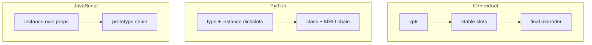

# Dynamic dispatch & object models

You need **one operation name** (`draw`, `speak`) with **different bodies** depending on the **actual** thing at runtime — e.g. a main loop over “drawables” without hardcoding every concrete type. Languages solve that **job** with different **machinery**: **vtables** (C++), **MRO + descriptors** (Python), **prototype chains** (JavaScript).

This page ties those models together: **what “class” means**, **inheritance mechanics**, **where state and methods live**, and a **step-by-step compare** on one example. Deep C++ implementation detail stays on [Virtual tables (vtables) in C++](../cpp-vtables/).

## Mental model in one diagram



## Chapter 1 — “Class” ideology (same plot, different staging)

**Shared plot:** A **class** groups **state** and **behavior**. **Inheritance** expresses **is-a**: specialized kinds reuse and override.

| | **C++** | **Python** | **JavaScript** |
|---|---------|------------|------------------|
| **Feels like** | Layout + compile-time rules | Types as runtime objects; uniform model | Objects delegate via prototypes; `class` is wiring sugar |
| **“Is-a”** | Subobject layout + optional **vtable** | **MRO** — linear ancestor order | **`[[Prototype]]`** chain |
| **Override surprise** | **`virtual`** matters for `Base*` | Rare — lookup uses **real type** of instance | Chain + **`this`** binding (callbacks!) |

**C++ — explicit dynamic dispatch**

```cpp
struct Animal {
  virtual void speak() const { std::puts("?"); }
  virtual ~Animal() = default;
};
struct Dog : Animal {
  void speak() const override { std::puts("woof"); }
};
```

**Python — instance methods dispatch on `type(instance)`**

```python
class Animal:
    def speak(self): print("?", end="")

class Dog(Animal):
    def speak(self): print("woof", end="")

x: Animal = Dog()
x.speak()  # woof — no virtual keyword
```

**JavaScript — delegation**

```javascript
class Animal { speak() { console.log("?"); } }
class Dog extends Animal { speak() { console.log("woof"); } }
```

## Chapter 2 — Inheritance mechanics (constructors, “parent,” gotchas)

### C++

- **Order:** Base subobjects → members → derived ctor body; destruction **reverse**.
- **Call parent:** Initializer list — `Dog() : Animal("canis") { }`. No `super` keyword.
- **Slicing:** Copying a `Dog` into an **`Animal` by value** keeps only the **`Animal` slice** — derived members vanish; the sliced copy’s dynamic type for dispatch is **`Animal`**.

```cpp
void poly(const Animal& a) { a.speak(); }  // OK — reference
void oops(Animal a) { a.speak(); }        // by value — sliced Animal

Dog d;
poly(d);   // woof if virtual
oops(d);  // usually "?" — sliced copy behaves as Animal for vtable (virtual speak)
```

### Python

- **`__init__` does not auto-chain** — call **`super().__init__(...)`** when the parent sets invariants.
- **`super()`** means **next in MRO**, not always “immediate parent” — matters in **diamond** inheritance (C3 linearization).

```python
class A:
    def ping(self): print("A", end=" ")
class B(A):
    def ping(self): print("B", end=" "); super().ping()
class C(A):
    def ping(self): print("C", end=" "); super().ping()
class D(B, C):
    def ping(self): print("D", end=" "); super().ping()

# D().ping() walks cooperative chain; D.__mro__ shows the linear order
```

- **Gotcha — class body mutable:** `tricks = []` on the **class** is **one list shared by all instances** (like a **C++ `static`** member or **JS `static`** property — not like an instance field).

### JavaScript

- Subclass constructor **must** call **`super(...)` before `this`** (TDZ).
- **`super.method()`** runs the prototype’s implementation with **`this` = current instance** — base code still sees **child** fields on **`this`** if already set (fragile design, but legal).

```javascript
class Dog extends Animal {
  constructor(name) {
    super("canis familiaris");
    this.name = name;
  }
}
```

- **Gotcha — losing `this`:** `setTimeout(d.bark, 0)` breaks unless bound; inheritance found the method, **`this`** didn’t follow.

### Multiple inheritance

- **C++ / Python:** Supported (Python uses **MRO**; C++ has layout **adjustments**).
- **JavaScript:** **No** multiple `extends`. Use **composition**, **mixins**, or **delegation**.

## Chapter 3 — Where things live

| | **Instance data (`name`)** | **Methods (`speak`)** |
|---|------------------------------|------------------------|
| **C++** | Bytes in object (**subobjects** + members); **vptr** if polymorphic | `.text`; **vtable** if virtual |
| **Python** | Usually **`__dict__`** per instance (or **`__slots__`**) | **Class** dict; **`self`** passed explicitly |
| **JavaScript** | **Own properties** on instance | Typically **`Constructor.prototype`** — shared |

**Python — explicit `self`, methods on class**

```python
Dog.speak(rex)   # same spirit as rex.speak()
```

**JavaScript — own vs prototype**

```javascript
const r = new Dog("Rex");
Object.hasOwn(r, "name");           // true
Object.hasOwn(r, "speak");          // false — walks prototype chain
```

## Chapter 4 — One call, three traces

Same intent: **`speak`** on something that might be **`Dog`.

**Python:** Resolve **`speak`** on **`type(rex)`**, walk **MRO** until found; call with **`rex` as `self`**.

**C++ (`virtual`):** Load **vptr** from object → **vtable slot** for **`speak`** → indirect call (ABI sketch on [the vtables page](../cpp-vtables/)).

**JavaScript:** Look **own** props → **`Dog.prototype`** → **`Animal.prototype`** … until **`speak`** found; invoke with **`this` = receiver**.

Hand-rolled dispatch (interview pattern): **`ops` table + pointer on object** — same **vtable shape** as C’s polymorphism idiom; see [Virtual tables — hand-rolled](../cpp-vtables/#implementing-a-vtable-by-hand-interview-style).

## Practical snippets — whiteboard size

**Manual “vtable” (conceptual)**

```text
call = obj->vtable[slot_speak](obj);
```

**Python lookup (conceptual)**

```text
for cls in type(obj).__mro__:
    if "speak" in cls.__dict__: return cls.__dict__["speak"](obj)
```

**JavaScript (conceptual)**

```text
obj -> [[Prototype]] -> ... until speak; call with this = obj
```

## Common interview questions

### How is Python “dispatch” different from C++ `virtual`?

Python **always** uses runtime lookup on **the class of the instance** for normal methods (descriptor binding). There is **no** `virtual` keyword — the analogue is **protocol**, not a keyword.

### Why does `oops(Animal a)` print base `speak` with virtual functions?

**Slicing:** The parameter is a **copy** of the **`Animal` subobject**; dynamic type for that **complete object** is **`Animal`**.

### Can a base-class method see “child-only” fields?

- **JS:** **`super.foo()`** uses **`this`** — if child put **`this.name`** after **`super()`**, **`foo`** can read **`this.name`** (coupling risk).
- **C++:** Base code should not cast to derived **without proof** — prefer **virtual interface**.

### Does JS support multiple inheritance?

**No** multiple `extends`. **Mixins / composition** approximate multiple roles.

### Class field `tag = this.id` in JS vs C++/Python?

Instance fields run **after `super()`** in subclass construction — **`this`** and base-assigned fields exist. C++ uses **ctor initializer lists** / member order; Python sets attributes in **`__init__`**.

## See also

- [Virtual tables (vtables) in C++](../cpp-vtables/) — vptr, ABI sketch, hand-rolled C/C++
- [Iterators & generators](../iterators-and-generators/) — protocols across languages
- [Interview syllabus (master list)](../interview-syllabus/)
