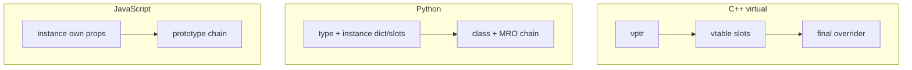

# Dynamic dispatch & object models

You need **one operation name** (`draw`, `speak`) with **different bodies** depending on the **actual** thing at runtime — e.g. a main loop over “drawables” without hardcoding every concrete type. Languages solve that **job** with different **machinery**: **vtables** (C++), **MRO + descriptors** (Python), **prototype chains** (JavaScript).

This page ties those models together: **what “class” means**, **inheritance mechanics**, **[how fields get their first values](#construction-cheat-sheet--three-languages)** (initializer lists vs Python defaults vs JS sugar), **where state and methods live**, and a **step-by-step compare** on one example. Deep C++ implementation detail stays on [Virtual tables (vtables) in C++](../cpp-vtables/).

## Mental model in one diagram



## Chapter 1 — “Class” ideology (same plot, different staging)

**Shared plot:** A **class** groups **state** and **behavior**. **Inheritance** expresses **is-a**: specialized kinds reuse and override.

| | **C++** | **Python** | **JavaScript** |
|---|---------|------------|------------------|
| **Feels like** | Layout + compile-time rules | Types as runtime objects; uniform model | Objects delegate via prototypes; `class` is wiring sugar |
| **“Is-a”** | Subobject layout + optional **vtable** | **MRO** — linear ancestor order | **`[[Prototype]]`** chain |
| **Override surprise** | **`virtual`** matters for `Base*` | Rare — lookup uses **real type** of instance | Chain + **`this`** binding (callbacks!) |

**C++ — explicit dynamic dispatch**

```cpp
struct Animal {
  virtual void speak() const { std::puts("?"); }
  virtual ~Animal() = default;
};
struct Dog : Animal {
  void speak() const override { std::puts("woof"); }
};
```

**Python — instance methods dispatch on `type(instance)`**

```python
class Animal:
    def speak(self): print("?", end="")

class Dog(Animal):
    def speak(self): print("woof", end="")

x: Animal = Dog()
x.speak()  # woof — no virtual keyword
```

**JavaScript — delegation**

```javascript
class Animal { speak() { console.log("?"); } }
class Dog extends Animal { speak() { console.log("woof"); } }
```

## Chapter 2 — Inheritance mechanics (constructors, “parent,” gotchas)

### C++

- **Order:** Base subobjects → members → derived ctor body; destruction **reverse**.
- **Call parent:** Initializer list — `Dog() : Animal("canis") { }`. No `super` keyword.
- **Slicing:** Copying a `Dog` into an **`Animal` by value** keeps only the **`Animal` slice** — derived members vanish; the sliced copy’s dynamic type for dispatch is **`Animal`**.

```cpp
void poly(const Animal& a) { a.speak(); }  // OK — reference
void oops(Animal a) { a.speak(); }        // by value — sliced Animal

Dog d;
poly(d);   // woof if virtual
oops(d);  // usually "?" — sliced copy behaves as Animal for vtable (virtual speak)
```

### Python

- **`__init__` does not auto-chain** — call **`super().__init__(...)`** when the parent sets invariants.
- **`super()`** means **next in MRO**, not always “immediate parent” — matters in **diamond** inheritance (C3 linearization).

```python
class A:
    def ping(self): print("A", end=" ")
class B(A):
    def ping(self): print("B", end=" "); super().ping()
class C(A):
    def ping(self): print("C", end=" "); super().ping()
class D(B, C):
    def ping(self): print("D", end=" "); super().ping()

# D().ping() walks cooperative chain; D.__mro__ shows the linear order
```

- **Gotcha — class body mutable:** `tricks = []` on the **class** is **one list shared by all instances** (like a **C++ `static`** member or **JS `static`** property — not like an instance field).

### JavaScript

- Subclass constructor **must** call **`super(...)` before `this`** (TDZ).
- **`super.method()`** runs the prototype’s implementation with **`this` = current instance** — base code still sees **child** fields on **`this`** if already set (fragile design, but legal).

```javascript
class Dog extends Animal {
  constructor(name) {
    super("canis familiaris");
    this.name = name;
  }
}
```

- **Gotcha — losing `this`:** `setTimeout(d.bark, 0)` breaks unless bound; inheritance found the method, **`this`** didn’t follow.

### Multiple inheritance

- **C++ / Python:** Supported (Python uses **MRO**; C++ has layout **adjustments**).
- **JavaScript:** **No** multiple `extends`. Use **composition**, **mixins**, or **delegation**.

## Construction cheat sheet — three languages

Different languages put **first assignment** of instance state in different places — and **mistakes don’t always show up at compile time**. This section aligns **member initializer lists** (C++), **mutable defaults** (Python), and **`class` desugaring + method forms** (JavaScript).

### C++ — initializer list, ctor body, in-class defaults, real init order

- **Initializer list** (`: a(1), b(x)`) runs **before** the constructor **body**. Use it for **bases**, **`const`** members, **references**, and **efficient** construction (e.g. move into members) instead of default-constructing then assigning in the body.
- **In-class member initializers** (C++11+, e.g. `int cached = 0`) are defaults when the member is **not** listed in the list (delegating/multiple ctor cases follow language rules — interviews usually stop at “default + override in list”).
- **`static`** data members are **not** duplicated per instance; one storage site for the type (`inline static` in-class since C++17 is common).

**Critical detail — initialization order**

Members are initialized in **declaration order inside the struct/class**, **not** the order they appear in the initializer list. If those differ, compilers often warn (`-Wreorder`); trusting the list order across members can mean **reading uninitialized members**.

```cpp
struct BadOrder {
  int b;
  int a;

  BadOrder()
    // List *suggests* a before b — but reality is: b initializes first (declared first).
    : a(1), b(a + 1) { // b reads `a` before `a`'s ctor runs → undefined behavior
  }
};

struct GoodOrder {
  int a;
  int b;

  GoodOrder() : a(1), b(a + 1) { // a initialized first → b sees valid a
  }
};
```

**Reasonable sketch with `static` + list + defaults**

```cpp
#include <string>

struct Counter {
  static inline int instances = 0;

  const int id;
  std::string name;
  int cached = 0; // default unless ctor list assigns

  explicit Counter(std::string n)
    : id(static_cast<int>(n.size())), name(std::move(n)) {
    ++instances;
    cached = id * 2; // body: assignment after construction
  }
};
```

### Python — no initializer list; watch **mutable defaults** and **class** attributes

- **`__init__`** runs **per instance** after the instance exists; assignments create **instance** attributes.
- **`def __init__(self, items=[]):`** — the **`[]`** is created **once** when the **`def`** runs (class definition time). Every call without `items` shares that **same list**.

```python
class BadDefault:
    def __init__(self, items=[]):
        self.items = items

class GoodDefault:
    def __init__(self, items=None):
        self.items = [] if items is None else list(items)
```

- **Dataclasses:** use `field(default_factory=list)` for a **fresh** list per instance.

```python
from dataclasses import dataclass, field

@dataclass
class Bag:
    items: list = field(default_factory=list)
```

A **mutable object** assigned in the **class body** (`tricks = []`) behaves the same “one object, shared across instances who don’t shadow it” pattern as **`static`**-ish state in other languages — see the **Gotcha — class body mutable** bullet under [Chapter 2 — Python](#chapter-2--inheritance-mechanics-constructors-parent-gotchas).

### JavaScript — what `class` is, and prototype method vs arrow field

**Sugar (conceptually):** `class C { … }`, `extends`, and `super` arrange **prototype links** (`C.prototype`), **`[[Prototype]]` on instances**, and **`C.__proto__` for static inheritance**. There is **no second object model** — engines implement the ES spec’s objects-and-prototypes story.

**Rough desugaring shape** (for mental model; engines optimize and private fields differ):

```javascript
function Timer(label) {
  this.tag = label; // instance field initializers conceptually run in instance setup
  // constructor body …
}
Timer.prototype.tick = function () {
  console.log(this.label);
};
```

**Prototype method** `tick() { }` — **one** function on **`Timer.prototype`**; **`this`** is the **call site**’s receiver (`t.tick()` vs `const f = t.tick; f()` loses `this` in strict mode).

**Arrow as instance field** `tick = () => { }` — typically **one closure per instance**, **`this`** **lexically** tied to the instance constructed in that scope — handy for **`setTimeout` / handlers**, more **allocation** if you create huge numbers of instances.

```javascript
class Timer {
  label = "t";

  protoTick() {
    console.log(this?.label);
  }

  arrowTick = () => {
    console.log(this?.label);
  };
}

const t = new Timer();
const p = t.protoTick;
const a = t.arrowTick;
// p(); // strict: `this` wrong — TypeError or undefined
a(); // still logs — lexical `this`
```

**`static count = 0` / `static instances()`** live on the **constructor function** object (shared, not per instance), analogous to **C++ `static`** or **Python class attributes**.

## Chapter 3 — Where things live

| | **Instance data (`name`)** | **Methods (`speak`)** |
|---|------------------------------|------------------------|
| **C++** | Bytes in object (**subobjects** + members); **vptr** if polymorphic | `.text`; **vtable** if virtual |
| **Python** | Usually **`__dict__`** per instance (or **`__slots__`**) | **Class** dict; **`self`** passed explicitly |
| **JavaScript** | **Own properties** on instance | Typically **`Constructor.prototype`** — shared |

**Python — explicit `self`, methods on class**

The **function object** for `speak` lives on **`Dog`** (the class). Instance lookup **`rex.speak`** wraps it in a **bound method** that passes **`rex`** as the first argument automatically. Calling **`Dog.speak(rex)`** is the same idea written out: **you** supply **`self`**.

```python
class Dog:
    def __init__(self, name: str) -> None:
        self.name = name

    def speak(self) -> None:
        print(f"{self.name} says woof")


rex = Dog("Rex")

rex.speak()              # bound method: implicit first arg = rex
Dog.speak(rex)          # unbound from class: you pass rex explicitly

# Bound methods carry the instance they were retrieved from:
assert rex.speak.__self__ is rex
```

**Why `__slots__` shows up in the same chapter**

Without **`__slots__`**, **every instance** gets its own **`__dict__`**: a **mapping** (hash table) from attribute names to values. That is flexible — any assignment **`rex.foo = ...`** adds or updates a key — but it costs **extra structure per object** (the dict object + bookkeeping). Methods still live on the **class**; only **where instance fields live** changes.

```python
class Dog:
    def __init__(self, name: str) -> None:
        self.name = name


rex = Dog("Rex")
rex.__dict__                      # {'name': 'Rex'} — per-instance namespace

rex.age = 7                       # OK: mutates rex.__dict__, adds key "age"

rex.nmae = "typo"                 # Still OK: creates a *wrong* attribute silently
assert hasattr(rex, "nmae")       # True — dict never rejects unknown names
```

With **`__slots__`**, the type declares **exactly** which attributes exist. **CPython** stores those values in **fixed slots** on the instance struct instead of putting them in a **`__dict__`**. You usually **drop** the per-instance dict — **that** is where **“fewer bytes per object”** comes from: **no separate dict object per row** when you have millions of small records.

```python
class LeanDog:
    __slots__ = ("name",)

    def __init__(self, name: str) -> None:
        self.name = name

    def speak(self) -> None:
        print(f"{self.name} says woof")


rex = LeanDog("Rex")
LeanDog.speak(rex)  # method still on class; explicit self = rex

# Without __dict__, these fail instead of adding stray attributes:
# rex.__dict__
# rex.age = 7
# rex.nmae = "typo"
```

Calling **`Dog.speak(rex)`** vs **`LeanDog.speak(rex)`** is the same idea: **`speak`** still lives on the **class**; **`__slots__`** only changes **how fields like `name` are stored** on the instance (fixed slots vs per-instance **`__dict__`**).

**Interview-sized caveat:** savings and behavior are **implementation-specific** (this is **CPython’s** story); **`sys.getsizeof`** on an instance **does not** always include every indirect cost, but **“no `__dict__` per instance”** is the right mental model for why RAM drops on huge graphs.

**JavaScript — own vs prototype**

```javascript
const r = new Dog("Rex");
Object.hasOwn(r, "name");           // true
Object.hasOwn(r, "speak");          // false — walks prototype chain
```

## Chapter 4 — One call, three traces

Same intent: **`speak`** on something that might be **`Dog`.

**Python:** Resolve **`speak`** on **`type(rex)`**, walk **MRO** until found; call with **`rex` as `self`**.

**C++ (`virtual`):** Load **vptr** from object → **vtable slot** for **`speak`** → indirect call (ABI sketch on [the vtables page](../cpp-vtables/)).

**JavaScript:** Look **own** props → **`Dog.prototype`** → **`Animal.prototype`** … until **`speak`** found; invoke with **`this` = receiver**.

Hand-rolled dispatch (interview pattern): **`ops` table + pointer on object** — same **vtable shape** as C’s polymorphism idiom; see [Virtual tables — hand-rolled](../cpp-vtables/#implementing-a-vtable-by-hand-interview-style).

## Practical snippets — whiteboard size

**Manual “vtable” (conceptual)**

```text
call = obj->vtable[slot_speak](obj);
```

**Python lookup (conceptual)**

```text
for cls in type(obj).__mro__:
    if "speak" in cls.__dict__: return cls.__dict__["speak"](obj)
```

**JavaScript (conceptual)**

```text
obj -> [[Prototype]] -> ... until speak; call with this = obj
```

## Common interview questions

### How is Python “dispatch” different from C++ `virtual`?

Python **always** uses runtime lookup on **the class of the instance** for normal methods (descriptor binding). There is **no** `virtual` keyword — the analogue is **protocol**, not a keyword.

### Why does `oops(Animal a)` print base `speak` with virtual functions?

**Slicing:** The parameter is a **copy** of the **`Animal` subobject**; dynamic type for that **complete object** is **`Animal`**.

### Can a base-class method see “child-only” fields?

- **JS:** **`super.foo()`** uses **`this`** — if child put **`this.name`** after **`super()`**, **`foo`** can read **`this.name`** (coupling risk).
- **C++:** Base code should not cast to derived **without proof** — prefer **virtual interface**.

### Does JS support multiple inheritance?

**No** multiple `extends`. **Mixins / composition** approximate multiple roles.

### Class field `tag = this.id` in JS vs C++/Python?

Instance fields run **after `super()`** in subclass construction — **`this`** and base-assigned fields exist. C++ uses **ctor initializer lists** / member order; Python sets attributes in **`__init__`**. Expanded patterns: [Construction cheat sheet — three languages](#construction-cheat-sheet--three-languages).

### In C++, does the ctor initializer list set the initialization order?

**No** — actual member initialization order follows **declaration order** in the class. The list order only controls **which initializer runs for each member**; mismatch with declaration order yields warnings and subtle bugs (see **`BadOrder` / `GoodOrder`** under [Construction cheat sheet — three languages](#construction-cheat-sheet--three-languages)).

### Why pass `dog.bark` to `setTimeout` but use an arrow property for callbacks?

Detached **prototype methods** (`const f = obj.m; f()`) lose the **`this`** receiver unless **bound** (`bind`) or wrapped. **`m = () => {}`** captures **lexical `this`** per instance — trade **memory** (per-instance function) for **ergonomics**. See the **JavaScript** subsection of [Construction cheat sheet — three languages](#construction-cheat-sheet--three-languages).

## See also

- [Virtual tables (vtables) in C++](../cpp-vtables/) — vptr, ABI sketch, hand-rolled C/C++
- [Iterators & generators](../iterators-and-generators/) — protocols across languages
- [Interview syllabus (master list)](../interview-syllabus/)
