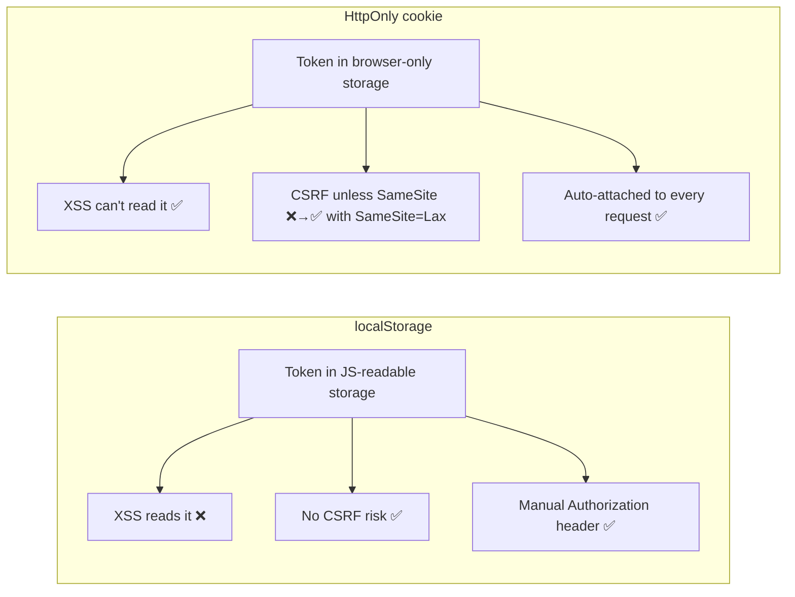
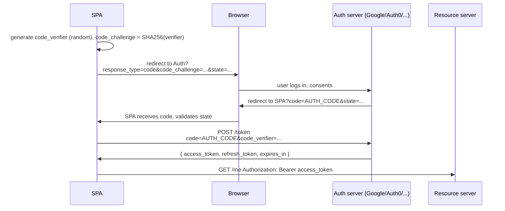
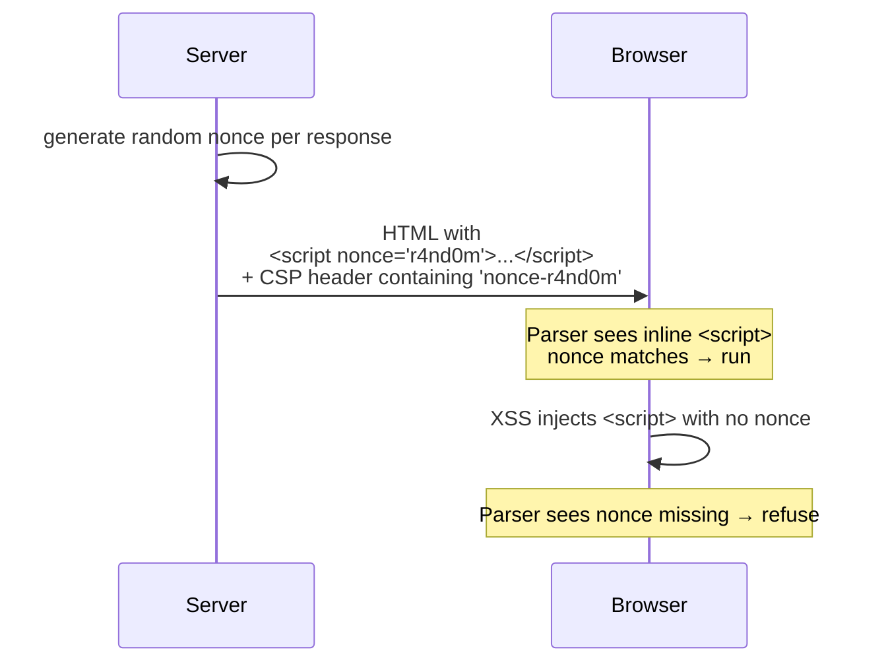

# Frontend security — Beat 3 + 4: Auth, sessions, headers & supply chain

> Beats 1–2 were about **specific attack classes** (injection, cross-origin abuse). This page is about **the rest of the staff-level surface area**: where credentials live, the security-header belt that hardens everything, and the supply chain that loads code into your origin in the first place.

**Series:** [Hub](../frontend-security/) · [Beat 1 — XSS](../frontend-security-xss/) · [Beat 2 — cross-origin](../frontend-security-cross-origin/) · **Beat 3+4 (this page)**

This page has two parts. They go together because **headers are how you defend the auth model** — splitting them across pages would force you to flip back and forth.

- **[Part 1 — Auth & sessions](#part-1--auth--sessions)** — cookies, token storage, JWT, OAuth/PKCE.
- **[Part 2 — The security-header belt](#part-2--the-security-header-belt)** — CSP, HSTS, COOP/COEP, Referrer-Policy, Permissions-Policy.
- **[Part 3 — Supply chain & loose ends](#part-3--supply-chain--loose-ends)** — SRI, npm hygiene, source maps, prototype pollution.

---

## Part 1 — Auth & sessions

### The problem

Your SPA needs to remember "who am I" across requests. You have to pick:

- **Where** the credential lives (cookie? `localStorage`? memory only?).
- **What** the credential is (opaque session ID? JWT?).
- **Who** issues it (your own login form? Google OAuth? Auth0?).
- **How** it expires and rotates.

Make these decisions wrong and you get one of: tokens leaked to XSS, sessions hijacked over HTTP, refresh-token replay, or a beautifully secure system that nobody can log into.

### Cookies — the three flags that matter

The most important auth-cookie line you'll write in your career:

```
Set-Cookie: session=abc123; HttpOnly; Secure; SameSite=Lax; Path=/; Max-Age=86400
```


| Flag                          | What it does                                     | What breaks if you forget                                                                           |
| ----------------------------- | ------------------------------------------------ | --------------------------------------------------------------------------------------------------- |
| `HttpOnly`                    | JS cannot read this cookie via `document.cookie` | XSS exfiltrates the session in one line                                                             |
| `Secure`                      | Cookie sent only over HTTPS                      | Sniffable on coffee-shop wifi over `http://`                                                        |
| `SameSite=Lax`                | Not sent on most cross-site requests             | CSRF (Beat 2)                                                                                       |
| `Path=/`                      | Scope to a path prefix                           | Wider blast radius than needed                                                                      |
| `Max-Age` / `Expires`         | Time-bounded                                     | Session lives forever; revocation impossible                                                        |
| `Domain` (omit unless needed) | Scope to host or include subdomains              | `Domain=.coinflip.shop` shares cookie with every subdomain — supply-chain risk if any one is XSS-ed |


The interview-grade answer to "where do I store my session ID?" is **always**: in a cookie with `HttpOnly`, `Secure`, `SameSite=Lax`. That answer is correct in 95% of cases.

### The localStorage-vs-cookie debate (the staple staff question)




The trade:


| Concern                       | `localStorage`                                     | `HttpOnly` cookie                                              |
| ----------------------------- | -------------------------------------------------- | -------------------------------------------------------------- |
| **XSS exfiltration**          | ❌ trivial: `localStorage.getItem('token')`         | ✅ JS literally can't read it                                   |
| **CSRF**                      | ✅ no auto-attach; you set `Authorization` manually | ⚠️ auto-attached; needs `SameSite=Lax` (free in modern Chrome) |
| **Cross-domain APIs**         | ✅ works trivially                                  | ⚠️ needs CORS + `credentials: 'include'`                       |
| **Mobile / native**           | ✅ tokens are portable                              | ⚠️ cookies are browser-shaped                                  |
| **Native browser revocation** | ❌ you have to clear it                             | ✅ `Set-Cookie: …; Max-Age=0`                                   |


**The rule of thumb:** **Cookies for sessions** (web app talking to its own backend), **tokens in memory** (never persisted, re-fetched via refresh on reload) for **third-party API access**. Never `localStorage` for an access token if you can avoid it — XSS turns into a one-line account takeover.

If you absolutely must use `localStorage` (e.g. a SPA hitting a third-party API across domains where cookies are awkward), pair it with: short token TTL (≤15 min), strict CSP (Beat 4), refresh-token rotation, and Trusted Types.

### JWT pitfalls

JWT is a **format**, not a **protocol**. It encodes a JSON payload + a signature. People treat it as a magic auth solution; it isn't.

A JWT looks like `xxx.yyy.zzz` — base64url(header) `.` base64url(payload) `.` base64url(signature).

```json
// header
{ "alg": "HS256", "typ": "JWT" }

// payload
{ "sub": "user_42", "exp": 1714600000, "role": "admin" }

// signature
HMAC-SHA256(headerB64 + "." + payloadB64, secret)
```

**The famous bugs:**

1. `**alg: none`** — early JWT libraries accepted `{"alg": "none"}` and skipped signature verification entirely. Attacker forges payload, sets `alg: none`, sends signature-less token, server accepts. *Fix: explicitly require expected algorithm in your verify call; never trust the header.*
2. **HS/RS confusion** — some libs let attackers set `alg: HS256` while the server expects `RS256`. The server's *public key* gets used as the *HMAC secret*, and since public keys are public, the attacker forges a valid signature. *Fix: pin the expected algorithm.*
3. **Unverified claims** — `payload.role = "admin"` only matters if the signature is checked. Forgetting `verify` and using `decode` (which just base64-decodes) is the senior-engineer-on-Friday-afternoon bug.
4. **No revocation** — JWTs are stateless. Once issued, they're valid until `exp`. If a user logs out or you discover a breach, you can't immediately invalidate them without an external denylist (a database lookup that defeats the whole "stateless" pitch).
5. **Long-lived JWTs** — every minute of TTL is a minute of XSS exfiltration window. Best practice: short access tokens (5–15 min) + refresh tokens (longer-lived, rotated, stored in `HttpOnly` cookie).

**The interview-grade JWT mental model:** "JWT is fine when you actually need stateless verification (microservices, gateways) and accept the 'no instant revocation' tradeoff. For a typical web app session, an opaque session ID in an `HttpOnly` cookie + Redis lookup is simpler, more revocable, and not measurably slower."

### OAuth 2.0 + PKCE on a SPA

The 30-second history: OAuth 2.0 had two main browser-side flows.

- **Implicit flow** (legacy) — token came back in the URL fragment. Multiple security flaws (token in browser history, no proof of binding to the client). **Dead.** Don't use it.
- **Authorization Code + PKCE** (current best practice for browsers and mobile) — short-lived auth code returned, exchanged for a token via a back-channel POST that proves possession of a per-attempt secret.




**Why PKCE matters:** even if an attacker intercepts the auth code (URL is logged in browser history, forwarded by chat apps, etc.), they can't exchange it for a token without the `code_verifier` that the SPA generated and never sent over the redirect.

`**state` parameter:** an unguessable nonce the SPA generates before redirecting to Auth and verifies on return. Prevents login-CSRF (attacker tricking a victim into logging into the attacker's account in your app).

**Where do the tokens go?** Modern guidance: refresh token in `HttpOnly` cookie; access token in JS memory only (variable in your auth context, not `localStorage`); on page reload, use the refresh cookie to silently get a new access token.

### Logout, session fixation, refresh-token rotation

**Logout** isn't trivial:

- Clear the cookie server-side (`Set-Cookie: session=; Max-Age=0`).
- For JWTs: add `jti` to a denylist until original `exp`.
- For OAuth: call provider's revocation endpoint if you want to kill the upstream session too (often skipped — it logs the user out of Google entirely).

**Session fixation:** an attacker sets the user's session ID to one the attacker knows (via `?session=...` or a pre-login cookie), then the user logs in and *the same session ID is now authenticated*. Mitigation: **always rotate the session ID on login**.

**Refresh-token rotation:** every time you redeem a refresh token, the server issues a *new* refresh token and invalidates the old one. If an attacker steals a refresh token and uses it, the legitimate user's next refresh fails — the server detects the reuse, invalidates the entire token family, and forces re-login. This turns a silent compromise into a noisy event.

---

## Part 2 — The security-header belt

The headers in this section are **defense in depth**. Each one assumes another defense will fail. Together they are 80% of what makes a frontend "hardened."

A typical hardened response set (annotated):

```
Content-Security-Policy: default-src 'self'; script-src 'nonce-r4nd0m' 'strict-dynamic'; object-src 'none'; base-uri 'none'; frame-ancestors 'none'
Strict-Transport-Security: max-age=63072000; includeSubDomains; preload
X-Content-Type-Options: nosniff
X-Frame-Options: DENY
Referrer-Policy: strict-origin-when-cross-origin
Permissions-Policy: camera=(), microphone=(), geolocation=()
Cross-Origin-Opener-Policy: same-origin
Cross-Origin-Embedder-Policy: require-corp
Cross-Origin-Resource-Policy: same-origin
```

Let's walk through them.

### CSP — Content Security Policy

CSP is the **single most impactful header** for XSS defense. It tells the browser "even if attacker JS gets injected somehow, refuse to run it unless it satisfies these rules."

The **modern strict CSP** that interviewers want to hear:

```
Content-Security-Policy:
  default-src 'self';
  script-src 'nonce-r4nd0m' 'strict-dynamic';
  object-src 'none';
  base-uri 'none';
  frame-ancestors 'none';
  require-trusted-types-for 'script';
```

What each directive does:


| Directive                               | Effect                                                                                       |
| --------------------------------------- | -------------------------------------------------------------------------------------------- |
| `default-src 'self'`                    | Fall-through default — only same-origin resources                                            |
| `script-src 'nonce-…' 'strict-dynamic'` | Only `<script>` tags with the matching `nonce` attribute run; scripts they load also trusted |
| `object-src 'none'`                     | No `<object>`/`<embed>`/Flash — kills a class of legacy XSS vectors                          |
| `base-uri 'none'`                       | Attacker can't inject `<base href="evil.tld">` to repoint relative URLs                      |
| `frame-ancestors 'none'`                | Can't be framed (clickjacking — Beat 2)                                                      |
| `require-trusted-types-for 'script'`    | Force Trusted Types (Beat 1)                                                                 |


**The nonce flow:**




**Why `'strict-dynamic'`?** Without it you'd have to allowlist every external script URL (CDN, analytics, chunks). With it, "any script loaded *by* an already-trusted script is also trusted," which works seamlessly with webpack/Vite chunk loading.

**Anti-patterns to call out in interviews:**

- `'unsafe-inline'` — defeats CSP's whole point. The only reason to use it is legacy code; migrate to nonces.
- `'unsafe-eval'` — needed by some libraries (older Angular templates). Avoid; refactor.
- A long allowlist of CDN domains — worked in 2015, broken now. Use nonces + `'strict-dynamic'`.

**Reporting:** add `report-to` / `report-uri` to collect violations from real users. Roll out CSP with `Content-Security-Policy-Report-Only` first, observe what breaks, then enforce.

### HSTS — Strict-Transport-Security

```
Strict-Transport-Security: max-age=63072000; includeSubDomains; preload
```

Tells the browser "for the next 2 years, never even *try* HTTP for this domain or any subdomain. Always HTTPS." Defends against TLS-stripping attacks (attacker on coffee shop wifi serves `http://` even though you typed `https://`).

`preload` opts your domain into Chrome's hardcoded list — browsers know to use HTTPS even on the **first** visit. Submit at [hstspreload.org](https://hstspreload.org/). Be careful: `includeSubDomains` + `preload` is hard to undo.

### `X-Content-Type-Options: nosniff`

Stops the browser from "sniffing" a response's content-type. Without it, a server returning `Content-Type: text/plain` for a `.js` file might still get *executed* as JS by a browser that "helpfully" guesses. `nosniff` says "trust my Content-Type or block." Always set it.

### Referrer-Policy

Controls how much URL info goes in the `Referer` header on outbound requests.

```
Referrer-Policy: strict-origin-when-cross-origin
```

Defaults to "send full URL within your origin, only origin (no path) cross-origin, never on HTTP downgrade." Sane default. Stops you from leaking sensitive paths like `/reset?token=abc` to third-party scripts.

### Permissions-Policy

Used to be called Feature-Policy. Lets you turn off browser APIs your site doesn't use, so injected JS can't use them either.

```
Permissions-Policy: camera=(), microphone=(), geolocation=(), interest-cohort=()
```

Empty parens = "no origin, including self." Belt-and-suspenders against XSS escalating to "turn on the user's webcam."

### COOP / COEP / CORP — cross-origin isolation

The newest belt of three. They exist mainly because **Spectre** showed you can read cross-origin data via CPU side-channels; isolating origins in separate processes is the mitigation.


| Header                                       | Effect                                                                                                                          |
| -------------------------------------------- | ------------------------------------------------------------------------------------------------------------------------------- |
| `Cross-Origin-Opener-Policy: same-origin`    | Window opened by/opens you can be in same browsing context group only if same origin. Stops `window.opener` cross-origin leaks. |
| `Cross-Origin-Embedder-Policy: require-corp` | Every subresource you load must opt-in via CORP or CORS.                                                                        |
| `Cross-Origin-Resource-Policy: same-origin`  | Set on *your* responses; tells browsers "only same-origin documents may embed me."                                              |


Setting **COOP + COEP** together gives you "cross-origin isolation," which unlocks `SharedArrayBuffer` and high-precision timers. Most apps don't need those, but COOP alone is a free win against `window.opener` shenanigans.

### Cookie prefixes (the bonus header trick)

```
Set-Cookie: __Host-session=abc; HttpOnly; Secure; SameSite=Lax; Path=/
```

The `__Host-` prefix is *enforced by the browser* — the cookie is only accepted if `Secure` is set, `Path=/`, and `Domain` is omitted. Prevents subdomain-injection attacks where an XSS on `blog.coinflip.shop` sets a cookie that overrides the one for `coinflip.shop`. Cheap to add; only works if your scope allows it.

---

## Part 3 — Supply chain & loose ends

A modern SPA loads ~200 npm packages, each of which can run code in your origin. Your XSS defenses are useless if `chalk-the-package-you-depend-on-by-mistake` has a malicious post-install script. Supply chain is increasingly the highest-leverage frontend security topic — and increasingly asked at staff loops.

### Subresource Integrity (SRI)

When you `<script src="https://cdn.example/lib.js">`, you're trusting the CDN forever. Add an SRI hash and the browser refuses the script if its bytes don't match:

```html
<script
  src="https://cdn.example/lib.js"
  integrity="sha384-oqVuAfXRKap7fdgcCY5uykM6+R9GqQ8K/uxi5d1qMBl6mHCfh4sl+Rr5IfM6h8gE"
  crossorigin="anonymous">
</script>
```

If the CDN is compromised tomorrow, the hash mismatch blocks execution. **Use this for any third-party script you can't bundle.**

### npm hygiene

The fundamentals every staff engineer checks:

1. `**package-lock.json` / `pnpm-lock.yaml` committed.** Without a lockfile, every install is "whatever is latest right now," and supply-chain attacks land on your laptop the second they're published.
2. `**npm ci` in CI**, not `npm install`. `ci` errors if lockfile and `package.json` disagree. Reproducible installs.
3. `**npm audit` / `pnpm audit`** in CI as a non-blocking signal; investigate criticals.
4. **Dependabot / Renovate** — automated PRs to bump minor/patch versions.
5. **Disable post-install scripts** for transitive deps you don't trust: `npm config set ignore-scripts true` (you'll need to re-enable for specific tools that need them, e.g. `esbuild`).
6. **Pin major versions** of build tools; don't trust `^` to never break.

### Typosquatting

`react-dom` vs `react-doom`, `chalk` vs `chаlk` (Cyrillic 'а'). Real attacks. Read every dependency name out loud during PR review of a new package.

### Source maps and bundle leakage

Your bundle is your code on every user's machine. Nothing in `process.env.NEXT_PUBLIC_`* (or any env var your build inlines) is secret. Common leaks:

- Internal API URLs that aren't supposed to be public.
- "Test mode" feature flags that bypass auth.
- API keys for third-party services accidentally inlined.
- Source maps shipped to production (they expose the *un-minified* code).

Audit: `curl https://yoursite.com/static/js/main.abc.js.map` — if that returns 200, you're shipping debug info. Either don't generate maps for prod, or generate them but keep them on Sentry / your error tracker only.

### Prototype pollution

A specifically-JS bug. Some library does:

```js
function merge(target, source) {
  for (const key in source) {
    if (typeof source[key] === 'object') {
      target[key] = merge(target[key] ?? {}, source[key]);
    } else {
      target[key] = source[key];
    }
  }
  return target;
}
```

Attacker sends JSON: `{"__proto__": {"isAdmin": true}}`. The merge writes `target.__proto__.isAdmin = true`, which (because of how prototype lookup works) makes `({}).isAdmin === true` for *every object created afterwards*. Now every code path that checks `user.isAdmin` thinks the user is admin.

**Fixes:**

- Use libraries that block `__proto__` / `constructor` / `prototype` keys (`lodash.merge` ≥ 4.17.20, `defu`, etc.).
- Use `Object.create(null)` for objects you'll merge into untrusted input (no prototype chain → no pollution).
- Never `JSON.parse` straight into a deep merge without validation.

### `eval`, `Function`, `setTimeout(string, ...)`

All four are XSS sinks. Lint them. CSP without `'unsafe-eval'` blocks them. Modern apps almost never need them — if you find one, it's a refactor, not a config tweak.

### ReDoS (Regex Denial of Service)

```js
// Looks innocent. Catastrophically backtracks on input like "aaaa…!"
const isEmail = /^([a-zA-Z0-9_\.\-])+\@(([a-zA-Z0-9\-])+\.)+([a-zA-Z0-9]{2,4})+$/;
```

Catastrophic backtracking can hang a Node server for minutes on a 50-character malicious input. Audit regexes that come from user input or that you apply to user input. Tools: `safe-regex`, `vuln-regex-detector`. Modern alternative: use `RegExp` engines that don't backtrack (the engine in Node 20+ is improving, but assume backtracking by default).

### Third-party scripts and tag managers

Every analytics / GTM / chat-widget script you load is a potential breach. They all run **with full access to your origin** — your DOM, your cookies (the non-`HttpOnly` ones), your auth tokens in memory.

Mitigations (in order of strictness):

1. **Don't load it.** Most analytics can be done server-side or with a small first-party tracker.
2. **Self-host a vendored copy** + SRI hash.
3. **Sandbox in a cross-origin iframe** with `sandbox` attribute and `postMessage` for the few values it actually needs.
4. If you must load it directly, scope its access — pin via SRI, set strict CSP, audit your tag manager's allowlist quarterly.

---

## Whiteboard fragment

```text
AUTH (default for a web app):
  Session ID (opaque) in HttpOnly + Secure + SameSite=Lax cookie.
  Server-side session store (Redis). Rotate on login.
  Logout = Set-Cookie: session=; Max-Age=0 + invalidate server-side.

AUTH (SPA + 3rd-party API):
  OAuth 2.0 Authorization Code + PKCE.
  Refresh token in HttpOnly cookie; access token in JS memory.
  Short access token TTL (5–15 min). Refresh-token rotation.

HEADERS BELT (paste into nginx/cloudfront for every response):
  CSP nonce + 'strict-dynamic'; object-src 'none'; base-uri 'none';
       frame-ancestors 'none'; require-trusted-types-for 'script'.
  HSTS max-age=2y; includeSubDomains; preload.
  X-Content-Type-Options: nosniff.
  Referrer-Policy: strict-origin-when-cross-origin.
  Permissions-Policy: deny camera/mic/geo by default.
  COOP same-origin (free win against window.opener leaks).

SUPPLY CHAIN:
  Lockfile committed; npm ci in CI; Dependabot on; SRI for CDN scripts;
  no source maps in prod (or auth-gated); audit eval / unsafe-* / regex.
```

---

## Practice

- **Run [Mozilla Observatory](https://observatory.mozilla.org/) on your live site.** Free header audit. Aim for A+.
- **Read `[npm audit signatures](https://docs.npmjs.com/cli/v10/commands/npm-audit#audit-signatures)` docs** — npm now signs packages; verify them in CI.
- **Build a [PKCE flow with Auth0 or Auth.js](https://authjs.dev/)** in a tiny React app. Watch the network tab. Find where the access token lives.
- **Set up CSP report-only** on a side project; collect violations for a week; see what breaks before going enforcing.

---

## Common interview questions

**Where should a session token live — `localStorage` or a cookie?**
Cookie — `HttpOnly` + `Secure` + `SameSite=Lax`. `localStorage` is JS-readable, so any XSS gets the token in one line. The cookie is auto-attached to requests; pair `SameSite=Lax` for free CSRF defense.

**Does `HttpOnly` defend against XSS?**
It *limits* the blast radius. XSS still runs in your origin and can call your APIs as the user, but it can't *read* the cookie to send to an external server. Sessions stay tied to that browser. Combined with short TTLs and refresh rotation, this contains the damage significantly.

**What does PKCE add to OAuth 2.0?**
It binds the auth code to a per-attempt secret (`code_verifier`) that never traverses the redirect channel. Even if the auth code is leaked (browser history, chat-app preview), it can't be exchanged for a token without the verifier. Mandatory for SPAs and mobile, recommended even for confidential clients.

**Why not implicit flow anymore?**
Tokens were returned in the URL fragment — leaked to browser history, screen sharing, copy-paste. No proof of binding to the client. Replaced by Authorization Code + PKCE everywhere modern.

**What are the two famous JWT signature bugs?**
(1) `alg: none` — early libs let unsigned tokens pass verification; fix by pinning expected algorithm. (2) HS/RS confusion — server expects RS256, attacker sets HS256, server uses the public key as HMAC secret and accepts a forged token. Pin the algorithm; never trust the header's `alg`.

**JWT vs opaque session ID — when do you use which?**
Opaque session ID + server store (Redis): default for web apps. Fast, revocable, simple. JWT: when you need stateless verification across services that can't share a session store (microservices, gateways), and you accept that revocation requires a denylist.

**Walk me through a strict CSP for a modern SPA.**
`default-src 'self'; script-src 'nonce-{r}' 'strict-dynamic'; object-src 'none'; base-uri 'none'; frame-ancestors 'none'`. Nonce per response, `strict-dynamic` so dynamically loaded chunks are trusted, `object-src/base-uri/frame-ancestors 'none'` to close legacy vectors. Add `require-trusted-types-for 'script'` for next-gen XSS defense.

`**'unsafe-inline'` in CSP — why is it bad?**
It defeats CSP's purpose for `script-src`. With it, any injected `<script>` tag runs. The whole reason for nonces / hashes is to identify *which* inline scripts you authored. If you have legacy code that needs inline scripts, migrate to nonces.

**HSTS and `preload` — what's the catch?**
Once preloaded, browsers refuse HTTP for your domain even on the very first visit. If you decide to drop HTTPS later (e.g. for an offline dev environment using the same hostname), you can't easily get out of the preload list. `includeSubDomains` extends this to every subdomain — make sure all of them are HTTPS-ready.

**SRI — what does it actually prevent?**
A compromise of the CDN you load a script from. The browser computes the script's hash and refuses to execute if it doesn't match the `integrity` attribute. Doesn't help against compromise of *your* origin's bundle (you can't SRI your own bundle from itself), but locks down the third-party surface.

**What is prototype pollution and why is it scary in JS?**
Writing to `Object.prototype` (often via `__proto__` or `constructor.prototype` in user JSON) changes the prototype of *every object*. So `user.isAdmin` becomes `true` for users who never had it set, breaking auth. Mitigations: validate keys before merging untrusted JSON, use `Object.create(null)`, prefer libraries that block these keys.

**Source maps in production — what do you do?**
Either don't generate them, or generate them but don't deploy them publicly. Upload them to your error tracker (Sentry, Datadog) which can de-minify stack traces server-side without exposing the maps to attackers. If you do publish them, accept that your full source code is public.

**A coworker wants to load a third-party tracking script on the checkout page. What's your concern?**
That script runs in your origin with full access — it can read DOM (form fields, including credit card if it's pre-tokenization), set cookies, exfiltrate any token in JS memory, even hijack form submissions. Mitigations in order: don't load it on checkout, sandbox it in a cross-origin iframe, at minimum SRI-pin and CSP-restrict it, audit what data it phones home.

**What's `__Host-` prefix on a cookie?**
A browser-enforced rule that the cookie must be `Secure`, `Path=/`, and have no `Domain`. Prevents subdomain-cookie-shadowing attacks (XSS on `blog.example.com` setting a cookie that overrides `example.com`'s).

**What does COOP `same-origin` get you?**
Window groups are partitioned by origin: a popup you open from another origin (or a window that opened you) gets `window.opener === null` cross-origin. Defends against `window.opener` leaks (Spectre-related and reverse-tabnabbing). Often the cheapest single header to add.

---

## References (external)

- MDN — `[Set-Cookie](https://developer.mozilla.org/en-US/docs/Web/HTTP/Headers/Set-Cookie)`, [CSP](https://developer.mozilla.org/en-US/docs/Web/HTTP/CSP), [HSTS](https://developer.mozilla.org/en-US/docs/Web/HTTP/Headers/Strict-Transport-Security), [Subresource Integrity](https://developer.mozilla.org/en-US/docs/Web/Security/Subresource_Integrity).
- web.dev — [Strict CSP](https://web.dev/articles/strict-csp), [Cross-Origin Isolation (COOP/COEP)](https://web.dev/articles/coop-coep).
- IETF — [RFC 7636 — PKCE](https://datatracker.ietf.org/doc/html/rfc7636), [RFC 8252 — OAuth for Native Apps](https://datatracker.ietf.org/doc/html/rfc8252).
- OWASP — [JWT Cheat Sheet](https://cheatsheetseries.owasp.org/cheatsheets/JSON_Web_Token_for_Java_Cheat_Sheet.html), [Session Management Cheat Sheet](https://cheatsheetseries.owasp.org/cheatsheets/Session_Management_Cheat_Sheet.html).
- [hstspreload.org](https://hstspreload.org/), [Mozilla Observatory](https://observatory.mozilla.org/).

---

**Series complete.** Back to the [hub](../frontend-security/) or jump to the [Interview syllabus](../interview-syllabus/) to pick the next topic.