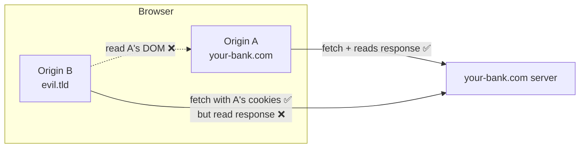
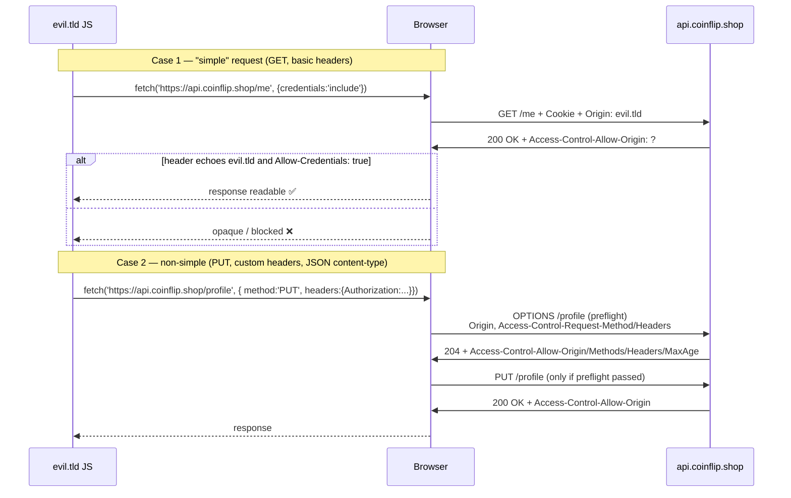
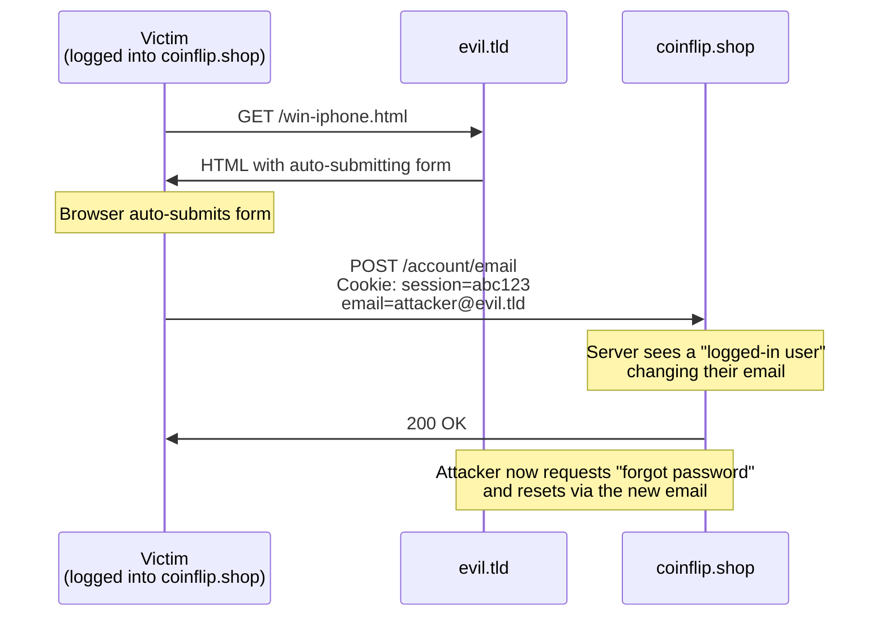
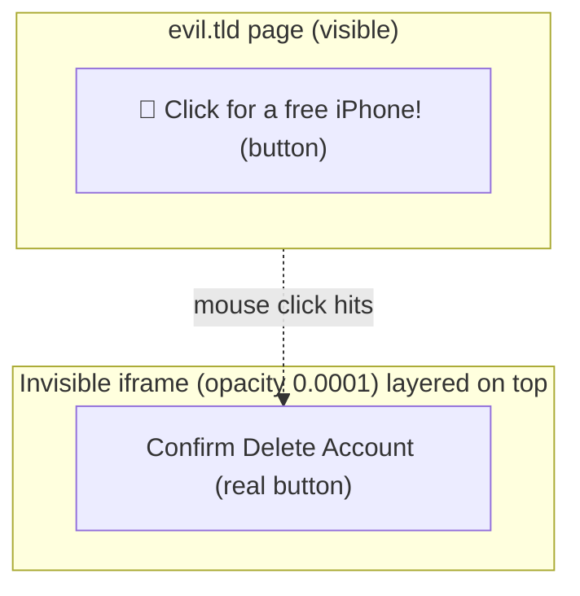
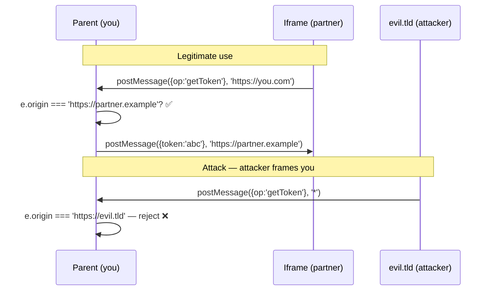

# Frontend security — Beat 2: Cross-origin attacks

> Beat 1 was about attackers running code **inside** your origin. Beat 2 is about attackers who can't — but who weaponize the **user's browser** to act on your origin from the outside. Same end goal, completely different toolkit.

**Series:** [Hub](../frontend-security/) · [Beat 1 — XSS](../frontend-security-xss/) · **Beat 2 (this page)** · [Beat 3+4 — auth & headers](../frontend-security-auth-and-headers/)

---

## The problem

Same `coinflip.shop` from Beat 1. You fixed the XSS bugs. You sleep better. Then a researcher emails three new exploits, none of which inject any code into your origin:

1. They built a page at `evil.tld/win-iphone.html`. A logged-in `coinflip.shop` user opens it and **their account password silently changes**.
2. They built another page that frames `coinflip.shop/account/delete` invisibly under a "Click here for your prize" button.
3. They host an embeddable **price widget** for partners. A partner with the widget reads every keystroke from your fields via `postMessage`.

These are **CSRF**, **clickjacking**, and **postMessage abuse**. None of them require code injection into your origin. They all exploit the fact that the browser, by default, is *too cooperative* across origins.

To understand the defenses, we first need the foundation: **what is an origin, and what does the same-origin policy actually do?**

---

## Foundation — origins and the same-origin policy

An **origin** is the triple `(scheme, host, port)`. These are different origins:

| URL | Origin |
|---|---|
| `https://coinflip.shop/a` | `https://coinflip.shop:443` |
| `https://coinflip.shop:8443/a` | `https://coinflip.shop:8443` (different port) |
| `http://coinflip.shop/a` | `http://coinflip.shop:80` (different scheme) |
| `https://api.coinflip.shop/a` | `https://api.coinflip.shop:443` (different host) |

The **Same-Origin Policy (SOP)** is the browser's foundational rule:

> **JavaScript in origin A may freely send requests to origin B, but it generally cannot read origin B's responses, cookies, DOM, or storage.**

Re-read that. It says **send is mostly free, read is restricted**. That asymmetry is the entire reason CSRF exists — your browser will happily send a cookie-bearing POST to your bank from any tab, but the attacker JS can't read the response. That's enough for a state-changing attack, even though it's not enough to *steal* data.



What SOP **doesn't** restrict (so attackers exploit these):

- HTML forms can `POST` to any origin (with credentials).
- ``, `<script src=…>`, `<link>`, `<iframe src=…>` can load cross-origin.
- A cross-origin script you load runs **in your origin** with full access to your DOM (this is why `<script src="cdn.evil/lib.js">` is a supply-chain risk — see Beat 4).
- An iframe of another origin **can't read your DOM**, but it **can be clicked through**, hence clickjacking.

What SOP **does** restrict:

- `fetch` / `XHR` reading cross-origin response bodies (unless CORS opts in).
- Reading cross-origin iframe DOM, cookies, or localStorage.
- Pointer/keyboard events delivered cross-frame in a way that lets you spoof the inner frame's UI (mostly).

CORS — the next section — is the controlled relaxation of "you can't read cross-origin responses."

---

## CORS — the controlled hole in SOP

CORS (Cross-Origin Resource Sharing) is **the server's way to opt-in** to letting a specific cross-origin browser tab read its response. It is enforced **by the browser**, not the server. The server just sends headers; the browser decides whether to surface the response to JS.

### Simple requests vs preflight



**Simple request:** `GET`/`HEAD`/`POST` with a content-type of `text/plain`, `application/x-www-form-urlencoded`, or `multipart/form-data`, and only a short list of allowed headers. Sent immediately; CORS is checked on the response.

**Non-simple:** anything else (`PUT`, `DELETE`, `Content-Type: application/json`, custom headers like `Authorization` or `X-API-Key`). Triggers a **preflight** — an `OPTIONS` request the browser sends *first* to ask the server "would you allow this?" If the preflight fails, the real request is never sent.

### Critical CORS headers

| Header | Sent by | Purpose |
|---|---|---|
| `Origin` | Browser, on every cross-origin fetch | Tells the server who's asking |
| `Access-Control-Allow-Origin` | Server | Either `*` or echo the specific origin. With credentials, must be specific. |
| `Access-Control-Allow-Credentials: true` | Server | Required to send/read cookies cross-origin |
| `Access-Control-Allow-Methods` | Server (preflight reply) | Allowed HTTP methods |
| `Access-Control-Allow-Headers` | Server (preflight reply) | Allowed request headers |
| `Access-Control-Max-Age` | Server (preflight reply) | Cache the preflight result for N seconds |

### The `*` + credentials pitfall

```
Access-Control-Allow-Origin: *
Access-Control-Allow-Credentials: true
```

The browser **rejects** this combo — wildcard origin is incompatible with credentials. To send cookies cross-origin, the server must echo the *specific* origin and maintain an allowlist.

### Common CORS misconceptions interviewers test

- **"CORS protects my server."** No. CORS is a browser policy. Anyone with `curl` can hit your endpoint regardless of your CORS headers. CORS protects your *users' browsers* from leaking data to other origins.
- **"If I just set `Access-Control-Allow-Origin: *` everywhere, I'm CORS-compliant."** Yes, and you've also opted into letting any origin's JS read your responses. That's catastrophic for any endpoint that returns user data.
- **"CORS prevents CSRF."** No! CORS gates *response reading*. CSRF works without ever reading the response. Browsers happily *send* cross-origin POSTs with cookies; the attacker doesn't need the response to have stolen money.

---

## CSRF — Cross-Site Request Forgery

The classic CSRF: a logged-in user visits attacker-controlled HTML, and the attacker's HTML triggers a state-changing request to your site that the user didn't intend. The user's cookies ride along automatically.

### The attack

```html
<!-- evil.tld/win-iphone.html -->
<h1>You won an iPhone!</h1>
<form id="f" action="https://coinflip.shop/account/email" method="POST">
  <input name="email" value="attacker@evil.tld">
</form>
<script>document.getElementById('f').submit();</script>
```



The bug: the server has no way to tell whether this `POST` came from your own page or from someone else's. The user's cookies are attached either way (browsers are eager).

### Defense 1 — `SameSite` cookies (the modern primary defense)

The single most impactful CSRF defense. Set on every authentication cookie:

```
Set-Cookie: session=abc; HttpOnly; Secure; SameSite=Lax
```

`SameSite` values:

| Value | Cookie sent on cross-site requests? |
|---|---|
| `Strict` | **No**, ever. Even a user clicking a link from another site arrives logged out. Great for sensitive sites; brutal for UX. |
| `Lax` | **Only** for top-level navigations using *safe* methods (`GET`). Not on `POST`/`PUT`/`DELETE` or subresource loads. **Modern default in Chrome.** |
| `None` | Sent on all cross-site requests; **must** be combined with `Secure`. Use only for cookies that need to work in 3rd-party contexts (auth widgets, embedded payments). |

Since 2020 Chrome defaults to `SameSite=Lax` for cookies that don't specify one. That single browser change killed the most common CSRF shape. **You should still set it explicitly** — defense in depth, and other browsers/older versions vary.

### Defense 2 — CSRF tokens (synchronizer token pattern)

A per-session unguessable random string the server issues, the page embeds in a hidden form field or sends in a custom header, and the server verifies on every state-changing request.

```html
<form method="POST" action="/account/email">
  <input type="hidden" name="_csrf" value="d4c3b2a1...">
  <input name="email">
</form>
```

The attacker's cross-origin form **can't read** your CSRF token (SOP), so it can't include it. Server rejects the forged request.

### Defense 3 — Double-submit cookie

Server sets a random cookie `csrf=xyz`. The client-side JS reads it (cookie isn't `HttpOnly` for this one) and sends the same value in a header `X-CSRF: xyz`. Server checks they match. Attacker can't read the cookie (SOP) so can't set the header.

### Defense 4 — Custom request headers

If your endpoint requires a header like `X-Requested-With: fetch` or `Content-Type: application/json`, a cross-origin attacker has to make a non-simple request, which triggers a CORS preflight, which fails because you don't allow `evil.tld`. So: **just requiring a custom header turns CSRF into a CORS problem the browser blocks for free**. This is why JSON-API SPAs are largely immune to classic CSRF without explicit tokens — they use `Content-Type: application/json`, which forces preflight.

### When you still need explicit CSRF tokens

- **Form-encoded `POST`s** (server-rendered apps, Django/Rails templates).
- Endpoints that must accept `text/plain` or `application/x-www-form-urlencoded`.
- Browsers older than `SameSite=Lax` defaults (mostly historical now).

A modern SPA with JSON APIs and `SameSite=Lax` cookies is largely safe; a legacy server-rendered app with form posts needs explicit tokens.

---

## Clickjacking (UI redress)

Your `/account/delete` button works fine. The attacker doesn't need to *call* the endpoint — they trick the user into clicking the real button without realizing it.

### The attack

```html
<!-- evil.tld -->
<style>
  iframe { position: absolute; opacity: 0.0001; width: 500px; height: 500px; top: 100px; left: 100px; }
  button { position: absolute; top: 200px; left: 200px; }
</style>
<button>🎁 Click for a free iPhone!</button>
<iframe src="https://coinflip.shop/account/delete"></iframe>
```

The iframe is invisible (`opacity: 0.0001`), positioned exactly over the bait button. The user thinks they're clicking "free iPhone," but the click lands on the **real** "Confirm Delete Account" button inside the iframe. The user is logged in, so it works.



### Defenses

**Old way — `X-Frame-Options` header:**

```
X-Frame-Options: DENY
X-Frame-Options: SAMEORIGIN
```

`DENY` — page may not be framed by anyone. `SAMEORIGIN` — only your own origin may frame it. Simple, broadly supported, no granularity.

**Modern way — CSP `frame-ancestors`:**

```
Content-Security-Policy: frame-ancestors 'none';
Content-Security-Policy: frame-ancestors 'self' https://partner.example;
```

More expressive (allowlist multiple origins, supports wildcards). Modern browsers prefer `frame-ancestors`; if both are set, `frame-ancestors` wins.

**Set both** for the next few years until `X-Frame-Options` truly dies.

### Bonus — when to allow framing

You almost never want to. Exceptions:

- A widget you ship to partners (price ticker, payment iframe). Allow `frame-ancestors https://partner1.com https://partner2.com`.
- An embeddable doc viewer. Same deal.

For sensitive pages (login, account, payment) use `frame-ancestors 'none'`. Always.

---

## `postMessage` — the cross-origin telephone with no caller ID

`window.postMessage(data, targetOrigin)` lets two windows (parent ↔ iframe, or window ↔ popup) talk **across origins**. It's the legitimate way to communicate with an embedded widget. It's also a juicy attack surface if you do it wrong.

### Two real bugs

**Bug A — sending to `'*'`:**

```js
otherFrame.postMessage({ token: 'abc123' }, '*'); // ❌
```

`'*'` means "any origin can receive this." If the iframe was navigated by an attacker (or your widget partner is compromised), your token leaks. **Always specify the target origin:**

```js
otherFrame.postMessage({ token: 'abc123' }, 'https://partner.example'); // ✅
```

**Bug B — not checking the sender:**

```js
window.addEventListener('message', (e) => {
  // ❌ no origin check — anyone who frames us can post here
  doSensitiveThing(e.data);
});
```

Always check `e.origin`:

```js
window.addEventListener('message', (e) => {
  if (e.origin !== 'https://partner.example') return;
  // additionally validate e.data shape — never trust structure
  if (typeof e.data?.action !== 'string') return;
  doSensitiveThing(e.data);
});
```

### Mental model

`postMessage` is **HTTP without TLS, cookies, or CORS**. The browser hands you a string and an `origin` claim. **The `origin` is trustworthy** (the browser sets it, not the sender), but the *content* is whatever the sender chose. Treat it like any other untrusted input — validate origin first, then validate shape.



---

## Bonus boundary attacks (good "I know one more thing" answers)

### Open redirect

```js
// /login?next=/dashboard — looks innocent
res.redirect(req.query.next);
```

Attacker URL: `/login?next=https://evil.tld/fake-login`. After "logging in," the user is redirected to `evil.tld`, which presents a convincing fake login page. Validate that `next` is a same-site path:

```js
const next = req.query.next ?? '/';
if (!next.startsWith('/') || next.startsWith('//')) {
  return res.redirect('/');
}
res.redirect(next);
```

`//evil.tld` is a protocol-relative URL — easy to miss.

### Cross-origin info leak via timing

`fetch('https://your-bank.com/me').then(timing => …)` — even if CORS blocks reading the response body, the *timing* of the response can leak whether the user is logged in (304 vs 200, fast vs slow). Mitigations: COOP/COEP (Beat 4), Cross-Origin-Resource-Policy headers.

### `target="_blank"` reverse tabnabbing

Old footgun:

```html
<a href="https://partner.tld" target="_blank">Partner</a>
```

The new tab can do `window.opener.location = 'https://evil.tld/fake-login'` — *your* tab gets navigated to a phishing page in the background. Modern browsers default `target="_blank"` to imply `rel="noopener"`, but **always set it explicitly**:

```html
<a href="https://partner.tld" target="_blank" rel="noopener noreferrer">Partner</a>
```

`noreferrer` also drops the Referer header.

---

## Whiteboard fragment

When the interviewer says "walk me through cross-origin attacks":

```text
Foundation:
  Same-origin policy: send-mostly-free, read-mostly-blocked.
  Origin = (scheme, host, port).
  CORS = server opts in to letting another origin's JS read its responses.

Attack 1 — CSRF: attacker's site triggers state-change as victim.
  Defense: SameSite=Lax cookies + JSON content-type (forces preflight)
           + explicit CSRF token for legacy form posts.

Attack 2 — Clickjacking: invisible iframe over bait button.
  Defense: CSP frame-ancestors 'none'  (and X-Frame-Options DENY).

Attack 3 — postMessage abuse: bad sender or bad listener.
  Defense: always specify targetOrigin; always check e.origin
           in the listener; validate e.data shape.

Bonus — open redirect, reverse tabnabbing, timing leaks.
```

---

## Practice

- **PortSwigger labs** — [CSRF labs](https://portswigger.net/web-security/csrf), [CORS labs](https://portswigger.net/web-security/cors), [Clickjacking labs](https://portswigger.net/web-security/clickjacking). Free, hands-on, the gold standard.
- **Audit one real form in your codebase.** Is it `POST` with a CSRF token? Are auth cookies `SameSite=Lax`? What happens if you `curl -X POST` it from another origin?
- **Add `frame-ancestors 'none'`** to a page in your dev environment. Then try to iframe it from a `file://` HTML page locally.

---

## Common interview questions

**What exactly is an origin?**
The triple `(scheme, host, port)`. `https://a.com` and `http://a.com` are different origins (scheme); so are `a.com:443` and `a.com:8443` (port). Subdomains are different origins by default; you can opt into sharing via `document.domain` (deprecated) or via cookies with `Domain=.a.com`.

**What does the same-origin policy actually restrict?**
Reading cross-origin responses (`fetch`/`XHR` body), DOM, cookies, storage. It does **not** restrict *sending* cross-origin requests — `<form>`, ``, `<script>` all work cross-origin and carry cookies. That asymmetry is the root cause of CSRF.

**Walk me through a CORS preflight.**
For non-simple requests (anything beyond `GET`/`HEAD`/`POST` with form/text content-types), the browser sends `OPTIONS` first with `Access-Control-Request-Method` and `Access-Control-Request-Headers`. Server responds with `Access-Control-Allow-Origin/Methods/Headers/Max-Age`. If they match the upcoming real request, the browser proceeds; otherwise it fails the fetch without ever sending the real request.

**`Access-Control-Allow-Origin: *` and `Allow-Credentials: true` — why doesn't this work?**
Spec rejects the combo. Wildcard origin can't be paired with credentials, because that would let any site exfiltrate authenticated responses. With credentials you must echo the specific origin from an allowlist.

**Does CORS protect my server from being scraped?**
No. CORS is enforced by the browser, not your server. `curl` ignores it entirely. Use rate limiting, auth, and bot-detection at the server layer.

**CSRF in one sentence and the modern primary defense?**
A logged-in user's browser is tricked into sending a state-changing request to your site that the user didn't intend. Primary defense: `SameSite=Lax` (or `Strict`) cookies — modern Chrome makes this the default for cookies that don't specify it.

**Why doesn't CORS prevent CSRF?**
CORS gates *reading* the response, not sending the request. CSRF only needs to make the request happen — the attacker doesn't care what comes back. Cookies attach automatically on cross-origin requests; that's enough to "transfer money" or "delete account."

**A SPA uses `fetch` with `Content-Type: application/json` — is it CSRF-vulnerable?**
Largely no. `application/json` is a *non-simple* content-type, which forces a preflight, which the attacker's origin won't pass (your CORS allowlist excludes them). So the browser blocks the request before it reaches your server. Belt and suspenders: still set `SameSite=Lax`.

**Clickjacking — old defense vs new defense?**
Old: `X-Frame-Options: DENY/SAMEORIGIN`. New: CSP `frame-ancestors`. `frame-ancestors` is more expressive (allowlists, multiple origins, wildcards) and supersedes `X-Frame-Options` in modern browsers. Set both for transition compatibility.

**`postMessage` — what are the two bugs you check for in code review?**
(1) Sending with `targetOrigin: '*'` — leaks data if the receiver was navigated. (2) The receiver's `message` listener not checking `event.origin` — accepts messages from anyone who frames you. Both must be fixed; specifying the target alone doesn't help if the listener is open.

**What's a CORS preflight cache and why does it matter?**
`Access-Control-Max-Age: 600` tells the browser "cache the preflight result for 10 minutes." Without it, every non-simple request to a new endpoint triggers a fresh `OPTIONS`, doubling round-trips. Set `Max-Age` to a sane value (300–7200s) for SPAs.

**What's an open redirect and why is it a security bug if it just redirects?**
A `?next=` parameter you blindly redirect to lets attackers craft `https://yoursite/login?next=https://evil.tld`. After authenticating, the user lands on a convincing phishing site — they trust the URL because they started on yours. Defenses: validate `next` is a same-site relative path, watch for `//evil.tld` (protocol-relative).

**What does `rel="noopener"` do?**
It prevents the new tab opened by `target="_blank"` from accessing `window.opener`. Without it, the new tab can navigate the original tab to a phishing URL while the user is distracted. Modern browsers imply this for `target="_blank"`, but set it explicitly for safety.

---

## References (external)

- MDN — [Same-origin policy](https://developer.mozilla.org/en-US/docs/Web/Security/Same-origin_policy), [CORS](https://developer.mozilla.org/en-US/docs/Web/HTTP/CORS), [`postMessage`](https://developer.mozilla.org/en-US/docs/Web/API/Window/postMessage).
- OWASP — [CSRF Prevention Cheat Sheet](https://cheatsheetseries.owasp.org/cheatsheets/Cross-Site_Request_Forgery_Prevention_Cheat_Sheet.html), [Clickjacking Defense Cheat Sheet](https://cheatsheetseries.owasp.org/cheatsheets/Clickjacking_Defense_Cheat_Sheet.html).
- Chromium — [SameSite cookies](https://web.dev/articles/samesite-cookies-explained) (web.dev).
- PortSwigger — [CSRF](https://portswigger.net/web-security/csrf), [CORS](https://portswigger.net/web-security/cors), [Clickjacking](https://portswigger.net/web-security/clickjacking) labs.

---

**Next:** [Beat 3 + 4 — Auth, sessions & the security-header belt](../frontend-security-auth-and-headers/) — where to keep credentials, JWT pitfalls, OAuth on a SPA, CSP, HSTS, supply-chain hygiene.
