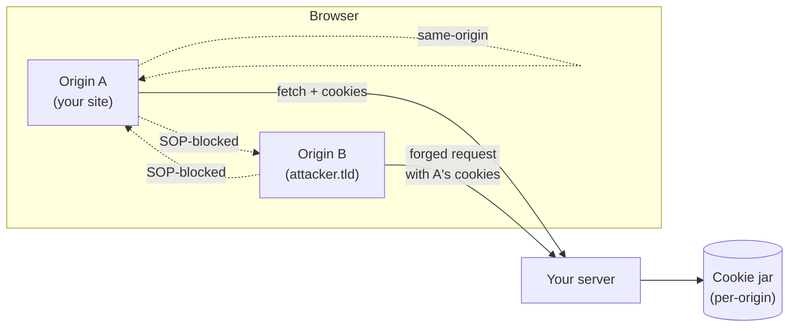

# Frontend security — a tutorial series

A **4-part series** for a senior / staff frontend interview loop. Every page is **problem-first**, has **Mermaid diagrams**, **worked attack scenarios**, and a **common interview questions** section at the end.

The bar at staff level is not "do you know the OWASP top 10" — interviewers assume you do. It is:

1. Can you **explain the trust model** the browser actually enforces (origins, who runs code, who reads data)?
2. Can you **trace an attack** end-to-end with HTTP requests, cookies, and headers — not just say its name?
3. Can you **layer defenses** (defense in depth) and explain *why* one is not enough?
4. Can you **defend a tradeoff** under pushback — "why not just put the JWT in localStorage?"
5. Can you make the **right call for your threat model** — a marketing site, a fintech SPA, and an embeddable widget all need different things.

This series teaches the **vocabulary, attack traces, and tradeoff sense** to clear that bar.

---

## How to use this series

- **Read top-to-bottom once.** Each page leans on the previous one. Cross-origin attacks (Page 3) only make sense once you've internalized the same-origin model and the injection floor (Pages 1–2).
- **Then come back to a single page** the night before an interview — the closing **Q&A** sections are designed to be re-skimmable.
- **Run the example URLs in your head.** When a page shows you `?q=<script>...`, trace what the *server*, the *HTML parser*, and the *cookie jar* each do. That's the muscle interviewers test.

---

## The 4 beats

| # | Beat | Why it matters |
|---|------|----------------|
| 1 | [**XSS & injection — the disease that justifies every other defense**](../frontend-security-xss/) | Reflected / stored / DOM / mutation XSS, React-specific traps, encoding vs sanitization, Trusted Types. |
| 2 | [**Cross-origin attacks — SOP, CORS, CSRF, clickjacking, postMessage**](../frontend-security-cross-origin/) | The browser's trust boundary and the four ways attackers cross it without ever running code in your origin. |
| 3 | [**Auth & sessions — cookies, tokens, JWT, OAuth/PKCE**](../frontend-security-auth-and-headers/#part-1--auth--sessions) | Where to keep credentials, why `HttpOnly` exists, the localStorage-vs-cookie debate, OAuth on a SPA. |
| 4 | [**Security-headers belt & supply chain**](../frontend-security-auth-and-headers/#part-2--the-security-header-belt) | CSP, HSTS, COOP/COEP, Referrer-Policy, Permissions-Policy, SRI, npm hygiene, source maps. (Ships with Beat 3.) |

---

## The mental model behind the whole series

Almost every frontend vulnerability is a **trust-boundary violation**. There are exactly **three** boundaries the browser cares about:

The three boundaries:

1. **Code → DOM.** Whose strings get interpreted as HTML / JS / CSS? *(XSS lives here.)*
2. **Origin A → Origin B.** Can JS in one origin read data from another? *(Same-origin policy + CORS live here.)*
3. **User's browser → your server.** Did the request *intentionally* come from your user, or did the attacker piggyback on the user's cookies? *(CSRF + clickjacking live here.)*

Every defense in this series is "make one of those three boundaries harder to cross." Once you internalize that, you can derive the right header / config from first principles in an interview, instead of memorizing 40 acronyms.

---

## What this series does not cover (and where to look)

- **Server-side injection** (SQLi, SSRF, command injection) — backend's problem; mention parameterized queries in the Q&A and move on.
- **Crypto primitives** (block ciphers, key exchange) — usually scoped out of frontend loops; a one-line "TLS uses asymmetric for handshake, symmetric for traffic" is enough.
- **Mobile / native** — out of scope.
- **Browser internals** (sandboxing, site isolation) — adjacent topic; interesting but rarely tested at the FE staff level. Mention "Chrome site isolation" in the COOP/COEP discussion and you're good.

For the broader interview backlog, see the [**Interview syllabus § Browser / runtime**](../interview-syllabus/#browser--runtime-when-frontend-or-node-appears) line items.

---

## Adjacent reading on this site

- [**Browser event loop**](../browser-event-loop/) — how UI freezes happen; relevant to one DoS-shaped XSS escalation discussion.
- [**JavaScript object APIs**](../javascript-objects-interview/) — `Proxy`, `structuredClone`; useful background for prototype-pollution discussion in Beat 4.
- [**Interview syllabus (master list)**](../interview-syllabus/) — the full backlog.

---

Ready? Start with [**Beat 1 — XSS & injection**](../frontend-security-xss/).
