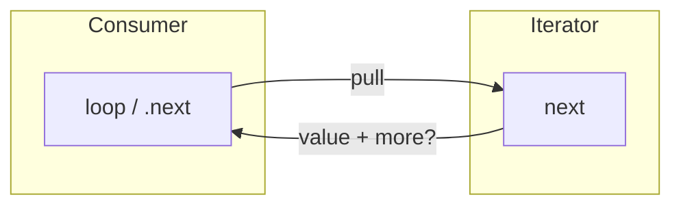

# Iterators & generators

You reach for iterators and generators when **materializing the whole sequence up front** is wrong or impossible: streams are unbounded, files are huge, or you want **lazy** work so the consumer can stop early. The shared idea is **pull**: each step asks “what’s next?” instead of building a giant list.

**Python hook names:** [Dunder methods](../python-dunder-methods/) documents `__iter__` / `__next__` and the exhausted-iterator gotcha; this page focuses on the **cross-language** protocol and **generators** (`yield`).

- **Iterable / range** — “I can start iteration” (`for…of`, `for x in …`, `for (auto x : v)`).
- **Iterator** — the object that actually answers **next** until exhausted.
- **Generator** — language sugar that **pauses** a function at `yield` and resumes on the next pull, so you write iterator logic like normal control flow.



Deep async + event-loop treatment (WebSockets, `for await`, push→pull bridges) stays in the lesson notes — link below — this page is the **cross-language protocol** and interview patterns.

## JavaScript — `Symbol.iterator` and `{ value, done }`

**Iterable:** any object with `[Symbol.iterator]()` returning a fresh **iterator**.

**Iterator:** an object with `.next()` returning `{ value, done }`. When `done === true`, `value` is usually ignored (often `undefined`).

**Concrete trace** — manual pull on an array’s default iterator (same protocol generators implement):

```js
const it = [10, 20][Symbol.iterator]();
it.next(); // { value: 10, done: false }
it.next(); // { value: 20, done: false }
it.next(); // { value: undefined, done: true }  ← still a valid "answer"
```

`for…of` is sugar: repeatedly call `.next()` until `done`. If you **break** out early, the runtime can call `iterator.return()` (if present) for cleanup — important for generators that hold locks or subscriptions.

### Generators (`function*` + `yield`)

The function **freezes at each `yield`** and **unfreezes** on the next `.next()`. To fully drain a generator with `n` yields, callers often need **`n + 1`** `.next()` calls: the last resume runs past the final `yield` and completes the function, producing `{ done: true }`.

```js
function* countTo(n) {
  for (let i = 1; i <= n; i++) yield i;
}
for (const x of countTo(3)) console.log(x); // 1 2 3
```

**Delegation:** `yield*` forwards to another iterable (spreads iteration into the current generator).

### Async iterables

**Async iterable:** `[Symbol.asyncIterator]()` returns an iterator whose `.next()` returns a **Promise** of `{ value, done }`. Consume with `for await…of`. Async generators (`async function*`) are the ergonomic way to define async iterators; they must **yield the thread** (typically via `await`) or you starve the event loop — see the lesson notes.

**Further reading (same repo):**

- [Lesson 1 notes — async generators, event loop, push→pull](/lessons/javascript/01-async-generators/NOTES)

## Python — `__iter__`, `__next__`, `StopIteration`

**Iterable:** `__iter__(self)` returns an iterator (often `self` for iterators, or a new generator object).

**Iterator:** `__next__(self)` returns the next value or **raises `StopIteration`** (optionally with a `.value` — rarely needed in application code). The **for-loop machinery** catches `StopIteration` for you.

**Manual iterator** (whiteboard-sized):

```python
class CountTo:
    def __init__(self, n: int) -> None:
        self.n = n
        self.i = 0

    def __iter__(self):
        return self

    def __next__(self) -> int:
        self.i += 1
        if self.i > self.n:
            raise StopIteration
        return self.i
```

### Generator functions

A function containing **`yield`** becomes a **generator function**: calling it returns a **generator iterator** (state machine object), not the final “return” value. **`yield from it`** delegates iteration to another iterable or generator (like JS `yield*`).

**Generator expressions** — lazy cousin of list comprehensions: `(x * x for x in range(10))` allocates no list; useful piped into `sum`, `max`, or your own consumer.

**Advanced (interviews sometimes mention):** `.send()`, `.throw()`, `.close()` interact with the paused frame; most day-to-day code only pulls with `next()` / `for`.

## C++ — iterators on containers (not Python’s protocol)

Here “iterator” usually means a **pointer-like object** into a container: `begin(v)` … `end(v)`, `++it`, `*it`, sometimes `it + k` for random-access containers.

- **Range-for** — `for (auto x : v)` uses `begin`/`end` and hides iterator syntax.
- **Categories (interview sketch):** *input* (read once, single pass), *forward*, *bidirectional* (`--`), *random access* (`it + n`, `it[n]`). Algorithms document which category they require.
- **Invalidation** — e.g. reallocation can invalidate `vector` iterators; `erase` returns the next valid iterator. Different from JS/Python “protocol” iterators; still the same **pull head, advance** mental model for merge / stream algorithms.

For the full C++ treatment—address traces, sequence/tree/hash-container guarantees, safe erasure, categories, `string_view`, and `span`—see [C++ containers, ownership & iterator invalidation](../cpp-containers-iterator-invalidation/).

**C++20 coroutines** can implement **lazy generators** (`co_yield` in library helpers); pre-coroutine C++ has no single built-in `yield` like JS/Python — you hand-roll iterators or use ranges/views.

```cpp
#include <vector>
#include <iostream>

int main() {
  std::vector<int> v{1, 2, 3};
  for (int x : v) std::cout << x << '\n';
}
```

## Pattern: many heads, one “next” (merge / flatten)

**Merge k sorted lists** (LeetCode 23): keep **k iterator heads** in a min-heap keyed by current value; each `pop` emits the smallest, then **advance that list’s iterator** and push again. Same idea as merging sorted files with file handles — language changes the heap API and iterator type, not the algorithm.

**Flatten nested list** (341): DFS or explicit stack of **positions**; each `next()` drills until a non-list integer or reports done.

```text
# Pseudocode — "next" for merge of two sorted iterators (interview whiteboard)
push (head(a), id=A), (head(b), id=B) into min-heap by value
def next():
  pop smallest (v, id)
  advance that iterator; if not exhausted, push new head
  return v
```

## Practice

- [LeetCode 23 — Merge k Sorted Lists](https://leetcode.com/problems/merge-k-sorted-lists/) — classic multi-head iterator + heap.
- [LeetCode 341 — Flatten Nested List Iterator](https://leetcode.com/problems/flatten-nested-list-iterator/) — implement `hasNext` / `next` over nested structure.
- [LeetCode 173 — Binary Search Tree Iterator](https://leetcode.com/problems/binary-search-tree-iterator/) — controlled in-order **lazy** traversal (stack of nodes).

## Common interview questions

- **Iterable vs iterator?** Iterable = “give me an iterator”; iterator = “I’m the cursor answering next until exhausted.”
- **Why generators instead of building a list?** **Lazy** evaluation, **constant** framing memory for long pipelines, early exit; tradeoff: can’t index `g[i]` without advancing.
- **What happens if I break out of `for…of` over a generator?** JS may call **`return()`** on the iterator; use `try` / `finally` in the generator for cleanup, and know **`finally` does not run on GC alone** — explicit teardown when needed (see async lesson notes for hooks).
- **Python: why `StopIteration` inside a generator was a footgun?** In older interactions with `yield from` / generators, leaking `StopIteration` could confuse the runtime; modern Python contains that; still: **don’t raise `StopIteration` manually** in generator bodies — use `return` to end.
- **`yield` / `yield from` / `yield*`?** Delegation to another iterable without manually copying values in the parent generator.
- **Async generator without `await`?** Can **block the event loop** — always yield time somewhere in real async generators (lesson above).
- **C++: when do vector iterators invalidate?** Typical gotcha: **`push_back` / `insert` may reallocate** — iterators into the old buffer die; use indices, `reserve`, or iterator-stable containers as appropriate.
- **Iterator categories — why care?** `std::sort` wants random-access; single-pass streams are input-only; choosing the wrong algorithm on the wrong category is a complexity or correctness bug.

**When not to use lazy generators:** You need **random access**, **length up front**, or **multiple passes** without storing — materialize a list/array or use a proper replayable structure.

**JS vs Python vs C++ here:** JS/Python emphasize a **small protocol** (`.next` / `StopIteration`) and **generator syntax** for lazy control flow. C++ emphasizes **container iterators + algorithms** and (optionally) coroutines for generator-like laziness — pick the idiom the codebase and problem already use.
