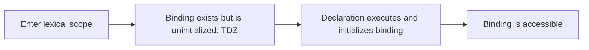
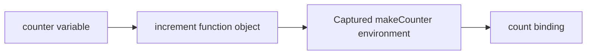
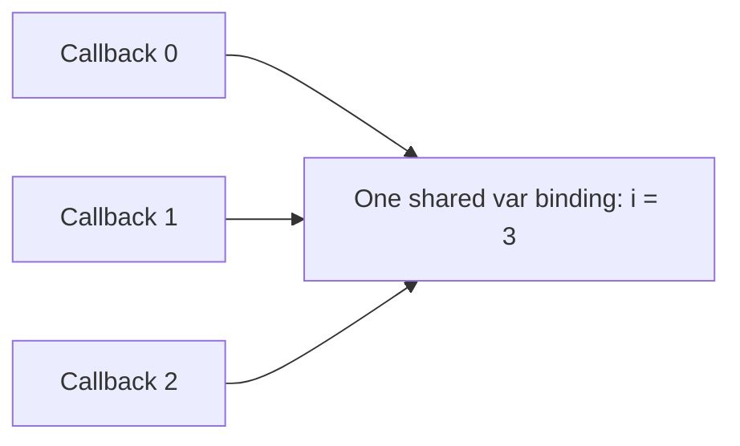

# JavaScript closures, lexical scope, hoisting, and declarations

**Problem:** A callback reads an old value, every timer in a loop prints the same number, or a name throws before a declaration even though an outer variable exists. These bugs share one cause: JavaScript first creates bindings in **lexical environments**, then functions retain links to those environments. A reliable mental model makes the output traceable instead of mysterious.

Use this page when you need to explain:

- how identifier lookup follows source-code nesting rather than callers;
- exactly how `var`, function declarations, `let`, and `const` differ;
- why `let` and `const` are hoisted **and** inaccessible in the temporal dead zone;
- how closures retain bindings, including per-iteration bindings; and
- why React callbacks can see values from an older render.

**See also:** [`this` binding](../javascript-this-binding/) for the separate question of how ordinary functions receive `this`, and the [JavaScript hub](../javascript/) for the rest of the interview track.

## The mental model: environments connected by outer links

An executing function has an **execution context**. Its scope-related state refers to a **lexical environment**. An environment contains an environment record—bindings such as `price -> 42`—and a link to its lexically enclosing environment.

When code evaluates an identifier, JavaScript searches the current environment and follows those outer links until it finds a binding or runs out of environments.


The chain comes from **where code is written**, not which function called it:

```javascript
const label = "global";

function showLabel() {
  console.log(label);
}

function caller() {
  const label = "caller";
  showLabel();
}

caller(); // "global"
```

`showLabel` was defined in the global environment, so its outer link leads there. The runtime call stack contains `caller`, but `caller`'s local bindings are not part of `showLabel`'s lexical scope chain.

### The limited “LEGB” analogy

Python's LEGB mnemonic—local, enclosing, global, built-ins—is a useful loose comparison, but it is not JavaScript terminology or a precise map. JavaScript has module, function, block, `catch`, class, and global environments; its declaration kinds are instantiated and initialized differently; and global bindings have browser-specific relationships with `globalThis`. For JavaScript, say **“follow lexical environment links outward.”**

## Declaration instantiation: what “hoisting” really means

Before executing a scope's statements, JavaScript performs declaration instantiation: it creates bindings required by declarations in that scope. “Hoisting” is shorthand for this setup, not a literal source-code rewrite.

| Declaration | Owning scope | State before its line executes | Reassign? | Redeclare in same scope? |
|---|---|---|---:|---:|
| `var x` | Nearest function, script global | Initialized to `undefined` | Yes | Yes, with compatible `var` declarations |
| `function f() {}` | Function/global; usually block in strict/module code | Initialized to the function | Usually yes | Has declaration-conflict rules |
| `let x` | Nearest block | Exists but is **uninitialized** | Yes | No |
| `const x = value` | Nearest block | Exists but is **uninitialized** | No | No |

This trace separates creation from execution:

```javascript
console.log(answer); // undefined
var answer = 42;

greet(); // "hello"
function greet() {
  console.log("hello");
}

console.log(status); // ReferenceError
let status = "ready";
```

An approximate mental rewrite helps for `var`:

```javascript
// Source
console.log(answer);
var answer = 42;

// Approximate mental model—not a source transformation
var answer = undefined;
console.log(answer);
answer = 42;
```

Do not apply that rewrite to `let` or `const`: their bindings exist, but cannot be read or written until initialization.

## The temporal dead zone: hoisted but inaccessible

The **temporal dead zone (TDZ)** runs from entry into a lexical scope until execution reaches the declaration that initializes its binding.



```javascript
const value = "outer";

{
  console.log(value); // ReferenceError—not "outer"
  let value = "inner";
}
```

The inner binding shadows the outer `value` for the entire block. At the log statement, lookup finds that inner binding and stops, but reading it fails because it is still uninitialized. This is the precise reason it is misleading to say “`let` and `const` are not hoisted.” They **are** created during scope setup; unlike `var`, they are not initialized to `undefined` at that point.

Even `typeof` cannot bypass a TDZ binding:

```javascript
console.log(typeof neverDeclared); // "undefined"
console.log(typeof later);         // ReferenceError
let later = 1;
```

`let` may omit an initializer and becomes `undefined` when its declaration executes. `const` must have an initializer because its binding cannot later be reassigned.

## Block scope versus function scope

`let` and `const` belong to the nearest brace-delimited block. `var` ignores ordinary blocks and belongs to the nearest function or script global scope.

```javascript
function inspect() {
  let message = "function";

  if (true) {
    var leaked = "visible after the block";
    let message = "block";
    console.log(message); // "block"
  }

  console.log(message); // "function"
  console.log(leaked);  // "visible after the block"
}

inspect();
```

The asymmetry matters for declaration conflicts:

```javascript
function valid() {
  var value = "function";
  {
    let value = "block"; // Separate block binding: valid
  }
}

function invalid() {
  let value = "function";
  {
    var value = "block"; // SyntaxError: var belongs to function scope
  }
}
```

A function declaration inside a block is block-scoped in modules and strict-mode code. Historical non-strict scripts have Annex B compatibility behavior, so do not build logic around that corner. A block-scoped function expression is unambiguous:

```javascript
if (enabled) {
  const helper = function helper() {
    return "ready";
  };
}
```

## Closure creation and lifetime

A **closure** is a function together with access to the lexical environment in which it was created. Every JavaScript function can close over outer bindings; it becomes interesting when the function outlives the call that created those bindings.

```javascript
function makeCounter() {
  let count = 0;

  return function increment() {
    count += 1;
    return count;
  };
}

const counter = makeCounter();
console.log(counter()); // 1
console.log(counter()); // 2
```



`makeCounter` has returned, but the environment needed by `increment` remains reachable. It becomes eligible for garbage collection only when no reachable closure needs it.

### Closures capture bindings, not frozen snapshots

```javascript
function makeCell() {
  let value = 0;

  return {
    read: () => value,
    write: (next) => {
      value = next;
    },
  };
}

const cell = makeCell();
cell.write(7);
console.log(cell.read()); // 7
```

Both functions resolve the same `value` binding. Conversely, separate factory calls create separate environments:

```javascript
const first = makeCounter();
const second = makeCounter();

console.log(first());  // 1
console.log(first());  // 2
console.log(second()); // 1
```

## The loop/callback bug: one binding or one per iteration?

`var` creates one loop binding shared by every callback:

```javascript
const callbacks = [];

for (var i = 0; i < 3; i++) {
  callbacks.push(() => console.log(i));
}

callbacks.forEach((callback) => callback());
// 3
// 3
// 3
```

All callbacks read the same `i` after the loop has finished.



A `for` loop declared with `let` creates a fresh binding for each iteration:

```javascript
const callbacks = [];

for (let i = 0; i < 3; i++) {
  callbacks.push(() => console.log(i));
}

callbacks.forEach((callback) => callback());
// 0
// 1
// 2
```

Before `let`, code commonly introduced a function call whose parameter provided a fresh binding:

```javascript
for (var i = 0; i < 3; i++) {
  ((capturedI) => {
    callbacks.push(() => console.log(capturedI));
  })(i);
}
```

The same issue appears with timers, requests, and event listeners because their callbacks run after the loop or surrounding call has advanced.

### Arrow functions still create scope

An arrow function has parameters and local bindings and closes over ordinary variables exactly as a regular function does. “Lexical arrow” specifically means that it does not create its own `this`, `arguments`, `super`, or `new.target`; it obtains those from an enclosing non-arrow context.

```javascript
const makeReader = (input) => {
  const doubled = input * 2;
  return () => doubled;
};

console.log(makeReader(3)()); // 6
```

Use the [`this` binding tutorial](../javascript-this-binding/) for call-site binding and the arrow-function distinction.

## React relevance: each render has new bindings

A function component runs again for each render. Each call creates new local bindings, so a callback created during one render sees that render's environment:

```javascript
function render(count) {
  return () => console.log(count);
}

const oldHandler = render(0);
const newHandler = render(1);

oldHandler(); // 0
newHandler(); // 1
```

This is the basis of a stale-closure bug:

```jsx
function Counter() {
  const [count, setCount] = useState(0);

  useEffect(() => {
    const id = setInterval(() => {
      setCount(count + 1);
    }, 1000);

    return () => clearInterval(id);
  }, []);

  return <div>{count}</div>;
}
```

The effect's interval closes over the initial render's `count === 0`, so every tick requests `setCount(1)`. When new state depends only on previous state, use a functional update:

```jsx
setCount((current) => current + 1);
```

Choose the fix by intent:

- add a dependency when the effect should be replaced as that value changes;
- use a functional updater for state derived from previous state;
- use a ref when a long-lived callback intentionally needs a mutable “latest value”; and
- clean up timers, subscriptions, and listeners so obsolete closures and external resources are released.

`useCallback` does not make a callback immune to closure rules. It reuses a function while its dependencies are unchanged, so an omitted dependency can preserve a stale environment.

## Closure tradeoffs and failure modes

| Benefit | Cost or risk |
|---|---|
| Private state without exposing properties | Hidden state can make tests and debugging less transparent |
| Small callbacks retain the context they need | Retained environments can keep large object graphs alive |
| Factories create isolated instances | Many instances mean many function objects/environments |
| Memoization can avoid repeated work | An unbounded cache is a memory leak with a friendly name |
| Async handlers preserve request/render context | Long-lived handlers can read stale values or outlive their owner |

Avoid accidental retention by capturing only what the callback needs, removing listeners and timers, and bounding caches. Engines optimize closure representation, so do not guess at byte-level costs in an interview; explain reachability and measure real hot paths.

## A whiteboard tracing algorithm

For interview snippets:

```text
1. Reject early declaration conflicts (possible SyntaxError).
2. Create bindings for each scope:
     var      -> initialized to undefined
     function -> initialized to function object
     let/const-> uninitialized (TDZ)
3. Execute statements in order; update binding values.
4. At each function creation, draw an arrow to its lexical environment.
5. At invocation, search that saved chain—not the caller's locals.
6. Stop at the first uncaught exception.
```

### Worked mixed-binding trace

```javascript
function buildReaders() {
  const readers = [];

  for (var i = 0; i < 2; i++) {
    let label = `item-${i}`;
    readers.push(() => `${i}:${label}`);
  }

  return readers;
}

const [first, second] = buildReaders();
console.log(first());  // "2:item-0"
console.log(second()); // "2:item-1"
```

Both callbacks share the function-scoped `i`, whose final value is `2`. Each closes over a distinct per-iteration `label` binding.

## Practice: predict before running

### 1. Lexical scope is not caller scope

```javascript
const score = 10;

function report() {
  console.log(score);
}

function start() {
  const score = 30;
  report();
}

start();
```

<details>
<summary>Answer</summary>

`10`: `report` was defined in the global environment; `start` is merely its caller.

</details>

### 2. Shadowing plus TDZ

```javascript
const status = "global";

function run() {
  console.log(status);
  let status = "local";
}

run();
```

<details>
<summary>Answer</summary>

`ReferenceError`: the local binding shadows the global one throughout `run`, but is uninitialized at the log.

</details>

### 3. A binding changes after function creation

```javascript
function build() {
  var state = "starting";
  const read = () => state;
  state = "ready";
  return read;
}

console.log(build()());
```

<details>
<summary>Answer</summary>

`"ready"`: the closure reads the binding when invoked, not a frozen creation-time value.

</details>

### 4. Mutating the loop control variable

```javascript
const readers = [];

for (let i = 0; i < 5; i++) {
  readers.push(() => i);
  i += 1;
}

console.log(readers.map((read) => read()));
```

<details>
<summary>Answer</summary>

`[1, 3, 5]`: bodies begin with `i` equal to `0`, `2`, and `4`; each body mutates its iteration binding before the callback later reads it.

</details>

## Common interview questions

**What is lexical scope?**  
Identifier resolution is determined by the nesting of source code. A function searches its own environment, then the environment where it was created, continuing outward—not through its runtime callers.

**What exactly is a closure?**  
A function plus access to its creation-time lexical environment. The retained access is to bindings, not necessarily immutable snapshots of values.

**Are `let` and `const` hoisted?**  
Yes. Their bindings are created when the scope is instantiated, but remain uninitialized and inaccessible in the TDZ until their declarations execute.

**Why does `var` read as `undefined` before its declaration?**  
Its binding is created and initialized to `undefined` before statement execution. The later declaration statement performs the assignment when reached.

**Why does an inner TDZ binding prevent fallback to an outer variable?**  
Lookup finds the inner binding first and stops. Reading that binding fails because it is uninitialized; lookup does not continue after finding an unusable binding.

**Does `const` make an object immutable?**  
No. It prevents reassignment of the binding. The referenced object's properties may still change unless separately protected, for example with `Object.freeze`—which is itself shallow.

**Why do `var` callbacks in a loop all print the final value?**  
They close over one function-scoped binding. `let` in a `for` declaration creates a fresh binding per iteration.

**Do arrow functions create a scope and closures?**  
Yes. They have parameters and local variables and close over outer bindings. What they lack is their own `this`, `arguments`, `super`, and `new.target`.

**Does a closure copy every variable in the outer function?**  
The language-level model gives the function access to its lexical environment. Engines may optimize which storage is retained, but code should reason in terms of reachable bindings, not assume a literal full-scope copy.

**When is a closure eligible for garbage collection?**  
When the function and its required environment are no longer reachable. Returning a closure can extend an outer environment's lifetime, but not forever by definition.

**Why do React callbacks become stale?**  
Each render creates new bindings. A callback retained from an earlier render still closes over that render's bindings. Correct dependencies, functional state updates, refs, and cleanup address different versions of the problem.

**When should you avoid closures?**  
Avoid using them as opaque, unbounded storage or when explicit object state would make ownership and testing clearer. In hot allocation paths, measure before choosing a different design.

## See also

- [`this` binding](../javascript-this-binding/) — call-site receiver rules versus lexical arrow `this`
- [Browser event loop](../browser-event-loop/) — when queued callbacks actually run
- [JavaScript object APIs](../javascript-objects-interview/) — `const` bindings versus object mutability, freezing, and cloning
- [JavaScript hub](../javascript/)
