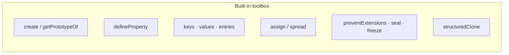

# Static `Object.*` helpers — interview survival guide

**Problem:** Interview questions drift from simple “what does `Object.assign` do?” into **enumeration vs inheritance**, **property descriptors**, **shallow limits**, **`Proxy`** vs accessors, **`Reflect`/`receiver`**, **`structuredClone` vs `JSON`**, and **strict-vs-sloppy** assignment. This page folds those threads into **runnable snippets** plus a **closing Q&A** you can skim before a loop.

**See also:** [Dynamic dispatch & object models](../dynamic-dispatch-and-object-model/) — prototypes and `class` sugar — [Python dunder hooks](../python-dunder-methods/) for parallels to `Proxy` vs `__getitem__`/attribute hooks — [JavaScript hub](../javascript/) for lesson-track links.

## Mental map

Static methods on **`Object`** operate on **plain objects**: create/configure/link prototypes, enumerate **own** props, shallow-merge, lock mutability shallowly, and run the built-in cloning algorithm. **`Object`** is a **namespace** for those operations — not something every instance inherits useful methods from (aside from `constructor` quirks).



---

## Prototype linkage: `Object.create`

**`Object.create(proto)`** returns a **new object** whose internal **`[[Prototype]]`** chain starts at **`proto`**. Prefer **`Object.getPrototypeOf(o)`** in explanations over legacy **`__proto__`**.

- **`Object.create(null)`** — no **`Object.prototype`**; useful for dictionary-like bags without **`toString`** surprises.
- Optional second argument: **`Object.create(proto, propertyDescriptors)`**, same descriptor shape as **`defineProperty`**.

**Own vs inherited recap:** Keys on the **prototype** (like **`a`** when you do `Object.create({ a: 1 })`) are reachable with **`obj.a`** or **`prop in obj`**, and show up in **`for...in`** if enumerable — but **`Object.keys(obj)`** lists only **own enumerable string keys**, so **`a`** is omitted there.

---

## Enumeration: `Object.keys` vs `for...in` vs `entries`

| Tool | Typical contents |
|------|------------------|
| **`Object.keys` / `values` / `entries`** | **Own**, **enumerable**, **string-named** props |
| **`for...in`** | **Enumerable** keys on **`obj`** **and prototypes** (`toString` only if enumerable on the chain — default **`Object.prototype`** props are usually **non-enumerable**) |
| **`Object.getOwnPropertySymbols`** | Own **symbol** keys (skipped by **`keys`**) |

**`Object.assign(target, …sources)`** copies **enumerable own** properties **left to right**, last source wins — **shallow**. **Getter** values run when read from sources (Ordinary **`Get`**), which surprises some “copy semantics” guesses.

---

## `Object.hasOwn` vs `hasOwnProperty`

**`Object.hasOwn(obj, key)`** (ES2022) answers “**does `obj` have an **own** property `key`?**” without calling a method retrieved from **`obj`**.

Older pattern: **`Object.prototype.hasOwnProperty.call(obj, key)`** — avoids:

- **`Object.create(null)`** objects with no **`hasOwnProperty`**
- A poisoned/overridden **`hasOwnProperty`** own property on **`obj`**

---

## Property descriptors (`defineProperty`, `fromEntries`)

`obj.x = 1` produces a classic **data** property: **`writable/enumerable/configurable` true.**

**`Object.defineProperty(obj, prop, descriptor)` defaults** omitting flags behave like **accessor-style strictness defaults** for brand-new props: **`enumerable`/`configurable`/`writable`** default **`false`** for data descriptors unless you specify otherwise — very different from `obj[prop] =`.

```javascript
const a = {};
a.x = 1;

const b = {};
Object.defineProperty(b, "x", { value: 1 });

console.log(Object.getOwnPropertyDescriptor(a, "x"));
// { value: 1, writable: true, enumerable: true, configurable: true }

console.log(Object.getOwnPropertyDescriptor(b, "x"));
// { value: 1, writable: false, enumerable: false, configurable: false }
```

**Non enumerable** own prop stays **hidden** from **`Object.keys`**, **`assign`/`spread`‑style merging**, etc., but still **`in`** the object unless deleted.

```javascript
const o = {};
Object.defineProperty(o, "secret", {
  value: 42,
  enumerable: false,
  configurable: true,
});
o.public = 7;
console.log(Object.keys(o)); // ['public']
console.log("secret" in o); // true
console.log(o.secret);       // 42
```

### Read-only assignments: sloppy vs strict

```javascript
const o = {};
Object.defineProperty(o, "tag", {
  value: "v1",
  writable: false,
  enumerable: true,
}); // configurable defaults false

o.tag = "v2"; // sloppy: silently fails; strict: throws TypeError
delete o.tag;   // false — non-configurable
```

### Accessors (`get` / `set`): state stays where you put it

Accessor descriptors do **not** automatically allocate backing storage beside your functions. Closure, **`WeakMap`**, **`#`** private fields inside a **`class`** — explicit choices:

```javascript
let backing = 0;
const o = {};
Object.defineProperty(o, "n", {
  get() {
    return backing;
  },
  set(v) {
    if (v >= 0) backing = v; // ignore invalid writes
  },
  enumerable: true,
  configurable: true,
});

o.n = 5;
o.n = -10;
console.log(o.n); // 5
```

> **Correction corner:** **`backing = Math.max(0, v)`** on negative **`v`** sets **`backing`** to **`0`**, **not** “keep prior value”; use **`if (v >= 0)`** to ignore illegal writes instead.

---

## Shallow merges: `{ ...obj }`, `assign`, `fromEntries(entries(obj))`

All are **shallow**: nested references point at the **same** inner objects. **`freeze` does not recurse** — **`o.child.field`** stays mutable unless **`child`** itself is frozen.

Pair transforms:

```javascript
const doubled = Object.fromEntries(
  Object.entries({ alice: 10, bob: 20 }).map(([k, v]) => [k, v * 2])
);
```

**Duplicates** in iterable input to **`fromEntries`** — **later wins.**

**Modern extra:** **`Object.groupBy(collection, fn)`** (ES2024) returns **arrays bucketed by key**. Verify environments if cited in live coding.

---

## Lock levels: `preventExtensions`, `seal`, `freeze`

| Method | Add keys? | Reconfigure/delete? | Change existing values (data props)? |
|--------|-----------|---------------------|--------------------------------------|
| **`preventExtensions`** | No (*extensible stays false*) | Yes | Yes |
| **`seal`** | No | Essentially fixed descriptors | Yes if writable |
| **`freeze`** | No | No `delete`/reconfigure | Writes fail (non-writable slots) |

**All shallow.**

---

## `Proxy` sketch (validation on `set`)

Prefer **`Reflect.set`/`Reflect.get`** in traps unless you knowingly bypass engine rules. **`receiver`** is the **`this`** “who asked” participant for accessors on prototypes — skim until you compose **`Proxy`** + getters on **`target`'s prototypes** simultaneously.

```javascript
function createNonNegativeNumberBox(initial = 0) {
  if (initial < 0) throw new RangeError("initial must be >= 0");
  const target = { n: initial };

  return new Proxy(target, {
    set(obj, prop, value, receiver) {
      if (prop === "n") {
        if (typeof value === "number" && value >= 0) {
          return Reflect.set(obj, prop, value, receiver);
        }
        /* ignore invalid silently */
        return true;
      }
      return Reflect.set(obj, prop, value, receiver);
    },
    get(obj, prop, receiver) {
      return Reflect.get(obj, prop, receiver);
    },
  });
}
```

**Tradeoffs:** Accessors **`defineProperty` / class getters** localize one property — **`Proxy`** centralizes policies for **many keys** — **identity differs** (`proxied !== target`), libs may discriminate prototypes, **`set` traps** returning **`false`** throw in strict assignments.

---

## `structuredClone` vs JSON {#json-vs-structuredclone}

**`structuredClone(value)`** clones many nested structures (**plain objects**, **arrays**, **`Date`**, **`Map`**/**`Set`**, **cycles**) using the structured-clone machinery (same family **`postMessage`** uses).

**Limits:** Not a magic “clone arbitrary class instances faithfully” tool — prototypes / functions behave carefully; **`JSON.stringify`/`parse`** drop **`undefined`/functions**, mangle **`Date`**, **`NaN`**, **`Infinity`**, and **throw on cycles**.

---

## Whiteboard recap

```
Shallow ops: {...o}, assign, freeze, clone top level only own enumerable string keys typical keys/assign

Own vs prototype: keys = own enumerable; for...in (+ filter hasOwn); hasOwn static

Descriptors: enumerable/writable/configurable + value OR get/set

Deep graph: structuredClone if ok; JSON if JSON-safe tree only

Proxy traps: Reflect.* + receiver forwarding for accessor correctness on prototypes
```

---

## Practice

- Drill **enumeration** + **freeze** prompts on arbitrary objects (`Object.keys` vs `for...in` filtering).
- Re-implement **`groupBy`** by hand (`reduce`), then contrast **`Object.groupBy`** when permitted.
- Re-read MDN summaries for **`defineProperty`** invariants (`configurable:false` ⇒ **no delete**).

## Common interview questions

- **`Object.assign` vs spread?** Same shallow merge semantics into a blank object (`assign` mutates **`target`**; spread always allocates except when nested in another expression).

- **`Object.keys({...enumerableInherited})`**? Inherited enumerable keys omitted.

- **`defineProperty` without flags?** New data props default restrictive (`enumerable`/`writable`/`configurable` **`false`** when omitted).

- **Why accessors feel “outside” the instance?** Getters/setters **are on the descriptor**, but backing storage isn’t magically allocated — closures / **`WeakMap`** / **`#`** fields choose where state lives.

- **When `Proxy` over accessors?** Whole-object interception, logging/virtual fields — watch **receiver/**`Reflect` correctness, prototype invariants of exotic objects, **`===` identity.**

- **`structuredClone` vs deep assign loop?** Built-in correctness for supported graph + cycles vs hand-rolled DFS with Map for visited refs.

Reliable **security** needs more than **`Object.freeze`** / **`Object.seal`**: nested **references** remain mutable, and untrusted code does not have to use your object wrapper at all.

---

## See also on this site

- [JavaScript hub](../javascript/)
- [Dynamic dispatch & object models](../dynamic-dispatch-and-object-model/)
- [Iterators & generators](../iterators-and-generators/) — `Symbol.iterator` vs iterable hooks
