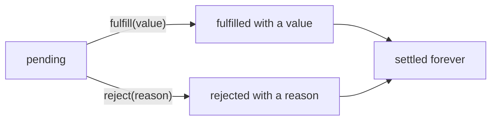
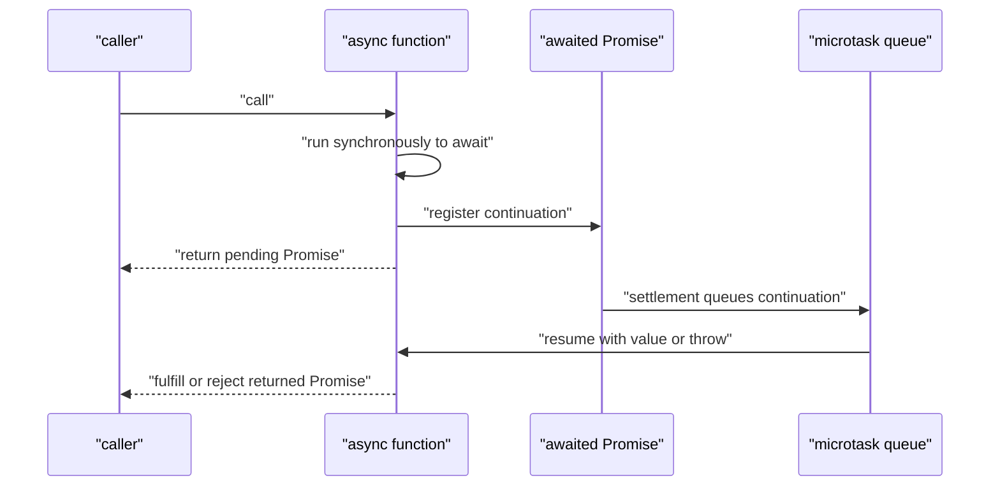
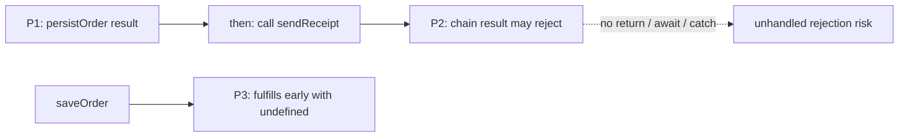

# JavaScript Promises and `async` / `await`

You need Promises when work finishes later but the caller still needs one dependable story for its value, failure, ordering, and cleanup. The syntax is compact; the production bugs come from misunderstanding **which Promise owns an error**, **when a continuation becomes runnable**, and **whether concurrent work was actually cancelled**.

This tutorial builds that model from settlement through composition and cancellation. For the surrounding browser schedule—tasks, microtasks, rendering, and starvation—use the dedicated [browser event loop tutorial](../browser-event-loop/). Here, we focus on what Promise operations add to its microtask queue.

## 1. One eventual outcome

A Promise begins **pending** and can settle exactly once:



- **Fulfilled** and **rejected** are the two **settled** states.
- A later call to `resolve` or `reject` cannot change a locked-in outcome.
- A rejection reason can technically be any value, but production code should reject with an `Error` so stack and context survive.

The Promise constructor's executor runs synchronously; only registered reactions run later:

```js
const promise = new Promise((resolve) => {
  console.log("executor");
  resolve(42);
});

promise.then((value) => console.log("reaction", value));
console.log("after construction");

// executor
// after construction
// reaction 42
```

### Resolved is not always fulfilled

**Resolved** means the Promise's fate is locked in. It may still be pending because it has adopted another pending Promise:

```js
let releaseInner;

const inner = new Promise((resolve) => {
  releaseInner = resolve;
});

const outer = new Promise((resolve) => {
  resolve(inner); // outer adopts inner; it does not fulfill with the Promise object
});

outer.then(console.log);
releaseInner(42); // later, inner and then outer fulfill with 42
```

JavaScript's **Promise resolution procedure** also assimilates a **thenable**—an object with a callable `then` property:

```js
const thenable = {
  then(resolve) {
    resolve("adopted");
  },
};

console.log(await Promise.resolve(thenable)); // adopted
```

Assimilation is why returning a Promise from a handler flattens the chain instead of creating a value shaped like `Promise<Promise<T>>`.

## 2. Chaining: each link creates a new Promise

`then`, `catch`, and `finally` do not mutate the original Promise. Each call returns a new one:

```js
const next = current.then(onFulfilled, onRejected);
```

The selected callback determines `next`:

| Callback behavior | Outcome of `next` |
| --- | --- |
| `return 5` | fulfills with `5` |
| return nothing | fulfills with `undefined` |
| `throw error` | rejects with `error` |
| return a Promise or thenable | adopts its eventual outcome |

Worked chain:

```js
Promise.resolve(2)
  .then((value) => value * 3) // fulfilled(6)
  .then((value) => {
    throw new Error(`bad ${value}`); // rejected(Error("bad 6"))
  })
  .catch((error) => {
    console.log(error.message);
    return 10; // recovery: fulfilled(10)
  })
  .then(console.log); // 10
```

`catch(handler)` is equivalent to `then(undefined, handler)`. A catch handler that returns normally **recovers** the chain. Preserve rejection by throwing again:

```js
request()
  .catch((error) => {
    addContext(error);
    throw error;
  })
  .catch(reportFinalFailure);
```

### The rejection-handler placement trap

These are not equivalent:

```js
operation().then(onValue, onError);
```

```js
operation().then(onValue).catch(onError);
```

In the first form, `onError` handles rejection from `operation()`, but it cannot handle an exception thrown by its sibling `onValue`. The second form's `catch` observes rejection from both `operation()` and `onValue`, so it is usually the clearer pipeline.

### `finally` preserves the previous outcome

`finally` is for cleanup that should run on both paths:

```js
showSpinner();

loadDashboard()
  .then(renderDashboard)
  .catch(renderError)
  .finally(hideSpinner);
```

Its callback receives no value or error. Normally it passes the previous outcome through. If the cleanup itself throws or returns a rejected Promise, that new failure replaces the previous outcome.

## 3. Promise reactions and microtasks

Even a handler attached to an already-settled Promise runs asynchronously as a microtask:

```js
console.log("A");
Promise.resolve().then(() => console.log("B"));
console.log("C");

// A C B
```

The browser finishes the current synchronous task, then drains microtasks. See [Browser event loop § Mental model](../browser-event-loop/#mental-model--one-thread-two-queues-one-render) for the full task → microtask → render cycle.

### Worked queue trace

```js
Promise.resolve()
  .then(() => {
    console.log("B");
    queueMicrotask(() => console.log("D"));
  })
  .then(() => console.log("E"));

queueMicrotask(() => console.log("C"));
console.log("A");
```

Output: `A B C D E`.

1. The first `then` reaction and `C` enter the queue: `[B, C]`; synchronous `A` prints.
2. `B` runs and queues `D`: `[C, D]`.
3. Only after the `B` handler returns does its new Promise fulfill and queue `E`: `[C, D, E]`.
4. The remaining jobs run FIFO.

Registering a handler on a **pending** Promise does not queue the handler yet. It records a reaction. The handler becomes a microtask only when that Promise settles.

## 4. `async` functions and the `await` mental model

Calling an `async` function always returns a Promise:

```js
async function value() {
  return 42;
}

async function failure() {
  throw new Error("boom");
}

value();   // Promise fulfilled with 42
failure(); // Promise rejected with Error("boom")
```

An internal throw does not synchronously escape the call boundary:

```js
try {
  failure(); // returns a rejected Promise
} catch {
  console.log("not reached");
}
```

Observe it with `.catch(...)` or use `await` to turn the rejection into a throw at that point:

```js
try {
  await failure();
} catch (error) {
  console.log(error.message); // boom
}
```

### Approximate desugaring

This:

```js
const value = await expression;
use(value);
```

has this useful mental shape:

```js
Promise.resolve(expression).then(
  (value) => use(value),
  (error) => {
    // behave as if `await expression` threw here
    throw error;
  },
);
```

It is not literal source transformation, but it predicts the important behavior:

1. Evaluate and assimilate the expression.
2. If it is pending, register the async function's continuation and suspend.
3. Return control to the caller.
4. When it settles, queue the continuation as a microtask.
5. Resume with its value or throw its rejection at the `await` point.

Code before the first `await` runs immediately. Code after every `await` runs in a later microtask—even when awaiting a non-Promise or an already-fulfilled Promise.



## 5. Sequential waits versus concurrent starts

`await` pauses the current async function; it does not usually start the operation. Calling the operation does.

Sequential start—roughly 600 ms for two independent 300 ms requests:

```js
const user = await fetchUser();
const orders = await fetchOrders(); // starts only after fetchUser finishes
```

Concurrent start—roughly 300 ms:

```js
const userPromise = fetchUser();
const ordersPromise = fetchOrders();

const user = await userPromise;
const orders = await ordersPromise;
```

Both calls start before either wait. The two `await`s do not serialize already-started work.

Prefer a combinator when the operations form one logical group:

```js
const [user, orders] = await Promise.all([
  fetchUser(),
  fetchOrders(),
]);
```

Do not introduce concurrency when the second operation depends on the first result, when ordering is required, or when unconstrained parallelism would overload an API. For a large input, use a concurrency limiter or worker pool rather than `Promise.all(items.map(...))` over thousands of requests.

## 6. Promise combinators

Combinators adopt Promise, thenable, and plain-value inputs. Their output arrays preserve **input order**, not completion order.

| API | Settles when | Fulfillment value | Rejection behavior |
| --- | --- | --- | --- |
| `Promise.all` | every input fulfills | plain values | first observed rejection rejects the aggregate |
| `Promise.allSettled` | every input settles | `{status, value/reason}` records | input rejection becomes data, not aggregate rejection |
| `Promise.race` | first input settles | first fulfillment value | first rejection may win |
| `Promise.any` | first input fulfills | first fulfillment value | all rejected → `AggregateError` |

### `Promise.all`: one all-or-nothing result

```js
const [profile, permissions] = await Promise.all([
  fetchProfile(),
  fetchPermissions(),
]);
```

If one input rejects, there is no partial result array from `Promise.all`. Successful input Promises retain their values, and unfinished work continues, but the aggregate exposes only the rejection.

### `Promise.allSettled`: one report per input

```js
const outcomes = await Promise.allSettled([
  upload("a.png"),
  upload("b.png"),
  upload("c.png"),
]);

for (const outcome of outcomes) {
  if (outcome.status === "fulfilled") {
    console.log("uploaded", outcome.value);
  } else {
    console.error("failed", outcome.reason);
  }
}
```

Use it when partial success is meaningful and every item needs a UI or audit outcome.

### `Promise.race`: first settlement wins

```js
const firstOutcome = await Promise.race([
  readReplicaA(),
  readReplicaB(),
]);
```

The first fulfillment or rejection wins. `race` is appropriate only when an early rejection should also end the aggregate wait.

### `Promise.any`: first success wins

```js
const firstValue = await Promise.any([
  readFromCache(),
  readReplicaA(),
  readReplicaB(),
]);
```

Rejections are ignored while a fulfillment remains possible. If everything rejects:

```js
try {
  await Promise.any([
    Promise.reject(new Error("cache failed")),
    Promise.reject(new Error("replica failed")),
  ]);
} catch (error) {
  console.log(error instanceof AggregateError); // true
  console.log(error.errors); // reasons in input order
}
```

Interview edges: `Promise.all([])` fulfills with `[]`; `Promise.allSettled([])` fulfills with `[]`; `Promise.any([])` rejects with an empty `AggregateError`; `Promise.race([])` remains pending forever.

## 7. Fail-fast is not cancellation

Suppose these operations start together:

```text
A: fulfills after 300 ms
B: rejects after 100 ms
C: fulfills after 500 ms
```

`Promise.all([A, B, C])` rejects after about 100 ms, but A and C continue unless their underlying APIs support cancellation and your code requests it.

Promises have no universal `.cancel()`. `AbortController` supplies an external, cooperative signal to APIs such as `fetch`:

```js
const controller = new AbortController();

try {
  await Promise.all(
    urls.map((url) => fetch(url, { signal: controller.signal })),
  );
} catch (error) {
  controller.abort(); // ask the remaining fetches to stop
  throw error;
}
```

Calling `abort()` changes the signal and dispatches an abort event. An API must listen and perform its own cleanup; an operation that ignores the signal keeps running. A controller is one-shot, and one signal may be shared across a group.

### Timeout with actual client-side abortion

Racing a request against a timer only stops waiting. A timeout helper should also abort the request:

```js
async function fetchWithTimeout(url, timeoutMs) {
  const controller = new AbortController();
  const timeoutId = setTimeout(() => controller.abort(), timeoutMs);

  try {
    return await fetch(url, { signal: controller.signal });
  } catch (error) {
    if (error.name === "AbortError") {
      throw new Error(`Timed out after ${timeoutMs} ms`, { cause: error });
    }
    throw error;
  } finally {
    clearTimeout(timeoutId);
  }
}
```

Aborting a client request cannot necessarily undo server-side work already accepted. Mutations still need idempotency keys or reconciliation where duplicates and uncertain outcomes matter.

## 8. Floating Promises and error ownership

A Promise **floats** when it is not connected to surrounding control flow through `await`, `return`, or deliberate rejection handling:

```js
async function saveOrder() {
  persistOrder().then(sendReceipt); // floating Promise returned by then
}
```

Name the Promises to see the bug:



If `persistOrder` rejects, rejection propagates to P2. If it fulfills but `sendReceipt` throws or returns a rejected Promise, P2 also rejects. Neither failure reaches P3, so `await saveOrder()` may finish early and cannot catch them.

Connect the work:

```js
async function saveOrder() {
  const order = await persistOrder();
  await sendReceipt(order);
}
```

Or return it:

```js
function saveOrder() {
  return persistOrder().then(sendReceipt);
}
```

Now a caller's `await saveOrder()` observes completion and both failure paths.

### Deliberate fire-and-forget

Sometimes background work should not delay the caller. Give its error an explicit owner:

```js
void sendAnalytics(event).catch((error) => {
  reportError(error);
});
```

Here `void` is JavaScript's unary operator, not a C++ return type. It evaluates the expression and produces `undefined`, communicating that the final value is intentionally discarded. It does **not** handle errors; `.catch(...)` does that.

Host environments report a rejection as unhandled when no handler owns it by their reporting checkpoint. Depending on browser, Node configuration, or test runner, the symptom may be a console event, failed test, missing telemetry, or process termination.

## 9. Production failure modes

| Failure | Typical cause | Repair |
| --- | --- | --- |
| API returns success before a write finishes | floating inner Promise | `return` or `await` the write |
| Loading spinner disappears early | async callback started but not awaited | return the complete chain; cleanup in `finally` |
| Caller `try/catch` misses an error | rejection belongs to a disconnected Promise | connect inner → outer and await/catch outer |
| Independent requests take twice as long | each operation starts after a prior `await` | start together, then combine |
| Rate limit or socket exhaustion | unbounded `Promise.all` | cap concurrency |
| Losing requests keep consuming resources | treating fail-fast/race as cancellation | propagate an `AbortSignal` and abort explicitly |
| Cancellation shown as a server failure | all rejections treated alike | classify `AbortError` / abort reason |
| Partial batch result is inaccessible | using `Promise.all` for independent outcomes | use `allSettled` |
| UI paint starves | recursive microtasks | yield with a task and use the event-loop model |

## 10. Interview traces

### Trace A: pending `await` versus an already-queued microtask

```js
async function job() {
  console.log("1");

  const promise = Promise.resolve().then(() => {
    console.log("3");
    return 10;
  });

  console.log("2");
  const value = await promise;
  console.log("4", value);
  return value * 2;
}

console.log("A");
job().then((value) => console.log("5", value));
queueMicrotask(() => console.log("B"));
console.log("C");
```

Output:

```text
A
1
2
C
3
B
4 10
5 20
```

At `await`, `promise` is pending, so the continuation is registered but not queued. After the script, the queue is `[3, B]`. Running `3` fulfills `promise` and appends the continuation behind B.

### Trace B: disconnected error branch

```js
async function publish() {
  sendToServer().then(() => {
    throw new Error("receipt failed");
  });

  return "queued";
}

try {
  console.log(await publish());
} catch {
  console.log("caught");
}
```

This prints `queued`. Later, the handler's throw rejects the separate Promise returned by `then`, producing an unhandled-rejection risk. Add `await` or `return` inside `publish` to connect that branch to the Promise the caller observes.

## Practice

1. Predict the output of Trace A using an explicit microtask queue after every line; then change `const promise` to `Promise.resolve(10)` and retrace it.
2. Implement `mapWithConcurrency(items, limit, asyncMapper)` without launching more than `limit` operations at once.
3. Write a batch upload UI twice: once with `Promise.all` and once with `Promise.allSettled`. Explain which UX each supports.
4. Extend `fetchWithTimeout` to accept a caller-provided `AbortSignal` as well as its internal timeout.
5. In a browser, listen for `unhandledrejection`, deliberately float a rejected Promise, then repair it by returning or catching the chain.

Further practice: revisit [Browser event loop § Order of operations](../browser-event-loop/#order-of-operations--a-trace-that-surprises-people) and explain exactly when each Promise reaction enters—not merely runs in—the microtask queue.

## Common interview questions

### What are the states of a Promise?

Pending, fulfilled, or rejected. Fulfilled and rejected are settled. “Resolved” is broader: a Promise can be resolved to another pending Promise and remain pending until the adopted Promise settles.

### Does `.then()` mutate its Promise?

No. It returns a new Promise. A handler's return fulfills it, a throw rejects it, and a returned Promise or thenable is assimilated.

### Why does `Promise.then` run after synchronous code?

Promise reactions are microtasks. They run only after the current synchronous task finishes. A reaction registered on a pending Promise is not queued until settlement.

### What does an `async` function return?

Always a Promise. A returned value fulfills it, a throw rejects it, and a returned Promise is adopted.

### Does `await` block the JavaScript thread?

No. It suspends only the current async function and returns control to its caller. The continuation becomes a microtask when the awaited Promise settles.

### Why does `try { asyncCall(); } catch {}` miss failures?

The call returns a Promise rather than synchronously throwing its rejection. Use `await asyncCall()` inside the `try`, or attach `.catch(...)`.

### How do you run independent async operations concurrently?

Start all operations before awaiting them, normally with `Promise.all`. Avoid sequential awaits unless there is a dependency, ordering requirement, or resource constraint.

### `Promise.all` versus `allSettled`?

`all` gives one value array only if everything fulfills and otherwise rejects early. `allSettled` waits for every input and returns a status record for each, making partial results explicit.

### `Promise.race` versus `Promise.any`?

`race` takes the first settlement, including rejection. `any` takes the first fulfillment and rejects with `AggregateError` only when every input rejects.

### Does fail-fast mean the remaining work stopped?

No. Promise settlement changes what the caller observes, not the underlying operations. Cancellation requires API support and explicit propagation, commonly through `AbortSignal`.

### What is a floating Promise?

A Promise whose completion or failure is not connected through `return`, `await`, or deliberate handling. It causes early completion, missed errors, flaky tests, and unhandled rejections.

### How would you debug an unhandled rejection?

Find the rejected Promise reported by the stack, then trace backward through every `then`, async call, and callback. Look for a missing `return` or `await`, a catch handler that throws, or intentional background work without its own catch and telemetry.

### When should you avoid `Promise.all`?

Avoid it when you need per-item outcomes, when one failure should not discard the aggregate result, or when launching the entire input concurrently would exhaust resources. Choose `allSettled`, bounded concurrency, or sequential processing according to the requirement.

## See also

- [Browser event loop](../browser-event-loop/) — tasks, microtasks, rendering, starvation, and real-time UI scheduling.
- [JavaScript hub](../javascript/) — other JavaScript interview-refresh topics.
- [Python asyncio](../python-asyncio/) — a cross-language comparison for coroutine scheduling, task ownership, and cooperative cancellation.

