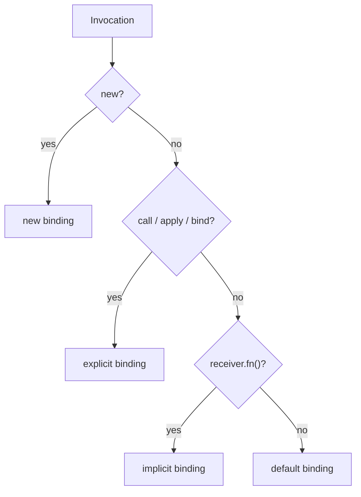

# `this` in JavaScript -- default, implicit, explicit and `new`

**Problem:** Callbacks, extracted methods, and DOM handlers silently pick the wrong receiver; **`this` is not "the object the method belongs to."** For ordinary functions, **`this` is decided largely by how the function is invoked** (the **call site**). Arrow functions opt out and inherit **`this`** from the enclosing lexical scope. Interview loops mix **`call`/`apply`/`bind`**, **`class`**, **`setTimeout`**, and prototype-chain methods -- this page lines up **Kyle Simpson's four binding rules** (popularized via *You Don't Know JS* -- **this & Object Prototypes** / **this & Object Foundations**) plus **lexical `this`**, **`call` vs `apply`**, and **prototype delegation**.

**See also:** [Dynamic dispatch & object models](../dynamic-dispatch-and-object-model/) -- construction, `class`, **`super`**, prototype sketches -- [JavaScript object APIs](../javascript-objects-interview/) -- [JavaScript hub](../javascript/)

---

## Mental model

| Idea | Ordinary functions (`function` / methods) | Arrow functions (`=>`) |
|------|----------------------------------------|-------------------------|
| **Who chooses `this`?** | **Runtime binding** from rules below | **Lexical** -- copied from enclosing scope |
| **Stable across extraction?** | No -- lose implicit binding when you pass **`fn`** naked | Yes -- if outer scope's **`this`** is what you want |
| **`new`** | Valid constructors (unless forbidden) | **Cannot** be used with `new` |

**Prototype tie-in:** If **`o`** inherits **`m`** from its prototype and you call **`o.m()`**, **`this` inside `m`** is still **`o`** -- lookup finds **`m`**, but **implicit binding** sets **`this`** from **how** **`m`** was called (**receiver before the dot**).

---

## Rule 1 -- Implicit binding

Call shape **`receiver.fn(...)`** (dot or bracket). **`this`** inside **`fn`** is **`receiver`**.

```javascript
const account = { name: "Ada", greet() { return `Hi, ${this.name}`; } };

account.greet(); // "Hi, Ada"

const basket = { tag: "fruit", greet: account.greet };
basket.greet(); // `this === basket` -- same function, different receiver → undefined name
```

**Lost implicit binding:** Storing the function drops the receiver unless you **`bind`** or wrap.

```javascript
const g = account.greet;
g(); // default binding -- not `account`
```

---

## Rule 2 -- Explicit binding (`call`, `apply`, `bind`)

You **supply** **`this`** as the **first argument**:

```javascript
account.greet.call(account);
account.greet.apply(account);

const bound = account.greet.bind(account);
bound(); // always `account` as `this`
```

| API | Extra arguments |
|-----|-----------------|
| **`fn.call(thisArg, a, b, c)`** | Passed **one-by-one** after **`thisArg`** |
| **`fn.apply(thisArg, [a, b, c])`** | Passed as an **array** (or array-like) |

Modern style often uses **`fn.call(thisArg, ...args)`** instead of **`apply`** when **`args`** is already an array.

**Hard binding:** **`bind`** returns a wrapper that **always** forwards **`thisArg`** on every call (unless invoked with **`new`** on a constructable bound function -- advanced edge case).

---

## Rule 3 -- Default binding

Plain call **`fn()`** with no **`new`**, no **`call`/`apply`/`bind`**, no **`receiver.fn()`**:

```javascript
function who() {
  "use strict";
  return this;
}
who(); // undefined

function sloppy() {
  return this; // non-strict: global object in browsers / Node legacy globals
}
```

**Strict mode** makes mistakes **loud** (**`undefined`** → **`TypeError`** when you read a property). **Sloppy** mode can hide bugs by pointing **`this`** at **global**.

---

## Rule 4 -- `new` binding

**`new Constructor(...)`** constructs a new object; **`this`** inside **`Constructor`** refers to that **new instance** (unless **`Constructor`** explicitly returns another **object**).

```javascript
function Person(name) {
  this.name = name;
}
const p = new Person("Ada"); // `this` inside Person was the new instance
```

---

## Precedence (when rules compete)

When several stories could apply, remember:

1. **`new`** -- **`this`** is the new instance for that constructor call.
2. **Explicit** **`call`/`apply`/`bind`** -- fixes **`this`** for that invocation (or permanently for **`bind`**).
3. **Implicit** **`obj.method()`** -- **`this`** is **`obj`**.
4. Otherwise **default** -- **`undefined`** (strict) or global (sloppy).



---

## Arrow functions -- lexical `this`

Arrows **do not** use the four rules above. They **capture `this` from the enclosing scope** (like a closure variable).

```javascript
const team = {
  name: "Core",
  tick() {
    setTimeout(() => {
      console.log(this.name); // `tick` had `this === team` → arrow inherits it
    }, 0);
  },
};
```

**Why object literal timing does not confuse things:** Defining **`team`** stores functions; **`this`** is settled when **`tick`** **runs** as **`team.tick()`**, not when **`team`** is allocated.

**Footgun -- arrow as object property:**

```javascript
const bad = {
  name: "X",
  go: () => {
    // NOT implicit binding to `bad` -- arrow ignores `bad.go()`
    return this?.name; // lexical `this` (module / strict undefined / global)
  },
};
```

Use **method shorthand** **`go() { }`** when you need **`this === bad`**.

---

## Prototypes

```javascript
const proto = {
  show() { return this.tag; },
};
const o = Object.create(proto);
o.tag = "hi";
o.show(); // implicit binding → `this === o`, though `show` lives on `proto`
```

**Interview line:** **Delegation** finds **`show`** on the chain; **`this`** is still the **original receiver** **`o`**.

---

## Worked contrast -- timer callback

```javascript
const svc = { tag: "api" };

function outer() {
  const arrowCb = () => console.log("arrow", this?.tag);
  const plainCb = function () {
    console.log("plain", this?.tag);
  };
  arrowCb();    // lexical from outer -- depends how `outer` was called
  plainCb();    // default binding
}

outer.call(svc);
// arrow api   ← outer's `this` was svc
// plain undefined (strict)
```

---

## Whiteboard fragment

```text
Determine `this` (ordinary fn):
  new?           → new object
  fn.call(X)?    → X
  obj.fn()?      → obj
  else           → default (strict ? undefined : global)

Arrow: inherit `this` from enclosing non-arrow scope.
```

---

## Practice

`this` rarely maps to one LeetCode problem; drill with **small runnable snippets** and **predict-print** exercises. Tie-ins:

- React **class** components (legacy) vs hooks (**no `this`** on the component function itself).
- Event listeners -- **`addEventListener`** invokes handler with **`this`** tied to the element **only for ordinary functions**, not arrows (browser-dependent quirks exist -- prefer **`event.currentTarget`**).

---

## Common interview questions

**What are the four ways `this` gets bound (ordinary functions)?**  
**Default** (bare **`fn()`**), **implicit** (**`obj.fn()`**), **explicit** (**`call`/`apply`/`bind`**), **`new`** (construction).

**Why does `const g = obj.m; g()` break?**  
**Implicit binding** requires **`obj`** at the **call** site. **`g()`** uses **default binding**.

**`call` vs `apply`?**  
Same **`this`**; **`call`** takes args listed out, **`apply`** takes an array of args (**`call` + spread** often replaces **`apply`**).

**When do arrow functions help vs hurt?**  
Help as **short callbacks** when you want **`this`** from an outer method (e.g. **`setTimeout`**). Hurt as **`obj`** "methods" when you need **`this === obj`** -- use method shorthand or **`bind`**.

**Does `this` follow the prototype chain?**  
**Lookup** does; **`this`** is the **call's receiver**, not "the object that owns the property." **`o.m()`** → **`this === o`** even if **`m`** is on **`Object.prototype`**.

**Strict vs sloppy default binding?**  
Strict → **`undefined`**; sloppy → global (**easy silent bugs**).

**Can you combine `bind` and `new`?**  
Advanced: bound functions can interact with **`new`** in specified ways; default expectation is **`bind` fixes `this`** for plain calls -- mention **"read spec / MDN if corner cases"** in interview unless asked to go deep.

---

## References (external)

- Kyle Simpson -- *You Don't Know JS* (this & object prototypes / this & object foundations) -- the **four binding rules** framing used widely in interviews.
- MDN -- [`this`](https://developer.mozilla.org/en-US/docs/Web/JavaScript/Reference/Operators/this), [`Function.prototype.call`](https://developer.mozilla.org/en-US/docs/Web/JavaScript/Reference/Global_Objects/Function/call), [`bind`](https://developer.mozilla.org/en-US/docs/Web/JavaScript/Reference/Global_Objects/Function/bind).
