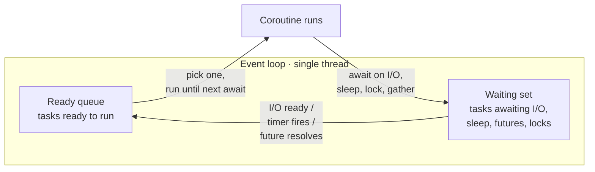
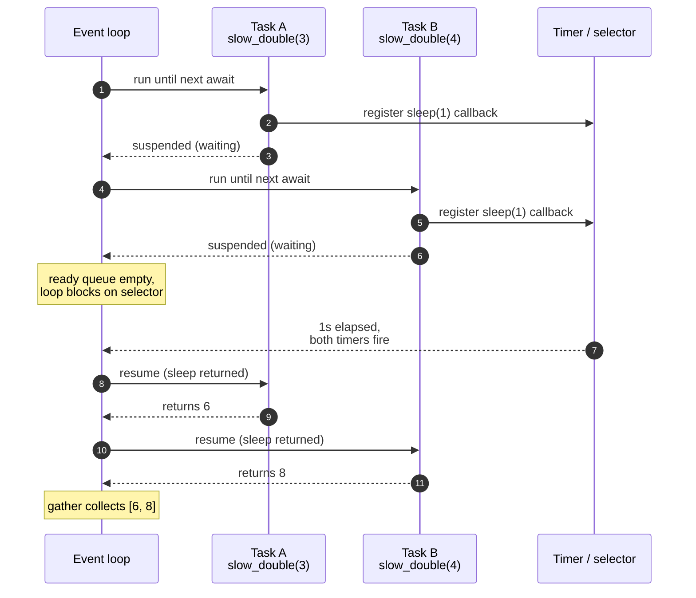

# Python asyncio — the cooperative concurrency model

> **Problem.** You're writing an HRT-style data ingestion service: pull from 200 upstream market-data feeds, parse, write to a queue. You try threads. The GIL keeps CPU-bound parsing serialized; 200 OS threads cost ~MB each in stacks; context-switch cost dominates. You try processes — pickling overhead and IPC kill the latency budget. The right shape is **one** thread, an event loop, and 200 lightweight coroutines that yield control while waiting on I/O. That shape is `asyncio`.

This page is the **interview-depth** view: what `await` actually does, how tasks differ from coroutines, how cancellation propagates, when asyncio is the wrong tool, and the producer-consumer pattern that comes up in nearly every real-time backend interview.

**See also:**

- [Python GIL — what it protects, when threads still help](../python-gil/) — the contrast page. asyncio sidesteps the GIL by using only one thread.
- [Browser event loop — microtasks, render, real-time UIs](../browser-event-loop/) — same shape, different runtime. The mental model transfers.
- [Iterators & generators](../iterators-and-generators/) — `async def` is built on the same generator/`yield`-based suspension machinery.
- [Context managers](../python-context-managers/) — `async with`, `AsyncExitStack`.

## Mental model in one sentence

> An **event loop** runs **one** coroutine at a time on **one** thread. Each coroutine voluntarily **yields** (via `await`) when it needs to wait, and the loop schedules another coroutine that's ready. There is no preemption.

Three corollaries fall out:

- **No GIL contention** — only one thread, so no contention to begin with. Cancellation, locking, and shared state still matter, but for **ordering**, not for race conditions on machine words.
- **Cooperation is mandatory.** A coroutine that doesn't `await` anywhere monopolizes the loop. `time.sleep(5)` inside an async function freezes **every** other coroutine for 5 seconds.
- **Concurrency, not parallelism.** A single Python process running asyncio uses **one** core regardless of how many tasks are concurrent. For CPU-bound work you still need `multiprocessing` or `run_in_executor`.

## The model — one loop, many coroutines, ready vs waiting



Ready queue + waiting set + selectors (epoll/kqueue/IOCP) under the hood — the loop calls `select()` on the OS layer to learn which file descriptors are readable/writable, wakes the corresponding coroutines, and runs them until the next `await`.

Step granularity is the same as in the [browser event loop](../browser-event-loop/): "run until you yield." If you understand JS's event loop, you already understand 80% of asyncio.

## What `await` actually does

`await expr` is *not* a function call that returns a value after computing. It is a **suspension point**:

1. Evaluate `expr` to a *waitable* (a coroutine, a `Task`, or an object with `__await__`).
2. **Yield control back to the event loop** along with that waitable.
3. The loop keeps a continuation: "when this waitable completes, resume **here** with its result."
4. The loop runs other ready tasks. When the waitable is done, the loop puts this task back on the ready queue.
5. Eventually it pulls this task again, the `await` "returns" with the result, execution continues from the next line.

Mental model: `await` is the same shape as `yield from` for generators. In fact, for years asyncio was *implemented* on top of generators (`@asyncio.coroutine` + `yield from`). The `async def` / `await` syntax is sugar that makes the suspension explicit.

A trace through a tiny program:

```python
import asyncio

async def slow_double(x):
    await asyncio.sleep(1)
    return x * 2

async def main():
    a = await slow_double(3)        # suspends here for 1s
    b = await slow_double(4)        # suspends here for 1s
    return a + b                     # 14

asyncio.run(main())                  # ~2 seconds total
```

Sequential. Two suspensions, each one second, two seconds total. Now make it concurrent:

```python
async def main():
    a, b = await asyncio.gather(
        slow_double(3),
        slow_double(4),
    )
    return a + b                     # 14

asyncio.run(main())                  # ~1 second total
```

Both coroutines are wrapped in `Task`s, both start running, both hit `asyncio.sleep(1)` and suspend. The loop's selector wakes them ~1 s later. Total wall time ~1 s. **Concurrency is "I started a second coroutine *while* the first was waiting"**, not "I ran two things in parallel on two cores."

The interleaving in pictures:



Two tasks, one thread, *interleaved at every `await`*. No timeslicing. No preemption. Each task runs synchronous Python until the next suspension point and then *voluntarily* hands control back. That's the entire model.

## Coroutine vs Task — the interview distinction

```python
async def fetch(url): ...
```

- `fetch("https://...")` returns a **coroutine object** — an *unstarted* description of work.
- `asyncio.create_task(fetch(...))` wraps it in a `Task`, **schedules** it on the loop, and returns immediately. The task starts running on the next loop iteration.
- `await fetch(...)` is shorthand for "wrap and immediately wait." Inside an already-running task, that's fine.

The difference matters when you want to start work **without** waiting yet:

```python
async def main():
    t1 = asyncio.create_task(fetch("a"))   # starts immediately
    t2 = asyncio.create_task(fetch("b"))   # starts immediately
    do_other_sync_work_here()
    a, b = await t1, await t2              # collect results
```

If you wrote `t1 = fetch("a")`, neither would have started. A common interview trap is calling a coroutine and assuming it ran:

```python
async def warmup():
    print("warming up")

async def main():
    warmup()                                # bug: returns coro, never awaited
    # RuntimeWarning: coroutine 'warmup' was never awaited
```

The fix is `await warmup()` (run-and-wait) or `asyncio.create_task(warmup())` (schedule and continue).

## `gather`, `wait`, `wait_for`, `as_completed`

| Helper | Returns | Behavior on failure | Use when |
|---|---|---|---|
| `await asyncio.gather(*coros)` | list of results in order | First exception **propagates**, others **continue running but their results are lost** unless `return_exceptions=True` | Fan-out collect; you need all results |
| `await asyncio.gather(*coros, return_exceptions=True)` | list mixed results/exceptions | Never raises | Fan-out where partial success is OK |
| `await asyncio.wait(tasks, return_when=...)` | `(done, pending)` sets | Doesn't raise; you inspect each task | You want to **act on the first one done** without cancelling others |
| `await asyncio.wait_for(coro, timeout=N)` | result | `TimeoutError` after N seconds; **cancels** the wrapped coroutine | Per-call deadline |
| `for fut in asyncio.as_completed(tasks):` | yields completed futures one by one | Each `await fut` may raise | Streaming results as they arrive (e.g. progress UI) |

`gather` is the right answer ~80% of the time. The other 20% you need cancellation control or streaming, and that's `wait` or `as_completed`.

```python
async def fetch_all(urls):
    timeout = 2.0
    return await asyncio.gather(
        *(asyncio.wait_for(fetch(u), timeout) for u in urls),
        return_exceptions=True,
    )

results = await fetch_all(urls)
ok      = [r for r in results if not isinstance(r, Exception)]
errored = [r for r in results if     isinstance(r, Exception)]
```

That's the pattern interviewers want for "fan out N HTTP calls, deadline each one, partial failure is OK."

### `asyncio.TaskGroup` (3.11+) — the new shape

```python
async def fetch_all(urls):
    async with asyncio.TaskGroup() as tg:
        tasks = [tg.create_task(fetch(u)) for u in urls]
    return [t.result() for t in tasks]
```

The `async with` block awaits all tasks at exit. If **any** task raises, the group cancels the rest and re-raises an `ExceptionGroup`. This is structured concurrency in the stdlib and is what new code should use; mention it in interview as "the modern replacement for `gather` when you want strict scoping and cancellation propagation."

## Cancellation — the part candidates get wrong

Cancellation in asyncio is **cooperative**, mediated by a `CancelledError` exception that the loop injects at the **next suspension point** of the cancelled task.

```python
async def slow():
    try:
        await asyncio.sleep(10)
    except asyncio.CancelledError:
        print("cleanup before re-raising")
        raise   # important — re-raise so cancellation propagates

async def main():
    t = asyncio.create_task(slow())
    await asyncio.sleep(0.1)
    t.cancel()                          # request cancel
    try:
        await t
    except asyncio.CancelledError:
        print("task cancelled")
```

Three things to remember:

- **Cancellation is a request, not an order.** The task can `try/except CancelledError` and choose not to re-raise — but **don't do that** outside narrow cleanup blocks. Swallowing it breaks structured cancellation everywhere upstream.
- **A task with no `await` cannot be cancelled.** Tight Python loops without suspension points are immune. This is why putting CPU work in a coroutine is dangerous — you can't cancel it, and you block the loop.
- **`asyncio.shield(coro)`** — wrap a coroutine so that an outer cancellation does not propagate into it. Useful for "cancel my wait, but don't cancel the underlying DB write."

### `asyncio.timeout` (3.11+) — better than `wait_for`

```python
async def with_deadline():
    async with asyncio.timeout(2.0):
        await long_work()
```

If 2 seconds elapse, the inner task gets `CancelledError` and the `async with` re-raises `TimeoutError`. Cleaner than `wait_for` because you can wrap multiple awaits in one timeout block.

## `asyncio.Queue` — producer-consumer (the interview kata)

This is the canonical "real-time backend ingest" pattern. Memorize it.

```python
import asyncio
import random

async def producer(name, queue):
    for i in range(5):
        await asyncio.sleep(random.random() * 0.5)   # simulate work
        item = f"{name}-{i}"
        await queue.put(item)
        print(f"  → {item}")
    await queue.put(None)                             # sentinel: I'm done

async def consumer(name, queue):
    while True:
        item = await queue.get()
        if item is None:
            queue.task_done()
            break
        await asyncio.sleep(0.1)                      # simulate processing
        print(f"  ← {name} processed {item}")
        queue.task_done()

async def main():
    queue = asyncio.Queue(maxsize=10)                 # bounded — provides backpressure
    producers = [asyncio.create_task(producer(f"P{i}", queue)) for i in range(3)]
    consumers = [asyncio.create_task(consumer(f"C{i}", queue)) for i in range(2)]
    await asyncio.gather(*producers)
    # one sentinel per consumer
    for _ in range(len(consumers) - 1):
        await queue.put(None)
    await asyncio.gather(*consumers)

asyncio.run(main())
```

What every part is doing:

- `Queue(maxsize=10)` — **bounded**. When full, `await queue.put(...)` suspends the producer. That's automatic **backpressure**: fast producers slow down to match slow consumers. **Always say "bounded queue for backpressure" in interview** — it's the cheap, correct answer for "what if producers outpace consumers?"
- `await queue.get()` — suspends if empty. The consumer doesn't busy-wait.
- `None` sentinel — one per consumer, so each one exits cleanly. `task_done()` + `await queue.join()` is the alternative if you don't want sentinels.
- `asyncio.gather(*producers)` — wait for all producers to finish before placing the remaining sentinels.

For HRT-shaped framing: producers are upstream feeds; the queue is your in-memory ring buffer; consumers are pricing/normalization workers; the bound is the "drop or block" policy when downstream is slow. Trivially extends to multiple queues, priority queues (`asyncio.PriorityQueue`), or per-symbol fan-out.

## When asyncio misleads — the section interviewers care about

This is where most candidates lose points. The trap is *thinking* you're async when you're not.

### 1. Calling blocking code in a coroutine

```python
import time
import requests   # synchronous HTTP

async def fetch(url):
    return requests.get(url).text     # blocks the loop for the whole HTTP call
```

`requests.get` is a synchronous C-then-Python call that blocks the OS thread. Because there's only **one** thread, the entire event loop is frozen until it returns. Your other coroutines, including health-check handlers, **stop**. Symptoms: latency spikes correlated with single slow upstreams.

Two fixes:

- **Use an async library.** `aiohttp`, `httpx.AsyncClient`, `asyncpg`, `aiomysql`, `motor` for Mongo. They issue real non-blocking I/O and yield to the loop while waiting.
- **Push the sync call to a thread pool.**

```python
async def fetch(url):
    return await asyncio.to_thread(requests.get, url)   # 3.9+
```

`to_thread` schedules the function on the default `ThreadPoolExecutor`. The coroutine suspends, the thread runs `requests.get`, when it returns the result is delivered back to the loop. The loop is free to run other coroutines in the meantime.

### 2. `time.sleep` vs `asyncio.sleep`

```python
async def bad():
    time.sleep(1)         # blocks the entire loop
async def good():
    await asyncio.sleep(1)   # suspends only this coroutine
```

`time.sleep` is a real OS-thread sleep. There's only one thread. You just slept the whole world.

### 3. CPU-bound work blocks the loop

```python
async def hash_password(pw):
    return bcrypt.hashpw(pw, bcrypt.gensalt())   # CPU-bound, ~100ms
```

100 ms × no other coroutine running = your latency p99. For CPU-bound:

- `await asyncio.to_thread(fn, *args)` — fine if it's a few calls and the function releases the GIL (e.g. `hashlib`, NumPy, bcrypt's C path). Doesn't help for pure-Python compute.
- `await loop.run_in_executor(ProcessPoolExecutor(), fn, *args)` — true parallelism, pickling cost. Use for serious compute.
- Externalize: queue to a worker service. The right answer for HFT-grade pricing.

### 4. Mixing sync handlers into async frameworks

If your async web framework (FastAPI, Starlette) lets you write a sync `def` handler and you do, the framework runs it in a threadpool — fine for short work, **terrible** if you assumed it was on the loop and used loop-only primitives. Read the docs for the framework you use; don't assume.

## Locks, semaphores, events — yes, you still need them

Single-threaded but not race-free. Two coroutines can interleave between `await`s and corrupt shared state.

```python
import asyncio

balance = 0

async def deposit(amount):
    global balance
    current = balance               # read
    await asyncio.sleep(0)          # yields to loop — *another* deposit may run here
    balance = current + amount      # write — lost update if interleaved

async def main():
    await asyncio.gather(deposit(100), deposit(100))
    print(balance)                  # may be 100, not 200
```

Fix:

```python
lock = asyncio.Lock()

async def deposit(amount):
    async with lock:
        current = balance
        await asyncio.sleep(0)
        balance = current + amount
```

Other primitives:

- `asyncio.Semaphore(n)` — bound concurrency. Classic "limit to 10 concurrent HTTP requests".
- `asyncio.Event` — broadcast wake-up.
- `asyncio.Condition` — predicate-based wait, like `threading.Condition`.

These are *non-reentrant* and *fair-ish*. They do not cross the loop boundary — if you spawn a thread, use `threading.Lock` instead.

### Bounded concurrency with Semaphore — the second canonical kata

```python
async def fetch(url, sem, client):
    async with sem:
        async with client.get(url) as r:
            return await r.text()

async def fetch_all(urls):
    sem = asyncio.Semaphore(10)         # at most 10 in flight
    async with httpx.AsyncClient() as client:
        return await asyncio.gather(
            *(fetch(u, sem, client) for u in urls)
        )
```

Whenever the interviewer says "rate limit", "bound", or "don't DOS the upstream," this is the answer.

## Cross-language note — same shape, different runtime

| Concept | Python `asyncio` | JavaScript / Node |
|---|---|---|
| Event loop | `asyncio` event loop | V8 + libuv |
| Coroutine syntax | `async def` / `await` | `async function` / `await` |
| Suspension primitive | generator-based machinery | microtask + Promise |
| Cancellation | `Task.cancel()` injects `CancelledError` | `AbortController` + `signal` |
| Bounded concurrency | `asyncio.Semaphore` | Userland (`p-limit`, custom) |
| Backpressure | bounded `asyncio.Queue` | Streams w/ `pause`/`resume` |
| CPU offload | `to_thread` / `ProcessPoolExecutor` | Worker threads / clusters |
| GIL involvement | sidestepped (single thread) | n/a (V8 single-threaded too) |

If you've read [Browser event loop](../browser-event-loop/), the *only* genuinely new things in asyncio are: explicit `Task` creation, explicit `gather`/`wait_for`/`as_completed` helpers, and the cancellation model. Suspension semantics are the same.

## Practice

- Write a CLI that fetches the same URL N times concurrently with **at most 10 in flight**, deadlines each call at 2 s, and prints "ok" / "timeout" / "error" per call. Constraints: no `requests`, no busy-wait. (Semaphore + `wait_for` + `gather`.)
- Write a producer that pushes integers 0..1000 into a bounded `asyncio.Queue(maxsize=100)`, and three consumers that pop, square, and print. Verify backpressure by adding `await asyncio.sleep(0.01)` on the producer and `await asyncio.sleep(0.1)` on each consumer — observe the producer slowing down.
- Take any blocking script you have (`requests`-based scraper, sync DB ETL) and rewrite it with `asyncio.to_thread` *without* changing the underlying calls. Measure the speedup.

## Interview Q&A

### What does `await` actually do?

It evaluates an expression to a *waitable* (coroutine, `Task`, or `__await__`-defining object), suspends the current coroutine **and yields control back to the event loop** carrying that waitable, and stores a continuation so the coroutine can be resumed when the waitable completes. While suspended, the loop runs other ready coroutines. When the waitable resolves, the loop puts this coroutine back on the ready queue. `await` is **not** a synchronous function call — nothing in the current task runs between the suspension and the resume.

### Why doesn't my asyncio code speed up CPU-bound work?

Because asyncio is concurrency on a **single** thread. There's no parallelism. CPU-bound code holds the loop without yielding, so other coroutines can't run, *and* the GIL is held by the only thread anyway. Use `multiprocessing`, `loop.run_in_executor(ProcessPoolExecutor(), ...)`, or push the compute to an external service. `asyncio.to_thread` only helps when the function releases the GIL (NumPy, hashlib, bcrypt's C path).

### What's the difference between a coroutine and a Task?

A coroutine is the *unstarted description* of work — what you get from calling `async def f(): ...; f()`. A Task is a coroutine **wrapped and scheduled** on the loop; it begins executing on the next loop iteration. `asyncio.create_task(coro)` is how you go from one to the other. `await coro` is shorthand for "schedule and immediately wait for it." If you call a coroutine and don't await or schedule it, you get a `RuntimeWarning: coroutine was never awaited` and the work doesn't happen.

### How does cancellation work?

`task.cancel()` schedules the loop to inject `asyncio.CancelledError` at the **next suspension point** of the task. The exception propagates like any other; tasks can catch it for cleanup but should re-raise. If a task is in pure synchronous Python with no `await`, **it cannot be cancelled** until it yields. `asyncio.shield(coro)` wraps a coroutine so outer cancellation doesn't propagate inward — useful when you want to cancel the wait but let an in-flight write finish. `asyncio.timeout` (3.11+) and `wait_for` build on this primitive.

### How do you handle backpressure when a producer is faster than consumers?

Use a **bounded** `asyncio.Queue(maxsize=N)`. `await queue.put(item)` suspends the producer when the queue is full, automatically slowing it down. The alternative — drop policy — uses an unbounded queue and a manual `if queue.qsize() > N: drop()` check, which is what real-time pipelines often do when latency matters more than completeness. Always volunteer "bounded queue for backpressure" early; it signals you've thought about overload.

### What's a common asyncio bug people don't notice?

Calling a synchronous blocking library (`requests`, `psycopg2`, `time.sleep`) inside a coroutine. The whole loop freezes for the duration. Symptoms: latency spikes that don't correlate with task count, health-check timeouts under load. The fix is either an async library (`aiohttp`, `asyncpg`) or `await asyncio.to_thread(blocking_fn, ...)`.

### When is `asyncio.gather` the wrong choice?

Three cases:

- **You want partial results as they arrive** — use `as_completed` and consume lazily.
- **You need to cancel the rest when one fails** — `gather` cancels by default *only* if `return_exceptions=False` (the default). With it `True`, failures are quiet. For strict scoping use `asyncio.TaskGroup` (3.11+) which cancels siblings on first exception and raises an `ExceptionGroup`.
- **You want "first one wins" semantics** — use `asyncio.wait(..., return_when=FIRST_COMPLETED)` and cancel the others manually.

### Why do I need a Lock if Python is single-threaded under asyncio?

Because two coroutines can interleave **between** `await`s. A read-modify-write across an `await` boundary can lose updates the same way two threads would. `asyncio.Lock` is the cure: `async with lock:` ensures no other coroutine enters the protected region until you release. (`Semaphore` for bounded concurrency, `Event` for broadcast wake-up, `Condition` for predicate waits.)

### How would you architect an asyncio-based market-data ingestion service?

One process, one event loop. For each upstream feed: one task that holds an async WebSocket connection and pushes ticks into a **bounded** `asyncio.Queue` (per-feed or shared). N consumer tasks pull, normalize, and write to a downstream queue or database via async drivers (`asyncpg`, `aiokafka`, `aioredis`). Bound concurrency on outgoing writes with a `Semaphore` to avoid overwhelming the sink. Use `TaskGroup` for structured cancellation: if any feed task fails fatally, the group cancels the rest and surfaces an `ExceptionGroup`. Heavy parsing (e.g. SBE binary decode, custom statistics) goes through `loop.run_in_executor(ProcessPoolExecutor(), ...)` so the loop stays responsive. Health endpoints and Prometheus scrape live on the same loop because none of the work blocks.

That's the canonical answer. Mentioning the bounded queue, backpressure, and `TaskGroup` is what separates "I read a tutorial" from "I built one."
