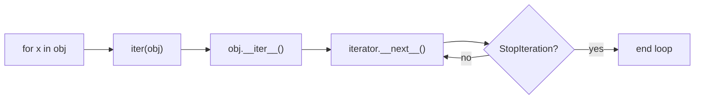
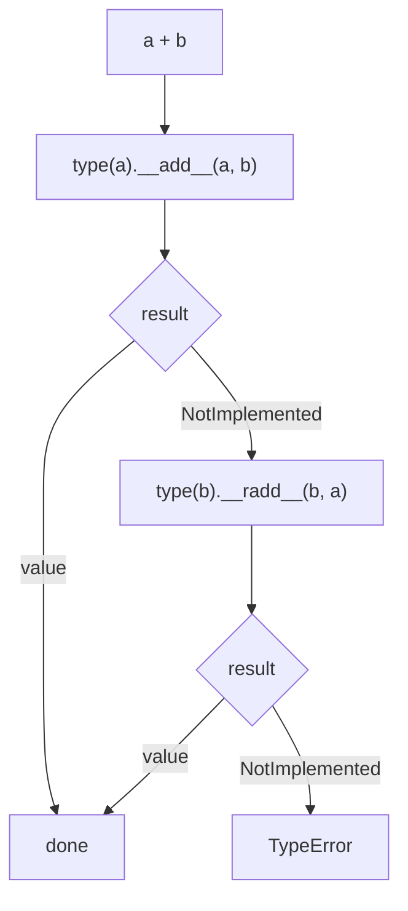

# Python “dunder” methods — hooks and JS / C++ parallels

**Problem:** Interviews love “what happens when you write `a + b` or `with x`?” Dunder names (`__init__`, `__iter__`, …) are not magic— they are **protocol hooks** the interpreter invokes so **normal syntax** compiles to **well-defined dispatch**. This page is a **self-contained map** of the most common hooks, with **honest** parallels: some languages offer a **named method**; others use a **pattern** (constructors, `Symbol.iterator`, RAII, `Proxy`, `operator+`).

**See also:** [Context managers (depth)](../python-context-managers/) for `__enter__` / `__exit__` and `contextlib`, [Iterators & generators](../iterators-and-generators/) for `yield` and language comparison, [Dynamic dispatch & object models](../dynamic-dispatch-and-object-model/) for MRO and `__slots__`.

## What we cover (dependency order)

1. Object construction — `__new__`, `__init__`
2. String forms — `__str__`, `__repr__`
3. Equality and hashing — `__eq__`, `__hash__`
4. Size — `__len__`
5. Bracket access — `__getitem__`, `__setitem__`, `__delitem__`
6. Iteration — `__iter__`, `__next__` (and the “exhausted iterator” gotcha)
7. Context managers — `__enter__`, `__exit__` (summary; details on the context-manager page)
8. Callable instances — `__call__`
9. Attribute hooks — `__getattr__`, `__setattr__` (and why `__getattribute__` is a footgun)
10. Operators — `__add__`, `__radd__`, `NotImplemented`

---

## 1. `__new__` and `__init__`

**Mental model:** **Allocation** vs **initialization**. `__new__(cls, ...)` is a **class method** that **creates and returns** the instance (often `super().__new__(cls)`). `__init__(self, ...)` runs on that object and **attaches state**; it must not return a value (implicitly `None`).

| Python | JavaScript (classes) | C++ |
|--------|----------------------|-----|
| `__new__` (rare to override) + `__init__` | `constructor(...)` | Constructors |

**Override `__new__` when** you need a **non-default** instance (singletons, **subclassing immutables** like `int`, or returning a **cached** instance). Day-to-day classes only touch `__init__`.

```python
class Point:
    def __init__(self, x: float, y: float) -> None:
        self.x = x
        self.y = y
```

**Analogy:** Like JS, “something” gives you `this` / `self` for a new object, then your setup runs. The formal split in Python is explicit: **`__new__` allocates, `__init__` configures**.

---

## 2. `__str__` and `__repr__`

**Two jobs, two audiences:**

- **`__repr__`** — **Unambiguous**; ideally something you could **paste** or that identifies type + key state. Container `repr` uses **element `__repr__`**, not `__str__`.
- **`__str__`** — **Human-friendly**; used by `print` and `str()`. If you only define `__repr__`, `str` often **falls back** to it (good default for small types).

| Python | JavaScript | C++ |
|--------|------------|-----|
| `__str__`, `__repr__` | `toString()`; `Symbol.toStringTag` only affects `Object.prototype.toString.call`’s `"[object Tag]"` | `operator<<` to streams; `std::to_string` for numbers; ad-hoc `to_string()` members |

```python
class Point:
    def __init__(self, x: float, y: float) -> None:
        self.x, self.y = x, y

    def __repr__(self) -> str:
        return f"Point({self.x!r}, {self.y!r})"

    def __str__(self) -> str:
        return f"({self.x}, {self.y})"
```

**Pitfall:** Hiding **secrets** or **huge** fields in `__repr__` is still your responsibility; “everything” means **everything needed to debug**, not necessarily every byte.

---

## 3. `__eq__` and `__hash__`

**`a == b`** for instances uses **`__eq__`**. If you do not override it, **distinct objects** are not equal even when fields match.

**Hashing:** `dict` and `set` use a **fast** bucket from **`__hash__`** and **`__eq__`** to **resolve** collisions. The invariant is: if **`a == b`**, then **`hash(a) == hash(b)`**.

In Python 3, if you define **`__eq__`** and **omit** **`__hash__`**, instances usually become **unhashable** (`TypeError` if you use them as `dict` keys). If you customize **`__eq__`** but leave an **identity-based** hash by mistake, equal objects can disagree on hash → **broken** containers.

| Python | JavaScript | C++ |
|--------|------------|-----|
| `__eq__`, `__hash__` | `===` is reference for objects; **`Map`/`Set`** use **SameValueZero**; objects compared **by reference** unless you use primitives as keys | `operator==`; **`std::unordered_*`** need **`std::hash`** + equality |

**Interview line:** Value-based **`dict` keys** → immutable/frozen-style types, or use **tuples of primitive fields** as keys.

---

## 4. `__len__`

**`len(x)`** calls **`x.__len__()`** (must return a **non-negative int**).

| Python | JavaScript | C++ |
|--------|------------|-----|
| `len` → `__len__` | No single hook: **Array** `.length`, **Map/Set** `.size` | `size()`, `std::size` (C++17) |

```python
class Basket:
    def __init__(self, items: list) -> None:
        self._items = list(items)

    def __len__(self) -> int:
        return len(self._items)
```

**Note:** `for x in obj` does **not** use `__len__` first; it needs an **iterator** (next section). A legacy path exists: **`__getitem__` with integer indices** until `IndexError` can drive iteration if `__iter__` is absent—prefer defining **`__iter__`**.

---

## 5. `__getitem__`, `__setitem__`, `__delitem__`

| Syntax | Dunder |
|--------|--------|
| `obj[key]` | `__getitem__(self, key)` |
| `obj[key] = value` | `__setitem__(self, key, value)` |
| `del obj[key]` | `__delitem__(self, key)` |

**Slices:** For **`seq[a:b]`**, **`key`** is a **`slice`** object, not only **`int`**. Custom sequences branch on **`isinstance(key, slice)`**.

| Python | JavaScript | C++ |
|--------|------------|-----|
| `operator[]` spelling via dunders | Plain objects: **`obj[k]`**; **`Map`**: `.get`/`.set`; **`Proxy`** for virtual keys | `operator[]` on your type |

```python
class Scores:
    def __init__(self) -> None:
        self._d: dict[str, int] = {}

    def __getitem__(self, name: str) -> int:
        return self._d[name]

    def __setitem__(self, name: str, value: int) -> None:
        self._d[name] = value

    def __delitem__(self, name: str) -> None:
        del self._d[name]
```

---

## 6. `__iter__` and `__next__`

**`__iter__(self)`** should return an **iterator** (an object with **`__next__`**). Each step calls **`__next__`** until **`StopIteration`**.

| Python | JavaScript | C++ |
|--------|------------|-----|
| `__iter__` + `__next__` + `StopIteration` | **`[Symbol.iterator]`** returns `{ next() }` → `{ value, done }` | **Range-`for`**: `begin`/`end`, `++it`, `*it` — no `StopIteration` |

**Exhausted iterator / second loop:** If **`__iter__` returns `self`** and the iterator **state** is not **reset** in **`__iter__`**, a second `for` over the **same** object may see **no items**. **Fix:** reset in **`__iter__`**, or return a **new** iterator object each time (or use a **generator**).

**JavaScript:** Each **`for...of` / spread** calls **`[Symbol.iterator]()`** again. If that **reuses** one exhausted cursor on `this` without a fresh state, the second pass is empty—same bug, different syntax.



```python
class Count:
    def __init__(self, n: int) -> None:
        self.n = n

    def __iter__(self) -> "Count":
        self._i = 0
        return self

    def __next__(self) -> int:
        if self._i >= self.n:
            raise StopIteration
        v = self._i
        self._i += 1
        return v
```

**Client usage:** `for x in Count(3):`, `list(Count(3))`, `iter(Count(3))` and `next(it)`.

---

## 7. `__enter__` and `__exit__`

**`with EXPR as VAR:`** → **`__enter__`** (return value binds to `VAR`) and always **`__exit__`** (with exception info on error). Return **`True`** from **`__exit__`** to **suppress** the exception; **`False`** to re-raise.

| Python | JavaScript | C++ |
|--------|------------|-----|
| `with` + dunders | `try` / `finally`; **`using`** + dispose where supported | **RAII** — **destructors**; `lock_guard`, streams |

**Pitfall:** Do not return **`True`** from **`__exit__`** unless you **mean** to hide bugs.

Full treatment: [with & context managers](../python-context-managers/).

---

## 8. `__call__`

**`instance(...)`** invokes **`__call__(self, ...)`** — a **stateful callable** (functor).

| Python | JavaScript | C++ |
|--------|------------|-----|
| `__call__` | Closures: `() =>` holding state; no `+` on custom types | `operator()` |

```python
class Adder:
    def __init__(self, n: int) -> None:
        self.n = n

    def __call__(self, x: int) -> int:
        return x + self.n

plus2 = Adder(2)
assert plus2(10) == 12
```

---

## 9. `__getattr__`, `__getattribute__`, `__setattr__`

- **`__getattribute__(self, name)`** — runs on **every** attribute read. Easy to recurse; use **`object.__getattribute__(self, name)`** to read fields safely.
- **`__getattr__(self, name)`** — only if **normal lookup failed**; good for **synthetic** attributes.
- **`__setattr__(self, name, value)`** — runs on **every** assign. **Pitfall:** writing **`self.n = value`** inside **`__setattr__`** without going through **`super().__setattr__`** can **recurse forever**. Use **`object.__setattr__`** for the common “validate then set” pattern.

| Python | JavaScript | C++ |
|--------|------------|-----|
| Dunders + descriptors | `get`/`set` on **Proxy**; class getters | No dynamic dot; explicit methods / `operator->` |

---

## 10. `__add__` and `__radd__` (and `NotImplemented`)

For **`a + b`**, Python tries **`type(a).__add__(a, b)`** first. If that returns **`NotImplemented`**, it may try **`type(b).__radd__(b, a)`** (right-hand operand’s “reflected” add). That is how **`1 + Meters(2)`** can work when **`int.__add__`** does not know your class.

**Always return `NotImplemented`**, not a wrong type, so the other type’s **`__radd__`** can run.



```python
class Meters:
    def __init__(self, v: float) -> None:
        self.v = v

    def __add__(self, other: object) -> "Meters":
        if isinstance(other, Meters):
            return Meters(self.v + other.v)
        if isinstance(other, (int, float)):
            return Meters(self.v + other)
        return NotImplemented

    def __radd__(self, other: object) -> "Meters":
        if isinstance(other, (int, float)):
            return Meters(other + self.v)
        return NotImplemented
```

**`sum([m1, m2, ...])`** starts with **`0`**, so the first add is like **`0 + m1`** — **`int.__add__`** won’t know **`Meters`**; **`Meters.__radd__`** (or a compatible **`__radd__` for `0`**) is why custom numeric types work with **`sum`**.

---

## One-page cheat table

| Dunder(s) | Role | JS / C++ parallel (short) |
|-----------|------|---------------------------|
| `__new__`, `__init__` | allocate / init | `constructor` / C++ ctor |
| `__str__`, `__repr__` | human / debug string | `toString` / `<<` or `to_string` |
| `__eq__`, `__hash__` | == and dict/set keys | `===`+Map / `==`+`std::hash` |
| `__len__` | `len` | `.length` / `.size` / `size()` |
| `__getitem__` / … | `[]` | `Map` / `Proxy` / `operator[]` |
| `__iter__`, `__next__` | `for` / `iter` | `Symbol.iterator` / iterators |
| `__enter__`, `__exit__` | `with` | `finally` / RAII |
| `__call__` | `obj()` | closure / `operator()` |
| `__getattr__` / `__setattr__` | attribute hooks | `Proxy` / no direct twin |
| `__add__`, `__radd__` | `+` and reflected `+` | (no user `+` in JS) / `operator+` |

---

## Common interview questions

- **What is a dunder?** A **special method name** the interpreter calls to implement **syntax** or **builtins** (`len`, `+`, `with`, …).
- **`__str__` vs `__repr__`?** **Human** vs **unambiguous / debug**; `repr` of collections uses **element `__repr__`**.
- **Why `__radd__`?** So **`2 + mytype`** can work when the **left** type’s **`__add__`** returns **`NotImplemented`**.
- **`__eq__` without `__hash__`?** Instances are usually **unhashable**; **`dict`/`set`** reject them as keys.
- **Why `NotImplemented`?** Lets **another** type’s reflected method run; wrong to return **`False`** or bogus values.
- **Iterator second loop empty?** **`__iter__`** must **reset** or return a **new** iterator.
- **C++ vs Python cleanup?** **`with`** is explicit; **RAII** ties release to **scope** via **destructors** — same **pairing** idea, different mechanism.

**When not to use:** Overriding many dunders on one type without need → hard to read and easy to break invariants (especially **`__hash__`** with mutable objects).

---

## Practice

- Implement a tiny **`Money`** or **`Meters`** type with **`__add__` / `__radd__`**, **`__repr__`**, and **`__eq__`** (decide **hash** deliberately).
- Trace **`sum([Meters(1), Meters(2)])`** through **`__radd__`** / **`__add__`**.
