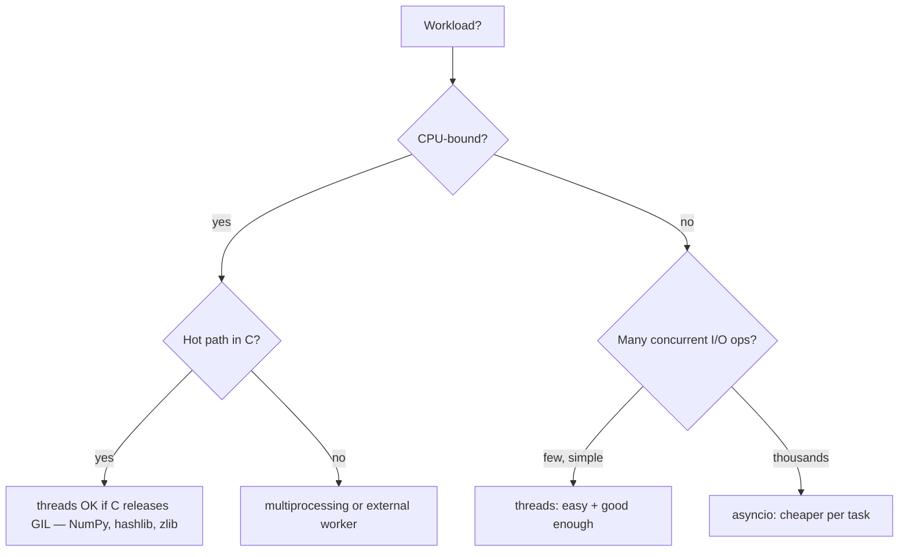
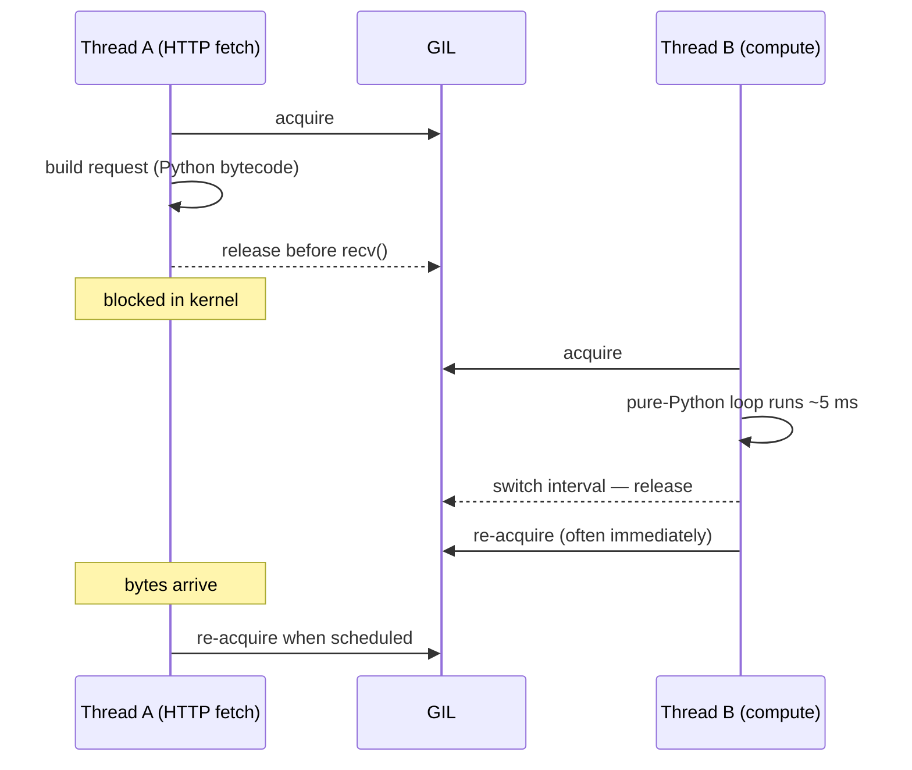

# Python GIL — what it actually does, and when threads still help

**Problem:** You write a Python program with 4 threads doing CPU-heavy math, expect a ~4× speedup on a 4-core machine, and instead see **the same wall time** — sometimes **slower**. Then your colleague writes the same program with 4 threads doing HTTP requests and gets a real **~4× speedup**. Same `threading` module, opposite outcome.

The thing in the middle is the **GIL** — the **Global Interpreter Lock**. Most candidates can say "GIL means Python doesn't use multiple cores," which is **the wrong sentence**. Interviewers want the **precise** version: what is locked, when it's released, and which workloads still benefit from threads.

**See also:** [asyncio — loop, tasks, cancellation](../python-asyncio/) for the cooperative-concurrency story (no preemption, no GIL contention because there's only one thread); [Context managers](../python-context-managers/) for `async with`.

## Mental model in one sentence

> The GIL is a **mutex around the CPython bytecode interpreter**. **Exactly one** thread can be **executing Python bytecode** at a time, **per process**.

Everything else follows from that:

- It's a property of **CPython** (the reference implementation), not the language. PyPy has one too. Jython and IronPython do not.
- It protects **interpreter internals** (refcounts on every object, dict resize during attribute lookup, GC bookkeeping). That's why removing it is a 20-year project.
- It is **released around blocking I/O and around C code that opts in**. That's the whole reason threads still help for I/O and for NumPy.

## The three concurrency shapes in CPython

This is the table interviewers are testing for. Memorize the rows.

| Shape | Parallelism | Memory | When it wins | When it loses |
|---|---|---|---|---|
| **`threading`** | Concurrent, **not parallel** for pure-Python CPU | Shared (one process) | I/O-bound: HTTP, disk, sockets, DB | CPU-bound pure Python — GIL serializes you |
| **`multiprocessing`** | **True parallel** (one GIL per process) | **Separate** — args are pickled | CPU-bound pure Python | Fork/spawn cost; can't share live objects; pickling constraints |
| **`asyncio`** | Cooperative, **single thread** | Shared, no preemption | Many concurrent I/O ops with low overhead per op | CPU work blocks the loop; library must be async |

The decision tree most interviewers want to hear:



## When the GIL is **released**

The GIL is not held continuously. CPython releases it in these cases:

1. **Blocking I/O syscalls** — `socket.recv`, `open`/`read`/`write`, `time.sleep`, `subprocess.wait`. The C wrapper releases the GIL **before** the syscall and re-acquires after.
2. **C extensions that opt in** — NumPy's vectorized ops, `hashlib`, `zlib`, image libraries. They use the `Py_BEGIN_ALLOW_THREADS` / `Py_END_ALLOW_THREADS` macros.
3. **Periodic check** — every ~5 ms in Python 3.2+ (the "switch interval", `sys.setswitchinterval`). The current thread yields so another runnable thread can grab the GIL. Before 3.2 it was every N **bytecode** instructions, which made tight C-loop-bound workloads bad citizens.

Note (1) is why threads work for I/O: while one thread is blocked in `recv`, the GIL is **not held**, so other threads execute Python freely.

## A two-thread trace



Two takeaways:

- Thread A's blocking I/O is **free** for Thread B — concurrency without parallelism.
- Two threads doing **pure-Python CPU work** are not on different cores; they are taking 5 ms turns on **one** core, plus paying lock-switching overhead. That's why CPU-bound threading is often **slower** than single-threaded.

## Worked example — threads vs processes for CPU work

```python
import time
from concurrent.futures import ThreadPoolExecutor, ProcessPoolExecutor


def cpu_work(n: int) -> int:
    s = 0
    for i in range(n):
        s += i * i
    return s


N = 20_000_000
JOBS = 4

if __name__ == "__main__":
    t0 = time.perf_counter()
    [cpu_work(N) for _ in range(JOBS)]
    print(f"sequential: {time.perf_counter() - t0:.2f}s")

    t0 = time.perf_counter()
    with ThreadPoolExecutor(max_workers=JOBS) as ex:
        list(ex.map(cpu_work, [N] * JOBS))
    print(f"threads:    {time.perf_counter() - t0:.2f}s")

    t0 = time.perf_counter()
    with ProcessPoolExecutor(max_workers=JOBS) as ex:
        list(ex.map(cpu_work, [N] * JOBS))
    print(f"processes:  {time.perf_counter() - t0:.2f}s")
```

Typical output on a 4-core laptop (CPython 3.12):

```text
sequential: 4.10s
threads:    4.35s   ← *slower* than sequential — GIL contention overhead
processes:  1.20s   ← real ~4× speedup, one GIL per process
```

The thread version is **slower than serial** because every 5 ms two threads fight for the GIL and pay context-switch cost for zero parallelism gain.

## Worked example — threads for I/O

```python
import time
import urllib.request
from concurrent.futures import ThreadPoolExecutor

URLS = ["https://httpbin.org/delay/1"] * 8

def fetch(u: str) -> int:
    with urllib.request.urlopen(u) as r:
        return len(r.read())

if __name__ == "__main__":
    t0 = time.perf_counter()
    [fetch(u) for u in URLS]
    print(f"sequential: {time.perf_counter() - t0:.2f}s")  # ~8s

    t0 = time.perf_counter()
    with ThreadPoolExecutor(max_workers=8) as ex:
        list(ex.map(fetch, URLS))
    print(f"threads:    {time.perf_counter() - t0:.2f}s")  # ~1s
```

Threads win cleanly here because each `urlopen` call **releases the GIL** while waiting on the socket. Eight requests overlap in the kernel; Python time on each is microseconds.

## The "atomic ops" footgun

A common mistake: "the GIL means I don't need locks because Python ops are atomic."

The truth is narrower: **single bytecodes** can't be torn by another thread, but the interpreter can — and does — **switch threads between any two bytecodes**. So almost any "operation" you'd write in source code is actually multiple bytecodes and is **not atomic**.

The pedagogically cleanest demo is `dis`:

```python
import dis

def inc(): counter += 1
dis.dis(inc)
```

```text
  1     RESUME              0
        LOAD_FAST           'counter'   ← read
        LOAD_CONST          1
        BINARY_OP           +           ← add
        STORE_FAST          'counter'   ← write
        ...
```

Three separate bytecodes. Thread A can run `LOAD_FAST` and lose the GIL on the switch interval before `STORE_FAST`; Thread B does its own load+add+store; Thread A resumes and overwrites. Lost update.

Same shape applies to:

```python
if k not in d:        # LOAD + CONTAINS_OP
    d[k] = expensive()  # ... CALL ... STORE_SUBSCR — anything in between can run
```

People also say `d[k] = v` and `list.append(x)` "are atomic in CPython". They typically are *today*, but `__hash__` and `__eq__` on the key can be **Python code** that itself can release the GIL — so don't rely on it. Use `threading.Lock`, `queue.Queue`, or `concurrent.futures` for any compound state. **The GIL protects the interpreter's internals, not your invariants.**

> **Common misconception:** "Only one thread runs Python, so my threads aren't on multiple cores at all." They *are* real OS threads on different cores; the GIL only serializes which one is currently executing **Python bytecode**. While Thread A is in a `recv` syscall on core 0, Thread B is genuinely running Python on core 1.

## What removes the GIL barrier (without removing the GIL)

If your hot path is in C, you usually don't need processes:

| Library / op | Releases GIL? | What you get |
|---|---|---|
| NumPy vectorized math (`np.dot`, `np.sum`, ufuncs over big arrays) | Yes | True multi-core via threads |
| Pandas operations backed by NumPy | Mostly yes | Same |
| `hashlib`, `zlib`, `bz2`, `lzma` (large buffers) | Yes | CPU work overlaps |
| Network / file I/O via stdlib | Yes (during the syscall) | The whole point of `threading` |
| Pure-Python `for` loops | **No** | Stuck behind GIL |

This is why "vectorize with NumPy" is not just a perf tip — it's also a **concurrency** tip.

## And the actual GIL removal — PEP 703 + subinterpreters

Two parallel efforts you should know by name:

- **PEP 703 — free-threaded build.** Python 3.13 ships an **experimental** `python3.13t` interpreter with the GIL removed. It uses biased reference counting plus per-object locking for dicts, and accepts a ~10% single-threaded slowdown for real multi-threaded CPython. **Opt-in**; most C extensions need recompilation.
- **PEP 684 / 734 — per-interpreter GIL + subinterpreters.** Python 3.12 made the GIL **per subinterpreter** instead of per process; 3.13 added a stdlib `interpreters` module. Each subinterpreter has its **own** GIL and runs in the same process, communicating by passing data through channels — closer to `multiprocessing` semantics but without fork/pickle cost. Still maturing; useful to mention as "the third option, between threads and processes".

Interview answer: "I know both exist, default CPython 3.13 still has the per-interpreter GIL on the main interpreter, plan code as if it does — but I'd watch the no-GIL build for CPU-bound services."

## Cross-language note

| Runtime | Equivalent? |
|---|---|
| **JavaScript** (V8, Node, browsers) | Single-threaded by design — no GIL because there's only one. Web Workers / `worker_threads` give you separate isolates with `postMessage`, like `multiprocessing`. |
| **C++** | True threads, no interpreter lock. You own correctness — `std::mutex`, atomics, memory orders. |
| **Java / C#** | True multi-threading. JIT plus a real memory model; `synchronized` / `lock` is your responsibility. |
| **Ruby (MRI)** | Has a GVL (Global VM Lock) — same shape as the GIL. JRuby and TruffleRuby don't. |

If an interviewer asks "is the GIL just because Python is interpreted?" — no. Java is interpreted-then-JITted and has no GIL. The GIL is a CPython implementation choice driven by the C API and per-object refcounting.

## Quick decision script (for whiteboarding)

> "Is the slow part **CPU** or **I/O**?
> If I/O → `threading` or `asyncio`, depending on how many concurrent ops.
> If CPU and the math is in **NumPy / a C extension** that releases the GIL → `threading` is fine.
> If CPU and **pure Python** → `multiprocessing`, or rewrite the hot path."

That sentence is most of the GIL conversation in a phone screen.

## Common interview questions

**1. "What does the GIL actually protect?"**
The CPython interpreter's internal state — most importantly the refcount on every Python object, plus shared structures like dict resizes and the GC. It's an implementation choice that lets the C API stay simple; without it, every refcount op would need an atomic.

**2. "If the GIL allows only one thread at a time, why does `threading` ever help?"**
Because the GIL is **released** during blocking I/O syscalls and by C extensions that opt in. While Thread A is in `recv` or running a NumPy op, Thread B can execute Python. So I/O-bound and NumPy-heavy workloads see real speedups; pure-Python CPU loops do not.

**3. "Threads vs processes vs asyncio — when each?"**
Threads when you have I/O-bound work and a synchronous library. Processes when you have CPU-bound pure-Python work and need actual parallelism. Asyncio when you have **many** concurrent I/O ops (thousands of sockets, websockets) and an async library — each OS thread costs ~1 MB of stack and a kernel context switch per wake, while an asyncio task is just a Python object and a coroutine frame, so 10k concurrent tasks is routine where 10k threads is not.

**4. "Does `threading.Lock` still matter under the GIL?"**
Yes. The GIL gives atomicity to **single bytecode** ops, but interpreters can switch threads **between** bytecodes. `counter += 1` is at least three ops (load, add, store) and is racy. Use `Lock`, `Queue`, or `concurrent.futures` for any compound state.

**5. "How would you make a pure-Python CPU loop use multiple cores?"**
First, try to push the hot loop into a library that releases the GIL — NumPy, Numba, Cython with `nogil`. If that's not possible, use `multiprocessing` (one GIL per process) or hand the work to a separate service. Inside one process, raw threads will not help.

**6. "What's the switch interval?"**
Default ~5 ms in Python 3.2+. After that interval, the running thread voluntarily releases the GIL so another runnable thread can take it. Configurable via `sys.setswitchinterval`. Before 3.2, the unit was every N bytecode instructions, which behaved poorly under tight C-bound contention — that history is "Python 3.2 GIL refactor".

**7. "Is the GIL going away?"**
Two efforts. PEP 703 ships a free-threaded build in 3.13 — opt-in, experimental. PEP 684 / 734 made the GIL per-subinterpreter in 3.12 and added a stdlib `interpreters` module in 3.13, which gives you in-process isolation without fork/pickle. Plan your code for the GIL today; structure it so that pushing CPU work into processes, subinterpreters, or vectorized C is straightforward, and you'll be fine when either matures.

**8. "Why doesn't Jython have a GIL?"**
It runs on the JVM, which provides a real threading and memory model and a different object model. The GIL exists to keep CPython's specific implementation (refcounting + a C extension API written assuming serialized execution) sane. Different runtime, different tradeoffs.

## See also

- [asyncio — loop, tasks, cancellation](../python-asyncio/) — the single-thread cooperative model; complements the GIL story
- [Python hub](../python/)
- [Iterators & generators](../iterators-and-generators/) — `yield` is also "cooperative" but isn't concurrent on its own
