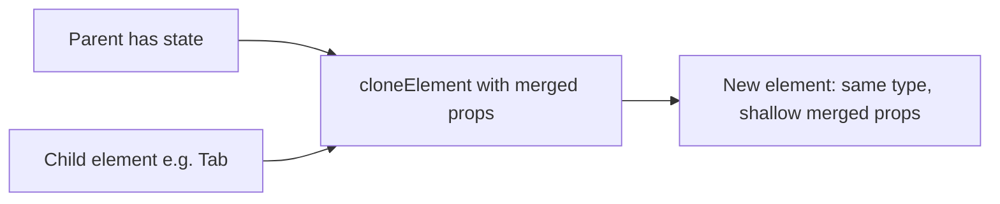

# `cloneElement` in React — when a parent decorates element children

**Problem:** A component receives **ready-made element children** (for example `<Tab />` instances) but still needs to pass **data and callbacks from above** — active index, selection handlers, or merged refs — **without** rewriting every child’s callsite or wrapping everything in an extra DOM node.

**`React.cloneElement(element, props?, ...children)`** returns a **new element** with the same `type` as `element`, **`props` shallow-merged** into the existing props (your keys win on conflict), and optional replacement children. It is the low-level **“patch props onto an existing element”** API.

**See also:** [JavaScript hub](../javascript/) — [interview syllabus — React patterns](../interview-syllabus/#react-library-patterns)

---

## When this pattern helps

- **Slot-style APIs** — Parent owns coordination state; children stay presentational (`Tab`, `Step`, `BreadcrumbItem`).
- **Avoid extra wrappers** — Inject `onClick` / `className` onto the **same** DOM/component node instead of `<span><Button /></span>` (layout, fewer nodes).
- **Libraries** that must support **unknown child types** but still attach behavior (with care around `ref` — see below).

---

## Mental model



1. **`Children.toArray(children)`** — Stable list when `children` is a mix of nodes; lets you attach an **index**.
2. **`isValidElement(node)`** — Skip `null`, booleans, strings if you only want to clone components.
3. **`cloneElement(child, { ... })`** — Adds/overrides props; **does not** deep-merge objects inside props (nested `style` would be replaced unless you merge manually).

---

## Whiteboard-sized example: tabs

Parent stores `activeIndex`. Each `Tab` only needs `label` at the callsite; `isSelected` and `onSelect` are **injected**.

```tsx
import {
  Children,
  cloneElement,
  isValidElement,
  useState,
  type ReactElement,
  type ReactNode,
} from "react";

type TabProps = {
  label: string;
  isSelected?: boolean;
  onSelect?: () => void;
};

function Tab({ label, isSelected, onSelect }: TabProps) {
  return (
    <button
      type="button"
      role="tab"
      aria-selected={!!isSelected}
      onClick={onSelect}
    >
      {label}
    </button>
  );
}

function Tabs({ children }: { children: ReactNode }) {
  const [activeIndex, setActiveIndex] = useState(0);
  const items = Children.toArray(children).filter(
    (c): c is ReactElement<TabProps> => isValidElement(c),
  );

  return (
    <div role="tablist" style={{ display: "flex", gap: 8 }}>
      {items.map((child, index) =>
        cloneElement(child, {
          key: child.key ?? String(index),
          isSelected: index === activeIndex,
          onSelect: () => setActiveIndex(index),
        }),
      )}
    </div>
  );
}
```

**Usage:**

```tsx
<Tabs>
  <Tab label="First" />
  <Tab label="Second" />
</Tabs>
```

**Production tabs** also wire `aria-controls`, `id`, keyboard focus, and **tab panels**; this snippet is the **prop-injection** slice interviews often ask about.

---

## Wrapping vs cloning

| Approach | Extra DOM? | Typical ref target |
|----------|------------|--------------------|
| **Wrapper** `<div onClick><Button /></div>` | Yes (the wrapper) | User ref on `Button` still hits `Button`; wrapper is a **second** node. |
| **`cloneElement`** on `Button` | No | Single tree node; you can **merge refs** if both parent and consumer need the same DOM handle. |

---

## Refs (interview footnote)

Refs are either an **object** (`useRef` → `.current`) or a **callback** `ref={node => ...}`. If you clone and **both** the library and the child need the same DOM node, you must **forward to both** (compose callbacks / assign `.current`). Many codebases use a small `mergeRefs` helper; see React docs on [callback refs](https://react.dev/reference/react-dom/components/common#ref-callback).

---

## When **not** to reach for `cloneElement`

- **Explicit composition** — `<Tabs tabs={[{ id, label }]} />` or `children` as a **render prop** / function often scales better and types more cleanly.
- **Shared data** — **Context** (or a small state library) when many deep descendants need the same thing.
- **You control one component** — Prefer passing props **normally** at the callsite instead of magic injection.
- **Performance sensitivity at scale** — Cloning many children every render is usually fine for small lists; for hot paths, a **data-driven** list (`map` over config) avoids repeated element cloning.

---

## Common interview questions

- **What does `cloneElement` do?**  
  Returns a new element with merged props (shallow); same `type`; optional new children.

- **Why use it instead of a wrapper?**  
  Fewer DOM nodes; direct-child layout (flex/grid); optionally one node for shared ref/focus behavior.

- **What are the pitfalls?**  
  Shallow merge only; easy to **fight** TypeScript on `children`; easy to **drop** user `ref` unless you merge; overuse makes data flow **implicit** compared to props or context.

- **`Children.map` vs `Children.toArray` + `map`?**  
  `Children.map` skips non-elements; **`toArray`** then `filter(isValidElement)` is a common explicit pattern when you need indices and typing.

- **Modern alternative?**  
  **Render props**, **context**, **explicit arrays of config**, or **composition** with documented props — cloneElement is still fair game where slot-style children are a deliberate API (some design systems and older patterns).

---

## Practice

- Extend the sample: controlled `value`/`onChange` from the parent, keyboard `ArrowLeft`/`ArrowRight`, and `role="tabpanel"` for content.
- React docs: [`cloneElement`](https://react.dev/reference/react/cloneElement), [`Children`](https://react.dev/reference/react/Children).
