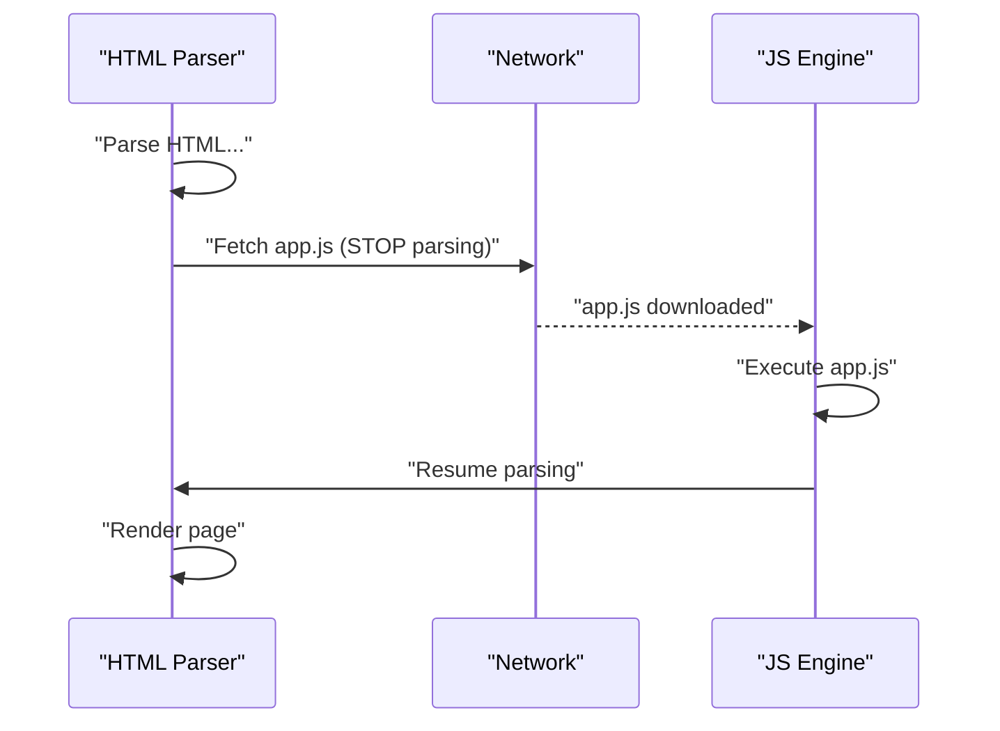
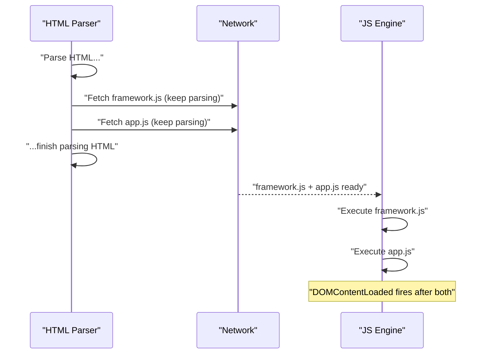
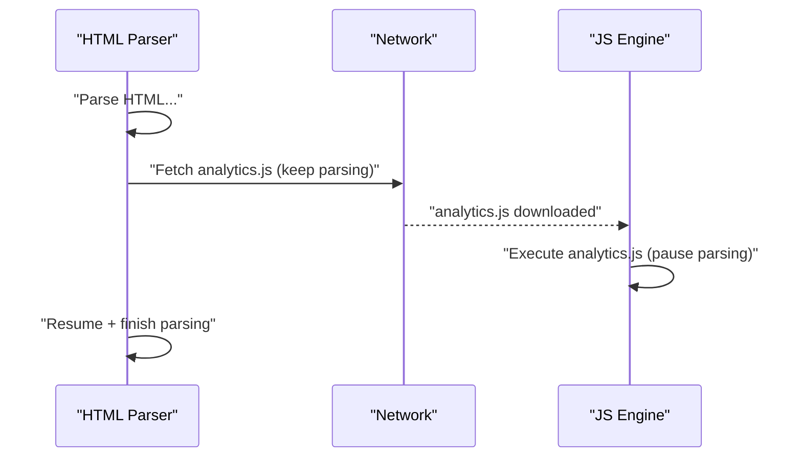

# Script loading — `defer`, `async` & `type="module"`

You need to understand script loading when you care about **page load performance**: a naively placed `<script>` tag can block the browser from rendering anything until the script has been downloaded and executed. `defer`, `async`, and ES modules each fix this differently — and each has different guarantees about **when** the script runs and **whether order is preserved**.

## The problem: render-blocking scripts

When the HTML parser hits a `<script src="...">` tag, it:

1. **Stops** parsing HTML
2. Downloads the script (network round-trip)
3. Executes the script
4. **Resumes** parsing

Nothing renders during steps 1–3. On a slow network or with large scripts, users stare at a blank page.

```html
<!-- Browser stops here — downloads, executes, then continues -->
<script src="app.js"></script>
<h1>Users never see this until app.js finishes</h1>
```



## The four loading strategies

| Strategy | Blocks parser? | Execution timing | Order preserved? |
|---|---|---|---|
| `<script src>` in `<head>` | ✅ Yes | Immediately on download | N/A |
| `<script>` at bottom of `<body>` | ❌ No (HTML already done) | After HTML parsed | N/A |
| `<script defer>` | ❌ No | After HTML fully parsed | ✅ Yes |
| `<script async>` | ❌ No (only pauses for exec) | As soon as downloaded | ❌ No |
| `<script type="module">` | ❌ No | After HTML fully parsed (defer default) | ✅ Yes |
| `<script type="module" async>` | ❌ No (only pauses for exec) | As soon as downloaded | ❌ No |

## `defer` — download in parallel, execute in order after parse

```html
<script defer src="framework.js"></script>
<script defer src="app.js"></script>
```



**Guarantees:**
- Download happens in parallel — parser never pauses
- Executes **only after** the HTML is fully parsed (DOM is complete)
- **Multiple deferred scripts run in source order** — `framework.js` always before `app.js`
- Executes just **before** `DOMContentLoaded` fires

**Use when:** your script needs the DOM, has dependencies on other scripts, or is your app's main bundle.

## `async` — download in parallel, execute immediately when ready

```html
<script async src="analytics.js"></script>
```



**Properties:**
- Download is parallel — no parse pause
- Executes **as soon as downloaded** — wherever that falls in the parse timeline
- **No ordering guarantee** — whichever downloads first runs first
- The parser only pauses during execution itself (unavoidable)

**Use when:** the script is self-contained and order-independent — analytics, A/B test injectors, chat widgets.

**Never use for:** your app bundle or anything that depends on other scripts.

## `type="module"` — the modern default

ES module scripts are **deferred by default**. You get all of `defer`'s loading behaviour plus:

- **Module scope** — top-level variables don't leak to `window`
- **`"use strict"` implicit** — no need to declare it
- **`import`/`export` syntax works** — the browser resolves the module graph

```html
<!-- These two have the same loading behaviour: -->
<script defer src="app.js"></script>
<script type="module" src="app.js"></script>

<!-- But the module also gets strict mode and its own scope -->
```

You can combine `type="module"` with `async` for a module that runs as soon as its graph is resolved, without waiting for parse to finish:

```html
<script type="module" async src="tracker.js"></script>
```

## Inline scripts — the gotcha

`defer` and `async` are **ignored on inline scripts** (there is nothing to download):

```html
<!-- defer has NO effect here — runs immediately -->
<script defer>
  console.log("runs right now, not deferred");
</script>

<!-- EXCEPTION: type="module" inline IS deferred by default -->
<script type="module">
  import { helper } from './lib.js'; // works — this is deferred
  console.log("runs after parse");
</script>
```

## "Bottom of body" vs `defer` — which wins?

"Put scripts at the bottom of `<body>`" is the classic workaround — by then, the HTML is already parsed, so there's no blocking. But `defer` is strictly better:

```html
<!-- Bottom-of-body: network fetch starts late (browser sees tag near end) -->
...lots of HTML...
<script src="app.js"></script>  <!-- fetch starts here -->
</body>

<!-- defer: fetch starts as soon as <head> is parsed, runs same time -->
<head>
  <script defer src="app.js"></script>  <!-- fetch starts HERE -->
</head>
```

With `defer`, the download starts **earlier**, so execution can finish sooner even though it waits for parse — parallel download hides the latency.

## `DOMContentLoaded` vs `load`

These two events are often confused:

- **`DOMContentLoaded`** — fires when HTML is parsed and all **deferred scripts** have executed. Stylesheets, images, and iframes are **not** waited for. This is when deferred scripts and module scripts have run.
- **`load`** — fires when **all resources** (images, stylesheets, subframes) are fully loaded. Fires later.

```js
// Rarely needed in modern code that uses defer or modules:
document.addEventListener('DOMContentLoaded', () => {
  // DOM is ready, deferred scripts have run
});

window.addEventListener('load', () => {
  // Everything including images is loaded
});
```

In practice: if your script uses `defer` or `type="module"`, the DOM is already ready when it runs — no listener needed.

## `<link rel="preload">` — hints vs execution

A common confusion: `preload` and `defer`/`async` solve **different halves** of the problem.

```html
<!-- Preload hints the browser to fetch early — but does NOT execute -->
<link rel="preload" href="app.js" as="script">

<!-- Still need a <script> tag to actually run it -->
<script defer src="app.js"></script>
```

Use `preload` for **critical scripts** you want the browser to prioritize during resource discovery (e.g., the main bundle), combined with `defer` for controlled execution timing.

## Worked example — execution order quiz

```html
<script>console.log('A')</script>                  <!-- inline -->
<script defer src="b.js"></script>                  <!-- b.js logs 'B' -->
<script async src="c.js"></script>                  <!-- c.js logs 'C', tiny & fast -->
<script type="module">console.log('D')</script>     <!-- inline module -->
```

Assuming `c.js` downloads before parse finishes:

**Order: A → C → B → D**

- **A** — inline, runs immediately (blocks parser briefly)
- **C** — async, downloaded before parse done, runs immediately on arrival
- **B** — deferred, waits for full parse, first in defer queue (source order)
- **D** — inline module (deferred by default), second in defer queue (source order)

## Common interview questions

### What's the difference between `defer` and `async`?

Both download in parallel without blocking the parser. **`defer`** runs after the full HTML is parsed, in source order. **`async`** runs as soon as downloaded, with no order guarantee. Use `defer` for your app; `async` for independent third-party scripts.

### Why not just put scripts at the bottom of `<body>`?

It avoids blocking but starts the download **later** — the browser only discovers the script when it parses that far down. `defer` in `<head>` starts the download immediately while the rest of HTML parses, so execution happens just as early but the fetch is more parallel.

### Does `defer` guarantee the DOM is ready?

Yes. A deferred script runs only after the full HTML is parsed — `document.querySelector` and friends work without any `DOMContentLoaded` listener.

### Can you `defer` an inline script?

No — `defer` and `async` are silently ignored on inline scripts (nothing to download). The exception: `type="module"` inline is always deferred.

### What does `type="module"` add over `defer`?

Same loading behaviour, plus: **module scope** (no `window` leakage), **strict mode** implicit, and **`import`/`export`** syntax. Vite, Rollup, and modern bundlers output `type="module"` scripts by default.

### When does `DOMContentLoaded` fire relative to deferred scripts?

Deferred scripts (and module scripts) execute **just before** `DOMContentLoaded` fires. `load` fires much later, after images and stylesheets.

### Failure modes / gotchas

| Mistake | Effect |
|---|---|
| `async` on a script that imports from another `async` script | Race condition — dependency may not be ready |
| `defer` on an inline script | Silently ignored — runs immediately |
| Assuming `async` preserves order | It doesn't — test on slow network to see the chaos |
| Using `DOMContentLoaded` in a deferred script | Redundant — DOM is already ready when the script runs |
| `<link rel="preload">` without a matching `<script>` | Browser fetches the file then discards it (wasted bytes) |

## See also

- [Event loop, microtasks & real-time UIs](/topics/browser-event-loop/) — once scripts execute, this is the runtime model they live in
- [Frame pipeline — `rAF`, `rIC` & `useLayoutEffect`](/topics/browser-frame-pipeline/) — scheduling work after scripts have run
- [JavaScript hub](/topics/javascript/) — all JS topics
