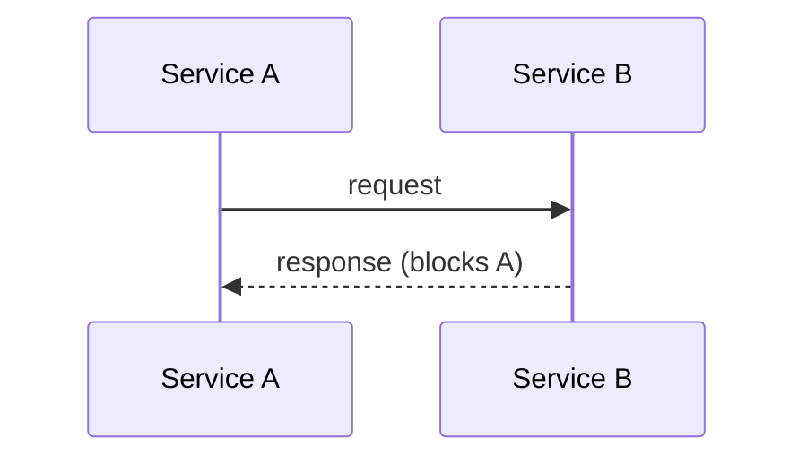
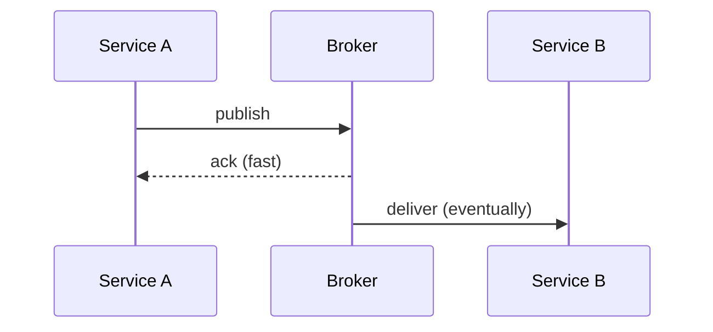
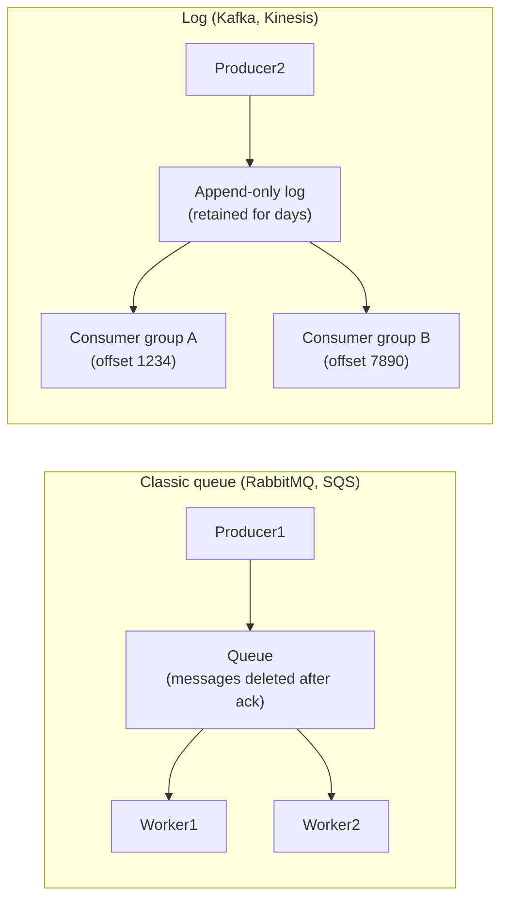
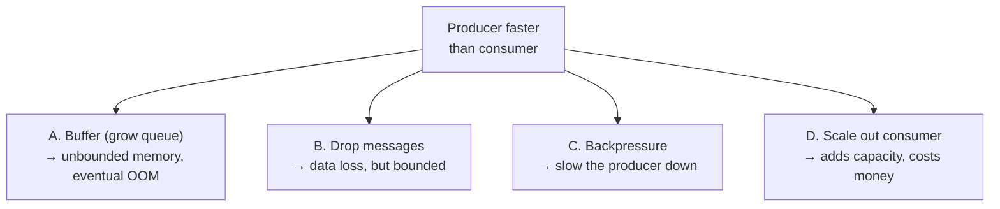
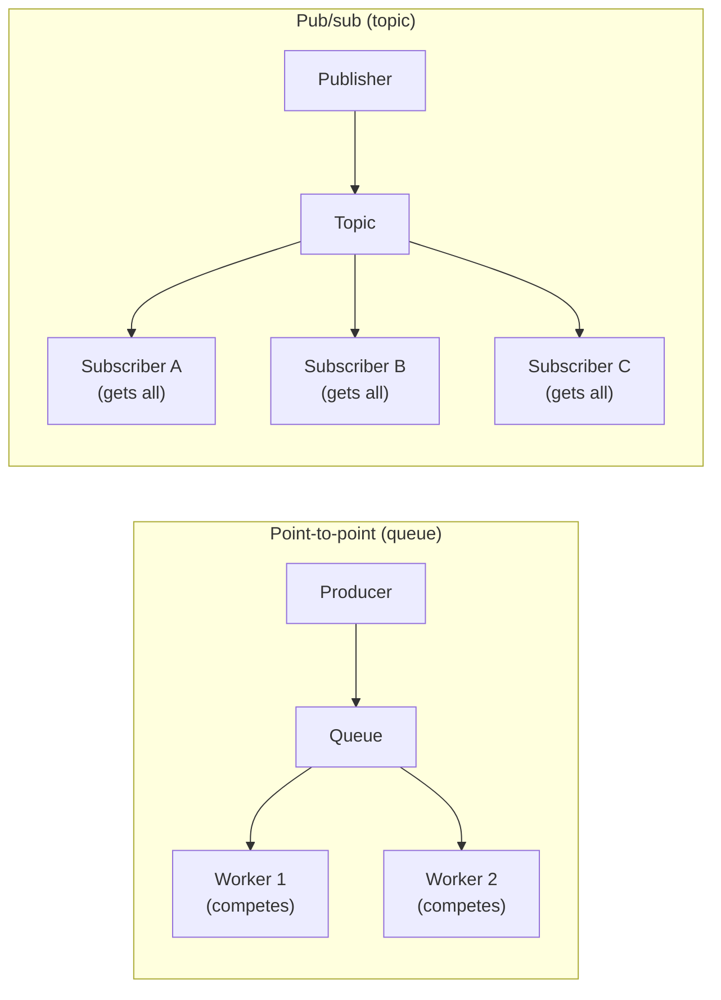
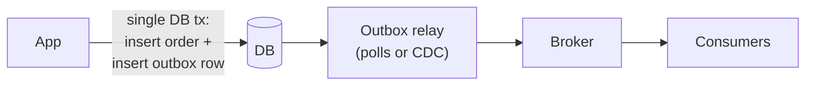
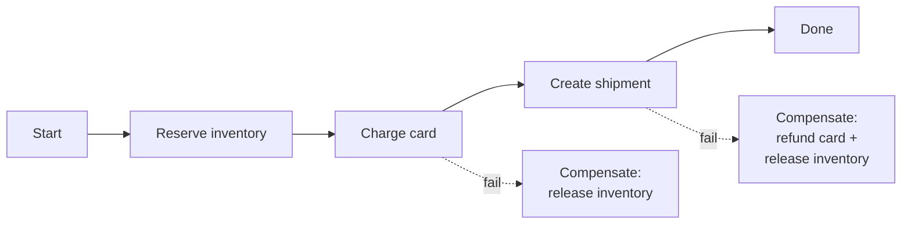
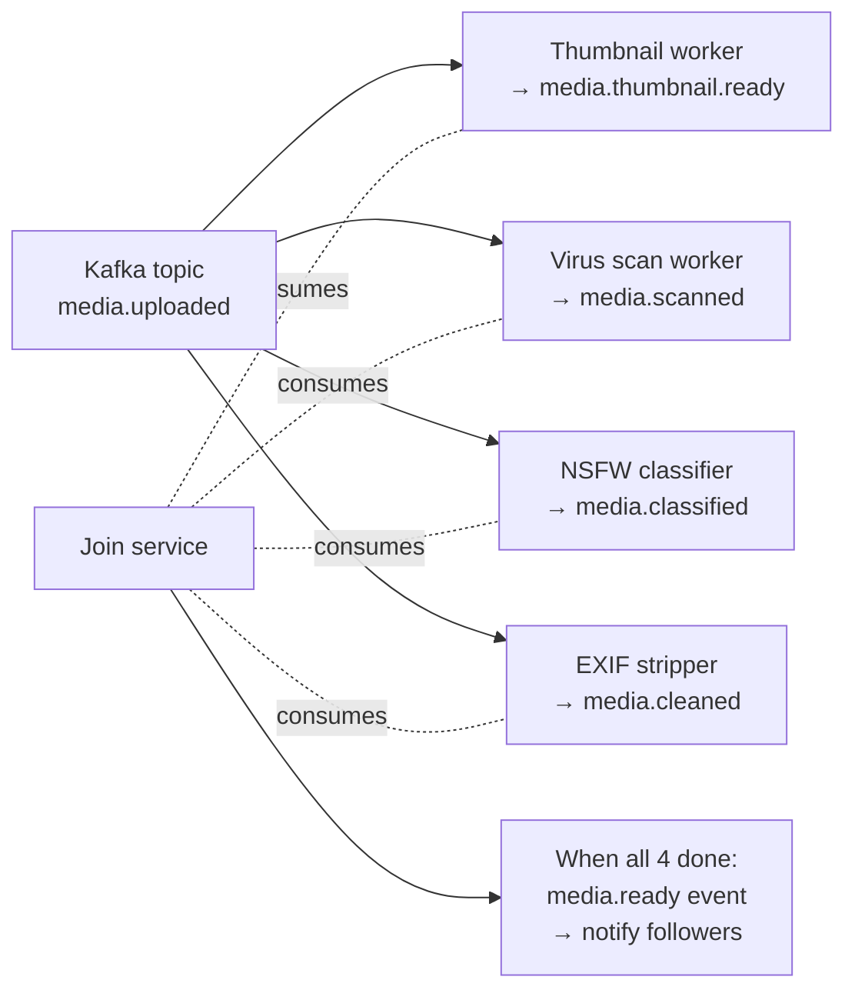

# Beat 4 — Async, messaging & decoupling

> Series: [System design tradeoffs](../system-design-tradeoffs/) · Prev: [Beat 3 — Caching](../system-design-caching/) · Next: [Beat 5 — Reliability](../system-design-reliability/)

## The problem

Every distributed system eventually faces the same question: when service A produces work for service B, do they talk **synchronously** (RPC/HTTP, A waits for B) or **asynchronously** (queue/log, A drops a message and moves on)?

Get this wrong and you get cascading failures (sync everywhere — one slow service takes down the world), or unbounded debugging (async everywhere — where did my message go?). Principal-level fluency means you can name:

1. **Sync vs async** as a deliberate decision per call, not a religion.
2. **Queue vs log** — different systems for different access patterns.
3. **Delivery semantics** — at-most-once, at-least-once, "exactly-once" — and why exactly-once is mostly a lie without idempotency.
4. **Backpressure** — the only correct answer when producer > consumer for sustained periods.
5. **Pub/sub vs point-to-point** topology.
6. **Outbox / CDC** for transactional message publishing.

This page pairs with [Distributed message queues](../distributed-message-queues/) (broker internals) and [Delivery semantics & idempotency](../distributed-delivery-and-idempotency/) (the dedup story).

---

## 1. Sync vs async — the per-call decision

### Sync (RPC, HTTP)



- **Pros:** simple mental model, immediate result, errors propagate naturally.
- **Cons:** **temporal coupling** (A and B must both be up), **latency coupling** (A is as slow as B), **failure coupling** (B's outage = A's outage).

### Async (queue / log / event bus)



- **Pros:** A is decoupled from B's availability, latency, and capacity. B can be down for an hour and A keeps shipping.
- **Cons:** complexity (broker is now critical infra), debugging (where is my message?), no immediate result, ordering and dedup become your problem.

### When to pick which

| Use sync when... | Use async when... |
|------------------|-------------------|
| The user is waiting for the result. | The user just needs an acknowledgement. |
| You need the result to continue. | The downstream work can fail and retry. |
| Latency budget is tight (< 100ms). | Latency budget is loose (seconds, minutes, hours). |
| Volume is moderate, spiky-but-bounded. | Volume is bursty and you need to absorb spikes. |
| Errors must propagate to caller. | Errors are handled by ops/dead-letter, not the caller. |

### The "checkout" worked example

User clicks "Place Order." What's sync, what's async?

| Step | Sync or async? | Why |
|------|-----------------|-----|
| Validate cart | sync | User must see error immediately. |
| Authorize payment | sync | Need success/fail to show user. |
| Reserve inventory | sync (with timeout) | Must confirm before promising. |
| Create order record | sync | Need order ID for the receipt page. |
| **Send confirmation email** | **async** | Slow, can retry, user doesn't wait. |
| **Update warehouse system** | **async** | Eventual is fine. |
| **Update analytics** | **async** | Loss-tolerant, batched. |
| **Recalculate recommendations** | **async** | Minutes are fine. |

**Principal move:** the sync part is the **smallest path that can fail safely**. Everything else is async. This pattern is sometimes called **"transactional core, eventual edges."**

---

## 2. Queue vs log — different beasts

People say "queue" for both. They're different.



| Axis | Classic queue | Log |
|------|---------------|-----|
| Retention | Until ack/delete | Time-based (e.g. 7 days) regardless of consumption |
| Replay | No (gone after ack) | Yes (rewind by offset / time) |
| Multiple consumers | Competing (one wins per message) | Independent groups, all see all messages |
| Ordering | Per-queue, often best-effort | Strict per-partition |
| Throughput | Tens of thousands msg/s | Millions msg/s (sequential disk I/O) |
| Mental model | Work queue / job board | Distributed commit log |
| Examples | RabbitMQ, SQS, ActiveMQ | Kafka, Kinesis, Pulsar (log mode), Redis Streams |

### When you want a queue

- **Job processing**: send email, resize image, charge card. Each message handled once by some worker.
- **Per-message routing** with rich semantics (priority, delay, TTL).
- **Variable handling time** is fine — workers compete, slow message blocks one worker.

### When you want a log

- **Event sourcing** — the log *is* the history.
- **Multiple downstream consumers** with different processing needs (search index, analytics, notifications) all reading the same events.
- **Replay** for backfills, debugging, or new consumers joining.
- **Partitioned ordering** by some key (e.g. all events for `user_id=42` go to one partition, processed in order).

### The hybrid

Modern stacks often use **Kafka as the log** + **per-consumer queues** when fan-out + queue semantics are needed. Or **Pulsar**, which exposes both modes.

---

## 3. Delivery semantics — and why "exactly-once" is a lie

### The three options

| Semantic | Guarantee | Failure case |
|----------|-----------|--------------|
| **At-most-once** | Each message delivered ≤ 1 time. | Message can be **lost**. |
| **At-least-once** | Each message delivered ≥ 1 time. | Message can be **duplicated**. |
| **Exactly-once** | Each message processed exactly 1 time. | "Doesn't really exist" — see below. |

### Why exactly-once is hard

Consider:

```
Consumer reads message → does work → acks message
```

If the consumer crashes **after** doing the work but **before** acking, the broker re-delivers (so the work happens twice). If it acks before doing the work, a crash loses the work. There is no atomic "do the work AND ack" across two systems.

Kafka's "exactly-once semantics" (EOS) works **only inside Kafka** (transactional writes from Kafka → Kafka). The moment your work touches another system (DB, HTTP API, file), you're back to at-least-once + idempotency.

### The Principal answer

> "I'll design for **at-least-once + idempotent consumers**. That's the only honest exactly-once. The consumer either uses an idempotency key the broker provides (Kafka offset, message ID), or computes one from the payload, and dedupes against a store before acting. For Kafka → Kafka pipelines I can use EOS for the in-cluster path."

See [Delivery semantics & idempotency](../distributed-delivery-and-idempotency/) for the deeper page.

### The dedup table pattern

```python
def handle(message):
    key = message.id  # unique per logical event
    with db.transaction():
        if db.exists("processed", key):
            return  # already processed; safely no-op
        db.insert("processed", key, ttl=7days)
        do_work(message)
    broker.ack(message)
```

- The transaction makes the "check + insert + work" atomic with respect to the DB.
- The TTL bounds the dedup table size (assumes broker retention < TTL so duplicates can't outlive the entry).

---

## 4. Backpressure — the only correct answer when overloaded

When a producer outpaces a consumer, you have four choices:



**A is wrong** in the limit (no system has infinite memory). **B, C, D are right** depending on the workload.

### Backpressure mechanisms

- **TCP** has it built in (sliding window).
- **HTTP/2** has it (stream-level windows).
- **Reactive Streams** (RxJava, Project Reactor) make it explicit (`request(n)`).
- **Kafka** has it via consumer lag and producer `linger.ms` / `max.in.flight.requests`.
- **Application-level**: bounded queues with `put` that blocks (or returns `false`).

### Drop policies (when backpressure isn't acceptable)

If you can't slow the producer (e.g., a stock tick feed), pick a drop policy:

- **Drop oldest** (head): keeps freshest data — good for tickers, telemetry.
- **Drop newest** (tail): keeps in-progress work — good for jobs.
- **Drop sampled** (every Nth): keeps coverage — good for logs.
- **Conflate** (collapse adjacent updates for the same key into one) — see [stock fan-out](../system-design-stock-notifications/#8-deep-dive-backpressure-and-conflation).

### The interview phrase

> "Unbounded buffers are a bug. Either I propagate backpressure to the producer, or I drop with an explicit policy and a metric for it."

---

## 5. Pub/sub vs point-to-point



| | Point-to-point | Pub/sub |
|--|----------------|---------|
| Each message goes to | One worker (competes) | All subscribers |
| Use for | Work distribution | Event broadcast / fan-out |
| Examples | SQS, RabbitMQ work queue | Kafka topics, SNS, Google Pub/Sub |

Many brokers do both: Kafka's "consumer groups" — within a group, partitions are point-to-point (one consumer per partition); across groups, it's pub/sub (each group sees everything).

---

## 6. The outbox pattern — transactional publishing

The classic bug:

```python
def place_order(order):
    db.insert(order)              # 1
    broker.publish("order.placed", order)  # 2
```

If step 1 commits but step 2 fails (network blip), you have an order with no event. If step 2 succeeds but step 1 rolls back, you have a phantom event. **You cannot atomically commit a DB transaction and a broker publish.**

### Outbox pattern



The "outbox" is a table in the **same DB** as the business data. The transaction inserts into both. A separate process tails the outbox and publishes — at-least-once, with retries.

### CDC (Change Data Capture) variant

Use the DB's WAL/binlog directly (Debezium, Kafka Connect). The DB itself becomes the durable log; consumers see every committed change. No outbox table needed, but you're now coupled to the DB's replication protocol.

---

## 7. Saga pattern — when 2PC isn't an option

If a workflow spans multiple services (each with its own DB), you can't use 2PC at scale. Use **sagas**: a sequence of local transactions where each step has a **compensating action**.



Two flavors:

- **Choreography** — each step publishes an event, the next step listens. No central coordinator. Simple, but logic is spread across services.
- **Orchestration** — a central workflow engine (Temporal, Step Functions, Cadence) drives the saga. Easier to debug, more infra.

For Principal-level: **prefer orchestration** for complex workflows. The "where are we?" answer must be obvious from one place.

More on this in [Beat 6 — Coordination](../system-design-coordination/).

---

## 8. Worked example — async pipeline for "image upload"

**Problem:** user uploads photo. We need: thumbnail, NSFW scan, virus scan, EXIF strip, store original, notify followers.

**Sync part** (must complete before user sees "uploaded"):

1. Auth + size/type check.
2. Stream to S3 (returns a URL).
3. Insert `media` row with status=`uploaded`.
4. Publish `media.uploaded` event to Kafka.
5. Return 200 to user.

**Async pipeline** (consumers of `media.uploaded`):



**Tradeoffs called out:**

- **Why Kafka?** Multiple consumers, replay (re-run NSFW with a new model), durable buffer.
- **Idempotency:** each worker keys on `media_id` and skips if already processed.
- **Backpressure:** consumer lag is the SLI; if it grows, autoscale workers or shed load by dropping low-priority pipelines.
- **Saga compensation:** if virus scan fails, mark media `quarantined` and notify user.
- **Failure isolation:** thumbnail worker dying doesn't stop NSFW scanning.

**What I'd say in the room:** "Sync path is < 200ms (just S3 + DB + publish). Async path is best-effort minutes. The user sees 'processing' for a few seconds while consumers complete. If a consumer is down for an hour, Kafka holds the events and the system catches up — no data loss."

---

## Common interview questions

### Q: "When do you reach for a queue?"

> "When the work doesn't need to be done in the request path, when I want to absorb spikes the downstream can't handle, when failures should be retried without affecting the caller, or when multiple consumers need the same data. The sync path should be the smallest set of steps that *must* succeed for the user; everything else is async."

### Q: "Kafka or RabbitMQ?"

> "Kafka if I need durable replay, fan-out to multiple independent consumer groups, ordered partitioning, or > 100k msg/s. RabbitMQ if I need rich routing semantics (per-message TTL, priority queues, dead-letter exchanges), small-volume work distribution, or RPC-style request/reply with reply queues. They're different tools — Kafka is a log, RabbitMQ is a queue. I've seen teams pick Kafka because it's trendy and then implement queue semantics on top, badly."

### Q: "Walk me through exactly-once."

> "Exactly-once delivery across systems doesn't really exist — it's at-least-once delivery plus idempotent processing. Kafka has 'EOS' for Kafka-to-Kafka transactions inside a cluster, but the moment a consumer writes to an external DB or calls an HTTP API, you're back to at-least-once. So I design consumers to be idempotent: a dedup key per logical event, stored alongside the side effect in the same transaction. This gives me 'effectively exactly-once' from the user's perspective."

### Q: "How do you handle a slow consumer?"

> "First, identify which: a single bad consumer or sustained producer > consumer? For a single bad one, isolate it — its lag shouldn't affect others. For sustained: scale out partitions/workers, find the bottleneck (DB? GC? external API?), or shed load with a drop policy. Long-term, ensure backpressure propagates: Kafka exposes lag as a metric and that's an SLI for me. Unbounded queues are an outage waiting to happen."

### Q: "What's the outbox pattern?"

> "It solves the dual-write problem: you can't atomically commit a DB row and publish to a broker. The outbox writes both the business row and an 'outbox' row in the same DB transaction. A separate relay tails the outbox and publishes to the broker, with retries. The broker delivery is at-least-once, so consumers must be idempotent. CDC via the DB's binlog/WAL is a variant that skips the outbox table at the cost of coupling to DB-specific replication."

### Q: "How do you guarantee message ordering?"

> "Within a Kafka partition, messages are strictly ordered by offset. So I shard by an ordering key — `user_id` or `account_id` — and all events for that key go to one partition. Cross-partition ordering doesn't exist; if you need it, you have one partition (which doesn't scale) or you accept causal ordering and reconstruct via timestamps + dedup. RabbitMQ queues are ordered per queue, but with multiple consumers competing, processing order is racy — you have to use a single consumer to preserve it."

### Q: "What's a dead-letter queue?"

> "A queue (or topic) that receives messages a consumer couldn't process after N retries. Critical: without it, poison messages block your queue forever or get retried infinitely. With it, you isolate failures, alert ops, and can replay after a fix. Always set a max retry count, always have a DLQ, always have a dashboard for it. A growing DLQ is a P1."

### Q: "Sync vs async fan-out — when do you pick which?"

> "Sync fan-out (request multiple downstreams in parallel and wait) makes sense when you need *all* responses for the user (e.g., search aggregator) and the latency budget allows it. Async fan-out (publish event, downstreams consume independently) makes sense when responses don't need to be merged for the user, or when downstreams have different SLAs. Hybrid: sync for what the user sees, async for everything else."

### Q: "How do you bound a Kafka topic's growth?"

> "Two retention policies: time-based (delete after N days) or size-based (keep last N GB per partition). For event sourcing with replay needs, longer retention. For pure transport, shorter. Compacted topics keep only the latest value per key — useful for snapshots and reference data. Whichever you pick, monitor disk and have a plan when you blow past — you can't always just add storage on a live cluster."

---

## See also

- Next: [**Beat 5 — Reliability & failure**](../system-design-reliability/)
- Prev: [Beat 3 — Caching](../system-design-caching/)
- [Distributed message queues](../distributed-message-queues/) — broker internals, partitions, ISR.
- [Delivery semantics & idempotency](../distributed-delivery-and-idempotency/) — the dedup story in depth.
- [Stock price fan-out walkthrough](../system-design-stock-notifications/) — backpressure & conflation in a real design.
