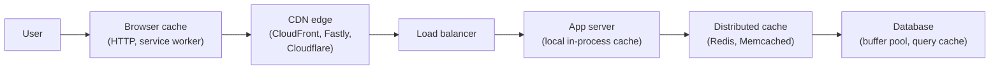
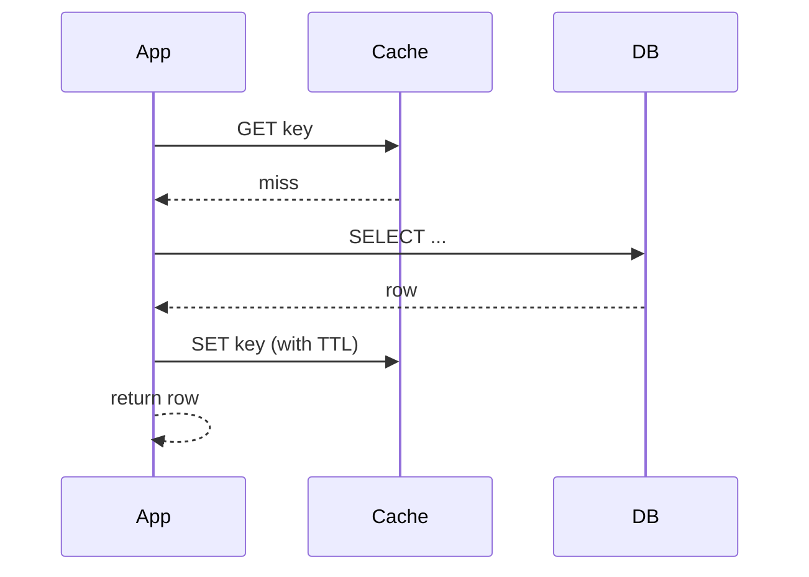
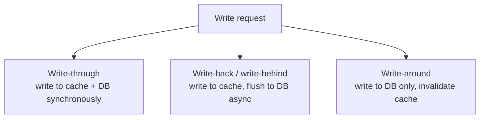
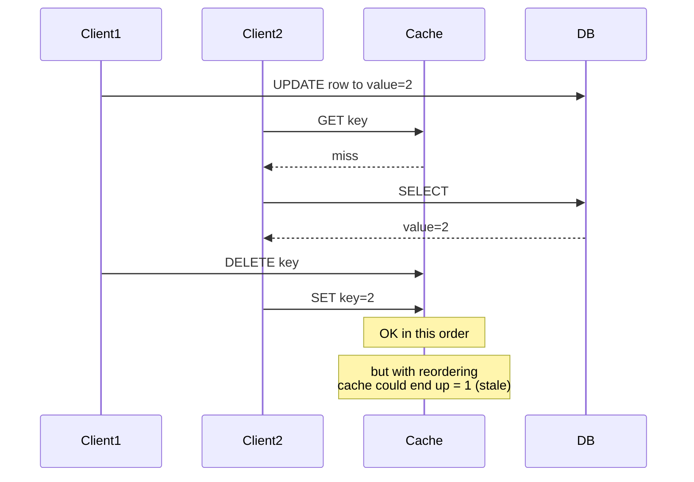
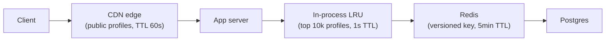

# Beat 3 — Caching & performance

> Series: [System design tradeoffs](../system-design-tradeoffs/) · Prev: [Beat 2 — Data & storage](../system-design-data-storage/) · Next: [Beat 4 — Async messaging](../system-design-async-messaging/)

## The problem

Caching is the cheapest performance tool in your kit and the most common source of subtle bugs. The naive view — "stick a Redis in front of Postgres" — works until it doesn't, and then you're debugging stampedes, stale reads, hot keys, and inconsistencies under load.

Principal-level fluency means you can name:

1. **Where** the cache lives (browser, CDN, edge, app, distributed, DB-internal).
2. **Which strategy** writes go through (cache-aside, write-through, write-back, write-around).
3. **How** entries expire (TTL, LRU, explicit invalidation, version-keyed).
4. **What goes wrong under load** (thundering herd, hot keys, cache penetration, cache stampede).
5. **The cost / hit-rate tradeoff** — caching only pays if hit rate is high enough.

> "There are only two hard things in computer science: cache invalidation and naming things." — Phil Karlton.

That joke is funny because it's true. Get the strategy right *before* you reach for Redis.

---

## 1. The cache hierarchy



The Principal habit: **the right cache layer is the one closest to the user that's still safe.** A 1 KB asset cached in the browser for 10 minutes is infinitely cheaper than the same asset cached in Redis. Don't reach for Redis when you could set `Cache-Control: max-age=600`.

### What lives where

| Layer | Best for | Hit ratio that justifies it |
|-------|----------|-----------------------------|
| **Browser** | User-specific static assets, immutable resources hashed in the URL. | Anything > 0% — it's free. |
| **CDN** | Public content, large objects, low cardinality. | > 50% typically. |
| **App-local (in-process)** | Tiny hot keys, config, feature flags. Sub-µs. | > 90%. |
| **Distributed cache (Redis)** | Shared hot data across many app servers. | > 70% to be worth the network hop. |
| **Database buffer pool** | Always on. You don't manage this — sizing your DB does. | n/a |

---

## 2. Cache strategies — read paths

### Cache-aside (lazy loading) — the default

The app **reads** from cache, falls back to DB on miss, and writes back into cache.



- **Pros:** simple, app controls everything, cache never has stale data the DB doesn't.
- **Cons:** every miss is a DB hit + a cache write. Vulnerable to **stampedes** — N concurrent misses for the same key all hit DB.
- **Where:** the most common pattern. Default unless you have a reason.

### Read-through

The cache itself loads from the DB on miss (you treat the cache as the data source).

- **Pros:** app code is simple — just `cache.get(key)`.
- **Cons:** the cache library/client must know how to load. Less common.
- **Where:** Hibernate L2 cache, Apache Ignite, some ORMs.

---

## 3. Cache strategies — write paths



| Strategy | Latency | Durability | Consistency | Use when |
|----------|---------|------------|-------------|----------|
| **Write-through** | Slow (two writes) | Strong (DB always has it) | Cache always fresh | Read-after-write, tolerable write latency. |
| **Write-back** | Fast (only cache) | **Risky** (cache crash = lost writes) | Strong on local, eventual to DB | Counters, metrics where loss is acceptable. |
| **Write-around** | Normal | Strong | Cache may be stale until invalidation propagates | Write-once, read-rarely (logs). |

### Worked example: a "view counter" — which strategy?

- **Write-through** to Redis + Postgres: every page view is a Postgres write. Postgres dies at 10k writes/sec. **No good.**
- **Write-back**: increment Redis on every view, flush to Postgres every 10 seconds. Postgres sees 1 write per (page, 10s) instead of millions. **Good** — accept the data loss window if Redis crashes.
- **Hybrid:** write to Kafka (durable buffer), aggregate, then bulk-update Postgres. **Best for production** — you don't lose data and Postgres still gets bulk writes.

---

## 4. Invalidation — the hard problem

### TTL — the cheapest tool

```python
cache.set(key, value, ttl=300)  # expire in 5 minutes
```

- **Pros:** zero coordination. Bounded staleness.
- **Cons:** unnecessarily refetches data that didn't change. Doesn't help when freshness matters more than the TTL allows.

### Explicit invalidation

```python
db.update(...)
cache.delete(key)  # or cache.set(key, new_value)
```

- **Pros:** tight freshness.
- **Cons:** **race condition** — what if cache is read between the DB update and the invalidation? Or what if the invalidation message is lost?

### Version-keyed (the safest pattern)

Embed a version into the key. Updating the version *is* the invalidation; old keys age out via LRU.

```python
key = f"user:{user_id}:v{user.version}"   # bump version on update
cache.set(key, value, ttl=86400)
```

- **Pros:** no race conditions; safe with multi-region; cheap reads.
- **Cons:** old keys linger until evicted (memory cost).

### CDN purge

CDN invalidation is **eventually consistent across edges** and slow (seconds to minutes). For sub-second freshness, version your URLs (`/style.abc123.css`) and just deploy new ones.

### The two-DB-update problem



The fix: **delete after the DB write** (not "set"), so a concurrent reader will fetch fresh from DB. Or use **version-keyed** keys to dodge the race entirely.

---

## 5. Eviction policies

When the cache is full, something has to go.

| Policy | What it evicts | Best for |
|--------|----------------|----------|
| **LRU** (least recently used) | Oldest accessed | General-purpose, default. |
| **LFU** (least frequently used) | Least often accessed | Workloads with stable hot keys. |
| **FIFO** | Oldest inserted | Simple, rarely the best. |
| **TTL only** | Expired entries | Time-bounded validity. |
| **TinyLFU / W-TinyLFU** | Hybrid: admission filter + LFU | High hit rates with small memory (used by Caffeine). |
| **Random** | Yep, random | Simple, surprisingly competitive. |

**Redis specifics:** `allkeys-lru`, `allkeys-lfu`, `volatile-ttl`, `noeviction`, `allkeys-random`. Pick **`allkeys-lru`** unless you have a specific reason.

---

## 6. The four cache failure modes

### A. Thundering herd / stampede

A hot key expires. 10,000 requests miss simultaneously, all hit the DB, DB melts.

**Fixes:**
1. **Single-flight / request coalescing** — in-process lock so only one DB call happens; others wait.
2. **Probabilistic early expiration** — refresh keys *before* TTL with probability `f(t)`. Spreads refreshes.
3. **Stale-while-revalidate** — serve stale value while a background task refreshes.
4. **Locking in the cache itself** — Redis `SETNX` lock; only the lock-holder hits DB.

```python
# probabilistic early expiration (XFetch / Redis "anti-stampede")
def get(key):
    val, expiry, delta = cache.get_with_metadata(key)
    if val is None or now() - delta * beta * log(rand()) >= expiry:
        val = db.fetch(key)
        cache.set(key, val, ttl=ttl, delta=time_to_recompute)
    return val
```

### B. Hot key

One key (Justin Bieber's profile) gets 10x the traffic of any other. The Redis shard holding it saturates.

**Fixes:**
- **Replicate** the hot key to multiple Redis shards (read from a random replica).
- **Local in-process cache** in front of Redis for the hottest keys.
- **Splitting** the value (counter sharding: write to `counter:bieber:0..15`, read by summing).

### C. Cache penetration

Requests for **keys that don't exist** bypass the cache and hit the DB on every call (a malicious actor or a bug enumerating IDs).

**Fixes:**
- **Cache the negative** (`SET key=null TTL=60`).
- **Bloom filter** in front of the cache to reject IDs that definitely don't exist.

### D. Cache avalanche

Many keys expire at the same time (e.g., bulk-loaded with the same TTL), all miss together.

**Fix:** **TTL jitter** — `ttl = base_ttl + random(0, jitter)`. Spreads expirations.

---

## 7. CDN / edge

CDNs are caches with two extra dimensions: **geographic distribution** and **public-internet egress savings**.

### What goes on a CDN

- Immutable assets (CSS, JS, images, video). Cache forever, version the URL.
- Public API responses with short TTLs (seconds to minutes).
- Static HTML for marketing pages.

### What does NOT go on a CDN

- Personalized responses (unless your CDN supports per-user cache keys, which is expensive).
- Real-time data.
- Anything with auth that varies the response.

### Cache key design at the CDN

A cache key is `URL + Vary headers + cookies you opt in`. The mistake: forgetting that `Cookie:` is part of the key by default and getting **0% hit rate** because each user has unique cookies. Strip cookies on cacheable routes.

### Edge compute

Cloudflare Workers, Lambda@Edge, Fastly Compute@Edge — run code at the CDN POP. Useful for:

- A/B test routing without a round trip to origin.
- Auth checks at the edge.
- Header rewriting, geolocation, bot mitigation.

The cost: edge compute is more expensive per ms than a beefy app server. Use for short, high-value logic only.

---

## 8. The hit-rate / cost equation

Cache only pays if the hit rate makes the math work.

```
effective_latency = hit_rate * cache_latency + (1 - hit_rate) * (cache_latency + db_latency)
```

If `cache_latency = 1ms`, `db_latency = 50ms`, `hit_rate = 80%`:

`effective_latency = 0.8*1 + 0.2*51 = 0.8 + 10.2 = 11ms` (vs 50ms uncached).

If `hit_rate = 20%`:

`effective_latency = 0.8 + 0.8 + 10 = 41ms`. Barely worth the operational cost of running Redis.

**Rule of thumb:** if you can't show > 50% hit rate, don't add the cache. Make the DB faster, denormalize, or fix the query.

---

## 9. A worked walkthrough — caching the user profile API

**Requirements:** 100k req/s, p99 < 50ms, profile changes ~once per day per user.



**Decisions:**

1. **CDN** for unauthenticated profile views — 90% hit rate at 1ms.
2. **In-process LRU** for the hot tail (10k most-active accounts). Avoids Redis network hop for ~30% of traffic.
3. **Redis** with **version-keyed** keys (`user:{id}:v{version}`) so updates never need explicit invalidation.
4. **Negative cache** for missing user IDs (60s TTL) to stop scrapers.
5. **TTL jitter** of ±20% to avoid avalanche.
6. **Single-flight** in the app: if 50 requests miss the same key, only one fetches.

**What I'd say in the room:** "I expect 90% CDN hit, 8% in-process, 1.5% Redis, 0.5% DB. So ~500 DB QPS instead of 100k. Postgres handles this trivially."

---

## Common interview questions

### Q: "Walk through cache-aside vs write-through."

> "Cache-aside: app reads cache, falls back to DB, populates on miss. Writes go to DB and explicitly invalidate or update the cache. Write-through: writes go to cache and DB synchronously, so the cache is always fresh — at the cost of write latency. Cache-aside is simpler and the default; write-through is for read-after-write workloads where the slight write penalty is fine. Write-back trades durability for write speed and is dangerous unless you've designed for cache loss."

### Q: "How do you prevent a thundering herd?"

> "Three layers. First, **single-flight** in the application — only one in-flight DB fetch per key, others wait. Second, **probabilistic early refresh** — recompute hot keys before they expire, spreading load. Third, **stale-while-revalidate** — serve the old value while a background fetch updates. If the herd is across machines, use a Redis lock (`SETNX`) so only the lock holder hits DB. Combine with TTL jitter so expirations don't synchronize."

### Q: "Cache invalidation — what's the safe pattern?"

> "Two patterns I trust. **Delete-on-write** (not update-on-write) so the next read fetches fresh — but order matters: write DB, *then* delete cache, and accept a brief stale window. The safer pattern is **version-keyed** — embed a version in the key. Updating the data bumps the version, so old keys age out and there's no race window. For multi-region, version-keyed is essentially the only sane option."

### Q: "How do you handle a hot key in Redis?"

> "Identify it via Redis's slow log or hot-key sampling. Then: replicate the key across N shards and read from a random one (with eventual consistency); or pull it into an in-process cache so most reads never hit Redis; or split the value if it's a counter (write to `key:0..N`, read by summing). The wrong fix is 'add more Redis nodes' — sharding doesn't help one hot key."

### Q: "Should I cache database query results or computed objects?"

> "Cache the **most expensive thing that's safe to share**. Computed objects (rendered JSON, prepared timeline) win when the computation is the bottleneck — but you eat invalidation pain because each object depends on many DB rows. Caching individual rows is simpler to invalidate but recomputes the join on every request. The pragmatic answer is both layers: row cache plus a thin computed cache for the hottest views."

### Q: "What's the right TTL?"

> "It's a function of three things: how stale can users tolerate, how often does the underlying data change, and what's the cost of a miss. For a product catalog: minutes. For a session: hours. For a leaderboard: seconds. Always add jitter (±20%) to prevent avalanche. If you don't know, start at 60s and tune from metrics."

### Q: "When would you NOT use a cache?"

> "When the hit rate would be low (cardinality too high, churn too high), when the data is too sensitive to stale by even a second (financial ledger), when the workload is write-heavy (cache adds work, doesn't save it), or when the underlying store is already fast enough (single-key DynamoDB hits are sub-ms — adding Redis just adds a hop and an invalidation problem). 'No cache' is a valid answer."

### Q: "How do you debug a 0% hit-rate cache?"

> "Check that cache keys are stable across requests (no per-request UUID accidentally in the key). Check Vary / Cookie behavior at the CDN. Check TTL — is everything expiring before the next access? Check eviction — is the working set larger than the cache? Look at hit/miss/eviction metrics; one of the four will tell you the answer in 30 seconds."

---

## See also

- Next: [**Beat 4 — Async, messaging & decoupling**](../system-design-async-messaging/)
- Prev: [Beat 2 — Data & storage](../system-design-data-storage/)
- [Browser event loop & real-time UIs](../browser-event-loop/) — client-side caching coordination.
- [Stock price fan-out walkthrough](../system-design-stock-notifications/) — caching/conflation in a hot-path system.
