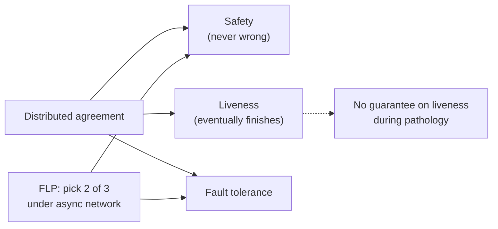
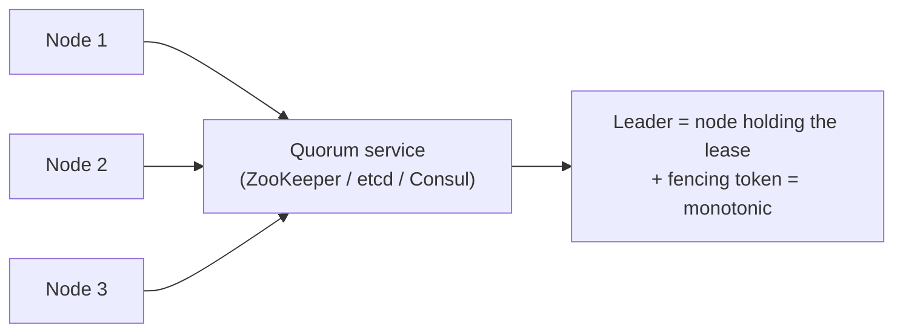
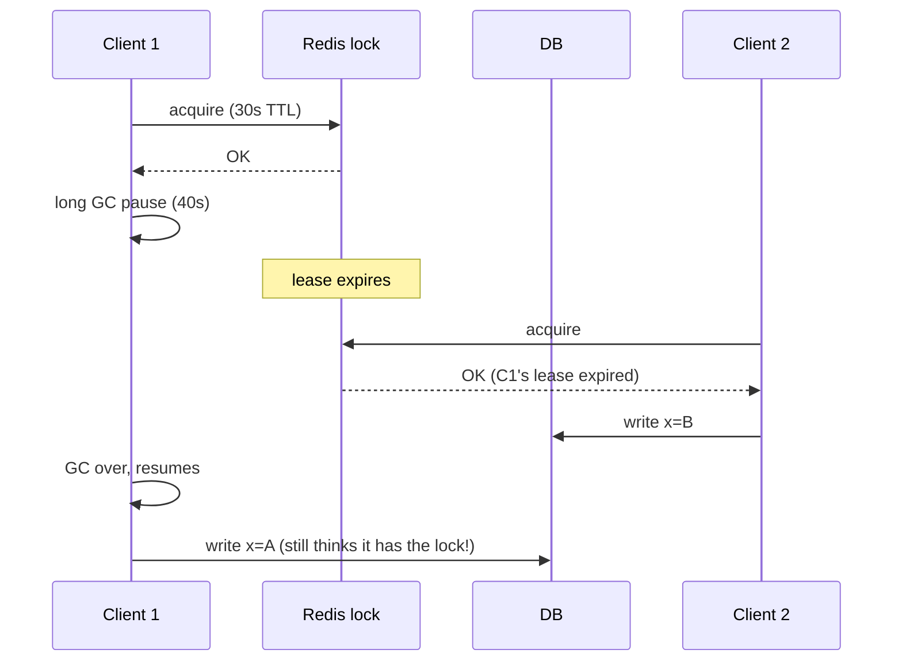
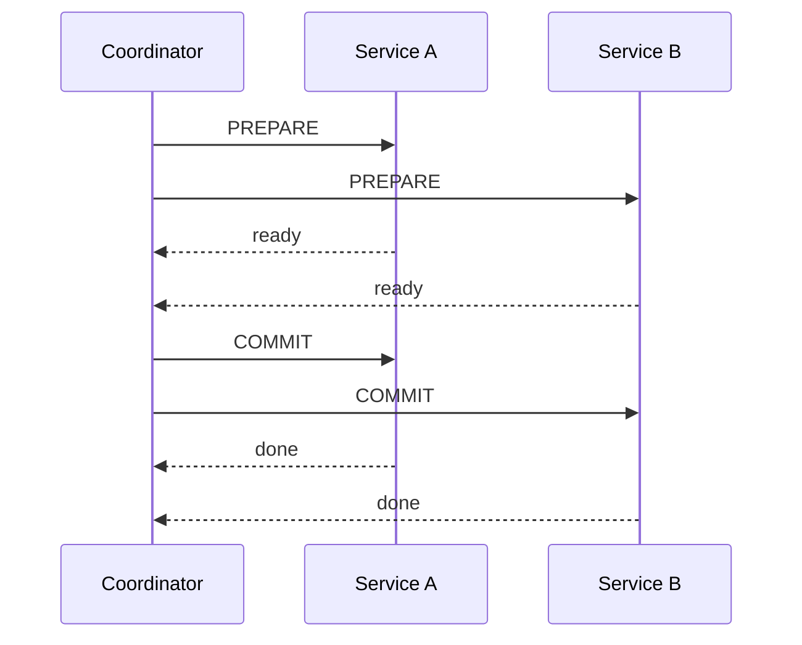
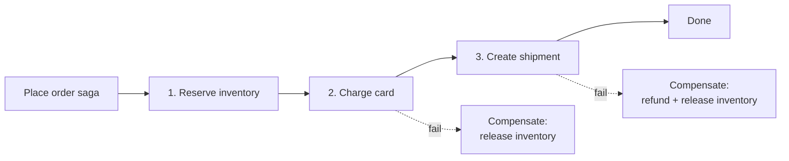
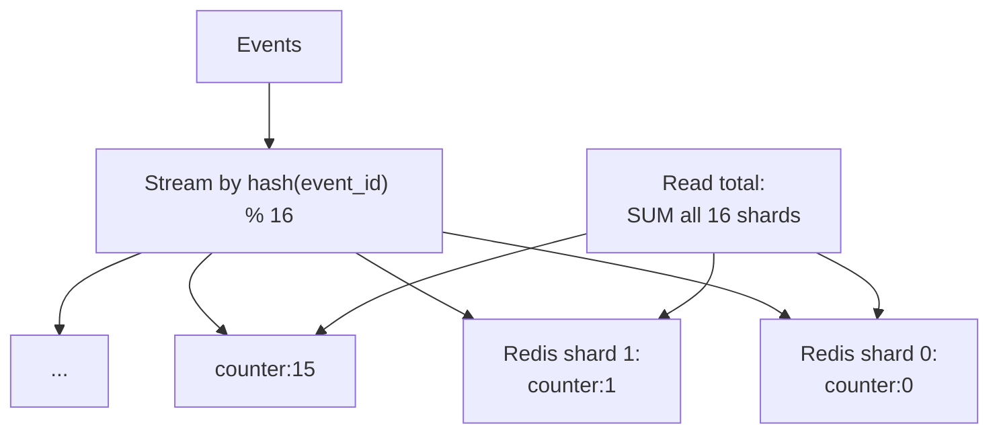

# Beat 6 — Coordination & consensus: leaders, locks, sagas, Raft/Paxos

> Series: [System design tradeoffs](../system-design-tradeoffs/) · Prev: [Beat 5 — Reliability](../system-design-reliability/) · Next: [Beat 7 — Scale & topology](../system-design-scale-topology/)

## The problem

You can avoid coordination for the read path with caches and replicas. You can avoid it for the write path with sharding and idempotency. But sometimes you genuinely need **multiple machines to agree** — on who is leader, on which transaction commits, on the order of operations. That is the realm of **consensus**, and it is the most expensive thing you can do in a distributed system.

Principal-level fluency means:

1. Knowing **what consensus actually buys you** (and what it costs).
2. Picking the right **leader-election** mechanism (or avoiding the need for one).
3. Treating **distributed locks** as a smell — they are usually wrong.
4. Choosing between **2PC and sagas** for distributed transactions, and knowing why 2PC dies at scale.
5. Understanding **Raft/Paxos at the right altitude** — you do not need to derive them; you need to know what they guarantee.
6. Having a clear position on **transactional outbox + CDC** as the practical alternative to distributed transactions.

> "If you think you need consensus, look again — most of the time you can shard the problem and pretend it never happened." — distilled from years of incident reviews.

---

## 1. Why consensus is expensive (the FLP impossibility, in plain English)

The **FLP result** (Fischer, Lynch, Paterson, 1985): in an asynchronous network, no deterministic protocol can guarantee both **safety** (no incorrect agreement) and **liveness** (eventually agree) if even one node can fail.

In English: a perfect distributed agreement algorithm that never makes mistakes and always finishes does not exist on a real network.

Real protocols (Paxos, Raft, Zab) cheat by relaxing **liveness** — they always give the right answer, but during pathological conditions (split brain, leader churn, network flapping), they may not make progress for a while. That is the price.



---

## 2. Leader election — the most useful kind of consensus

Many systems are simpler with one leader and N followers. The hard question is **how do you elect the leader** when nodes can fail?

### The naive bug — "ping the others"

If node A loses contact with B, who's right? If both think they're leader → **split brain** → divergent state → data loss when they reconcile. This is the canonical distributed-systems horror story.

### The right answer — quorum + fencing



- A separate **strongly-consistent** quorum service (ZK/etcd/Consul) holds the leader lease.
- The leader holds the lease for a TTL. If it can't renew (network partition), the lease expires and another node can take it.
- Every action the leader sends downstream includes a **fencing token** (monotonic version of the lease). Downstreams reject older tokens — so an old leader who didn't notice it lost the lease can't corrupt state.

### What runs ZK / etcd / Consul

These are themselves consensus systems (using Zab, Raft, Raft respectively). You're outsourcing the hard part to a focused, well-tested cluster of 3–5 nodes.

### Worked example: a stream processor with one writer per partition

Kafka Streams, Flink, Spark Streaming all need exactly-one-owner per partition. The pattern: partitions are leases held in ZK or the broker itself; on consumer failure, the broker reassigns. Fencing happens via **generation IDs** on offset commits — old owner's commits are rejected.

---

## 3. Distributed locks — the tempting wrong answer

Junior code: "Just take a Redis lock and we're safe."

```python
if redis.setnx("lock:account:42", token, ex=30):
    update_account(42)
    redis.delete("lock:account:42")
```

### Why this is broken (Martin Kleppmann's classic critique)



The fix: **fencing tokens**. The lock service issues a monotonically increasing token; the DB rejects writes with tokens older than what it has seen. Without fencing, the lock provides no real guarantee under GC, scheduler stalls, or network slowness.

### Redlock and friends

Redlock (Redis's official multi-instance lock) is **disputed** for safety. The mainstream answer is: if you really need a lock, use a **CP** system (etcd, ZooKeeper, Consul) plus fencing. Redis is fine for advisory locks where occasional double-execution is tolerable.

### The better question

> "Do I actually need a lock, or can I make the operation idempotent / atomic in the database?"

90% of the time, the answer is "I can use `INSERT ... ON CONFLICT`, optimistic concurrency, or a single-leader DB transaction." Reach for a distributed lock only after you've ruled those out.

---

## 4. Two-phase commit (2PC) — and why it dies at scale



### The blocking problem

Between **PREPARE** and **COMMIT**, participants hold locks waiting for the coordinator. If the coordinator crashes, **participants stay locked**. Recovery requires the coordinator's log — and during the wait, those rows are unavailable to anyone.

In a tightly-coupled DB cluster (one DC, fast network) 2PC can work. Across services with independent DBs across regions, 2PC is a recipe for cascading stalls.

### When 2PC is acceptable

- Inside a single DB engine (Postgres prepared transactions).
- For occasional, non-hot-path operations (a once-an-hour reconciliation).
- Across two systems where you control both and can promise tight SLAs.

### When 2PC is wrong

- High-throughput cross-service workflows.
- Anything where one participant might be slow or down for minutes.

---

## 5. Sagas — the practical alternative

A **saga** is a sequence of local transactions where each step has a **compensating action**. No global lock, no coordinator holding state across services — just forward progress with explicit rollback.



### Choreography vs orchestration

| | Choreography | Orchestration |
|--|---------------|---------------|
| How | Each step publishes an event; the next step consumes | A workflow engine drives each step |
| Code lives | Spread across N services | Centralized in the workflow definition |
| Debugging | Hard — you trace events across services | Easy — workflow has a single state |
| Coupling | Loose (services know events, not each other) | Logical coupling to the workflow engine |
| Examples | Pure event-driven systems | Temporal, AWS Step Functions, Cadence, Camunda |

### Compensations are not rollbacks

Database rollbacks are atomic — they undo. Compensations are **forward business actions** that cancel a previous business effect:

- Reserve → Release (not "uninvert" — explicit release).
- Charge → Refund (not "undo charge" — a separate transaction).
- Send email → Send "ignore prior email" (you can't unsend).

Two implications:

1. Compensations can fail too — your saga must handle "compensation failed" (alert humans, retry forever, etc.).
2. Some operations have **no real compensation** (sending an email, firing a missile). For those, structure the saga so they happen **last**.

---

## 6. Raft / Paxos at the right altitude

You don't need to derive these. You need to know **what they buy you** and **when each shows up**.

### What both buy you

- **Linearizable** writes (and optionally reads) across a cluster.
- Tolerates `(N-1)/2` failures in an N-node cluster (so 5 nodes tolerates 2).
- A single replicated log of operations — every replica applies them in the same order.

### Raft, in three sentences

1. One leader at a time. Leader gets elected by a majority vote each "term."
2. Clients send writes to the leader. Leader appends to its log, replicates to followers, commits when a majority ack.
3. If the leader dies, followers time out and elect a new one. The new leader has the most up-to-date log among voters.

### Paxos vs Raft

- **Paxos** is older (Leslie Lamport, 1998) and famously hard to understand. Multi-Paxos = a leader-based variant much like Raft.
- **Raft** (Ongaro & Ousterhout, 2014) was designed for understandability. Most modern systems (etcd, Consul, CockroachDB, TiKV, Kafka KRaft) use Raft.

### Where Paxos / Raft show up in interviews

- "Design a distributed config store" → Raft.
- "Design a metadata service for a sharded DB" → Raft.
- "How does Spanner achieve linearizability across regions?" → Paxos groups + TrueTime.
- "Why does Kafka need ZooKeeper / KRaft?" → controller election & metadata.
- "How does Aurora handle leader failover?" → quorum reads/writes (4 of 6 storage nodes), not full Raft.

### The cost in numbers

- Each consensus write requires a quorum round trip. Within a DC: ~1ms. Cross-DC: tens of ms. Cross-continent: 100ms+.
- **Throughput cap:** a single Raft group can handle ~10–50k writes/sec depending on payload. Beyond that, **shard the keyspace** into multiple Raft groups (CockroachDB, Spanner do this).

---

## 7. Time, clocks, and ordering

### Why physical clocks lie

Wall clocks across machines drift, and NTP can correct backwards (your clock can go from 12:00:01 to 11:59:59). You **cannot** order events across machines by wall-clock timestamp without risking inversions.

### Logical clocks

- **Lamport timestamps:** each event gets a counter; events that talk to each other increment the counter. Gives you a total order consistent with causality, but unrelated events can be ordered arbitrarily.
- **Vector clocks:** each node has a counter; event timestamps are vectors. Detect concurrency exactly (`A || B` if neither vector dominates).

### Hybrid logical clocks (HLC) — the sweet spot

HLCs combine wall-clock time with a logical counter. They're close enough to wall-clock for human use and strictly ordered for causality. Used by CockroachDB, MongoDB, YugaByte.

### Spanner's TrueTime

Spanner spends real money (atomic clocks + GPS in every DC) to bound clock uncertainty (`now ± ε`, ε ≈ 7ms). It then **waits out** the uncertainty before committing — so it can produce true global wall-clock ordering. This is the only mainstream system that does this.

### Why any of this matters in interviews

> "If you sort events by timestamp from independent producers, you'll see inversions. Use vector clocks if you need causality, HLC for an ordered timeline, or pin events to a single sequencer (a Kafka partition) where the broker assigns the order."

---

## 8. Distributed transactions you should know by name

| Pattern | What it is | When to use |
|---------|-----------|-------------|
| **Local transaction** | All work inside one DB. ACID. | Default. Most workflows fit. |
| **2PC (XA)** | Coordinator + participants, prepare/commit. | Single-DC, low-frequency cross-system. |
| **Saga (orchestrated)** | Sequenced local txns + compensations driven by a workflow engine. | Cross-service workflows, high throughput. |
| **Saga (choreographed)** | Same, driven by events. | Loose coupling, simple flows. |
| **Outbox + CDC** | Atomic with the DB write; broker delivers eventually. | Anywhere you need to publish + write atomically. |
| **TCC (Try-Confirm-Cancel)** | A 3-phase business-level protocol with reservations. | Booking systems where you can hold a slot. |
| **Linearizable distributed DB (Spanner/Cockroach)** | The DB itself does cross-shard txns. | When you have the budget and need ACID across keys. |

The **transactional outbox** is so common that it deserves its own beat: see [Beat 4 — async messaging](../system-design-async-messaging/#6-the-outbox-pattern-transactional-publishing).

---

## 9. Worked example — distributed counter

Naive: `UPDATE counter SET v = v + 1 WHERE id = X` on every event. Single-row contention kills it at a few thousand QPS.



**Why this works:**

- No coordination on writes — each shard is independent.
- Reads pay O(N_shards), but N is fixed and small.
- Tradeoff: reads are not "snapshot consistent" — you might count a write applied to shard 0 but not yet to shard 5. For most counters that's fine.
- For exact counts, periodically snapshot all shards into a single read view (eventual consistency on the snapshot).

The Principal-level move: **don't reach for distributed consensus for a counter**. Sharding eliminates the need.

---

## Common interview questions

### Q: "How do you elect a leader?"

> "I outsource the hard part to a CP system — etcd, ZooKeeper, or Consul. Each candidate tries to take a lease; the one that wins is the leader for the lease's TTL. The lease must be renewed; if it expires (network partition, crash), another candidate can claim it. Critically, every action the leader takes downstream carries a fencing token — a monotonic version of the lease — and downstreams reject older tokens. Without fencing, you can't prevent a 'zombie' leader from corrupting state after a stall."

### Q: "Why are distributed locks dangerous?"

> "Because the lock-holder can pause (GC, scheduler, network) past the lease TTL without knowing it. The lock service hands the lock to someone else. Now two clients think they hold the lock and both write. The fix is fencing tokens — the lock issues a monotonic ID, the resource accepts only the highest ID it has seen. Without that, the lock guarantees nothing under real-world failure modes. And before reaching for a distributed lock at all, ask whether you can use an atomic DB primitive — `INSERT ... ON CONFLICT`, conditional update, or a single-leader transaction — instead. Most use cases don't need a true lock."

### Q: "2PC vs saga — when do you pick which?"

> "2PC inside a single database (or a tightly-coupled cluster) is fine. Across independent services or DBs, 2PC blocks participants while the coordinator decides; a coordinator crash leaves rows locked. So at any real scale across services, I use sagas — local transactions sequenced with compensating actions. Orchestration (Temporal, Step Functions) for complex flows because you can see the state in one place; choreography for simple flows where event-publishing services already exist."

### Q: "Walk me through Raft."

> "One leader per term. Followers timeout and start an election if they don't hear from the leader; whoever gets a majority of votes becomes the new leader. Writes go to the leader, who appends to its log, replicates to followers, and commits when a majority ack. The new leader is always chosen from candidates with the most up-to-date log so commits don't get lost. Failure tolerance is `(N-1)/2`, so 5 nodes tolerate 2 failures. The cost of a write is a quorum round trip — fine within a DC, expensive cross-region."

### Q: "Why does Kafka use ZooKeeper (or KRaft)?"

> "For metadata that requires consensus: which broker is the controller, which broker leads each partition, ACLs, topic configs. The data path (writes to topics) doesn't go through ZK — that's important; only the control plane does. KRaft is the in-broker replacement that lets Kafka run without an external ZK by using Raft within the broker cluster. Same role, different implementation."

### Q: "What's a fencing token?"

> "A monotonically increasing identifier issued by the lock or lease service, attached to every action the holder takes. The downstream resource tracks the highest token it has accepted and rejects anything lower. This converts 'I had the lock once' into 'this action is from the current legitimate holder.' Without fencing, locks are advisory at best."

### Q: "How would you build a globally-consistent view counter?"

> "I wouldn't, if I can avoid it. Sharded counters with eventual aggregation handle planetary scale and never need consensus. If the requirement is truly 'exact, monotonic, globally observable,' I'd lean on a managed system like Spanner — accept the latency cost, and try to convince stakeholders that a near-real-time view counter (a few seconds of lag) is acceptable, because it almost always is."

### Q: "Tell me about clocks in distributed systems."

> "Wall clocks lie — NTP can move backwards, drift differs across machines. So I never order cross-machine events by wall time. For causality I use logical clocks (Lamport for total order, vector for concurrent detection). For human-readable ordered timelines I use Hybrid Logical Clocks. Spanner gets true global wall-time ordering by paying for atomic clocks and waiting out the uncertainty interval, but that's a special case. The most common practical move is to pin events that need ordering to the same Kafka partition and let the broker assign offsets."

### Q: "When can you avoid consensus entirely?"

> "Almost always, if you partition cleverly. Per-user state — shard by user, no cross-user agreement needed. Counters — shard and sum. Sessions — sticky-route to one node. The only places I genuinely need consensus are leader election for singleton roles, schema/config stores that everyone reads, and the metadata layer of a sharded system. Avoiding consensus on the hot path is a Principal-level instinct."

---

## See also

- Next: [**Beat 7 — Scale & topology**](../system-design-scale-topology/)
- Prev: [Beat 5 — Reliability](../system-design-reliability/)
- [Beat 4 — async messaging — outbox pattern](../system-design-async-messaging/#6-the-outbox-pattern-transactional-publishing)
- [Distributed message queues — replication & ISR](../distributed-message-queues/)
