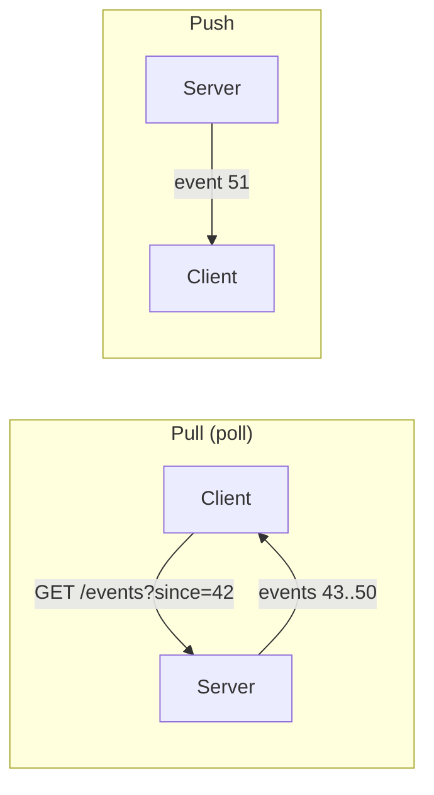
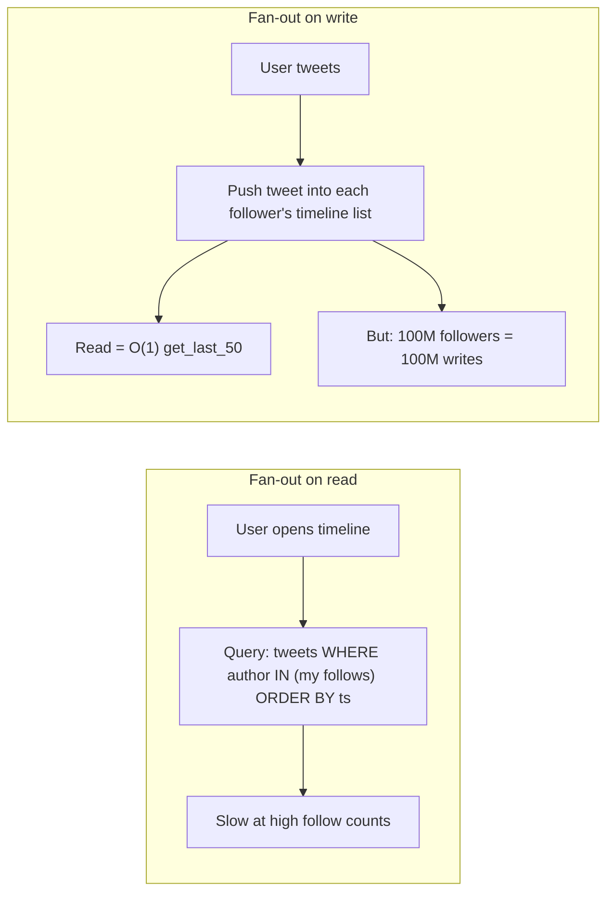
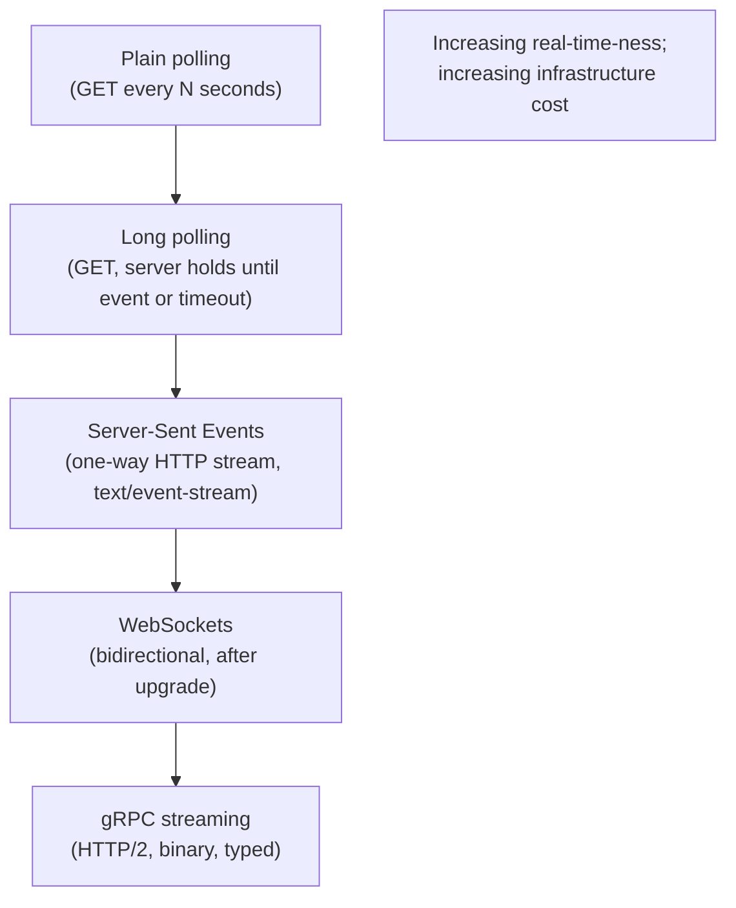
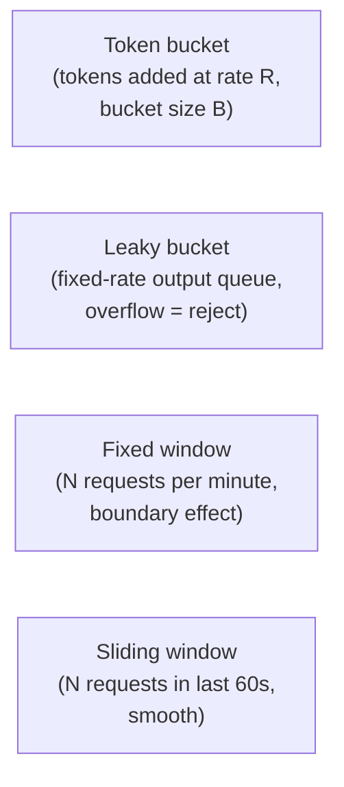
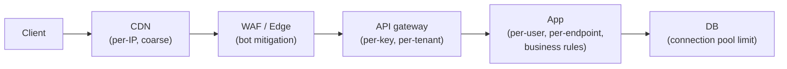
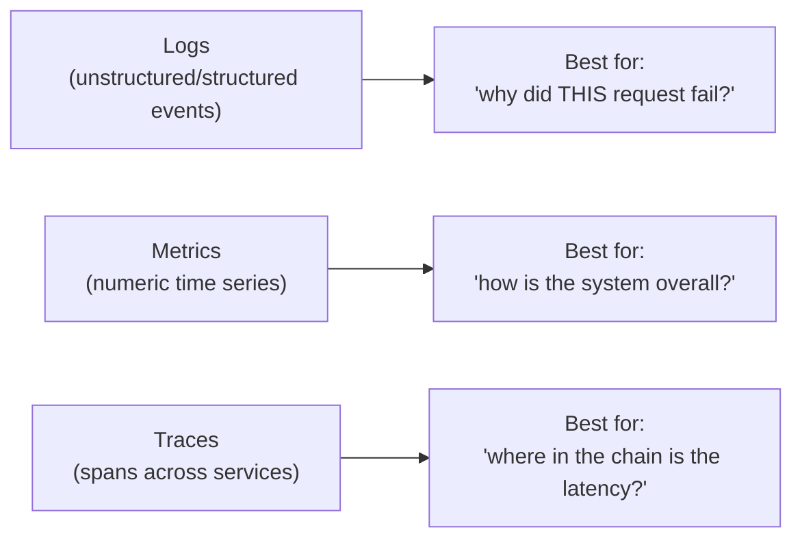
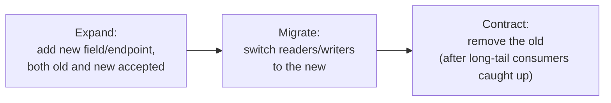
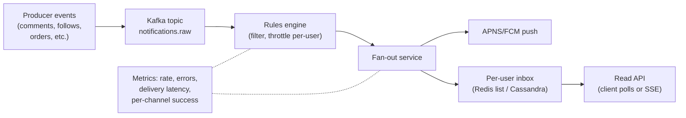

# Beat 8 — Cross-cutting patterns: push vs pull, fan-out, client APIs, observability

> Series: [System design tradeoffs](../system-design-tradeoffs/) · Prev: [Beat 7 — Scale & topology](../system-design-scale-topology/) · Next: [Beat 9 — Interview framework](../system-design-interview-framework/)

## The problem

A handful of patterns show up in every design problem regardless of domain. If you can't reach for them by name, every design will feel reinvented. Principal-level fluency means:

1. **Push vs pull** as a deliberate choice for any data-flow connection.
2. **Fan-out on read vs fan-out on write** — the most-asked tradeoff in social/feed systems.
3. **Client API style** — polling, long-poll, SSE, WebSockets, gRPC streaming — each with a clear sweet spot.
4. **Rate limiting** — token bucket, leaky bucket, fixed/sliding windows, where they live.
5. **Observability** — what to log, what to metric, what to trace, and what each costs.
6. **Schema and API evolution** — backwards/forwards compatibility, contract testing.

Many of these are tools that compose with everything in beats 1–7.

---

## 1. Push vs pull

| | Pull | Push |
|--|------|------|
| Who initiates | Client | Server |
| Latency | High (one poll interval) | Low (immediate) |
| Server overhead | Low (only when asked) | High (must track and send) |
| Connection state | Stateless requests | Long-lived connections |
| Backpressure | Natural (client throttles itself) | Server must handle slow consumers |
| Failure recovery | Easy (just poll again) | Requires reconnect + replay |
| Best for | Bulk data, cold consumers, public APIs | Real-time UIs, streaming, ticker-style |

### When to push

- **Notifications** that must reach the user fast.
- **Live data** (chat, sports scores, ticker, collaborative editing).
- **Long jobs** completing — push the result rather than make the client poll.

### When to pull

- **Cold data** that's read on demand.
- **High client count** where push would overwhelm the server.
- **Public APIs** where contract simplicity beats latency.
- **Battery-constrained mobile clients** — push wakes the radio more.

### The hybrid: push notifications via mobile-OS

Mobile push (APNS, FCM) inverts the cost: the OS holds one connection per device for *every* app, and apps push through the OS. Your server doesn't keep the socket open — the OS does.

---

## 2. Fan-out on read vs fan-out on write (the Twitter timeline classic)

This is the single most-asked tradeoff in feed/social design. You will see it in chat apps, news feeds, notification systems.

| | Fan-out on read | Fan-out on write |
|--|------------------|--------------------|
| Read cost | Expensive (compute on demand) | Cheap (precomputed) |
| Write cost | Cheap (one row) | Expensive (one per follower) |
| Storage cost | Low | High (every follower gets a copy) |
| Latency on read | High | Low |
| Best for | Write-heavy, low read | Read-heavy, low write |

### Twitter's hybrid (the canonical answer)

- **Most users:** fan-out on write — push tweets into followers' precomputed timelines.
- **Celebrities** (e.g., > 1M followers): fan-out on read — too expensive to push to 100M timelines, so fetch their tweets at read time and merge.
- **Result:** reads are fast for everyone; writes are fast for celebrities; the merge logic at read time handles a small set of "celebrity authors I follow."

### The Principal move

Always **identify the write fan-out distribution first**. If every user has < 1,000 followers, fan-out on write is fine. If the distribution has a long tail (a few users with 100M followers), you need the hybrid.

---

## 3. Client API styles — polling, long-poll, SSE, WebSockets, gRPC streams

### Plain polling

- **Pros:** simplest, works everywhere, stateless, cacheable.
- **Cons:** wasted requests; latency = poll interval / 2 on average.
- **Where:** simple admin UIs, low-traffic background syncs.

### Long polling

- Server holds the request open until there's data or a timeout (~30s).
- **Pros:** near-real-time, no special infra (just HTTP).
- **Cons:** ties up server connections; reconnect overhead.
- **Where:** legacy fallbacks where WebSockets don't work (corp proxies).

### Server-Sent Events (SSE)

- One-way (server → client) over HTTP. Native browser support (`EventSource`).
- **Pros:** simple, works through HTTP/1.1, automatic reconnect, easy to load-balance.
- **Cons:** one-way only; some old proxies buffer it.
- **Where:** dashboards, tickers, notifications — anywhere bidirectional isn't needed.

### WebSockets

- Bidirectional, full-duplex after an HTTP upgrade.
- **Pros:** lowest latency, true bidirectional, binary or text.
- **Cons:** stateful (long-lived connections); harder to scale (sticky routing); proxies may interfere.
- **Where:** chat, multiplayer games, collaborative editing, trading UIs.

### gRPC streaming

- Built on HTTP/2 streams; client/server/bidi streams; strong typing via Protobuf.
- **Pros:** efficient binary protocol, multiplexing, code-gen for types.
- **Cons:** browser support requires gRPC-Web (extra layer); more complex deployment.
- **Where:** internal microservices, mobile clients with gRPC support.

### Decision table

| If the client is... | Reach for... |
|---------------------|--------------|
| Browser, server pushes only | **SSE** |
| Browser, bidirectional | **WebSocket** |
| Mobile, low data, OS-managed | **Push notifications (APNS/FCM)** |
| Service-to-service | **gRPC streaming** or Kafka |
| Anything where simplicity > latency | **Polling** with short interval |

---

## 4. Rate limiting — algorithms and where they live

### The four classic algorithms

| Algorithm | Behavior | Best for |
|-----------|----------|----------|
| **Token bucket** | Allows bursts up to bucket size, smooth rate after | APIs that should allow short spikes |
| **Leaky bucket** | Strictly smooths to constant output rate | Network shaping, payment gateways |
| **Fixed window** | N reqs per N-second window | Simple, OK for coarse limits |
| **Sliding window** (log or counter) | N reqs in any 60s window | Strict per-user APIs, abuse prevention |

### The fixed-window boundary bug

If your limit is "100 req/min," fixed-window resets at the top of the minute. A client can send 100 reqs at 12:00:59 and another 100 at 12:01:00 — 200 reqs in 1 second. Sliding window solves this by tracking a moving window.

### Where rate limiting lives

The Principal move: **defense in depth**. Each layer enforces what it knows about — the CDN can't see your API key, the app can't cheaply absorb 1M req/s of garbage. Stack the limits.

### Distributed rate limiting

A single instance can use a local counter. Across N instances you need a shared store (Redis with `INCR` + `EXPIRE`) — but that adds latency per request. For very high QPS, use **approximate** distributed limiting: each instance has a local quota of `total / N` and refreshes occasionally. Slight over-counting is acceptable for abuse prevention.

---

## 5. Observability — logs, metrics, traces

The three pillars, what each costs, and what each is for.

### Logs

- **Format:** structured JSON (parsable, indexable).
- **Cost:** storage, indexing, retention. The cheapest line of code in your service is a `logger.debug` that nobody disables — it'll cost a fortune at scale.
- **Patterns:** sample (don't log every line), redact PII, include trace IDs for correlation.

### Metrics

- **Cardinality is the killer.** A counter labeled `(endpoint, status)` is fine. A counter labeled `(endpoint, status, user_id)` will explode your Prometheus.
- **Four golden signals (Google SRE):** latency, traffic, errors, saturation. Track per service.
- **RED method:** Rate, Errors, Duration. Easier than USE for request-driven services.
- **USE method:** Utilization, Saturation, Errors. For resources (CPU, disk).

### Traces

- **Span = unit of work** with start/end and metadata.
- **Trace = tree of spans** for one logical request across services.
- **Cost:** must propagate context everywhere (W3C Trace Context, OpenTelemetry SDK). Sampling is mandatory at scale (you don't trace every request, just a representative slice or anything anomalous).

### Sampling strategies

- **Head-based:** decide at trace start (random N%). Simple but might miss the interesting outliers.
- **Tail-based:** decide after the trace finishes (keep slow ones, errors, etc.). Better data; needs a buffer.
- **Always-on for errors:** sample at 1% baseline + 100% on errors → cheap + diagnostic.

### What to monitor at the SLO level

The user-facing SLO usually decomposes into a small number of **SLIs**:

- p99 latency on the critical endpoint.
- Success ratio (non-5xx) on the critical endpoint.
- Freshness (e.g., "events visible within N seconds").
- Correctness (e.g., "no double charges in the dedup audit").

Burn-rate alerts (Google SRE) wake you when error budget is being consumed too fast — much better than absolute thresholds that flap.

---

## 6. Schema & API evolution

Production systems live for years. Schemas and APIs change. The contract between callers and callees must evolve **without coordinated deploys**.

### Backwards-compatible changes (safe)

- Add a new optional field.
- Add a new endpoint.
- Add a new enum value (consumers that don't know it must ignore).
- Loosen validation on input.

### Backwards-incompatible changes (require careful rollout)

- Remove a field consumers may read.
- Rename a field.
- Change a type or unit.
- Tighten validation on input.

### The expand → migrate → contract dance

This pattern works for DB schema, API endpoints, message formats, and event payloads. It's how every "big migration" should look at scale.

### Protobuf / Avro contracts

Protobuf and Avro give you **wire-level forwards/backwards compatibility** by design — fields have stable IDs (Protobuf) or schemas (Avro) that consumers parse against. Use them for high-volume internal APIs.

### API versioning

Three styles, decreasing in popularity:

1. **URL versioning** (`/v1/...`, `/v2/...`) — explicit, slightly ugly.
2. **Header versioning** (`Accept: application/vnd.app.v2+json`) — clean, harder to debug in browser.
3. **No version, just additive** — possible if you're disciplined; favored at companies like Stripe (which added versioning headers later anyway).

The Principal move: **minimize versions**. Each version you maintain is a multiplier on test surface. Sunset old versions on a published timeline.

---

## 7. Worked example — designing a notifications service

**Requirements:** millions of users, push notifications + in-app feed, ~1k notifications/sec spikes to 100k.

**Tradeoffs called out:**

- **Push vs pull split:** in-app feed is **pulled** (low real-time pressure) via SSE or short poll; mobile push uses **APNS/FCM** (the OS holds the socket).
- **Fan-out on write** to per-user inboxes (read-heavy: feed opens > new notifications). Most users have a small inbox so storage cost is bounded.
- **Rate limiting** at the rules engine: max 5 push notifications per user per hour, with merging ("3 new comments on your post" instead of 3 separate notifications).
- **Idempotency** keyed on `(user, event_id)` — duplicate events from upstream are deduped.
- **Observability**: trace the entire fan-out from event to delivery; metric per channel (APNS vs FCM vs email) success rates; log delivery failures with reason for debugging.
- **Schema evolution**: notification payloads use Protobuf with field IDs so we can add metadata without breaking older clients.

---

## Common interview questions

### Q: "Push vs pull?"

> "Push for real-time UIs and mission-critical low-latency notifications. Pull for cold data, public APIs, and high-cardinality consumer fleets where push would melt the server. Mobile is interesting — pull from the server's perspective via APNS/FCM, but the OS pushes to the device. The key tradeoff is who pays for the connection state. Push minimizes latency but the server tracks every consumer; pull is stateless but adds a poll-interval of latency."

### Q: "Fan-out on read or fan-out on write?"

> "It depends on the read:write ratio and the fan-out distribution. For social feeds, read:write is usually 1000:1 or more, so fan-out on write wins for reads. But you have to handle the long tail — celebrities with 100M followers can't fan out cheaply on write, so you do a hybrid: fan-out on write for the bulk of users, fan-out on read for celebrities, merge at read time. The Principal move is identifying the write-fan-out distribution before picking."

### Q: "WebSocket or SSE?"

> "SSE if I only need server → client. It's simpler, works through HTTP/1.1 proxies, has automatic reconnect built into the browser, and load-balances trivially. WebSockets if I need bidirectional — chat, collab editing, multiplayer. WebSockets cost more in connection state and stickiness. I default to SSE if I can get away with it; many systems labeled 'WebSocket' could have been SSE."

### Q: "Token bucket vs leaky bucket?"

> "Token bucket allows bursts up to the bucket size, then smooths to the refill rate. Leaky bucket smooths everything to a strict constant rate. Token bucket is what you want for APIs — clients should be allowed short bursts. Leaky bucket is what you want for downstream protection — even bursts must be smoothed. They're often combined: token bucket at the edge, leaky bucket in front of fragile services."

### Q: "How do you build a rate limiter for a distributed API?"

> "Layered. CDN/WAF for IP-level coarse limiting. API gateway for per-key/per-tenant limits using a shared store (Redis with INCR/EXPIRE) — accepting a small latency cost. App for per-user / per-endpoint business rules. For very high QPS, use approximate distributed limits — each instance gets a local quota of total/N with periodic refresh — to avoid hot Redis keys. Rejected requests get 429 with a Retry-After header so clients can back off correctly."

### Q: "What are the four golden signals?"

> "Latency, traffic, errors, saturation — Google SRE's framework for monitoring user-facing services. Latency: how long requests take (p50/p99). Traffic: how many requests/sec. Errors: error rate. Saturation: how full the system is (CPU, queue depth). I track all four per critical endpoint and tie alerts to SLO burn rate rather than absolute thresholds — burn-rate alerts wake me only when the error budget is at real risk."

### Q: "Logs vs metrics vs traces — what's each for?"

> "Logs answer 'why did this request fail?' — they're event-level detail, expensive at scale, sampled aggressively. Metrics answer 'how is the system overall?' — numeric time series, cheap if cardinality is controlled, alert-friendly. Traces answer 'where in the chain is the latency?' — spans across services tied by trace ID. They compose: a metric tells me errors are up, a trace narrows it to one service, a log tells me exactly what failed. Cardinality discipline on metrics is the most common mistake — labeling by user_id or request_id will blow up Prometheus."

### Q: "How do you evolve a schema without downtime?"

> "Expand → migrate → contract. Step 1: add the new field/endpoint, both old and new accepted. Step 2: switch readers/writers to the new representation, in stages. Step 3: remove the old, after consumers have caught up. The duration of the middle step depends on how out-of-date your slowest client can be. For internal services with controlled deploys: hours. For public APIs with mobile clients: months or years. Protobuf and Avro give you forwards/backwards compatibility on the wire so the dance is mostly mechanical."

### Q: "How would you trace a request through 10 microservices?"

> "Propagate a trace ID at the entry point (W3C Trace Context header), pass it through every RPC and async message, log it on every line. Each service emits spans to a tracing backend (Jaeger, Tempo, Honeycomb, Datadog). Sampled because tracing every request is too expensive — head-based for baseline coverage, tail-based to keep slow/error traces. Then you can pull up the trace in the UI and see the timeline of all 10 hops with timing. Without trace propagation, debugging a microservices stack is impossible."

---

## See also

- Next: [**Beat 9 — Interview framework & meta-skills**](../system-design-interview-framework/)
- Prev: [Beat 7 — Scale & topology](../system-design-scale-topology/)
- [Stock price fan-out walkthrough](../system-design-stock-notifications/) — push, conflation, fan-out in a real design.
- [Browser event loop & real-time UIs](../browser-event-loop/) — the client side of push.
