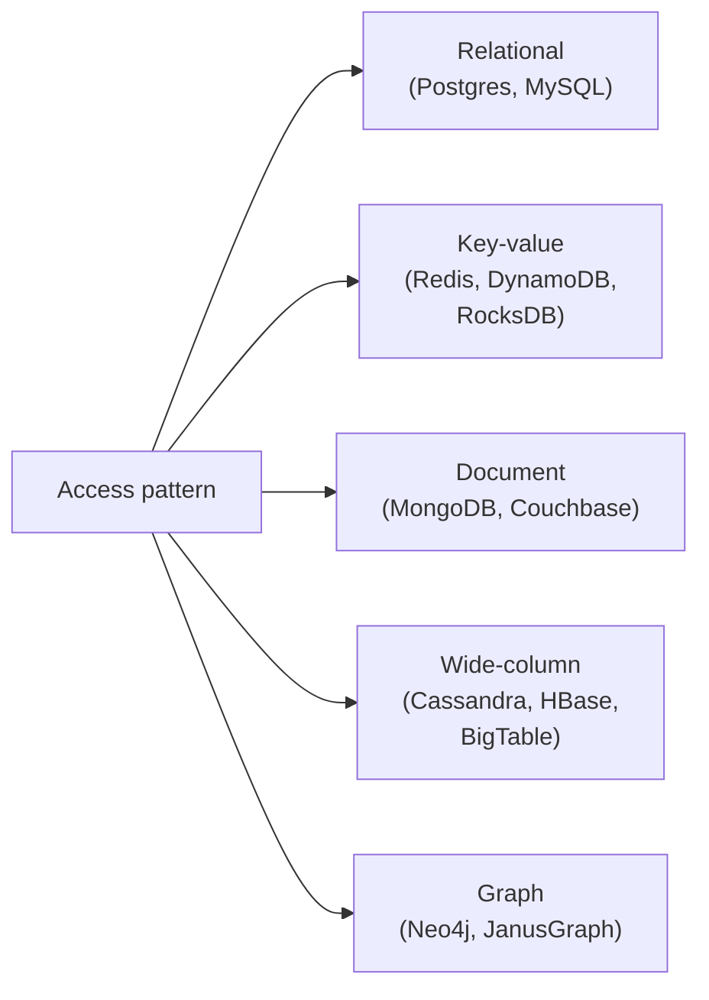
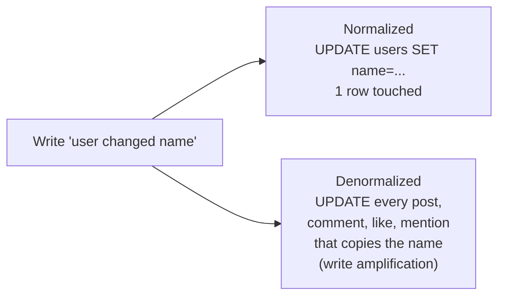
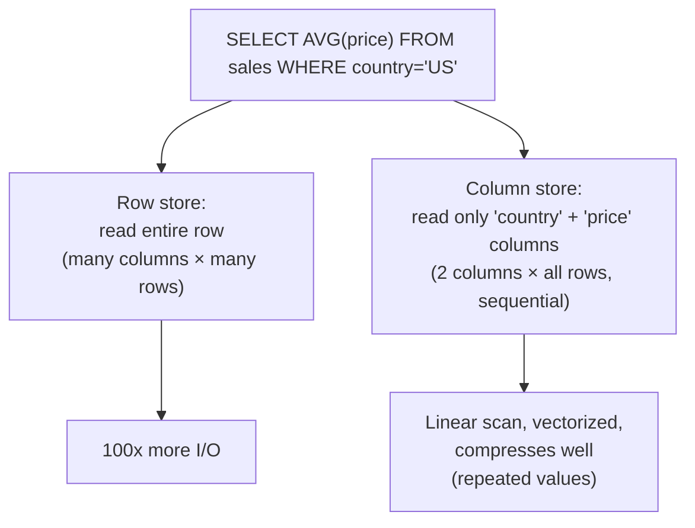
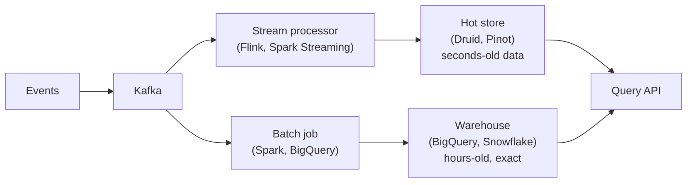
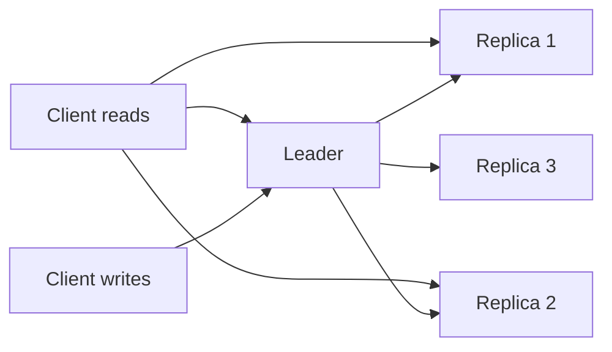
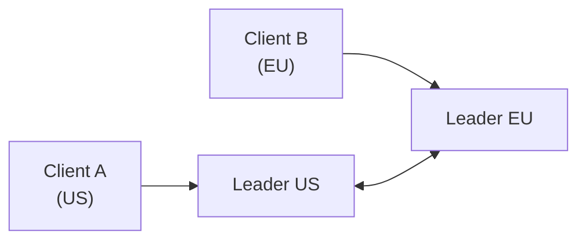
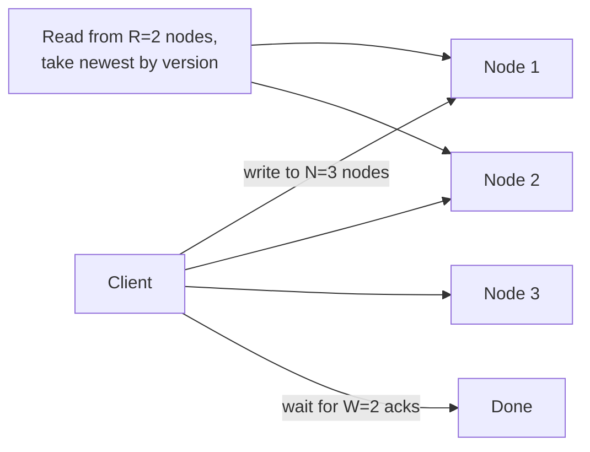
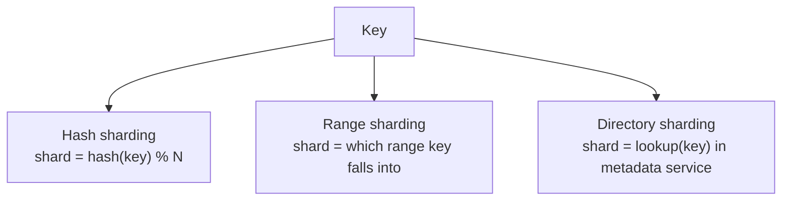
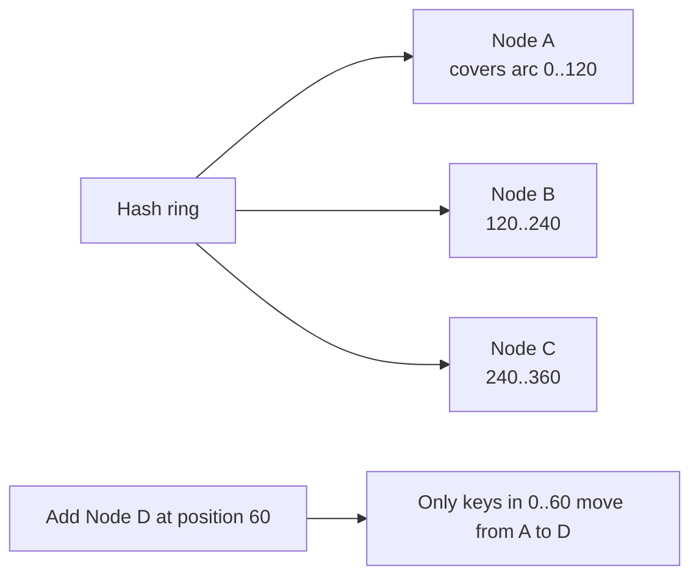

# Beat 2 — Data & storage: SQL vs NoSQL, replication, sharding, consistency

> Series: [System design tradeoffs](../system-design-tradeoffs/) · Prev: [Beat 1 — Foundations](../system-design-foundations/) · Next: [Beat 3 — Caching](../system-design-caching/)

## The problem

The data layer is where 80% of system-design interviews live. Get this wrong and the rest of your design is built on sand. Specifically you need fluency in:

1. **Picking a storage model** that matches the access pattern (not the brand on the side of the box).
2. **Normalizing or denormalizing** with eyes open to write amplification.
3. **Choosing OLTP vs OLAP** — and not pretending one tool does both well.
4. **Naming a consistency level** out of the spectrum (not "strong" or "eventual" but exactly which guarantee).
5. **Picking a replication topology** — single-leader, multi-leader, or leaderless — and explaining the failure modes.
6. **Sharding** without painting yourself into a corner (resharding is hell).

Storage decisions are **the hardest to reverse**. A wrong cache layer can be ripped out in a sprint. A wrong primary database can take 18 months to migrate. Interviewers know this, which is why they push hard here.

---

## 1. Storage model — match the access pattern

### The five fundamental shapes

### When each wins

| Model | Sweet spot | Don't use it for |
|-------|-----------|------------------|
| **Relational** | Anything with multi-entity transactions, ad-hoc queries, joins, reporting. The default unless you have a specific reason. | Massive single-table writes (logs, metrics), schema chaos, planet-scale workloads. |
| **Key-value** | Single-key reads at huge scale: sessions, user profiles, counters, caches. Sub-ms p99. | Anything that needs joins, range scans across keys, secondary indexes. |
| **Document** | Self-contained entities (a user with their settings, a product with its variants). Schema-on-read. | Cross-document transactions, joins, "show me all docs where this nested array contains X" at scale. |
| **Wide-column** | Time-series, event logs, IoT, anything where rows are huge and queries are by partition key + range on cluster key. | Ad-hoc queries you didn't design the primary key for. |
| **Graph** | Relationships of unknown depth: social graphs, fraud rings, recommendations, identity resolution. | Anything you can model as flat tables — graph DBs cost a lot of ops complexity. |

### Worked example: design "users + posts + comments"

| Approach | Best for |
|----------|----------|
| **Postgres** with three tables and FKs | The default. Joins are cheap up to ~100M rows per table. |
| **MongoDB** with a `User` doc that embeds `posts: [...]` | If posts are always read with the user and you never query "all posts in the last hour across users." |
| **Cassandra** with `(user_id, post_ts)` partition + cluster | If you must scale to billions of posts and the dominant query is "give me a user's recent posts." |
| **Neo4j** | Almost never for this — until you add "show me friends-of-friends who liked this post." |

**The Principal-level move:** name the *dominant query* first, then pick. "If 95% of reads are 'get a user's last 50 posts,' Cassandra with `(user_id) PARTITION, post_ts DESC CLUSTER` is unbeatable. If we need ad-hoc reporting too, I'll keep Postgres as the source of truth and stream into a column store for analytics."

---

## 2. Normalization vs denormalization

### The tradeoff in one sentence

- **Normalized:** writes are cheap (one place to update), reads are expensive (joins).
- **Denormalized:** reads are cheap (one row, one network hop), writes are expensive (update many places, risk of drift).

### Worked example: write amplification at Twitter scale

If you embed the author's display name into every tweet (denormalized for read speed), and a popular user with 10M tweets changes their name, you have 10M rows to update. Twitter's solution: **don't embed the name; embed the user_id**, and join (or cache) the name at read time.

This is a constant tension. Rules of thumb:

- **Default to normalized** for transactional systems. Denormalize only the reads that prove to be hot.
- **Default to denormalized** for analytical / read-heavy systems. Pay the write cost via batch jobs.
- **Materialized views / projections** are denormalization with a name. Use them.

---

## 3. OLTP vs OLAP — and the lambda architecture

| Axis | OLTP (transactional) | OLAP (analytical) |
|------|----------------------|--------------------|
| Workload | Many small reads/writes by ID | Few large scans/aggregations |
| Storage | Row-oriented | Column-oriented |
| Indexes | B-tree on PK + a few secondary | Sort keys, zone maps, encoded columns |
| Examples | Postgres, MySQL, DynamoDB | BigQuery, Snowflake, Redshift, ClickHouse, Druid |
| Latency | ms | seconds to minutes (acceptable) |
| Concurrency | thousands of users | dozens of analyst queries |

### Why columnar wins for analytics

### Lambda / Kappa architectures

In an interview, when asked "how do you serve real-time analytics on a high-write system?", the canonical answer:

The key Principal point: **the OLTP DB is not your analytics DB**. If the interviewer says "and we want to run reports too" — say "we'll stream into a warehouse." Don't run analytics on the production Postgres.

---

## 4. The consistency spectrum

"Strong vs eventual" is too coarse. Here's the actual spectrum, from strongest to weakest:

| Model | Guarantee | Where you see it |
|-------|-----------|-------------------|
| **Linearizable** | Reads see the latest write, globally, in real time. | Spanner, etcd, ZooKeeper, single-leader RDBMS reads from leader. |
| **Sequential / serializable** | All clients see operations in some single order, but not necessarily real-time. | Many SQL databases at SERIALIZABLE isolation. |
| **Causal** | If A causes B, everyone sees A before B. Concurrent ops can be reordered. | COPS, MongoDB causal sessions. |
| **Read-your-writes** | A client always sees its own writes. Other clients may not. | Sticky sessions to a primary, write-through caches. |
| **Monotonic reads** | A client never sees time go backwards. | Session pinning to a replica. |
| **Eventual** | If writes stop, all replicas converge. No timing guarantees. | DynamoDB default, Cassandra default, DNS. |

### Worked example: read-your-writes for comments

User posts a comment, page refreshes from a read replica that hasn't caught up — the comment is "missing."

Fixes, in increasing engineering cost:

1. **Read from primary for N seconds after a write** (cookie / session flag).
2. **Pin user to a replica** that they wrote to (sticky session).
3. **Optimistic UI** — show the comment locally even if the server hasn't confirmed.
4. **Causal session tokens** — client sends "last write timestamp," server waits or routes accordingly.

In an interview, name the model and the fix. Don't just say "eventual consistency is fine."

---

## 5. Replication topologies

### Single-leader

- **Pros:** simple, strong consistency from leader, easy to reason about.
- **Cons:** single write bottleneck, failover is tricky (split brain, lost writes).
- **Where:** Postgres, MySQL, MongoDB, most RDBMS, Kafka per partition.
- **Sync vs async replication:** sync = no data loss, slower writes; async = fast, can lose tail of writes on failover.

### Multi-leader

- **Pros:** writes accepted in every region (low write latency for users).
- **Cons:** **conflicts**. Two regions update the same row at the same time → who wins? LWW, CRDTs, or human merge.
- **Where:** active-active multi-region (CockroachDB, BDR, some Cassandra setups), Git itself.
- **Interview red flag:** if you propose multi-leader without a conflict-resolution story, you'll lose the room.

### Leaderless (Dynamo-style)

- **Quorum math:** with N replicas, if `R + W > N` you have read-your-write within the quorum.
- **Pros:** no single point of failure for writes, smooth degradation.
- **Cons:** read repair, hinted handoff, anti-entropy — lots of moving parts. Conflicts handled with vector clocks or CRDTs.
- **Where:** DynamoDB, Cassandra, Riak.

### Replication tradeoff cheat sheet

| | Single-leader | Multi-leader | Leaderless |
|--|--|--|--|
| Write latency | High (one place) | Low (local) | Low (any quorum) |
| Conflict handling | Trivial (only one writer) | Hard | Hard (vector clocks/CRDTs) |
| Failover | Coordinator needed | Per-region OK | Smooth, no failover |
| Best for | OLTP, source of truth | Geo-distributed UX | Massive scale, AP workloads |

---

## 6. Sharding — and why it's the hardest to undo

### Three sharding strategies

| Strategy | Pros | Cons |
|----------|------|------|
| **Hash** | Even distribution, no hot shards (usually). | No range scans (`WHERE id BETWEEN`). Resharding pain — `% N` changes everything. |
| **Range** | Range scans are fast. Adjacent keys colocate. | Hot shards (recent timestamps, alphabet bias). Need rebalancing. |
| **Directory** | Flexible, can move keys individually. | Metadata service is a SPOF and a bottleneck. |

### Consistent hashing (the resharding fix)

Standard `hash(key) % N` reshuffles ~all keys when N changes. **Consistent hashing** maps both nodes and keys onto a ring; only ~`1/N` of keys move when a node is added/removed.

In practice: use **virtual nodes** (each physical node owns many ring positions) to smooth load.

### Hot shards — the killer

Even hash sharding can have hot shards if you shard by `user_id` and one user is Justin Bieber. Fixes:

- **Compound keys:** shard by `(user_id, bucket)` where bucket = `hash(post_id) % 16`. Spreads one user across 16 shards. Reads must fan out.
- **Tiered storage:** detect hot keys, replicate them to a hot-key cache layer.
- **Salting** the key for writes (logs).

### Resharding — the real interview question

> "Your service is on 16 shards. You're at 90% capacity. How do you go to 32?"

Answers, by sophistication:

1. **Naive:** stop writes, dump everything, reshard, restart. Hours of downtime. **Wrong answer.**
2. **Double-write + backfill:** write to both old and new shards, backfill historical data, switch reads, drop old. Days but zero downtime.
3. **Consistent hashing from day 1:** add new nodes to the ring, only ~50% of keys move, online.
4. **Range sharding with split:** a tablet that gets too big splits in half (BigTable, Spanner, HBase). The platform does it.

Naming "double-write + backfill" with sequencing of cutover is a strong Principal signal.

---

## 7. Indexes — the silent storage cost

A table with 5 indexes pays the index-update cost on every write. In a write-heavy workload this can be the dominant cost.

| Index type | What it's good for | Cost |
|------------|--------------------|------|
| **B-tree (primary)** | Point and range queries on the indexed column. | Update on every write. |
| **Hash index** | Point queries only. Faster than B-tree for equality. | Update on every write. No range scans. |
| **Bitmap** | Low-cardinality columns in OLAP. | Slow on writes, great on reads. |
| **Inverted index** | Full-text search. | Significant build/update cost (Lucene/Elastic). |
| **LSM-tree** (Cassandra/RocksDB internal) | Massive write throughput; reads use bloom filters + compaction. | Read amplification, compaction overhead. |
| **B-tree vs LSM** | B-tree: balanced reads/writes, lower write throughput. LSM: write-optimized, can have tail-latency spikes from compaction. | — |

### Worked example: the missing index that ate the database

A team adds a `created_at` filter to a hot endpoint. Without an index it does a sequential scan on a 100M-row table. Database CPU pegs at 100%, all queries slow down. Adding the index fixes reads but adds 5% write overhead. **Both numbers belong in the design doc.**

---

## 8. Storage costs (rough, for back-of-envelope)

| Tier | Cost (USD / GB / month, ~2025) | Latency |
|------|-------------------------------|---------|
| L1 cache | n/a (silicon) | ns |
| RAM | ~$3–5 | 100ns |
| NVMe SSD | ~$0.10 | 50µs |
| HDD | ~$0.02 | 10ms |
| S3 standard | ~$0.023 | 50ms |
| S3 IA | ~$0.0125 | 50ms |
| Glacier Deep Archive | ~$0.001 | hours |

Use these to defend your tiering: "hot data in Redis ($3/GB/mo, 100µs); recent in Postgres ($0.10/GB/mo on EBS, ms); historical archived to S3 ($0.023/GB/mo, batch access)."

---

## Common interview questions

### Q: "SQL or NoSQL?"

> "Wrong question — the right one is 'what's the access pattern?' If we have multi-entity transactions and ad-hoc queries, I default to Postgres until I prove I can't scale it. If we have one dominant query at planet scale (e.g. 'get a user's recent activity'), I'll pick a wide-column store and design the partition key around it. NoSQL isn't faster by magic — it's faster *because* you've constrained the access pattern up front. Pay the constraint cost willingly or stay relational."

### Q: "When do you denormalize?"

> "When measurement shows the join is the bottleneck and the column being copied changes rarely. I keep the normalized source of truth and add a denormalized read model — a materialized view, a cache, or a separate table maintained by CDC. I never denormalize a frequently-mutating field across a large fan-out — that's how you get write amplification incidents."

### Q: "How would you shard Postgres?"

> "First I'd ask why — is it write throughput, storage size, or hot rows? Then pick a shard key that matches the dominant query (so most queries hit one shard). I'd use Citus or app-level sharding with consistent hashing on virtual nodes. The hard parts are cross-shard joins (avoid; denormalize or use a read-side replica), unique constraints across shards (use composite keys with shard ID), and resharding (double-write + backfill). And honestly — at ~10TB / ~50k writes per second I'd consider Spanner/CockroachDB before sharding Postgres myself."

### Q: "What's read-your-writes consistency and how do you provide it?"

> "It's the guarantee that a client sees its own writes immediately. The user-visible bug it prevents is 'I posted, refreshed, and my post is missing.' Fixes: pin the user to the leader for N seconds after a write, sticky sessions to a single replica, send a 'last-seen LSN' token with every request and have the read wait for that LSN, or — easiest — render optimistically on the client and reconcile."

### Q: "Cassandra vs DynamoDB?"

> "Both are wide-column AP stores with tunable consistency. Cassandra you self-host (or DataStax) — more control, more ops. DynamoDB is fully managed with on-demand scaling and great integration with the AWS ecosystem; you pay per request and per GB. Cassandra wins for very high-throughput workloads where you want to control compaction, GC, and tuning. DynamoDB wins for 'I never want to think about a database again' and predictable single-key access. Both fall over if you try ad-hoc queries — design the primary key around your access pattern."

### Q: "What's a write-ahead log and why does it matter?"

> "It's the durability primitive: every change is appended to a log on disk *before* the in-memory state is updated. On crash, replay the log. This is how Postgres, MySQL InnoDB, Kafka, and almost every modern DB get durability + speed — sequential writes are fast, random in-place writes are slow. It also gives you replication for free (ship the log to followers) and is the basis for point-in-time recovery."

### Q: "How do you handle schema migrations on a busy table?"

> "**Expand-migrate-contract.** Step 1: add the new column nullable, deploy code that writes both. Step 2: backfill in batches with throttling, track via a watermark. Step 3: switch reads to new column. Step 4: drop the old column. Each step is independently revertible. Online schema-change tools (gh-ost, pt-online-schema-change for MySQL; Postgres handles many alters concurrently) automate the table-rewrite case. The forbidden move is `ALTER TABLE` with a long-held exclusive lock during business hours."

### Q: "Picking between Postgres, Spanner, CockroachDB, Aurora — go."

> "Postgres: single-region, fits in one box, mature ecosystem. Aurora: managed Postgres/MySQL with storage scaled out, faster failover, single-region default. CockroachDB: Postgres-wire-compatible, distributed multi-region SQL, no single leader, slightly higher latency. Spanner: Google-only, TrueTime-based linearizability across regions, gold standard for global ACID. I'd go Postgres → Aurora → Cockroach/Spanner as I cross scale and geography boundaries."

---

## See also

- Next beat: [**Beat 3 — Caching & performance**](../system-design-caching/)
- Prev: [Beat 1 — Foundations](../system-design-foundations/)
- [Distributed message queues](../distributed-message-queues/) — log-structured storage in disguise.
- [Batch & stream compute](../distributed-batch-and-stream-compute/) — the OLAP side in more depth.
