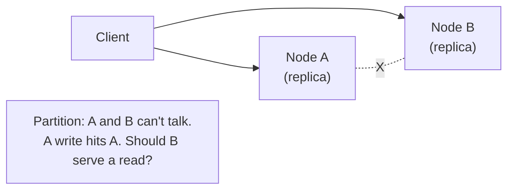
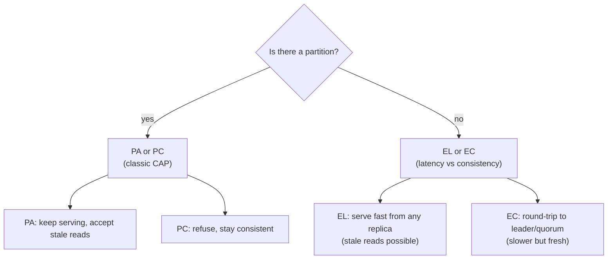
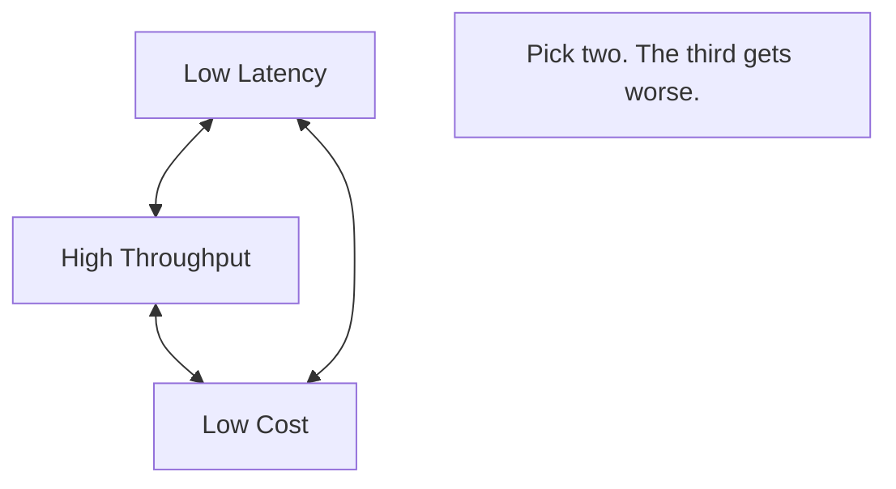
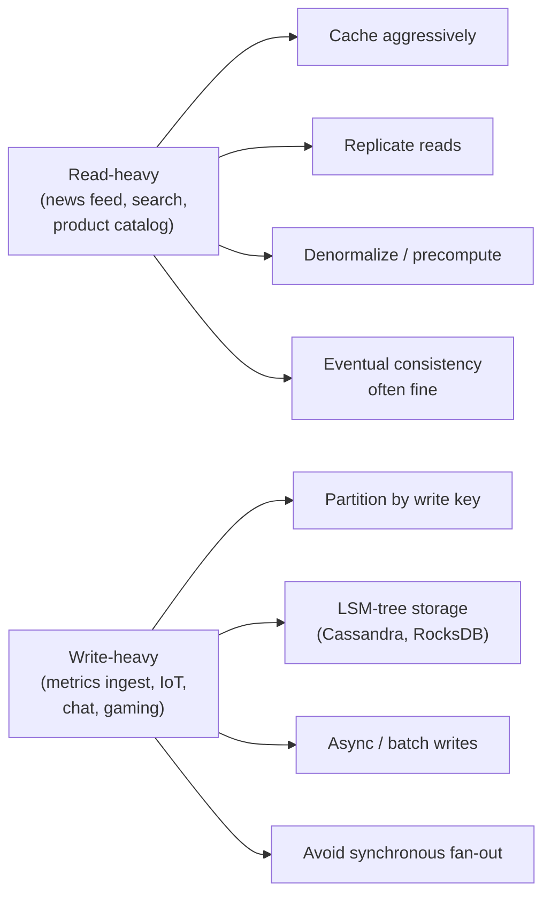

# Beat 1 — Foundations: CAP, PACELC, and the eternal triangle

> Series: [System design tradeoffs](../system-design-tradeoffs/) · Next: [Beat 2 — Data & storage](../system-design-data-storage/)

## The problem

Every interesting system-design tradeoff in the rest of this series — replication, caching, queues, sagas, multi-region — eventually bottoms out at **three irreducible truths**:

1. **Networks fail.** Packets get lost, links partition, nodes can't tell "you're slow" from "you're dead."
2. **Light is slow.** New York ↔ London is ~70 ms one-way *on the wire alone* — physics, not engineering.
3. **You can't have all the things.** Consistency, availability, latency, throughput, cost — these trade off against each other in well-known shapes.

A senior candidate reaches for "let's just use Postgres" or "let's just use Kafka." A Principal candidate names which of these truths is biting and what they're paying to bend it.

This page teaches the four mental models you'll lean on in every other beat:

- **CAP** — what you give up during a network partition.
- **PACELC** — what you give up *even when there is no partition*.
- **The eternal triangle** — latency vs throughput vs cost.
- **Read-heavy vs write-heavy** — the most under-appreciated framing question.

---

## 1. CAP — the partition-time tradeoff

CAP says: when a network partition happens (and it *will*), you must pick **either Consistency or Availability**. You cannot have both.

### Definitions, precisely

- **Consistency (C)** — every read sees the most recent successful write. (This is **linearizability**, *not* the C in ACID.)
- **Availability (A)** — every request to a non-failed node gets a non-error response.
- **Partition tolerance (P)** — the system keeps working when the network drops messages between nodes.

In any real distributed system, **P is not optional**. So CAP is really: when partitioned, pick **CP** or **AP**.

- **CP**: B refuses to serve (or returns error) until it can confirm with A. → consistent, not available.
- **AP**: B serves stale data. → available, not consistent.

### Worked example: a shopping cart

You run a cart service replicated across two regions. The cross-region link drops.

| Choice | Behavior | Where you'd pick it |
|--------|----------|---------------------|
| **CP** (e.g. Spanner, Postgres with synchronous replication) | The unreachable region returns 503. Customers in that region can't shop. | Banking ledger, inventory of 1-of-a-kind items, anything where wrong > slow. |
| **AP** (e.g. DynamoDB, Cassandra, Riak) | Both regions accept writes. When the link heals, you reconcile (last-write-wins, CRDTs, vector clocks, manual merge). | Shopping cart (Amazon's original Dynamo paper!), social-media likes, view counts. |

The Amazon insight: a cart conflict ("you added two items in different regions, here are both") is **better business** than telling a customer "we're down." So Dynamo is AP.

### The thing juniors get wrong

CAP is **only about partitions**. When the network is healthy, a CP system is also fast and available. CAP doesn't say "Cassandra is always inconsistent and Spanner is always slow." It says "during a partition, here's how each behaves."

That's why we need **PACELC**.

---

## 2. PACELC — the everyday tradeoff

PACELC, by Daniel Abadi, fixes CAP's "what about the 99.99% of the time when there's no partition?" gap.

> **If Partition, choose between Availability and Consistency. Else, choose between Latency and Consistency.**

### Classifying real systems

| System | PACELC | Plain English |
|--------|--------|---------------|
| **DynamoDB** (default) | PA/EL | Always picks availability + low latency. Eventual consistency. |
| **DynamoDB** (strong reads) | PC/EC | You can opt in to consistency, paying ~2x latency and reduced availability. |
| **Cassandra** (tunable quorums) | PA/EL by default | `R=1, W=1` → PA/EL. `R=ALL, W=ALL` → PC/EC. |
| **MongoDB** (default) | PA/EC | Reads from primary by default (consistent, slower). |
| **Spanner** | PC/EC | Always consistent. Pays latency for TrueTime + Paxos. |
| **HBase** | PC/EC | CP system; reads block during failover. |
| **Couchbase / Riak** | PA/EL | Always serve, reconcile later. |

### Why this matters in interviews

When the interviewer asks "would you use Spanner or DynamoDB here?", the *PACELC answer* is:

> "Spanner gives me PC/EC — I get global consistency at ~100ms write latency. DynamoDB gives me PA/EL — single-digit-ms reads but I have to design for eventual consistency. For an inventory ledger I'll pay the latency. For a session store I won't."

That sentence is the difference between Senior and Principal.

---

## 3. The eternal triangle — latency, throughput, cost

CAP/PACELC handle **consistency** tradeoffs. The other axis you trade against is **performance vs money**.

### Concrete examples of the triangle in action

| Scenario | What you optimize | What you sacrifice |
|----------|-------------------|--------------------|
| **HFT order book** | Latency (microseconds) | Cost (kernel-bypass NICs, colocated DC) and throughput per dollar. |
| **Batch ETL** (Spark) | Throughput (GB/s) and cost (spot instances) | Latency (jobs take hours). |
| **Serving p99 100ms web app** | Balance of all three | Each requires explicit budget — caches add cost, sharding adds ops. |
| **Cold archive (S3 Glacier)** | Cost ($0.001/GB-month) | Latency (hours to retrieve) and throughput. |

### The "throughput vs latency" subtlety

These two are not the same. A system can have **high throughput and high latency** (a big batch job processes 1 TB/hour but each record takes minutes). Conversely, **low throughput and low latency** (a single-threaded RPC: each call is 1ms but you only get 1000/sec).

The Principal-level habit: **state both numbers separately**. "p99 latency 50ms, sustained throughput 10k req/s/node." Don't conflate them.

### Little's Law (the one formula to memorize)

> **L = λ · W**
>
> Concurrent requests in flight (L) = arrival rate (λ) × average latency (W).

If 10,000 req/s arrive and each takes 100ms, you have **1,000 requests in flight at any moment**. That tells you connection pool sizes, thread counts, memory budgets. Use it in interviews — it sounds smart and it's almost always relevant.

**Worked example:** "We need 50,000 req/s with p99 of 200ms. By Little's Law that's 10,000 concurrent requests. If each request holds a 1MB buffer, that's 10GB of working memory across the fleet. With 16GB nodes, we need at least... 1 node? No — we need headroom for p99 spikes plus GC plus other workloads. So ~10 nodes minimum, more for HA."

---

## 4. Read-heavy vs write-heavy — the framing question

Almost every system-design interview reduces, in part, to: **is this read-heavy or write-heavy?** The answer changes which tradeoffs you take.

### Worked example: Twitter timeline (the classic)

This problem is famous because the read:write ratio is **extreme**: ~1 write per 1,000 reads.

- **Naive (read-heavy thinking):** On read, query "tweets by users I follow, ordered by time, limit 50." That's a join across millions of rows per request. Dies at scale.
- **Twitter's actual answer (fan-out on write):** When you tweet, **push** that tweet into the in-memory timeline of each follower (Redis lists). Reads become "give me the last 50 entries from my list." O(1) reads.
- **Cost:** writes are now O(followers). For Justin Bieber (100M followers), one tweet = 100M writes. So Twitter uses a **hybrid**: fan-out on write for normal users, fan-out on read for celebrities, merged at read time.

The Principal-level move: notice the read:write ratio *first*, then choose the strategy.

### Worked example: ad-click pipeline

- Read:write ratio: **1:100,000** (lots of clicks, occasional analytical queries).
- → Write-heavy. Use Kafka + columnar warehouse (BigQuery, Snowflake). Partition by `(ad_id, hour)`. Reads are batch.

### Worked example: bank transfer

- Read:write ratio: ~1:1, but **every write must be correct**.
- → Neither caching nor fan-out helps. Optimize for **correctness** (ACID, single-leader Postgres or Spanner).

---

## 5. Latency numbers every Principal candidate should know

These are Jeff Dean's numbers, updated for modern hardware. **Memorize them.** When you say "an L1 cache hit is ~1ns and a disk seek is 10ms," interviewers sit up.

| Operation | Latency | In "human time" if 1ns = 1 second |
|-----------|---------|------------------------------------|
| L1 cache reference | 1 ns | 1 sec |
| L2 cache reference | 4 ns | 4 sec |
| Branch mispredict | 3 ns | 3 sec |
| Mutex lock/unlock | 17 ns | 17 sec |
| Main memory reference | 100 ns | 1.5 min |
| Compress 1 KB with Snappy | 2 µs | 30 min |
| Send 1 KB over 1 Gbps | 10 µs | 2.5 hours |
| SSD random read | 16 µs | 4 hours |
| Read 1 MB sequentially from memory | 3 µs | 50 min |
| Read 1 MB sequentially from SSD | 49 µs | 13 hours |
| Round trip same DC | 500 µs | 5.5 days |
| Read 1 MB sequentially from disk | 825 µs | 9 days |
| Disk seek | 2 ms | 23 days |
| Round trip CA → Netherlands | 150 ms | 4.5 years |

### How to use this in an interview

> "A read-your-writes guarantee across regions is going to cost ~150ms minimum because of physics. So if our SLO is p99 < 100ms, we cannot do cross-region synchronous writes — period. Either we relax the SLO, relax the consistency, or we keep users pinned to a single region."

That's a Principal-level argument grounded in physics, not vibes.

---

## 6. The "pick your poison" cheat sheet

Use this in your head as you reason through any design:

| If you want... | You probably give up... |
|-----------------|-------------------------|
| Strong consistency | Latency and/or availability |
| Low write latency | Some consistency or some durability |
| High availability | Some freshness on reads |
| Low cost | Latency or throughput |
| Multi-region active-active | Strong consistency (without exotic infra like Spanner) |
| Schema flexibility (NoSQL) | Joins, transactions, ad-hoc queries |
| Joins and transactions (SQL) | Easy horizontal scale (until you shard) |
| Real-time analytics | Cost (need streaming infra) |
| Operational simplicity | Some scale ceiling (monolith vs microservices) |

---

## Common interview questions

### Q: "Walk me through CAP."

> "During a network partition you must choose either consistency — every read sees the latest write — or availability — every node still answers. Most real systems pick AP (Dynamo, Cassandra) or CP (Spanner, HBase) by *default*, but many tunable systems let you pick per-operation. Crucially, CAP only describes partition behavior — for the everyday case I use PACELC to also reason about latency vs consistency."

### Q: "Is Kafka CP or AP?"

> "Kafka is CP for writes — a producer with `acks=all` blocks until ISR replicas acknowledge, and if the partition's leader is isolated from the controller it gives up leadership rather than serve diverging writes. So you trade availability of the partition for consistency. With `acks=1` or `acks=0` you shift toward AP and lose durability guarantees. The tunable nature is the interview answer, not 'CP' or 'AP' alone."

### Q: "Why isn't 'CA' a real thing?"

> "Because real networks partition. 'CA' would mean 'consistent and available, assuming no partitions' — which is just a single node, and a single node has no real availability story (one disk failure ends you). CAP is meaningful only as a choice between CP and AP under partitions."

### Q: "What's wrong with eventual consistency?"

> "Nothing — for the right workload. The problems are subtle: read-your-writes violations (you post a comment, refresh, it's gone), monotonic-read violations (you see version 5, then version 3), and operations that aren't commutative under merge (e.g. 'subtract 10' loses if applied twice during reconciliation). The fix is either (a) pick a stronger consistency model in the spectrum — read-your-writes, monotonic, causal — or (b) design data structures that *are* commutative (CRDTs)."

### Q: "p99 latency is 200ms but average is 30ms. What do you say?"

> "Tail latency dominates user perception, especially in fan-out systems. If a page makes 20 backend calls and each has p99 = 200ms, by basic probability the page's p99 is much worse — about 1 - (1 - 0.01)^20 ≈ 18% of pages will hit a 200ms tail. So I'd attack tails: hedge requests, set tighter timeouts with retries, identify head-of-line blocking, and make sure GC isn't synchronous. Average latency is mostly a vanity metric."

### Q: "How would you design for low cost first, performance second?"

> "Pick the storage tier that matches access frequency: hot in memory/SSD, warm on cheap rotational, cold on object storage. Use spot/preemptible compute for batch. Compress everything (network, disk). Avoid cross-region traffic — it's the most expensive byte you can move. And measure: most cost wins come from finding the one query, one cron, one log stream that's 80% of the bill."

### Q: "Give me an example where you'd violate every 'best practice' in this page."

> "A leaderboard for a small game. I'd put it all in a single Redis instance (no HA, no partition tolerance), accept that a crash loses the last few seconds of scores, skip the cache layer (Redis *is* the cache), and not bother with multi-region. The blast radius is tiny, the workload is bounded, and engineering time is the scarce resource. Best practices are for problems I have, not problems I might have."

---

## See also

- Next beat: [**Beat 2 — Data & storage**](../system-design-data-storage/)
- [Distributed message queues](../distributed-message-queues/) — Kafka's PACELC behavior in practice.
- [Delivery semantics & idempotency](../distributed-delivery-and-idempotency/) — what "exactly-once" actually buys you.
