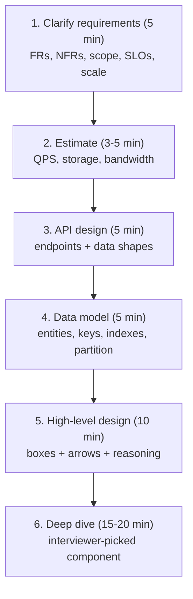
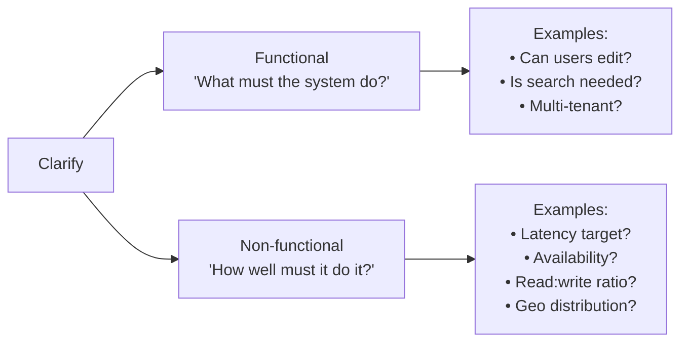
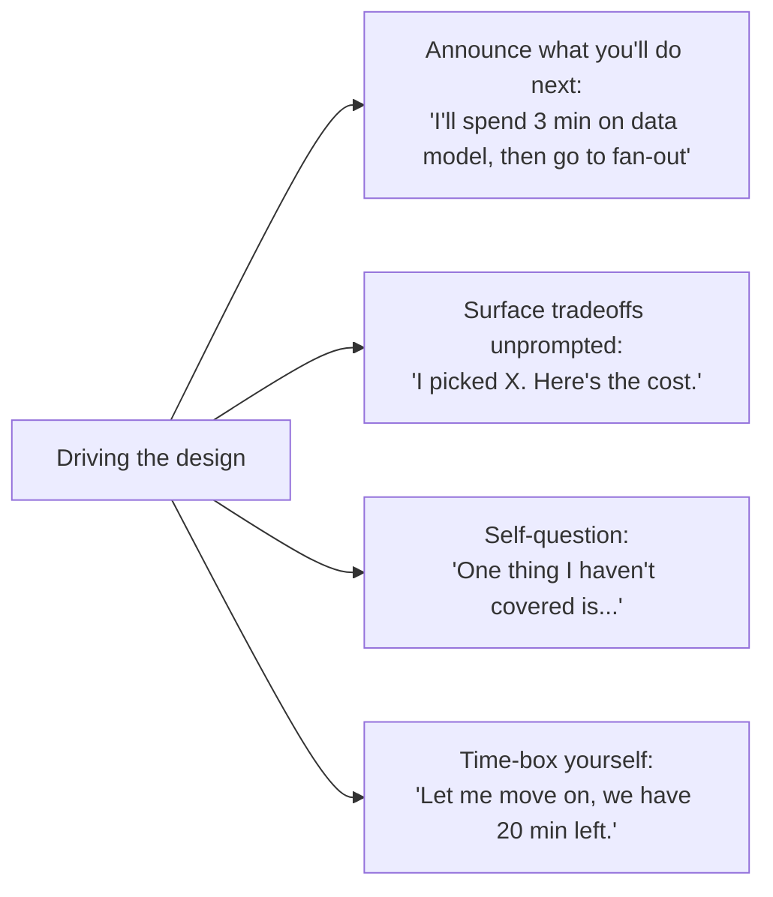

# Beat 9 — Interview framework & meta-skills (Principal-level signal)

> Series: [System design tradeoffs](../system-design-tradeoffs/) · Prev: [Beat 8 — Cross-cutting patterns](../system-design-cross-cutting/)

## The problem

You can know every pattern in beats 1–8 and still fail the interview. The mistake is treating system design as a *recipe* — pick a database, draw boxes, list components. At Principal level, interviewers grade you on **process**, **defense**, **evolution**, and **self-critique**. This page is the meta-skill layer: how to walk into the room, structure 45 minutes, signal seniority, and recover when you're stuck.

It also lists the **canonical practice problems** so you can drill the patterns from beats 1–8 against real prompts.

---

## 1. The 6-step framework (use this every time)



The numbers are budgets, not commands. If the problem is open-ended, spend more on step 1; if it's narrow, less.

### Step 1 — Clarify (the most under-invested step)

**Don't start designing.** Spend 5 minutes naming:

- **Functional requirements (FRs):** what must the system do? List 4–6, not 20.
- **Non-functional requirements (NFRs):** latency, availability, durability, consistency, cost.
- **Scale:** users, QPS, data size — even if rough.
- **Scope:** what's *out*. "Auth, billing, abuse — assume separate services."
- **Constraints:** existing infra, languages, regions, regulations.

The Principal-level move: **propose the constraints if the interviewer is vague.**

> "Let's say 100M MAU, 10k peak QPS, p99 < 200ms, 99.99% available, no multi-region requirement for v1, US-only, 1 KB average payload. Sound right?"

This anchors the rest of the conversation in numbers and gives the interviewer something to push back on, which is what they want.

### Step 2 — Estimate

Back-of-envelope. Don't be exact, be **defensibly close**.

> "100M MAU × 10 sessions/day = 1B sessions/day = ~12k sessions/sec average, ~50k peak with 4x diurnal. Each session is ~10 reads × 5 KB = 50 KB transfer; total ~600 MB/s peak read bandwidth. Storage: 100M users × 10 KB profile = 1 TB; events at 10k/sec × 1 KB × 30 days retention = ~26 TB."

Use **Little's Law** (`L = λ × W`) to convert QPS + latency → concurrent connections → memory.

### Step 3 — API

Sketch the 3–5 endpoints (or message types). Show the request/response shapes briefly. **Don't write OpenAPI** — bullet form is fine.

```
POST /tweet { text } -> { tweet_id }
GET /timeline?cursor= -> { tweets[], next_cursor }
POST /follow/{user_id} -> 204
```

This forces specificity and gives the data model something to anchor on.

### Step 4 — Data model

What entities, what keys, what's indexed, what's the partition strategy?

```
users(user_id PK, name, ...)
tweets(tweet_id PK, author_id idx, ts idx, text)
follows(follower_id, followee_id)  PK=(follower_id, followee_id)
timeline(user_id PK, sorted by ts) — fan-out cache, Redis
```

Name the **partition key** for any horizontally-scaled table; it's a Principal-level signal that you've thought about how the data lives at scale.

### Step 5 — High-level design

Now draw the boxes. Five rules:

1. **Start at the client and trace one request all the way through.** Boxes that aren't on a request path don't belong yet.
2. **Mark sync vs async edges.** Solid arrow = blocking, dashed = async.
3. **Name the storage in each box.** "App tier (stateless)", "Postgres (single-leader)", "Redis (cache, LRU)".
4. **Put numbers on the arrows** when you can. "10k QPS", "100ms p99".
5. **Voice the tradeoffs as you draw.** "I'm putting Redis here for read fan-out — alternative was a read replica, but the working set fits in 50 GB and Redis is 100x faster."

### Step 6 — Deep dive

The interviewer picks. They will pick what *you* didn't fully justify. Expected dives:

- "How does the cache invalidation work?"
- "How would you shard this DB?"
- "What happens when a node dies?"
- "How does a write make it to disk?"
- "How does the saga compensate if step 3 fails?"
- "Now 100x scale — what changes first?"

This is where beats 1–8 actually pay off. Have the vocabulary ready.

---

## 2. The two question types — FR and NFR

Every clarification question is one of:



A common Senior failure mode is asking only FR ("does it support comments?") and not NFR ("what's the p99 latency target?"). Principal candidates ask both, and frequently propose specific NFR numbers and ask the interviewer to confirm.

---

## 3. Phrases that signal Principal

Use these naturally; they distinguish levels.

| Phrase | What it signals |
|--------|------------------|
| "Let's start with what's *out* of scope." | You can prune ambiguous problems. |
| "I'll pick X because of Y; the cost is Z." | You think in tradeoffs, not features. |
| "I don't think we need this in v1; here's how I'd add it in v2." | You can phase work. |
| "What's the read:write ratio?" | You know the framing question. |
| "By Little's Law that's about 10k concurrent connections." | You quantify with formulas, not vibes. |
| "Let me name the failure modes I haven't covered." | Self-critique. |
| "If I had to defend this in production for 5 years, I'd change..." | Long-term thinking. |
| "We could do X, but the operational cost would be Y full-time engineer-years." | Cost in *people*, not just dollars. |
| "I'd canary this to one cell first." | Operational maturity. |
| "The dedup key here is `(user_id, request_id)`; TTL 24 hours." | Specifics over hand-waves. |

### Phrases that signal Junior (avoid)

- "We'd just use Kafka." (No defense.)
- "Microservices." (Reflex without org context.)
- "It would just work." (The room laughs internally.)
- "We'd handle that." (Be specific about *how*.)
- "Probably... I think... maybe..." too often. (Pick a position; you can revise.)

---

## 4. Handling pushback (the "what about X?" pattern)

Interviewers will push. Pushback is a feature, not a bug — it means they want to see how you reason. Three failure modes and the right move:

### Failure 1: Cave instantly

**Junior:** "Oh you're right, let me change it."

**Principal:** "Good question — let me think about whether that changes the balance. I picked X because [original reason]. If [their concern] is true, then I'd switch to Y because [new reason]. Want me to assume their case?"

You either **defend with reasoning**, or **change with reasoning**. Never change *without* reasoning.

### Failure 2: Defend reflexively

**Junior:** "No, X is fine, X always works."

**Principal:** "Let me think through the case where that breaks... ah yes, if [scenario], then X falls over because [reason]. Good catch. Two options: [option A] or [option B]. I'd lean A because..."

Acknowledge when the pushback lands. Senior+ candidates are admired for **graceful updates** under new info.

### Failure 3: Freeze

The interviewer asks something you don't know. **Don't freeze.** Use the recovery line.

---

## 5. The recovery line — for "I don't know"

Memorize this. It's the most useful phrase in any technical interview:

> "I don't know that off the top of my head. Here's how I'd reason about it: [first principles]. Based on that, my best guess is [answer]. I'd verify by [how you'd check]."

### Why it works

- Honest (you didn't fake).
- Demonstrates reasoning (the actual signal).
- Demonstrates verification habit (Principal trait).
- Often lands close to the right answer because first-principles reasoning is what you really do every day.

### Worked example

> Interviewer: "What's the throughput limit of a single Raft group?"
>
> You: "I don't know exactly. Let me reason — Raft requires a quorum write, so each operation costs one round-trip across N nodes. Within a DC that's ~1ms, so at best ~1000 ops/sec serially. With pipelining, batching, and parallel proposals, modern implementations probably hit 10k–50k ops/sec per group. That's why CockroachDB and Spanner shard the keyspace into many Raft groups rather than scale a single one. I'd verify with the etcd or CockroachDB docs."

That's a strong answer to a question you "don't know."

---

## 6. The drive-the-conversation skill

Don't wait for the interviewer to prompt you. Drive.



Senior candidates wait to be asked. Principal candidates **announce** their next move and self-critique without prompting.

---

## 7. Time management — the 45-minute layout

| Minutes | Phase | What you do |
|---------|-------|-------------|
| 0–5 | Clarify | FR + NFR + scope + scale numbers |
| 5–10 | Estimate | QPS, storage, bandwidth, Little's Law |
| 10–15 | API + data model | endpoints, entities, partition keys |
| 15–25 | High-level design | boxes + arrows + tradeoff voice-over |
| 25–40 | Deep dive | interviewer picks; go deep |
| 40–45 | Wrap | self-critique, "in v2 I would" |

**Watch the clock.** A common Senior failure: spending 25 minutes on requirements + diagram and only 10 on the deep dive. The deep dive is where Principal signal lives.

---

## 8. The wrap-up — self-critique (the final differentiator)

When time is almost up, **don't run out of things to say.** Volunteer:

> "Three things I'd revisit if I had more time. First, I waved hands on the migration from v1 to v2 of the schema — I'd want to spec the expand/migrate/contract steps. Second, I haven't covered cost — at this scale, the inter-region egress alone is on the order of $50k/month, which might push us toward a single-region launch. Third, I'd want a game day plan to validate the failover story I described."

Three signals in one paragraph: **honest gaps**, **cost awareness**, **operational maturity**.

---

## 9. The canonical practice problems

Drill these. Each one exercises a specific cluster of patterns from beats 1–8. Aim to do each in 45 minutes from cold.

| Problem | Patterns it exercises |
|---------|------------------------|
| **URL shortener** (TinyURL) | Hashing, key generation, read-heavy cache, CDN, basic data model. Beats 1, 2, 3. |
| **Twitter / news feed** | Fan-out on read vs write, hybrid celebrity strategy, timeline cache. Beats 2, 3, 8. |
| **Chat (WhatsApp / Slack)** | WebSockets, presence, message ordering, multi-device sync, push notifications. Beats 4, 6, 8. |
| **Rate limiter** | Token/leaky bucket, distributed counters, Redis, burst vs steady. Beat 8. |
| **Distributed counter / view count** | Sharded counters, eventual consistency, batch aggregation. Beats 1, 6. |
| **Top K / trending** | Approximate algorithms (Count-Min Sketch), windowing, stream processing. Beats 4, 8. |
| **Search autocomplete** | Trie, Redis, prefix indexing, cache hit ratio, freshness vs cost. Beats 2, 3. |
| **Web crawler** | Politeness queue, dedup at scale, distributed work queue, bloom filters. Beats 4, 5. |
| **Notification service** | Push vs pull, fan-out, dedup, multi-channel (email/SMS/push). Beats 4, 8. |
| **Ride sharing dispatch (Uber)** | Geo indexing (geohash, S2), real-time matching, surge pricing, ETA, stateful sharding. Beats 2, 4, 7. |
| **Payment / wallet** | ACID, idempotency, sagas, ledger design, double-entry, reconciliation. Beats 5, 6. |
| **Distributed file storage (Dropbox / S3)** | Chunking, dedup, metadata vs data plane, consistency on metadata, eventual on bytes. Beats 2, 6. |
| **Video streaming (YouTube / Netflix)** | CDN, adaptive bitrate, transcoding pipeline, recommendations, hot content. Beats 3, 4, 8. |
| **Ad-click pipeline** | Stream processing, exactly-once-ish, attribution, write-heavy, lambda architecture. Beats 2, 4. |
| **Online code-execution sandbox** | Resource isolation, queueing, worker pool, fairness, abuse prevention. Beats 4, 5, 7. |
| **Distributed cache** | Consistent hashing, replication, eviction, hot keys. Beats 3, 6. |
| **Distributed task scheduler (cron / Airflow)** | Leader election, fairness, idempotency, missed runs. Beats 5, 6. |
| **Observability platform (Datadog-lite)** | High-cardinality metrics, tail-based sampling, cheap storage tiering. Beats 2, 8. |
| **Stock fan-out** | Conflation, backpressure, snapshot+delta, sequence numbers. See [the worked walkthrough](../system-design-stock-notifications/). |

For each problem, do a full 45-minute timed run, then self-grade against the rubric below.

---

## 10. The Principal-level rubric (self-grading)

After a practice run, score yourself out of 5 on each:

| Criterion | What 5/5 looks like |
|-----------|---------------------|
| **Clarification** | Listed 4+ FRs, 4+ NFRs with specific numbers, named what's out of scope. |
| **Estimation** | At least 3 numbers (QPS, storage, bandwidth), at least one Little's Law calc. |
| **Data model** | Named partition key, called out indexes, considered access patterns. |
| **High-level diagram** | Started from client, marked sync/async, justified each box's existence. |
| **Tradeoff fluency** | Voiced reason for at least 5 decisions; named the cost of each. |
| **Failure modes** | Named what happens when each major component fails; named recovery. |
| **Cost awareness** | At least one $ or eng-year cost mentioned. |
| **Evolution** | Answered "what about 10x?" with specific stages. |
| **Self-critique** | Listed 2+ things you'd revisit; honest gaps. |
| **Pushback handling** | Updated gracefully when wrong; defended with reasoning when right. |

Below 30/50 — keep practicing. 35–40 — solid Senior. 40+ — Principal range.

---

## 11. The "what makes Principal feel different from Senior" essay

If you take one thing from this series, take this:

**Senior candidates can build the system. Principal candidates can talk about the system as if it has a 5-year lifespan.**

That means:

- **Cost over its lifetime**, not just launch cost.
- **Operational burden** (dashboards, alerts, on-call, runbooks) — engineering you'll do *every week*, not once.
- **Migration plans** for getting to v2, v3 without rewriting.
- **Org and team implications** (Conway's Law).
- **Honest tradeoffs** — naming what your design is *bad at*, because everything is bad at something.
- **Evolution scenarios** — "if traffic grows 10x, here's the order of changes; if regulators require data residency, here's what changes."

If you can hold all that in your head while also drawing accurate boxes, you'll pass the loop.

---

## Common interview questions

### Q: "What's the first thing you do when given a system design prompt?"

> "I write down five FRs and five NFRs in bullet form, propose specific scale numbers, and confirm with the interviewer. I don't draw a single box until I've named what the system must do, how well, and what's out of scope. The biggest mistake I see — and used to make — is jumping to architecture before scoping. Five minutes spent here saves twenty in the deep dive when the interviewer says 'oh actually, also...' and your design needs to absorb a new requirement."

### Q: "How do you handle 'now scale this to 10x'?"

> "I'd identify the current bottleneck first — usually the DB or one hot endpoint. Then propose the smallest change that buys the next stage of headroom: cache, replicas, sharding, async pipelines, in roughly that order. Each step has a stated cost and a handoff to the next bottleneck. Avoid jumping to multi-region or microservices reflexively — those are expensive and usually solve problems you don't have yet."

### Q: "How do you handle pushback when you're not sure if you're right?"

> "Acknowledge it, reason out loud, and either defend or update with explicit reasoning. 'Good question — let me think. I picked X because [reason]. If [their case] is true then X breaks because [reason], so I'd switch to Y. Or if I assume [my case], X still works. Which scenario are we in?' That turns pushback into collaboration. The two failure modes I avoid are caving instantly with no defense, and defending reflexively with no openness."

### Q: "What if you don't know the answer to something specific?"

> "Recovery line: 'I don't know that off the top of my head. Here's how I'd reason: [first principles]. Best guess: [answer]. I'd verify by [how].' That signals two things — honesty and the ability to reason from first principles. Most of the time, first-principles reasoning lands close enough that the interviewer credits it as a strong answer. Never bluff — interviewers always notice."

### Q: "What separates Principal from Senior in a design interview?"

> "Senior gets to a working design and can defend its components. Principal does that *plus* talks about the system across its 5-year lifespan — operational burden, cost, migration paths, team and org implications, honest gaps, evolution under pressure. The diagram is similar; the conversation around it is different in scope and self-awareness. The single biggest signal is unsolicited self-critique — 'three things I'd revisit if I had more time' — at the end."

### Q: "How do you avoid running out of time?"

> "Announce a budget and watch the clock. 5 / 5 / 10 / 10 / 15 / wrap. If I'm 25 minutes in and still on the diagram, I move — even if the diagram isn't perfect. The deep dive is where the Principal signal lives, and missing it because I over-polished the diagram is a self-inflicted wound. I'd rather have a slightly rough high-level design and 15 minutes of strong deep-dive content than the reverse."

### Q: "What's the most common mistake you see senior candidates make?"

> "Treating the interview as 'demonstrate I know the patterns' instead of 'demonstrate I can reason about tradeoffs.' Reaching for Kafka, microservices, multi-region without being asked or without justification. Jumping to architecture before scoping. Defending without listening when pushed back on. And — most common — running out the clock by over-engineering the high-level design and shorting the deep dive."

### Q: "Walk me through how you'd practice."

> "Pick one canonical problem (URL shortener to start), set a 45-minute timer, and do the full 6-step framework on a whiteboard or doc. Then self-grade against the rubric — clarification, estimation, data model, diagram, tradeoff fluency, failure modes, cost, evolution, self-critique, pushback handling. Score below 30/50, do another problem of similar shape; score 40+, move to a harder problem (Twitter, Uber, payments). Two problems a day for two weeks plus reading is enough to interview-ready for most loops."

---

## See also

- Hub: [**System design tradeoffs**](../system-design-tradeoffs/) — the full series.
- [Stock price fan-out walkthrough](../system-design-stock-notifications/) — a full worked design problem.
- [Interview syllabus (master list)](../interview-syllabus/) — the broader topic backlog.
