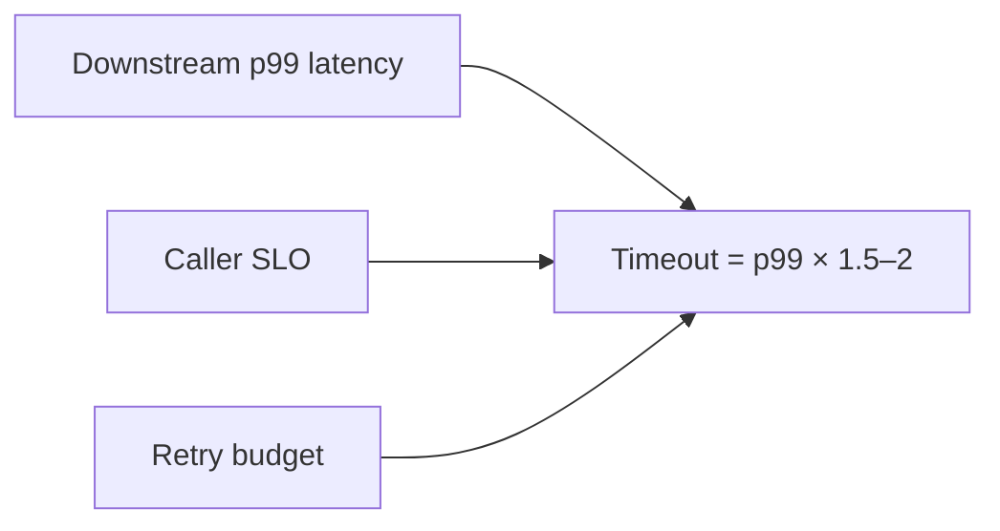
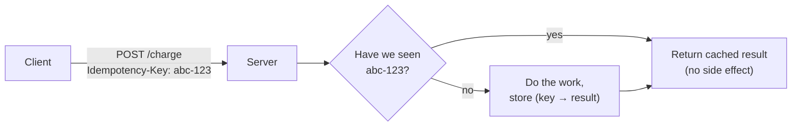
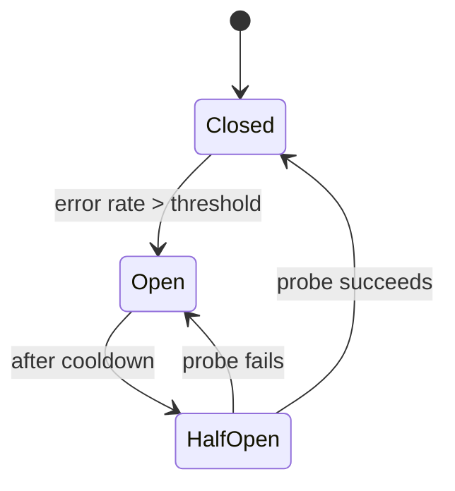
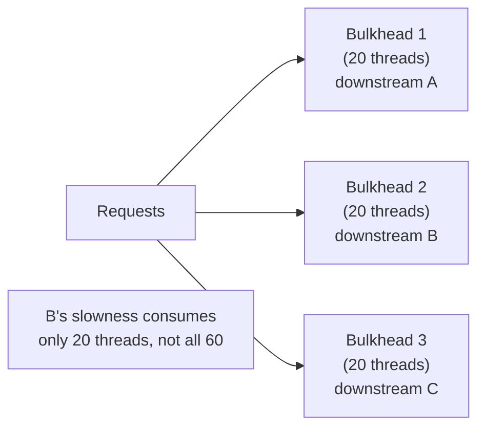
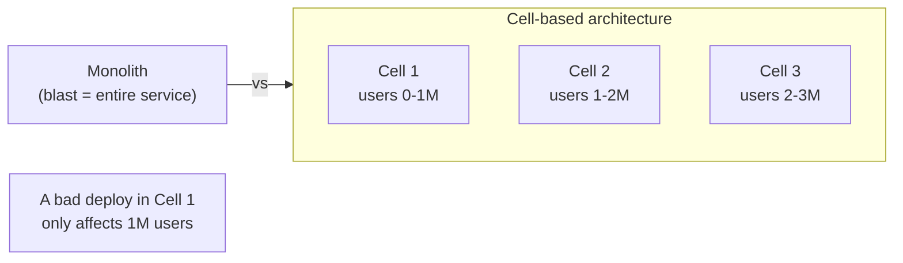
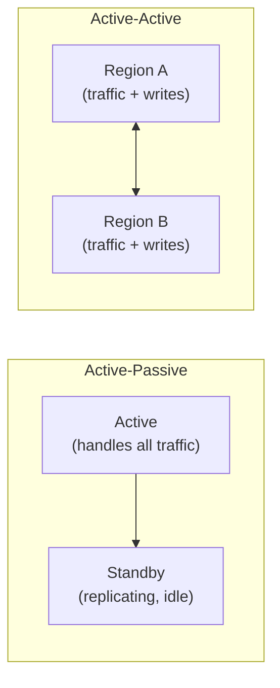
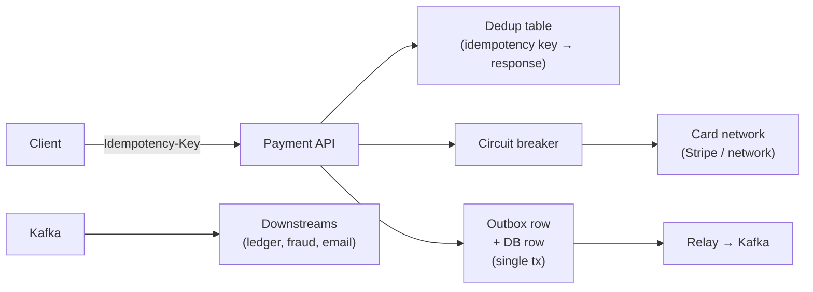

# Beat 5 — Reliability & failure: retries, timeouts, circuit breakers, blast radius

> Series: [System design tradeoffs](../system-design-tradeoffs/) · Prev: [Beat 4 — Async messaging](../system-design-async-messaging/) · Next: [Beat 6 — Coordination](../system-design-coordination/)

## The problem

Distributed systems are fundamentally about **failure**. A single-machine program either runs or doesn't. A distributed system is **partially** failed almost all the time — one node is rebooting, another's disk is filling, a network link is flapping, a downstream is in GC pause. The question is not "how do you prevent failure?" but "how do you make failure routine, contained, and recoverable?"

Principal-level fluency means you reason in:

1. **Timeouts** — every network call has one.
2. **Retries with backoff + jitter** — never naive, never unbounded.
3. **Idempotency** — the precondition that makes retries safe.
4. **Circuit breakers** — fail fast when downstream is sick.
5. **Bulkheads** — isolate failure to one compartment.
6. **Graceful degradation** — partial service > no service.
7. **Blast radius / cell-based architecture** — limit how big a single failure can get.
8. **RPO / RTO** — what data can you lose, how fast can you recover.
9. **Post-incident discipline** — runbooks, game days, chaos engineering.

> "Hope is not a strategy." — Google SRE Book.

---

## 1. Timeouts — the most under-used primitive

**Every** network call has a timeout. Defaults (HTTP libraries' "no timeout" or 30s) are wrong for production.

### How to pick a timeout



Rules:
- **Timeout < your own SLO**, otherwise you can't possibly meet your SLO when downstream is slow.
- **Timeout × max retries < user-visible budget** (e.g., 100ms × 3 < 500ms).
- **Tighter at deeper layers**: if your service has a 1s budget and calls 3 services, each gets ~300ms not 1s.

### Cascading timeouts (deadline propagation)

A common bug: caller timeout = 1s, callee timeout = 5s. Caller gives up, callee keeps working — wasted resources, GC pressure.

The fix: **deadline propagation** — pass the remaining budget in the request (gRPC has this built in: `Deadline`). Callees check the deadline before doing expensive work.

```python
def handle(req, deadline):
    if now() >= deadline:
        return error("deadline exceeded")
    remaining = deadline - now()
    downstream.call(..., timeout=remaining)
```

---

## 2. Retries — necessary, dangerous, often misused

### Why naive retries are an outage in waiting

A downstream gets sick → 10% of requests fail → callers retry → 11% load → more failures → 50% retry → 1.5x load → service dies. This is **retry amplification** — the cure becomes the disease.


### Safe retry pattern

```python
def call_with_retry(fn, max_attempts=3, base_ms=100, max_ms=2000):
    for attempt in range(max_attempts):
        try:
            return fn()
        except RetryableError:
            if attempt == max_attempts - 1:
                raise
            sleep_ms = min(base_ms * (2 ** attempt), max_ms)
            sleep_ms = sleep_ms * (0.5 + random.random())  # jitter ±50%
            time.sleep(sleep_ms / 1000)
```

Three things this code gets right:

1. **Bounded retries** — never infinite.
2. **Exponential backoff** — gives downstream time to recover.
3. **Jitter** — prevents synchronized retry storms.

### What's safe to retry

| Operation | Safe to retry? | Why |
|-----------|---------------|-----|
| `GET /user/123` | Yes | Idempotent. |
| `PUT /user/123` (full replace) | Yes | Idempotent (multiple identical PUTs = one PUT). |
| `DELETE /user/123` | Yes (mostly) | Idempotent — second DELETE returns 404, fine. |
| `POST /charge` | **No** without idempotency key | Could double-charge. |
| Read-only DB query | Yes | — |
| `INSERT INTO orders` | **No** without idempotency key | Could create duplicate orders. |

The **idempotency key** (UUID generated client-side, sent with the request, deduped server-side) is the unlock for retrying writes.

### Retry budgets (Google SRE pattern)

Cap total retries as a percentage of total requests (e.g., max 10% of traffic can be retries). Once exceeded, deny new retries — preserves the system's ability to serve fresh requests.

---

## 3. Idempotency — the precondition for safe retries



### Patterns for idempotent writes

1. **Idempotency key** — client generates UUID, server stores `(key → result)` for the dedup window. Stripe, Square, AWS all do this.
2. **Conditional writes** — `UPDATE ... WHERE version = N` (optimistic concurrency). Retries don't double-apply.
3. **Upserts** — `INSERT ... ON CONFLICT DO NOTHING` (Postgres) / `PUT` (DynamoDB) — idempotent by design.
4. **Natural keys** — derive an ID from the payload (hash of canonical form) so duplicates collapse.

### The dedup window question

> "How long do you keep idempotency keys?"

Answer: **longer than the maximum retry window the client will use**. For HTTP APIs: 24 hours is common. For internal services: hours. Store with TTL; otherwise the dedup table grows forever.

See [Delivery semantics & idempotency](../distributed-delivery-and-idempotency/) for the broker side.

---

## 4. Circuit breakers — fail fast when downstream is sick



- **Closed** — normal. Requests flow through. Track error rate.
- **Open** — fail fast (return error / fallback **immediately**, no call). Save downstream from extra load. Save caller from waiting on timeouts.
- **Half-open** — after cooldown, allow a few probe requests. Promote to closed if they succeed.

### Why this matters

Without a breaker, every request waits the full timeout (say 1s) when downstream is dead. A few requests/sec become a **thread pool exhaustion** because all threads are blocked on dead downstream. The breaker turns 1s waits into 1ms fast-fails — preserving the caller's capacity to serve other endpoints.

### Tuning

- **Threshold:** 50% error rate over 30s is a reasonable default.
- **Cooldown:** 30–60s.
- **Probe count:** 1–3 in half-open.
- **Per-endpoint** breakers, not per-service — `/profile` being slow shouldn't break `/login`.

### Libraries that do this for you

Resilience4j (JVM), Polly (.NET), gobreaker (Go), Hystrix (deprecated), Envoy / Istio (sidecar — universal).

---

## 5. Bulkheads — isolate failure compartments

Named after ship hulls divided into watertight sections so one breach doesn't sink the whole ship.



### Mechanisms

- **Thread pools** per downstream (Hystrix-style).
- **Connection pools** per downstream — bound the number of concurrent calls.
- **Process / container** per workload — noisy-neighbor isolation.
- **Separate clusters** for different tenants or workloads (small batch jobs don't share compute with the latency-sensitive API).

The trade: more pools = more overhead, less elasticity. Worth it for any downstream that has a real chance of going slow.

---

## 6. Graceful degradation

The principal mantra: **partial service is better than no service.** When something fails, what's the simplest thing that still works?

| System | Full service | Degraded service |
|--------|--------------|-------------------|
| News feed | Personalized, ranked feed | Reverse-chronological friends-only |
| Search | ML-ranked + filters + suggestions | Lexical match only |
| Maps | Live traffic + ETA + reroute | Static map + last-known route |
| Streaming | 4K + multi-stream + DRM | 720p + single stream |
| Checkout | Saved cards + recommendations + reviews | Plain checkout, type the card |

### Patterns

- **Fallback values** — cached or constant when downstream fails.
- **Feature flags** — kill switches for expensive features.
- **Fallback paths** — call a simpler service when the rich one fails.
- **Read-only mode** — disable writes when the write path is impaired.

### What to communicate to the user

A partial-service experience must say *something* — silent failure is worse than no service because the user doesn't know to retry / refresh.

---

## 7. Blast radius and cell-based architecture

The largest unit that can fail together is the **blast radius**. Reduce it.



### What "cell" means

A cell is an **independent stack** (services + DB + cache + queues) serving a slice of traffic. Cells share nothing on the data plane — they may share a control plane (deployer, identity).

### Slicing strategies

- **By user/account** — most common. Stripe does this.
- **By region** — natural blast-radius boundary.
- **By tenant tier** — enterprise customers get their own cell.
- **Shuffle sharding** (AWS) — each customer maps to a small random subset of cells. Even if a cell dies, only a fraction of customers lose service. Pairs nicely with load shedding.

### What it costs

More infra, more deploys, more dashboards, more on-call complexity. Worth it when:

- Your service is mission-critical for many tenants.
- You've had outages that affected everyone at once.
- Compliance / data residency drives per-region or per-tenant isolation.

---

## 8. RPO and RTO — define what "down" means

| Term | Question it answers | Example |
|------|---------------------|---------|
| **RPO** (Recovery Point Objective) | "How much data are we OK losing?" | "RPO = 5 minutes" → can lose last 5min of writes. |
| **RTO** (Recovery Time Objective) | "How fast must we be back up?" | "RTO = 1 hour" → service restored within 1h of disaster. |

### How they shape design

| RPO / RTO | Implication |
|-----------|-------------|
| RPO = 0, RTO ≈ 0 | Active-active multi-region with synchronous replication (Spanner-class). Expensive. |
| RPO ≤ 5min, RTO ≤ 1h | Async cross-region replication + automated failover (Aurora Global, DynamoDB Global Tables). |
| RPO ≤ 1h, RTO ≤ 24h | Periodic backups to another region; restore on demand. |
| RPO/RTO N/A | Single region, snapshots locally. Fine for non-critical services. |

The Principal-level move: **state RPO/RTO before designing the failover story.** Otherwise you'll over-engineer (and pay too much) or under-engineer (and explain it during the post-mortem).

---

## 9. Failover topologies



| | Active-Passive | Active-Active |
|--|----------------|---------------|
| Cost | Pay for standby that idles | Both regions in use, better $/req |
| Failover time | Seconds to minutes (DNS, warm-up) | ~zero (already serving) |
| Conflict handling | None (only one writer) | Required (multi-leader semantics) |
| Complexity | Low | High |
| Best for | Strong-consistency systems where conflict resolution is impractical | Stateless services + eventually consistent stores |

The "active-active for everything" trap: it sounds great until two writers update the same row in two regions and you have to write conflict-resolution code for every entity.

---

## 10. Chaos engineering & game days

The only way to know your reliability story works is to **break things on purpose**.

- **Chaos Monkey** (Netflix) — random VM termination in prod.
- **Latency / partition injection** — Toxiproxy, Chaos Mesh, AWS Fault Injection Simulator.
- **Game days** — scheduled exercises where on-call practices "the database is down for 1 hour, what now?"
- **Load tests at 1.5x peak** — find the cliff before the cliff finds you.

Principal-level signal: "we run a quarterly game day where we kill the primary region; last time we found three runbooks were stale."

---

## 11. Worked example — payment service reliability

**Service:** processes card charges. p99 < 500ms, 99.99% availability, RPO = 0 (no lost charges).



**Tradeoffs called out:**

- **Idempotency key** mandatory; retries safe.
- **Timeout** 2s on card network (their published p99); **circuit breaker** opens at 25% errors over 30s.
- **Bulkhead**: card-network calls in their own thread pool — even if Visa is slow, our `/refund` endpoint still works.
- **Outbox** ensures the ledger event is published if-and-only-if the DB write commits.
- **Active-active in two regions** with sticky routing per merchant; idempotency key dedup is global (Dynamo with Global Tables).
- **RPO = 0** achieved by synchronous WAL replication for the dedup table; charges that fail to replicate fail closed.
- **Graceful degradation**: if fraud service is down, we either fall back to "block this merchant" or "let through if amount < $X" depending on risk policy — feature-flagged.
- **Game day** quarterly: kill one region, prove RTO < 90s.

---

## Common interview questions

### Q: "How do you set timeouts?"

> "Start from the SLO and work backward. If my service has a 500ms budget and I make three downstream calls, each gets ~150ms minus overhead — not the full 500. I size each timeout at downstream p99 × ~1.5 so I tolerate normal variance but fail fast on real slowness. I pass deadlines through the call chain (gRPC's Deadline pattern) so callees don't waste work after the caller has given up. And I never use the library default — those are usually 30s or none, which is wrong for production."

### Q: "Walk me through a retry strategy."

> "Bounded retries (typically 2–3), exponential backoff, full jitter (e.g., randomize 0..2^n × base). I retry only on idempotent operations or on operations with an idempotency key. I track a retry budget — say no more than 10% of total traffic — to avoid amplifying an outage. And I keep an eye on which error codes I retry: 5xx and timeouts yes, 4xx no (it's the caller's fault, retrying won't fix it)."

### Q: "Explain circuit breakers."

> "A breaker tracks errors to a downstream and trips open when the rate crosses a threshold. While open, calls fail fast — no waiting for timeouts — preserving the caller's threads and giving the downstream room to recover. After a cooldown the breaker goes half-open, lets a probe through, and either closes (recovery) or re-opens. The win is twofold: protecting the caller from cascading slowness, and protecting the downstream from a retry storm. I use them per-endpoint, not per-service."

### Q: "How does a bulkhead differ from a circuit breaker?"

> "Bulkhead is structural isolation — separate thread pools or connection pools per downstream so one slow dep can't exhaust shared resources. Circuit breaker is a behavioral response — when errors spike, stop calling for a while. They compose: bulkhead caps the damage radius even before the breaker trips."

### Q: "What's the safe way to make a payment retryable?"

> "An idempotency key generated by the client and stored on the server with the response. Server-side: when a request arrives, look up the key first — if it's a duplicate, return the cached response without doing the work again. Persist the (key, response) atomically with the side effect. TTL the table at, say, 24 hours so it doesn't grow forever. Stripe and AWS both do this; it's the canonical pattern."

### Q: "What's blast radius?"

> "The largest unit of your system that fails together. A monolith's blast radius is the whole service. A regional deploy's is one region. A cell-based architecture's is one cell — say a million users. Reducing blast radius is the most reliable reliability win, because it bounds the worst-case incident regardless of cause. Combine with shuffle sharding for AP-style isolation: each tenant maps to a small random subset of cells, so even a cell loss only affects a fraction of any tenant's traffic."

### Q: "RPO 0, RTO 0 — possible?"

> "Asymptotically yes, in practice no. RPO 0 means synchronous replication, which means you commit when *every* replica acks — if a replica is across a 100ms link, every write pays 100ms. RTO 0 means active-active with no failover, which means multi-leader writes and conflict resolution. You can approximate both with Spanner-class infrastructure at significant latency and dollar cost. Most businesses set RPO/RTO to small but non-zero values that the workload can actually tolerate."

### Q: "How would you test reliability?"

> "Three layers. Unit/integration: chaos in CI — inject failures into mocks, assert graceful degradation. Staging: load test at 1.5x peak, then break dependencies (Toxiproxy: kill a service, slow a network, fill a disk). Production: quarterly game days where on-call practices the runbook for a real failure scenario; chaos engineering tools that inject low-blast-radius faults continuously (Chaos Monkey kills VMs, FIS injects latency). The runbook only counts if it's been used recently."

### Q: "How do you handle a downstream that's permanently slow today, not just intermittently failing?"

> "Three moves in order: (1) put the calls behind a bulkhead so they can't exhaust caller threads; (2) trip a circuit breaker so calls fail fast and we save downstream cycles; (3) graceful degradation — return a fallback (cached, default, simpler service) and tell the user. Long term, work with the downstream owners on capacity or remove the dependency from the hot path. The wrong response is to bump timeouts — that just means the failure takes longer."

---

## See also

- Next: [**Beat 6 — Coordination & consensus**](../system-design-coordination/)
- Prev: [Beat 4 — Async messaging](../system-design-async-messaging/)
- [Delivery semantics & idempotency](../distributed-delivery-and-idempotency/) — deeper on the idempotency story.
- [Stock price fan-out walkthrough](../system-design-stock-notifications/) — gap detection, sequence numbers, snapshot+delta — practical reliability primitives.
