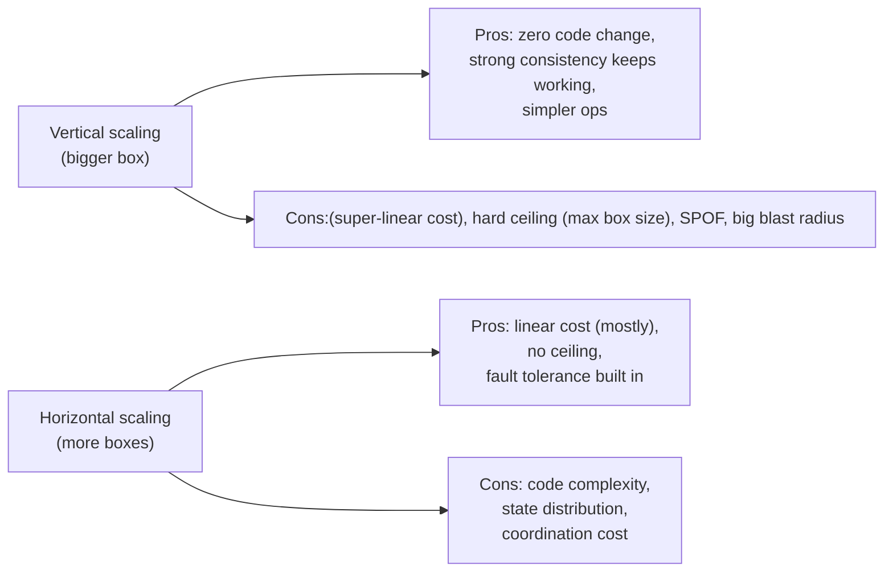
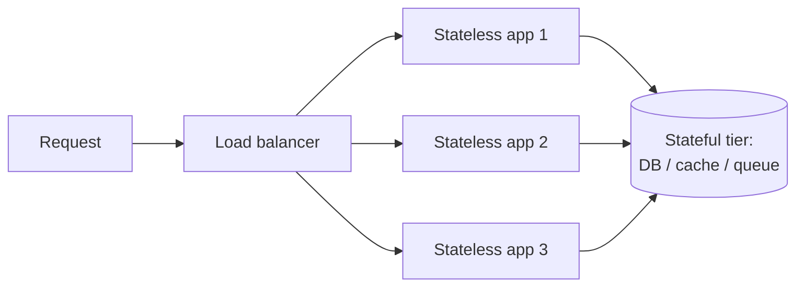
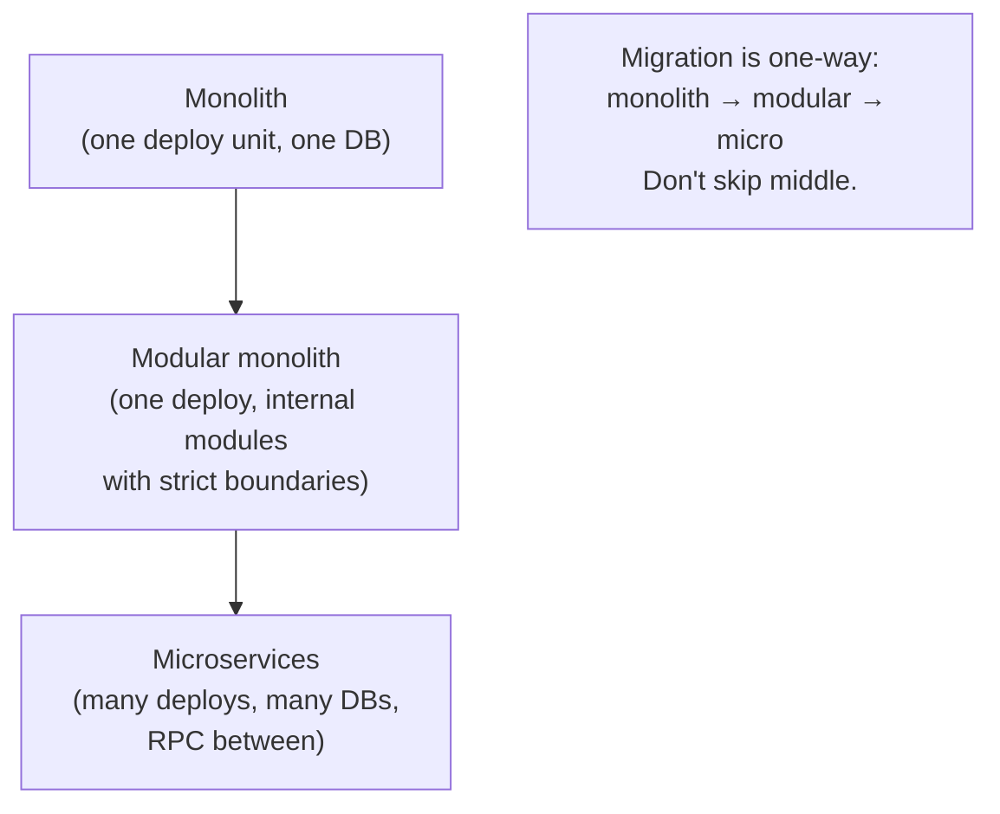
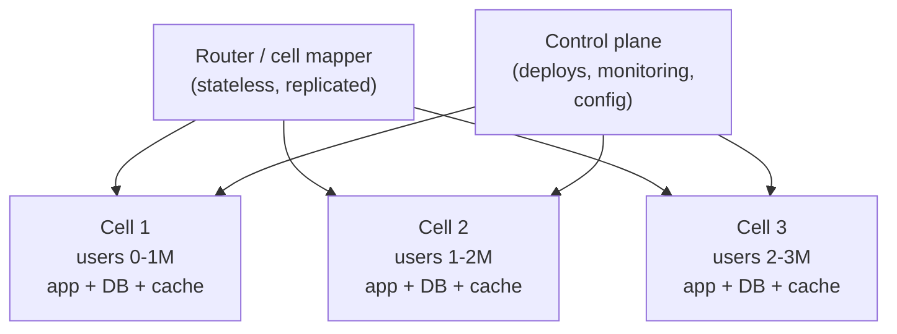
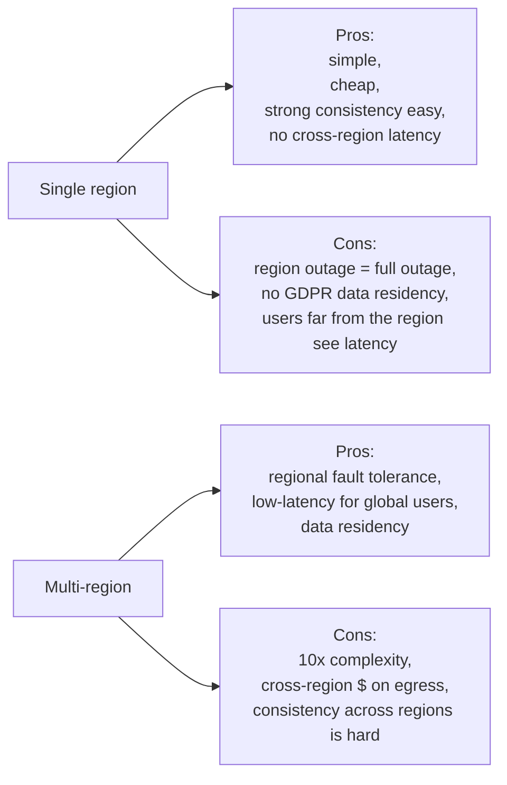
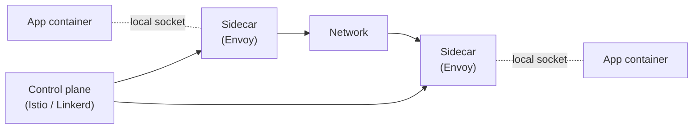
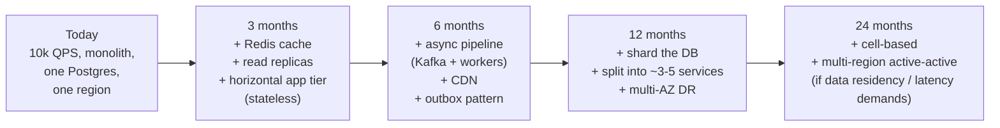

# Beat 7 — Scale & topology: vertical vs horizontal, monolith vs microservices, multi-region

> Series: [System design tradeoffs](../system-design-tradeoffs/) · Prev: [Beat 6 — Coordination](../system-design-coordination/) · Next: [Beat 8 — Cross-cutting patterns](../system-design-cross-cutting/)

## The problem

"Just add more servers" is a Senior answer. Principal answers come with constraints attached: which axis are you scaling, what does it cost, what new failure modes does it introduce, and what's the migration plan from where you are?

Principal-level fluency means you can:

1. Pick **vertical vs horizontal** scaling consciously, not by reflex.
2. Distinguish **stateless** (trivial to scale) from **stateful** (every move is hard).
3. Defend **monolith vs modular monolith vs microservices** with team and ops cost in the equation.
4. Design **cell-based architectures** to bound blast radius.
5. Reason about **single-region vs multi-region**, active-active vs active-passive, follow-the-sun.
6. Understand the **edge cost** of every cross-DC and cross-region call.

This beat builds on Beat 5 (blast radius, RPO/RTO) and Beat 6 (coordination cost). Read those first if you skipped.

---

## 1. Vertical vs horizontal — the bedrock choice



### When vertical wins

- **State that resists sharding** (graph DBs over a tightly-connected graph).
- **OLTP databases** below a single-box write ceiling (~10–100k writes/sec on modern Postgres).
- **Caches with hot keys** that can't be split.
- **Early-stage products** where engineering time is scarcer than money.

A modern EC2 instance has 192 vCPUs and 1.5 TB RAM. Many "scale problems" disappear when you discover your DB was on an `r5.large`.

### When horizontal wins

- Stateless tier (always horizontal — pets vs cattle).
- Beyond the single-box ceiling.
- When you need geographic distribution.
- When you need fault isolation.

### The cost curve

Vertical cost is roughly **quadratic** at the high end (a 4xlarge is more than 2× a 2xlarge in $/CPU). Horizontal cost is roughly linear, **plus an overhead constant** (load balancer, replication, coordination).

```
Cost
 |
 |   Vertical (steepens)
 |  /
 | /
 |/    Horizontal (linear + constant)
 +--------------------- Capacity
```

The crossover is where horizontal becomes cheaper. For most production services, that's surprisingly low — but for a single-leader DB, vertical can pay for years.

---

## 2. Stateless vs stateful



### Stateless tier

- Any instance can handle any request.
- Add/remove instances at will (autoscaling).
- Failure of one instance is invisible to ongoing requests (after a failed retry).
- The simplest distributed system you'll ever build.

### Stateful tier

- A given piece of state lives somewhere specific (a shard, a replica, a partition leader).
- Adding/removing nodes triggers **rebalancing** (slow, risky).
- Failure means failover (consensus, quorum, fencing).
- Where all the hard problems live.

### Two design axioms

1. **Push state to the edges.** Make as much of the middle stateless as possible. State concentrates in DBs, caches, and brokers — fewer things to worry about.
2. **State that must be local should be local.** Sticky sessions, in-memory caches, partition leadership — when the work and the data are co-located, latency drops by 10–100x.

### The "sticky session" tax

Sticky sessions (route a user to the same server) buy in-memory speed at the cost of:

- Uneven load (whales)
- Failover pain (where does the session go?)
- Deploy complexity (drain connections gracefully)

Use them only when you can't easily externalize state. Modern alternative: externalize to Redis/Memcached and keep the tier stateless.

---

## 3. Monolith vs microservices vs modular monolith

The Principal answer is rarely "microservices everywhere." Microservices solve **organizational** problems first and **technical** problems second. If your organization is 8 engineers, microservices will create more problems than they solve.



### The honest comparison

| Axis | Monolith | Modular monolith | Microservices |
|------|----------|------------------|---------------|
| Deploy unit | One | One | Many |
| Local dev setup | `npm run dev` | `npm run dev` | Docker compose with N services + brokers + DBs |
| Refactoring across modules | Easy (compiler catches) | Easy | Hard (cross-team coordination, API versioning) |
| Independent scaling | No | No | Yes |
| Independent deploys | No | No | Yes |
| Team autonomy | Low | Medium | High |
| Operational complexity | Low | Low | High (10–100× more dashboards, alerts, runbooks) |
| Latency overhead | None | None | Network hops (each call ~1ms intra-DC) |
| Failure modes | Crash = whole app | Crash = whole app | Cascading failures, partial outages, RPC bugs |
| Sweet team size | 1–8 engineers | 5–25 | 25+ across ≥3 teams |

### When microservices win

- **Multiple teams** working independently on different parts.
- **Different scaling profiles** (image processing needs GPUs, API needs RAM).
- **Different SLAs** (payments must be 99.99%, recommendations 99%).
- **Different release cadences** (mobile feature ships weekly, billing every 6 months).

### When microservices lose

- Small team trying to look like Netflix.
- Premature decomposition before domain boundaries are stable.
- Network call where a function call would have done.

### The Conway corollary

> "Organizations design systems that mirror their communication structure." — Melvin Conway.

If you have a monolithic team, you'll build a monolithic system whether you call it microservices or not. Inverse Conway maneuver: shape the team boundaries to the boundaries you want in the system.

---

## 4. Cell-based architecture (the modern AP-scale answer)

Mentioned in [Beat 5 — reliability](../system-design-reliability/#7-blast-radius-and-cell-based-architecture). Here we go deeper because cells are also a **scale** primitive.

### Anatomy



### Why cells scale

- **Capacity** scales by adding cells, not by growing one. New cell, new tenants.
- **Blast radius** scales the *opposite* way — bigger system, same cell size.
- **Deploys** can be **canaried per cell** — push to one cell, watch, push to the rest.
- **Multi-tenant isolation** is structural, not just logical.

### The router is the only shared thing

The router is **stateless** (just a hash / lookup) and replicated. It must be ridiculously available. Cell mapping changes are rare and use the same `expand → migrate → contract` discipline as schema changes.

### Shuffle sharding (the AWS twist)

Each customer is mapped not to one cell but to a small **random subset** (say 4 of 64 cells). If a cell goes down, only customers whose subsets included that cell are affected — and they have other cells still serving. With 4 of 64, the chance of *any two specific customers* sharing all four cells is astronomically small, so noisy-neighbor blast is minimized.

### Real-world examples

- **Slack workspaces** are sharded into "shards" that look a lot like cells.
- **Stripe accounts** are sharded for blast-radius limits.
- **AWS S3** uses shuffle-sharded request handlers internally.

---

## 5. Single-region vs multi-region



### Don't go multi-region until you must

The minimum viable cause: **a real business reason** — regulatory (GDPR, data residency), a market segment that demands low latency in another continent, a customer with a 4-nines availability SLA that single-region can't meet.

"Disaster recovery" alone often isn't enough — most teams over-pay for active-active when active-passive (warm standby) gives them their RTO/RPO at a fraction of the cost.

### Multi-region patterns

| Pattern | What | When |
|---------|------|------|
| **Active-Passive (warm standby)** | One region serves; another replicates and waits. Failover via DNS/Route53 in minutes. | RPO ≤ 5min, RTO ≤ 30min, predictable cost. |
| **Active-Active per shard** | Each shard has a home region; users routed there. Other regions are read-only replicas. | Geographically partitioned users (EU users in EU). |
| **Active-Active fully replicated** | All regions accept writes for all data; conflicts resolved (LWW, CRDT, app-level). | Truly global users + low write latency required + you can stomach conflict resolution. |
| **Follow-the-sun** | Active region rotates with the working day. | Internal corporate apps with predictable usage curves. |

### The latency tax

| Operation | Cost |
|-----------|------|
| Round trip same DC | ~0.5ms |
| Round trip same region (cross-AZ) | ~1ms |
| Round trip cross-region (US East ↔ US West) | ~70ms |
| Round trip cross-continent (US ↔ EU) | ~80ms |
| Round trip cross-continent (US ↔ Asia) | ~150ms |

A "synchronous cross-region write for consistency" therefore costs 70–150ms minimum. Your p99 SLO must accommodate that or you can't do it.

### The egress tax

Cross-region traffic is the **most expensive byte you can move**. AWS charges ~$0.02/GB inter-region (was $0.09/GB cross-continent for years). Replicating a 1 TB DB across regions = $20+/day for the replication alone, before storage and compute.

This is why "stream the entire warehouse to every region" is a bad answer. **Process locally, ship summaries.**

---

## 6. Multi-AZ vs multi-region — different problems

| | Multi-AZ | Multi-region |
|--|----------|---------------|
| Distance | < 100km, < 1ms RTT | > 1000km, 10–150ms RTT |
| Failure correlation | Power, cooling can affect AZ; rare regional events affect region | True regional events (hurricane, fiber cut) |
| Sync replication | Cheap and normal | Expensive, often impractical |
| Data residency | Same region = same legal zone | Different jurisdictions |
| Default for HA | **Yes — multi-AZ should be the default**. | Only when justified. |

The Principal-level habit: **everything is multi-AZ; multi-region is opt-in per service** based on its real requirements.

---

## 7. Service mesh & sidecars (the "infrastructure as a service" wave)



A **service mesh** (Istio, Linkerd, Consul Connect) puts a proxy (sidecar) next to every service. The proxy handles:

- mTLS between services
- Retries, timeouts, circuit breakers
- Load balancing
- Observability (metrics, tracing, access logs)
- Traffic shaping (canaries, A/B)

### When to adopt

- You have **many services** and don't want each team reimplementing reliability primitives.
- You want **uniform mTLS** without per-language libraries.
- You need **canary deployments** with traffic-percentage routing.

### When not to

- Small service count: the mesh's operational complexity exceeds its benefit.
- Performance-critical paths: every sidecar adds ~1ms and a process boundary.
- You don't have an SRE/platform team to run it.

The Principal answer: **mesh is a platform investment**. Adopt it when the org is ready for the platform, not because Istio is on a tech-radar slide.

---

## 8. Worked example — designing for 10x growth

Common interview challenge: "your system handles 10k QPS today, the prompt is 1M QPS in 2 years. Walk me through."

### Scaling plan, in stages



### The Principal moves in this answer

1. **Don't jump straight to multi-region.** First exhaust caching, replicas, and async — usually 80% of the wins.
2. **State why each step.** "Read replicas because read:write is 100:1 and the master CPU is at 60%." Numbers > vibes.
3. **Identify the next bottleneck before solving the current one.** "Adding cache reduces DB load to 10%, then we'll be CPU-bound on app tier — autoscaling there is trivial."
4. **Defer microservices and multi-region** until they're forced by org / regulatory / scale that nothing else solves.

---

## Common interview questions

### Q: "Vertical or horizontal scaling — which do you pick first?"

> "Vertical for stateful tiers until you hit a real ceiling — modern boxes are huge, code stays simple, no consistency tax. Horizontal always for stateless tiers — autoscaling, fault tolerance, cheaper at the high end. The cost curve flips at the top: at small scale vertical is cheaper per unit, at large scale horizontal pulls ahead. The skill is recognizing where you are."

### Q: "When do you pick microservices?"

> "When the **organization** demands them — multiple teams need independent deploys, different scaling profiles, different SLAs. Not because microservices are 'better.' A monolith with clean module boundaries is faster to build, faster to debug, and cheaper to run for a single team. Conway's Law says the architecture mirrors the org chart, so I'd inverse-Conway: shape teams to match the boundaries you want, then let services emerge. The biggest mistake I see is decomposing before the domain is stable — refactoring across services is 10x harder than refactoring inside a monolith."

### Q: "Modular monolith — what do you mean?"

> "One deploy unit, but internal modules with **strict** boundaries — explicit interfaces, no shared DB tables across modules, dependency direction enforced (e.g., by a build rule). It gives you most of the architectural discipline of microservices without the operational tax. When a module proves it needs independent deploy or scale, you extract it — and because the boundary already existed, extraction is mostly mechanical."

### Q: "Single-region or multi-region?"

> "Default to single-region with multi-AZ. Multi-region only when there's a concrete trigger: data residency (GDPR), a global user base where one-region latency is unacceptable, or an SLA that requires regional fault tolerance. Multi-region is at least 10x the operational complexity and adds 70-150ms of physics to any synchronous cross-region operation. Most teams over-engineer this and end up with active-active they never failover to."

### Q: "Active-active or active-passive multi-region?"

> "Active-passive is usually right: warm standby in another region, asynchronous replication, failover via DNS in minutes. Cheap, simple, and the failover path is exercised in game days. Active-active is for businesses where you genuinely need low write latency in every region — and you've solved conflict resolution either by data partitioning (each user's home region) or by using a global ACID DB like Spanner. Active-active 'because we want zero downtime' often becomes 'we have two systems silently diverging.'"

### Q: "How does cell-based architecture limit blast radius?"

> "Each cell is an independent stack — app, DB, cache — serving a slice of users. A bad deploy or noisy neighbor in one cell can't reach the others, because there's no shared data plane. Combined with shuffle sharding, where each customer is mapped to a small random subset of cells, the probability that any two customers share all their cells is tiny. So even a cell-wide outage degrades only a fraction of any given customer's surface. The cost is more deploy targets, more dashboards, and a slightly more complex routing layer."

### Q: "How do you scale a stateful service?"

> "Three levers in order. First, vertical — bigger box, more memory, faster disk. Cheap and zero code. Second, read scaling — replicas for reads if read-heavy, with awareness of staleness. Third, horizontal — sharding by a key that matches the dominant access pattern, with consistent hashing for resharding sanity. If the workload doesn't shard cleanly, the right answer might be 'pick a different storage engine' — Spanner, Cockroach, Cassandra all do horizontal scaling structurally rather than as a bolt-on."

### Q: "What's the cost of cross-region traffic?"

> "On AWS, roughly $0.02 per GB inter-region, more for cross-continent. Replicating a 1 TB DB across two regions is ~$20/day in egress alone, ignoring storage and compute. So 'just stream the warehouse to every region' is wrong — you process locally and ship summaries. And cross-region synchronous writes pay 70-150ms of physics, so they're a non-starter for most user-facing SLOs."

### Q: "How would you scale to 10x in 2 years?"

> "I'd plan it as 4–5 stages, each unlocking the next. Stage 1: cache + replicas + stateless app tier — catches 80% of read load. Stage 2: async pipelines + outbox pattern, removes synchronous coupling. Stage 3: shard the DB and decompose hot domains into services. Stage 4: cell-based isolation and multi-AZ DR. Stage 5 (only if forced): multi-region. At each stage I'd identify the next bottleneck *before* solving the current one — wasted work is the biggest scaling cost."

### Q: "Service mesh — when is it worth it?"

> "When you have enough services that the per-team cost of reimplementing retries, mTLS, observability, and traffic shaping exceeds the cost of running the mesh. That's typically 20+ services with multiple languages. Below that, libraries (or sidecar-light approaches) are simpler. Above that, the uniformity is a strategic win — you upgrade one component, every service benefits. And you get canaries and zero-trust networking essentially for free."

---

## See also

- Next: [**Beat 8 — Cross-cutting patterns**](../system-design-cross-cutting/)
- Prev: [Beat 6 — Coordination](../system-design-coordination/)
- [Beat 5 — Reliability — blast radius & cells](../system-design-reliability/#7-blast-radius-and-cell-based-architecture)
- [Beat 2 — Data & storage — sharding strategies](../system-design-data-storage/#6-sharding-and-why-its-the-hardest-to-undo)
