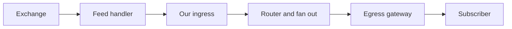
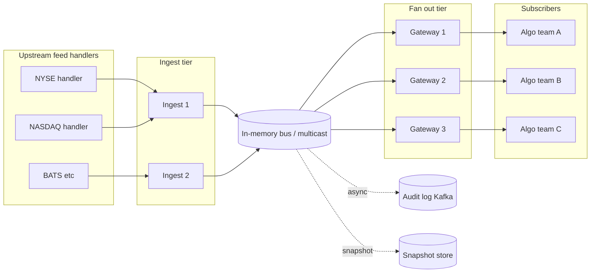
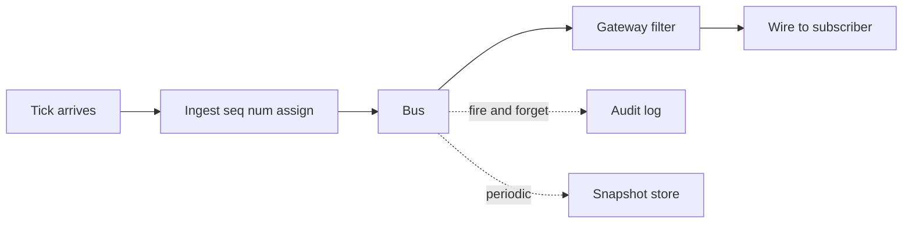
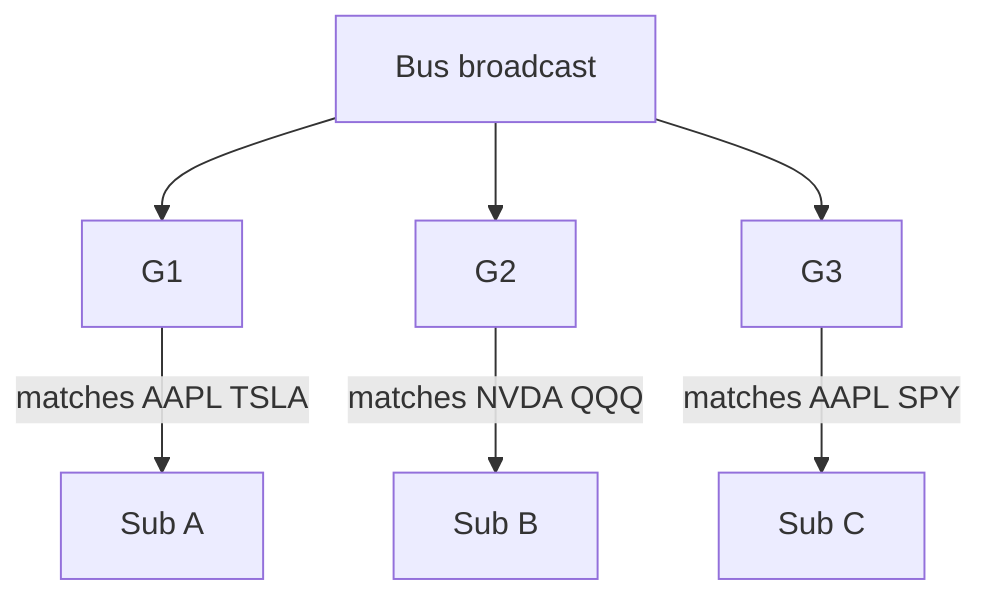
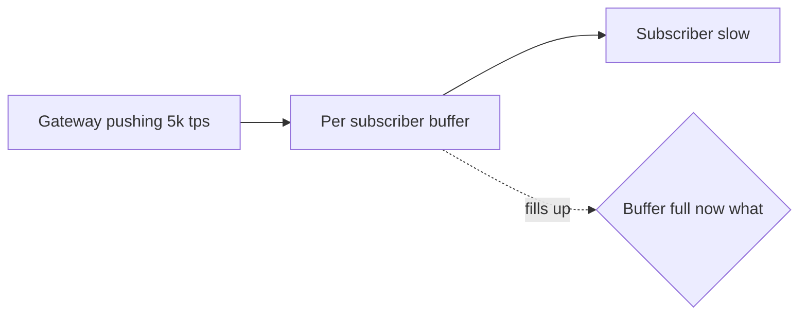
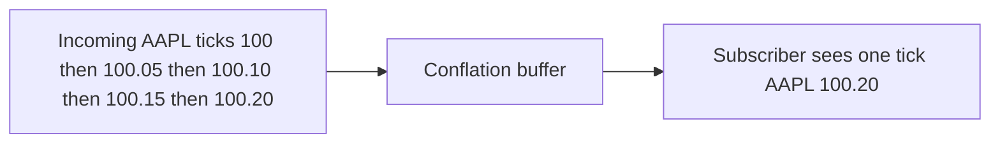
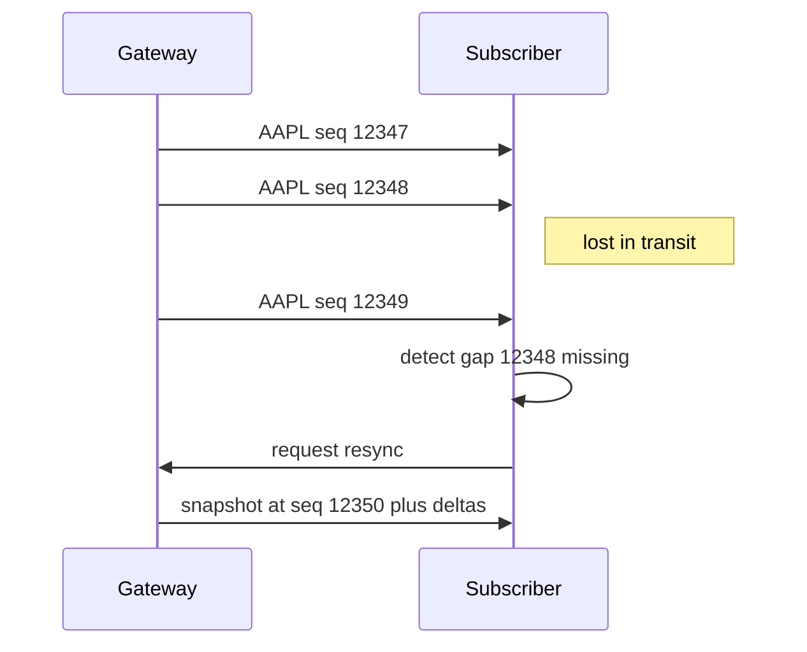

# System design — stock price fan-out service

A long, self-contained walkthrough of one **system design interview question**, end to end: a service that pushes stock price events to many consumers, fast. The framing is **trading-platform** flavored (HRT, Jane Street, Citadel, Bloomberg-style internal infra), but the **method** transfers to any "many producers, many consumers, low latency" design.

This page is structured to be readable cold. Read once top-to-bottom; come back to specific sections during prep.

**See also:** [Browser event loop & real-time UIs](../browser-event-loop/) · [`asyncio` — loop, tasks, cancellation](../python-asyncio/) · [Interview syllabus — distributed systems](../interview-syllabus/#distributed-systems-concept-checklist) · the in-repo demo `apps/shared-rpc-ticker/` (the human-UI variant of this exact problem; clone the repo to run it — not mounted on this site).

---

## 1. The problem (and what makes it interesting)

A trading firm sees the world through **price ticks** — discrete events flowing in from stock exchanges, hundreds of thousands per second, telling you "the bid for AAPL just moved to 187.42." Algorithms and dashboards consume those ticks to make decisions or render screens.

Inside the firm, you need an **internal service** that:

1. Takes raw ticks from upstream feed handlers (per-exchange).
2. Routes them to **many internal subscribers** (algos, traders' UIs, risk dashboards, monitoring) **in under 100 ms**, ideally less.
3. Survives slow subscribers without dragging the fast ones down.
4. Recovers cleanly when something disconnects.

This is the bread-and-butter of trading-platform fullstack roles. It's also one of the cleanest **interview** designs because every interesting distributed-systems concept shows up: fan-out, backpressure, sequencing, idempotency, sharding, hot keys, and the unavoidable physics of network latency.

> **Interviewer's prompt (typical wording):** *"Design a service that notifies our traders about stock price events."*

That sentence is **deliberately vague**. The first thing a strong candidate does is *not draw boxes* — it's clarify what the prompt actually means. We start there.

---

## 2. How to crack a system design interview (the method)

If you take one thing from this page, take this:

> **System design interviews are won or lost in the first five minutes.**

Most candidates fail because they hear "design X" and immediately start drawing components. They've answered a question the interviewer hasn't asked. Senior candidates do something that *feels uncomfortably slow*: they spend 5–8 minutes asking, restating, and writing requirements before any architecture appears.

The skill is **staying in the conversation longer than feels natural**.

### 2.1 The four moves

| Move | What it sounds like | Why interviewers love it |
|---|---|---|
| **Clarify** | "Before I sketch anything — who is the consumer, and what's our latency budget?" | Shows you build the *right* thing, not a generic thing. |
| **Estimate** | "Let me put rough numbers on this — call it 1M ticks/sec at peak, here's why." | Anchors every later decision in math, not vibes. |
| **Restate** | "OK, let me play back what I think we're building before I start." | Buys you 30 seconds, surfaces gaps, signals you listened. |
| **Trade off** | "We could do A or B. A is faster but loses on X. I'd pick B because we said latency dominates." | Designs aren't right or wrong; they trade. Saying so out loud is the seniority signal. |

### 2.2 Two kinds of questions you must ask — FR and NFR

Before any sketch, ask questions in **both** axes:

- **Functional Requirements (FR)** — *what* the system does.
  - Who is the consumer?
  - What is "an event"? Every tick, or only when crossing a user-set threshold?
  - What types of feedback / acknowledgement do consumers send back?
  - What's in scope vs out of scope (e.g. exchange protocol layer)?

- **Non-Functional Requirements (NFR)** — *how strict* the system must be.
  - Throughput: how many events per second, peak vs average?
  - Latency: end-to-end target — p50, p99? Hard or soft?
  - Reliability: can a subscriber miss a message? Replay needed?
  - Ordering: per-key, global, or none?
  - Locality: same datacenter, same region, or globally distributed?
  - Scale: number of subscribers? Number of distinct topics/symbols?

A working rule of thumb:

> **For every "what" question you ask, ask one "how much" or "how strict" question.**

Most candidates only ask FR questions. NFR questions are what unlock the design.

### 2.3 The recovery line for "I don't know"

When the interviewer asks "how many ticks per second do you think there are?" and you have no idea, the wrong answer is *"I don't know, you pick."* That signals you can't reason under uncertainty, and a trading firm cannot use someone who can't.

The right answer is:

> *"I don't know the exact number, but let me reason from what I do know and we can sanity-check at the end."*

Then estimate, badly, out loud. **A bad estimate, narrated, beats no estimate every time.**

---

## 3. Framing this prompt (worked example)

Apply the method. Here's the prompt again:

> *"Design a service that notifies our traders about stock price events."*

### 3.1 The clarification questions (first thing out of your mouth)

A strong candidate would ask, roughly in this order:

**Functional / scope:**

1. **Who is the consumer?** A human trader on a UI, an algorithm subscribing programmatically, or both?
2. **What is "an event"?** Every raw tick (firehose), or only when a per-user threshold is crossed (alert), or specific domain events (order fills, risk breaches)?
3. **Is the upstream side in scope?** Are we ingesting directly from exchanges in their wire protocols (FIX, ITCH, OUCH), or assuming a normalized internal feed?
4. **What downstream actions does this enable?** Pure notification, or do consumers send orders back through it?

**Non-functional / scale:**

5. **What's the target latency, p50 and p99?** And is this end-to-end (exchange → consumer) or just inside our service?
6. **What's the tick volume?** Total messages per second at peak.
7. **How many subscribers, and do they want all symbols or filter to a subset?**
8. **What's the loss tolerance?** Can a subscriber miss a tick, or must we replay?
9. **Must ticks be ordered?** Per-symbol? Globally?
10. **Where are subscribers?** Same datacenter, same region, or remote?

That's ten questions. A real interview will only let you ask 3–5 before they say "let me give you what we have." Pick the load-bearing ones and ask those first.

### 3.2 The picks for this walkthrough

We're going to design the **most HRT-flavored** variant of this prompt. The picks below all map to "this is what HRT actually builds":

| Axis | Pick |
|---|---|
| Consumer | **Algos** — internal backend services in Python and C++ subscribing programmatically. We'll cover the human-UI variant in a later section. |
| Event type | **Raw firehose** — every price tick from the upstream feed, not threshold alerts. |
| Upstream scope | **Out of scope** — assume one normalized feed handler per exchange already exists. |
| Latency target | **Sub-100 ms p99 end-to-end**, of which our service should consume ≤ 50 ms. (Real HRT cares about microseconds; we use 100 ms as the prompt's stated bar.) |
| Reliability | **Lossless on the happy path; reconnect with snapshot + delta** if a consumer drops. |
| Ordering | **Per-symbol FIFO**. Global ordering is unnecessary and very expensive. |
| Locality | **Same datacenter** as the feed handlers. Sub-100 ms p99 across continents is physically hard. |

### 3.3 The restatement (say this out loud)

> *"OK, let me play this back. We're building an internal **market-data fan-out service**. Upstream, I assume one normalized feed-handler per exchange already exists — that's out of scope. Downstream, my consumers are other backend services — algos, mostly Python — that subscribe to the raw tick firehose, optionally filtered by symbol set. Target end-to-end latency p99 is sub-100 ms, of which I'd like our service to consume under 50 ms. Per-symbol FIFO ordering, lossless on the happy path, reconnect with snapshot+delta. All in one datacenter. Does that match what you have in mind?"*

Read that aloud once. It scopes the problem, surfaces every assumption, and *invites correction*. That paragraph alone is worth 10 minutes of nodding.

---

## 4. Estimation — putting numbers on it

Now we turn the picks into numbers. The numbers will dictate the architecture.

### 4.1 How many ticks per second? (Fermi method)

You probably don't know this number. That's fine. Reason from what you do know.

| What I know-ish | Number |
|---|---|
| Active US-listed equities (incl. ETFs) | ~8,000 |
| Trading hours per day | 6.5 hours ≈ 23,000 seconds |
| Daily share volume across all US equities (rough) | ~10 billion shares/day |
| Trades vs quote updates | Quotes ≫ trades, ~10–50× more quote updates |

Decompose:

- **Trades/sec average** = 10B / 23k ≈ **430k/sec**.
- **Trades/sec at peak** ≈ 3–5× average ≈ **1.5M/sec**.
- Add quote updates at 10–50× → **10M–50M messages/sec** at the peak of the consolidated feed.

Pick a clean number: **1M ticks/sec at peak** for our service. Whether the real number is 500k or 5M, the qualitative shape of the design doesn't change. State your assumption, move on.

> **Interview move:** pick a *round* number and *say why you picked round*. "I'll use 1M/sec — I think the real number is 1–10M but the math doesn't shift qualitatively, and round numbers are easier to reason about." That sentence buys you trust.

### 4.2 Fan-out — the most important number

We have **30 algo teams** subscribing, each averaging **200 symbols** out of ~8,000.

**Naive (uniform) calculation:**

```
P(any given team subscribes to symbol S) = 200 / 8000 = 0.025
Expected teams per tick = 30 × 0.025 = 0.75
Total deliveries/sec      = 1M × 0.75 = 750k deliveries/sec
```

That feels manageable. **It is also wrong.**

Real markets are heavily skewed. The top 100 symbols (AAPL, NVDA, SPY, TSLA, QQQ, …) carry ~50% of the tick volume, and **every** algo team subscribes to those. The long tail of 7,900 symbols carries the other 50% with sparse subscriptions.

**Refined:**

```
Hot symbols (top 100): 500k ticks/sec × 30 teams = 15M deliveries/sec
Long tail (other 7,900): 500k ticks/sec × ~0.75   ≈ 375k deliveries/sec
Total                                              ≈ 15M deliveries/sec
```

That's a **20× difference** between the naive answer and the realistic one. The whole design now revolves around the **hot-symbol problem**: a single naive node trying to fan out AAPL alone would melt.

This is the single most important observation on the page. Everything in section 7 (fan-out patterns) exists to handle it.

### 4.3 Bandwidth math

Per-tick payload, packed binary:

| Field | Bytes |
|---|---|
| Symbol id (u64) | 8 |
| Price (f64 or fixed-point i64) | 8 |
| Size / quantity (u32) | 4 |
| Timestamp (ns since epoch, u64) | 8 |
| Side / exchange / flags | 4 |
| **Subtotal** | **32** |
| Framing + sequence + headers | ~18 |
| **Total per message** | **~50** |

Throughput:

| Layer | Messages/sec | Bandwidth |
|---|---|---|
| Upstream ingest | 1M | 50 MB/s ≈ **400 Mbps** |
| Downstream fan-out (with hot-symbol skew) | 15M | 750 MB/s ≈ **6 Gbps** |

**Takeaway:** ingest is small, fan-out dominates by an order of magnitude. The system is bottlenecked downstream, not upstream. *That single fact decides almost every architecture choice.*

### 4.4 Latency budget

End-to-end p99 budget of 100 ms, broken down:

| Hop | Budget |
|---|---|
| Upstream feed-handler → our ingress | ~5 ms |
| Our processing (parse, route, serialize) | ≤ 50 ms |
| Network: our egress → subscriber (same DC) | ~1 ms |
| Subscriber receive + framework overhead | ~10 ms |
| **Total p50** | **~20 ms** |
| **Slack for p99 jitter** | ~80 ms |



Any hop that adds >5 ms p99 is suspect. Synchronous database writes on the hot path are out. JSON serialization is probably out (slow + bloated).

> **Sidebar — interview-flavored honesty:** real HRT cares about **microseconds**, not 100 ms. If an interviewer pushes back ("we'd never accept 100 ms"), the right answer is *"Agreed, 100 ms is loose for this domain — what's our actual bar?"* Renegotiate the spec; don't argue. That, too, is a senior move.

---

## 5. What the numbers force on the design

Before we draw a single architecture box, the math has already locked in five decisions:

1. **One datacenter, fast internal network.** 6 Gbps of fan-out plus sub-100 ms p99 means no cloud-region replication on the hot path. Speed of light is real: New York ↔ London is ~70 ms one-way *on the wire alone*.
2. **Broadcast-style fan-out beats per-subscription routing for hot symbols.** Pushing AAPL through one router node = 30 deliveries × 50 bytes × 20k AAPL ticks/sec ≈ 30 MB/s on one link. Survivable for one symbol but stacks badly across the top-100.
3. **No synchronous database writes on the hot path.** Anything durable goes to a side-channel (write-behind log, Kafka topic on the side for audit). The hot path is in-memory only.
4. **Binary protocol, batched frames, persistent connections.** 15M deliveries/sec with TCP-per-message ack and JSON would not finish parsing before the next tick arrived. Think gRPC streaming, raw WebSocket binary frames, or custom UDP-multicast inside the DC.
5. **We can't TCP-fan-out from one process.** A single Linux box might handle ~1–2 Gbps of TCP egress before kernel/socket overhead bites. 6 Gbps means **multiple egress nodes**, which means **a fan-out tier**, which means horizontal scaling, which means we now have a distributed-systems problem (consistency, hashing, failure handling).

Notice: we haven't drawn anything yet, but five decisions are already made. *That's why estimation comes before boxes.*

---

## 6. High-level architecture

Now we draw. The math says: ingest tier → fan-out tier → subscribers, with a side-channel for durability.



### 6.1 Components, one paragraph each

- **Ingest nodes** — read normalized ticks from each upstream feed handler, attach our internal sequence number per symbol, and publish to the bus. Stateless except for the per-symbol sequence counter; trivially horizontally scalable per exchange.
- **Bus** — the fan-out fabric. Could be UDP multicast inside the DC (lowest latency, classic trading-system choice), or a custom in-memory pub/sub, or Aeron, or a tightly-tuned Kafka cluster (for less latency-sensitive flavors). The point is: ingest writes once, all gateways read.
- **Gateway nodes** — hold persistent subscriber connections, maintain each subscriber's symbol filter, deliver matching ticks. This is where most of the CPU goes. Horizontally scaled by *subscriber*, not by symbol.
- **Subscribers** — algo processes. Receive a binary stream over a persistent connection, decode in their address space.
- **Audit log (async, off the hot path)** — every tick is also written to a durable log (Kafka, or just rolled binary files) for post-trade analysis, replay, and compliance. Subscribers don't read this; it's a side-channel.
- **Snapshot store** — periodic per-symbol "latest known state" snapshots, used for reconnect (see section 9).

### 6.2 What lives on the hot path vs the side-channel

The hot path is **ingest → bus → gateway → subscriber**. Everything else is async.



**Why this matters:** if the audit log goes down, ticks still flow. If Kafka is slow, ticks still flow. The hot path has zero blocking dependencies on durable storage. That's the only way you hit 50 ms p99 reliably.

---

## 7. Deep dive — fan-out

Fan-out is "one input, many outputs." Sounds easy. The 15M deliveries/sec number from section 4.2 says it isn't.

### 7.1 Three patterns

| Pattern | How it works | Pros | Cons |
|---|---|---|---|
| **Per-symbol shard** | Hash symbol → one shard owns it. That shard does fan-out for all subscribers of that symbol. | Simple. Each shard knows its subscribers. Easy ordering. | **Hot keys melt one node.** AAPL alone ≈ 20k ticks/sec × 30 subs × 50B = 30 MB/s on one machine. Still OK for one symbol; multiply by top-100 hot symbols and you've concentrated 70% of total fan-out on a few nodes. |
| **Broadcast + local filter** | Every gateway sees every tick. Each gateway filters to its own subscribers and delivers. | No hot-key problem. Trivial to add gateway capacity. Excellent for "many subscribers, each filtering to ~tens of symbols." | Wastes work: every gateway parses every tick even if it owns zero subscribers for that symbol. CPU bound at very high tick rates. |
| **Hybrid (replicated hot shards)** | Most symbols use per-shard. Top-N hot symbols are *replicated* across multiple shards; subscribers for those symbols are split across replicas. | Best of both worlds in theory. | Most complex. Requires identifying hot symbols and rebalancing live. |

For our 1M ticks/sec × 15M deliveries/sec scale with hot-symbol skew, **broadcast + local filter** is usually the right starting point. The wasted parse-and-filter work (every gateway reads every tick, even ticks for symbols it has no subscribers for) is cheap on modern CPUs — call it a few hundred nanoseconds per tick. The benefit is that adding gateway #4, #5, #6 is operationally trivial — they just join the multicast group. No rebalancing.



### 7.2 The hot-symbol problem made concrete

Suppose you do pick per-symbol shard, naively. AAPL is ~2% of all ticks → 20k ticks/sec. All 30 algo teams subscribe → 600k deliveries/sec from one shard for one symbol.

```
Throughput required for AAPL on one shard
= 20,000 ticks/sec
× 30 subscribers
× 50 bytes
= 30 MB/sec = 240 Mbps
```

OK on one machine. But:

- The **top 10 symbols** alone are typically 30% of total volume.
- All 30 teams subscribe to all 10.
- One shard owning all 10 = 9 Gbps egress. **Won't fit.**

The hybrid pattern fixes this by replicating each hot symbol across multiple shards and partitioning *subscribers* across the replicas. It works, but it's complicated to operate. Broadcast sidesteps the whole problem.

### 7.3 What HRT-style firms actually use

In practice, market-data fan-out at HRT-tier firms tends to use:

- **UDP multicast inside the datacenter** for the bus (sub-millisecond, kernel-bypass with DPDK/Solarflare). Subscribers join multicast groups.
- **Aeron** or a similar low-latency messaging library for app-level reliability on top of UDP.
- **TCP** (or QUIC) for the last hop to subscribers that can't do multicast (most application teams).

Multicast naturally implements "broadcast + local filter" — every group member sees every message in the group. You can also do per-symbol multicast groups for selective subscription, but at our subscriber-symbol scale (30 teams × 200 symbols = 6,000 (sub, sym) pairs) the management overhead of 8,000 multicast groups isn't worth it. Coarser groups (e.g. one group per exchange or per "hot top 500 + one for everything else") are usually enough.

> **Interview move:** if the interviewer asks "what about Kafka?" — Kafka adds ~5–50 ms latency typically due to batching and disk fsync, and isn't designed for sub-millisecond fan-out. It's a great choice for the **audit log** side-channel; it's the wrong choice for the hot path at HRT-scale. Say so out loud.

---

## 8. Deep dive — backpressure and conflation

This is the section trading-firm interviewers love most. **Backpressure** is what happens when a downstream consumer can't keep up with an upstream producer. The choices you make here are the difference between "system stays alive" and "one slow trader takes down everyone."

### 8.1 The setup

A gateway is happily pushing 5,000 ticks/sec to subscriber X. Subscriber X is a Python process on a machine with a slow disk. Suddenly X starts processing each tick in 1 ms instead of 100 µs. The gateway can't push faster than X can drain.

What does the gateway do?



There are exactly four answers, and you must choose at design time.

### 8.2 The four choices

| Policy | What happens | When it's right | When it's a disaster |
|---|---|---|---|
| **Block the producer** | Gateway stops reading from the bus until the slow subscriber catches up. | Never, in fan-out. | Always, in fan-out. One slow consumer freezes everyone. |
| **Buffer unbounded** | Memory grows until the gateway OOMs. | Demos. | Production. |
| **Buffer bounded + drop** | Drop oldest (or newest) when buffer fills. Subscriber sees gaps. | When subscribers can detect gaps and recover (seq numbers). | When subscribers assume lossless. |
| **Conflate** | Drop *intermediate state* and only keep the *latest* per key (per symbol). Subscriber gets fewer messages but each is current. | **Trading systems with price ticks.** A subscriber that fell behind 40 ms wants the *latest* AAPL price, not the 200 stale ones in between. | When every event matters individually (e.g. order fills, audit logs). |

**Conflation** is the single most distinctive pattern in trading-system backpressure. It exploits the fact that for a *price stream*, only the latest value is interesting. If the subscriber missed AAPL going 100 → 100.05 → 100.10 → 100.15 → 100.20 in 10 ms, they care about 100.20 — not the four stale values. So the gateway, when its per-subscriber buffer fills, **collapses** the queue: keeps one slot per symbol, overwrites with newer values.



### 8.3 Implementing conflation (sketch)

```python
class ConflationBuffer:
    def __init__(self):
        # symbol -> latest tick. Order is "first time we saw this symbol since last drain."
        self._latest: dict[str, Tick] = {}

    def offer(self, tick: Tick) -> None:
        # Overwrites if a tick for the same symbol is already pending.
        self._latest[tick.symbol] = tick

    def drain(self) -> list[Tick]:
        out = list(self._latest.values())
        self._latest.clear()
        return out
```

A real implementation uses a `dict` plus a linked list to preserve "first-seen" order, locks (or lock-free single-producer-single-consumer queues per pair), and a high-water mark before conflation kicks in. The key idea is the same: **collapse on the symbol axis, keep latest**.

Subscribers are told at handshake time: *"You are a conflated subscriber; you will not see every tick."* Algo subscribers that need every tick (rare in trading — usually only auditing systems) opt out and accept that they'll be disconnected if they fall behind a hard threshold.

### 8.4 Drop policies (when conflation isn't right)

For non-tick streams (e.g. order fills, where every event matters), conflation is wrong. Choices:

- **Drop oldest** — newer messages preserved, subscriber sees recent state but with gaps. Usually preferred when "current" matters more than "complete."
- **Drop newest** — older messages preserved. Almost never right.
- **Disconnect the slow subscriber** — close the connection, let them reconnect with a snapshot. Brutal but correct when you'd rather have *one* sad subscriber than corrupt the rest.

The disconnect-on-fall-behind policy is the trading-system favorite for non-conflatable streams. You set a "max lag" threshold (e.g. 1 second of buffered messages), and if a subscriber's queue exceeds it, you close their socket. They reconnect and resync. **This is the protective backpressure** — it bounds blast radius.

### 8.5 The most important sentence in this section

> **Backpressure decisions encode policy, not technology.** The interview question "how do you handle slow consumers?" is really asking "what does your business tolerate — gaps, staleness, or disconnection?" Different streams in the same system pick differently.

For our design:

- **Tick stream** → conflate (latest-per-symbol).
- **Order-fill events** → drop nothing; disconnect on lag, force resync.
- **Audit log** → never on the hot path; goes through the side-channel.

---

## 9. Reliability — sequence numbers, gap detection, snapshot + delta

Even on the happy path, networks lose packets, processes restart, and subscribers reconnect. The design has to make these recoverable without dropping back to "replay the universe from yesterday."

### 9.1 Sequence numbers per symbol

The ingest tier stamps each tick with a per-symbol monotonically increasing sequence number:

```
AAPL  seq=12345  price=187.40
AAPL  seq=12346  price=187.41
AAPL  seq=12347  price=187.42
...
```

Subscribers track the last-seen seq per symbol. If they receive `12349` after `12347`, they know they missed `12348` and can request it (or take the simpler path: ask for a fresh snapshot).

### 9.2 Gap detection



Subscribers detect gaps locally, decide whether to request a recovery, and the gateway responds with either the missing message (if still in its replay buffer) or a fresh snapshot.

### 9.3 Snapshot + delta protocol

The canonical reconnect protocol in trading feeds:

1. Subscriber connects (or reconnects after a drop).
2. Gateway sends a **snapshot**: the latest known state for every symbol the subscriber cares about — typically `(symbol, latest_price, latest_seq)`.
3. Gateway begins streaming **deltas**: every new tick from `latest_seq + 1` onward.
4. Subscriber knows its in-memory state matches the gateway's view as of the snapshot, then advances forward.

This pattern is universal: SIP feeds, exchange order books, internal market-data buses — all use snapshot+delta.

The snapshot store from section 6 exists for this. It's updated periodically (e.g. once per second per symbol) and read on reconnect. It is *not* on the hot tick path.

### 9.4 At-least-once vs exactly-once vs at-most-once

| Semantic | Meaning | Cost |
|---|---|---|
| **At-most-once** | A message arrives 0 or 1 times. No retries on loss. | Cheapest; loses messages. |
| **At-least-once** | A message arrives 1 or more times. Subscribers must dedupe. | Standard for distributed systems. Requires sequence numbers + idempotent handlers. |
| **Exactly-once** | A message arrives exactly 1 time. | Largely a marketing term across an unreliable network. Can be approximated with at-least-once + idempotency keys. |

Our service is **at-least-once with sequence-number-based dedup**. A subscriber receiving the same `(AAPL, seq=12347)` twice (e.g. after a reconnect) discards the duplicate. Cheap and correct.

For the *threshold-alert* variant of this prompt (`AAPL > $200, ping me`), at-least-once means the user might see two pings for the same crossing if a network hiccup causes a retry. The fix is **idempotency keys** — each alert has a unique id (e.g. `user_id + symbol + crossing_seq`), and the notification delivery service dedupes on it. See [interview-syllabus § distributed systems](../interview-syllabus/#distributed-systems-concept-checklist).

---

## 10. Variant — when the consumer is a human (the UI angle)

We picked algo consumers, but the prompt could have meant trader UIs. This is also the variant that maps most directly to the `apps/shared-rpc-ticker` demo in this repo (not mounted on this site — clone and run locally).

### 10.1 What changes

| Aspect | Algo consumer (our pick) | Human UI consumer |
|---|---|---|
| Protocol | Custom binary, gRPC streaming, or UDP multicast | **WebSocket** (binary or JSON) |
| Latency target | Sub-100 ms (and they actually notice) | ~200–500 ms is plenty (humans don't perceive faster than ~100 ms anyway) |
| Throughput per consumer | 100k–1M msg/sec | 10–100 msg/sec rendered (humans can't read more) |
| Backpressure policy | Conflate or disconnect-on-lag | Always conflate; humans want latest, not all |
| Reconnect UX | Algo retries silently | Show "stale data" badge, don't show a spinner over old prices |

### 10.2 The browser-tab dedup problem

A trader has 5 browser tabs open, each rendering a price widget. Without coordination, that's 5 WebSocket connections from one user, each independently subscribing to the same symbols. Multiply by 200 traders → 1,000 connections instead of 200.

The fix is a **SharedWorker** that owns one connection per origin, with browser tabs subscribing through it via `postMessage`. This is exactly what the in-repo `apps/shared-rpc-ticker` builds toward across its v0–v7 lessons. The "N tabs × M widgets = N×M duplicate connections" framing on the repo README is this exact problem.

### 10.3 Stale-data UX (the "UX fundamentals" signal HRT mentioned)

When the WebSocket drops:

- **Don't** show a loading spinner over the last known price. The trader's eyes are tracking a number; replacing it with a spinner is worse than showing the stale number.
- **Do** show the last known price with a visual "stale" indicator (greyed out, badge, last-updated timestamp).
- **Do** auto-reconnect with snapshot+delta in the background.
- **Do** render at most ~30 Hz even if 1,000 ticks/sec are flowing in (coalesce). Humans can't tell the difference, and the browser will thank you.

This is the kind of detail that sounds small but signals "I've actually thought about how a human uses this." HRT's email called out *UX fundamentals* explicitly.

---

## 11. How to talk through this in the room (interview moves)

The design is now complete enough. Here's how to *deliver* it.

### 11.1 The spoken arc

A 45-minute system design slot, paced:

| Minutes | What you're doing | What you're saying |
|---|---|---|
| 0–5 | Clarification | "Before I sketch — who's the consumer, what's our latency budget, what's the tick rate? Can we assume the upstream feed-handler layer exists?" |
| 5–10 | Restate + estimate | "OK so we're building... My back-of-envelope says 1M ticks/sec, 15M deliveries/sec dominated by hot symbols. Bandwidth is 6 Gbps." |
| 10–20 | High-level architecture | "Ingest → bus → gateway tier → subscribers. Audit log on the side-channel. Here's why each piece exists..." |
| 20–35 | Drill into 1–2 hard parts | "I'll go deep on fan-out and backpressure since they're the most interesting. For fan-out I'd pick broadcast + local filter because of hot-symbol skew..." |
| 35–42 | Failure / extensions | "Let me cover what happens on subscriber reconnect, network partition, gateway crash..." |
| 42–45 | Tradeoffs + next steps | "If we had more time I'd go deeper on auth, multi-DC, or the human-UI variant. Open questions: ..." |

### 11.2 Phrases that make you sound senior

- "Let me restate the problem before I sketch."
- "I'm going to assume X — flag if that's wrong."
- "Two options here: A or B. A wins on latency, B on simplicity. Given our spec, I'd take A."
- "I haven't decided yet whether to put X on the hot path or in a side-channel — let me think out loud about both."
- "If we had less strict latency, I'd reach for Kafka. We don't, so I'm going custom."
- "Let me know if you want me to go deeper on this part or move on."
- "I'd defer that to a v2 — call out the gap, but not block on it."

### 11.3 Common pitfalls (avoid these)

| Pitfall | What to do instead |
|---|---|
| **Drawing components in minute 1** | Spend 5+ minutes on requirements first. |
| **No numbers** | Always estimate; bad estimates beat none. |
| **Designing for max scale, not stated scale** | "1M ticks/sec, not 1B" — design for the spec, mention the next-order-of-magnitude only if asked. |
| **Mentioning Kafka/Redis without justifying** | Every tech name needs a sentence on *why this one*. |
| **Ignoring failure modes** | Reserve the last 10 minutes for "what happens when X breaks." |
| **Refusing to estimate** | Say "I don't know but let me reason" — never "you pick." |
| **Defending a bad early choice** | "Earlier I said X, but with these numbers I think Y is better. Let me revise." That's a *positive* signal. |

---

## 12. Common interview questions

### 12.1 Why not just use Kafka?

Kafka is great for **durable, high-throughput, batched** messaging where 5–50 ms latency is acceptable. For our hot path we need **sub-50 ms p99 with 6 Gbps fan-out**. Kafka's batching and disk fsync push tail latency well past our budget. We'd use Kafka for the **audit-log side-channel** (durability matters there, latency doesn't) but not the hot path. UDP multicast inside the DC, or a dedicated low-latency messaging library like Aeron, is the standard hot-path choice at trading firms.

### 12.2 Why not gRPC streaming end-to-end?

gRPC streaming (HTTP/2 over TCP) is fine for the **last hop** to subscribers — many trading firms use it. The problem is at the **bus** layer where one message must reach many gateways. Doing that over N pairwise TCP streams scales poorly; UDP multicast is one wire, N readers. gRPC is good for the gateway → subscriber edge; not for the ingest → gateway fan-out.

### 12.3 What if a gateway crashes?

Subscribers' TCP/gRPC connections drop. They reconnect (DNS or service-discovery routes them to another gateway). The new gateway sends a **snapshot** of latest state per symbol and resumes streaming deltas. As long as snapshots are kept fresh (sub-second), reconnect time is bounded by network round-trip plus snapshot transfer. Total subscriber-perceived gap: typically ≤ 1 second, which is acceptable for most consumers (and conflation means they don't see the missing intermediate ticks anyway).

### 12.4 What if the bus drops a message?

If using UDP multicast, the bus *can* drop messages — UDP is unreliable. Mitigations:

- **Sequence numbers** let subscribers detect gaps.
- **Aeron** or similar libraries layer reliability on top of UDP using NAK-based recovery (subscriber says "I missed 12348, send it again") with a bounded replay buffer.
- For longer gaps, fall back to snapshot+delta resync.

The **audit log on the side channel** is the source of truth for replay if something falls off the in-memory buffer.

### 12.5 How would you handle a slow subscriber?

Per-subscriber bounded buffer with a **conflation policy** for the tick stream: collapse on the symbol axis, keep latest. If the subscriber falls behind a hard threshold (e.g. 1 second of latency or 10k buffered conflated entries), **disconnect them**. They reconnect and resync. This bounds the blast radius — one slow subscriber can never affect the rest, and they get a clean restart.

### 12.6 At-least-once or exactly-once?

At-least-once. Exactly-once across an unreliable network is largely a marketing term. We achieve effective exactly-once *processing* via sequence numbers: subscribers dedupe by `(symbol, seq)`. Cheaper and equally correct.

### 12.7 How would you scale to 10× the tick rate?

The math says fan-out dominates. To 10× both ingest and fan-out:

- **Ingest:** add more ingest nodes per exchange. Already trivially horizontal — each ingest node is independent.
- **Bus:** UDP multicast scales to multi-Gbps inside a DC; if we hit NIC limits, partition the bus by exchange or by symbol-hash range so different multicast groups carry different subsets.
- **Fan-out:** add gateway nodes. Each new gateway joins the multicast groups it needs and accepts a share of subscriber connections. Subscribers are distributed by client-side hashing or via a service-discovery layer.
- **Bandwidth:** at 60 Gbps egress, single NICs aren't enough. Multiple NICs per gateway, or scale gateway count further.

What *doesn't* scale linearly: per-symbol global ordering (we don't have it; we have per-symbol FIFO). Truly global ordering is much harder and is rarely required.

### 12.8 How does this differ if consumers are humans on a UI?

See section 10. Short version: WebSockets, lower per-consumer throughput, conflation always, browser-tab dedup via SharedWorker, stale-data UX (don't show a spinner over old prices). The latency budget loosens (~200–500 ms is fine; humans don't perceive better than ~100 ms anyway). This is the variant the `apps/shared-rpc-ticker` demo in this repo builds toward.

### 12.9 What's the most expensive thing in your design?

Fan-out bandwidth. 6 Gbps at p99 sub-100 ms means same-DC, fast NICs, kernel-bypass for the bus, possibly hardware multicast. In a real budget, the egress NICs and switch fabric for the gateway tier are the dominant capex line.

### 12.10 What would you change for **threshold alerts** instead of raw ticks?

The whole shape changes:

- Throughput drops by 1000×. A user-defined alert ("AAPL > $200") fires only on crossings — maybe a few times per day per user.
- Backpressure stops mattering on the hot path; **persistence and reliable delivery** start mattering. Users care if they miss an alert.
- Architecture shifts toward: tick stream → **alert evaluator** (matches each tick against per-user rules) → **notification delivery service** (push, email, SMS) with idempotency keys to dedupe retries.
- Storage matters: per-user rules live in a database; alert history lives in a log.
- This is now closer to a notification/feed-evaluation system than a market-data fan-out system. Different design, same prompt.

This is itself a great follow-up the interviewer might ask. *Recognizing that it's a different design* is the right move.

### 12.11 What's the single thing you'd do first if I gave you 2 weeks?

Build the gateway tier with broadcast + local filter, sequence numbers, and conflation. That's the heart of the system. Ingest can come from a single test-feed-handler at first; audit log can come later; snapshot store starts as "in-memory dict per gateway" and becomes a proper service later. The gateway is the most novel piece and where most of the latency budget is spent.

---

## 13. Cheat sheet (memorize this shape)

| Thing | Number / answer |
|---|---|
| Tick rate at peak (US equities) | ~1M/sec (real range 1–10M) |
| Hot-symbol skew | Top 100 symbols ≈ 50% of volume |
| Fan-out multiplier | 30 teams × 200 syms / 8000 syms = 0.75 avg, but ~30 for hot symbols |
| Total deliveries/sec | ~15M (dominated by hot symbols) |
| Per-tick payload (binary) | ~50 bytes |
| Hot-path bandwidth | ~6 Gbps fan-out, ~400 Mbps ingest |
| Latency budget (sub-100 ms p99) | 5 ms upstream, 50 ms us, 1 ms net, 10 ms subscriber |
| Bus choice | UDP multicast inside DC (Aeron-style) |
| Fan-out pattern | Broadcast + local filter |
| Backpressure for ticks | Conflation (latest-per-symbol) |
| Backpressure for non-conflatable | Bounded buffer + disconnect on lag |
| Reliability | Per-symbol sequence numbers + snapshot+delta on reconnect |
| Delivery semantic | At-least-once with `(symbol, seq)` dedup |
| Audit log | Side-channel only (Kafka), never hot path |
| Reconnect time goal | ≤ 1 second |

## 14. Further reading and connections

- [Browser event loop & real-time UIs](../browser-event-loop/) — for the human-UI variant of this design (rAF coalescing, microtasks, render budgets).
- [`asyncio` — loop, tasks, cancellation, queues](../python-asyncio/) — for implementing the gateway side in Python (`asyncio.Queue` with conflation logic).
- [GIL — what it protects, when threads still help](../python-gil/) — context for "why might a Python subscriber fall behind?"
- [Iterators & generators](../iterators-and-generators/) — async generators are the natural shape for "subscribe and stream."
- [Interview syllabus — distributed systems](../interview-syllabus/#distributed-systems-concept-checklist) — adjacent concepts (idempotency, retries, jitter).
- [Multiset & ordered duplicates](../multiset/) — comes up if the interviewer pivots into "now build me an order book" as a follow-up.

---

## 15. The one-paragraph version (for revision)

A market-data fan-out service ingests ~1M ticks/sec from upstream feed handlers (per-exchange), tags them with per-symbol sequence numbers, and broadcasts to a tier of stateless **gateway** nodes via UDP multicast inside the datacenter. Each gateway holds persistent connections to subscribers (algos, mostly Python), filters the broadcast by per-subscriber symbol set, and delivers in binary frames. Hot-symbol skew (top 100 symbols ≈ 50% of volume, every team subscribes) forces broadcast over per-shard routing. Backpressure on the tick stream uses **conflation** — collapse the buffer on the symbol axis, keep latest. Slow subscribers exceeding a hard lag threshold are disconnected and reconnect with **snapshot + delta** for a clean resync. Audit logging happens on a Kafka side-channel, never on the hot path, so durability never blocks delivery. End-to-end p99 latency target: under 100 ms; achievable in single-DC with binary protocols, multicast, and zero synchronous DB writes on the hot path.

Memorize that paragraph. It's the entire design in 200 words. Everything else on this page is justification for those 200 words.
