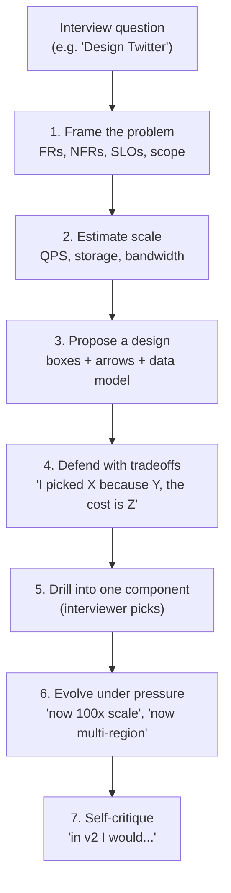

# System design tradeoffs — a Principal-level interview series

A **9-part tutorial series** built for a Principal / Staff system-design interview loop. Every page is **problem-first**, has **Mermaid diagrams**, **worked examples**, and a **common interview questions** section at the end.

The bar at Principal is not "do you know the patterns" — interviewers assume you do. It is:

1. Can you **frame the problem** (FRs, NFRs, SLOs, what's out of scope)?
2. Do you reason in **tradeoffs**, not recipes? Every choice has a cost.
3. Can you **defend a position** under "why not X?" pushback?
4. Do you see **second-order effects**: cost, ops burden, blast radius, team topology?
5. Can you **zoom in and out** — whole system, then drill into one component's data model?

This series teaches the **tradeoff vocabulary** you need for moves 2–5. Move 1 (framing) gets a dedicated page in [Beat 9 — interview framework & meta-skills](../system-design-interview-framework/).

---

## How to use this series

- **Read once top-to-bottom.** Each beat builds on the previous one (storage assumes you've internalized CAP; messaging assumes you've internalized consistency models).
- **Then practice by drilling worked examples.** Twitter timeline, URL shortener, rate limiter, chat app, distributed counter, news feed, ride-sharing dispatch, ad-click pipeline.
- **Come back to a single beat** the night before an interview. The closing **interview Q&A** sections are designed to be re-skimmable.

---

## The 9 beats

| # | Beat | Why it matters |
|---|------|----------------|
| 1 | [**Foundations — CAP, PACELC, the eternal triangle**](../system-design-foundations/) | The mental model that makes every other tradeoff make sense. |
| 2 | [**Data & storage tradeoffs**](../system-design-data-storage/) | SQL vs NoSQL, normalization, replication, sharding, consistency models. |
| 3 | [**Caching & performance**](../system-design-caching/) | Cache strategies, invalidation, hot keys, CDNs. |
| 4 | [**Async, messaging & decoupling**](../system-design-async-messaging/) | Sync vs async, queue vs log, delivery semantics, backpressure. |
| 5 | [**Reliability & failure**](../system-design-reliability/) | Retries, timeouts, circuit breakers, idempotency, blast radius, RPO/RTO. |
| 6 | [**Coordination & consensus**](../system-design-coordination/) | Leader election, distributed locks, sagas vs 2PC, Raft/Paxos at the right altitude. |
| 7 | [**Scale & topology**](../system-design-scale-topology/) | Vertical vs horizontal, stateful vs stateless, monolith vs microservices, cells, multi-region. |
| 8 | [**Cross-cutting patterns**](../system-design-cross-cutting/) | Push vs pull, fan-out on read vs write, sync vs async APIs to clients, observability. |
| 9 | [**Interview framework & meta-skills**](../system-design-interview-framework/) | The 6-step framework, signaling Principal, handling pushback, the recovery line. |

---

## See also

- [**Stock price fan-out walkthrough**](../system-design-stock-notifications/) — a full worked design problem (HRT-flavored).
- [**Distributed message queues**](../distributed-message-queues/) — log vs classic queue, deeper than Beat 4.
- [**Delivery semantics & idempotency**](../distributed-delivery-and-idempotency/) — pairs with Beat 5.
- [**Batch & stream compute**](../distributed-batch-and-stream-compute/) — pairs with Beats 2 and 8.
- [**Interview syllabus (master list)**](../interview-syllabus/) — the full backlog of interview topics.

---

## The Principal-level rubric (what interviewers grade)

This is the rubric I keep in my head while answering. It is the lens behind every page in this series.

A Principal candidate is **fluent at every step** and especially strong at steps 4, 6, and 7. Junior candidates often skip 4 (state the design without justifying), freeze at 6 (can't evolve), and never reach 7 (can't critique their own work).

Let's begin with [**Beat 1 — Foundations**](../system-design-foundations/).
