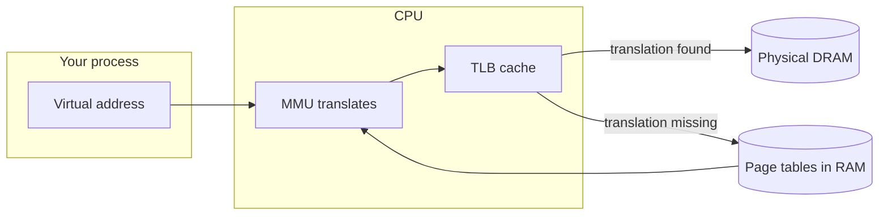
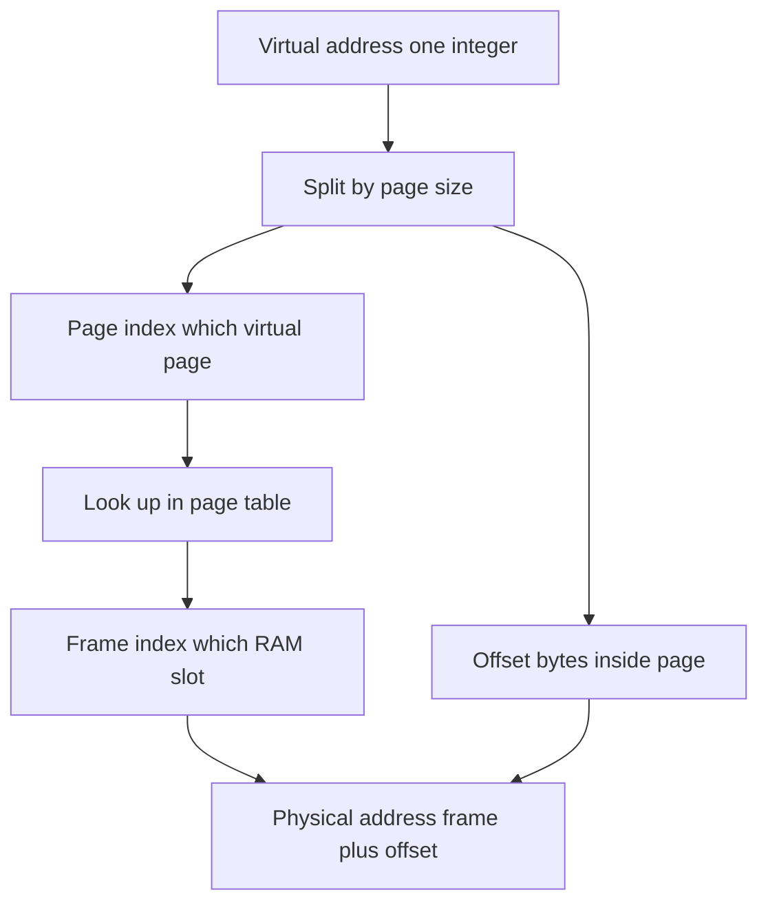
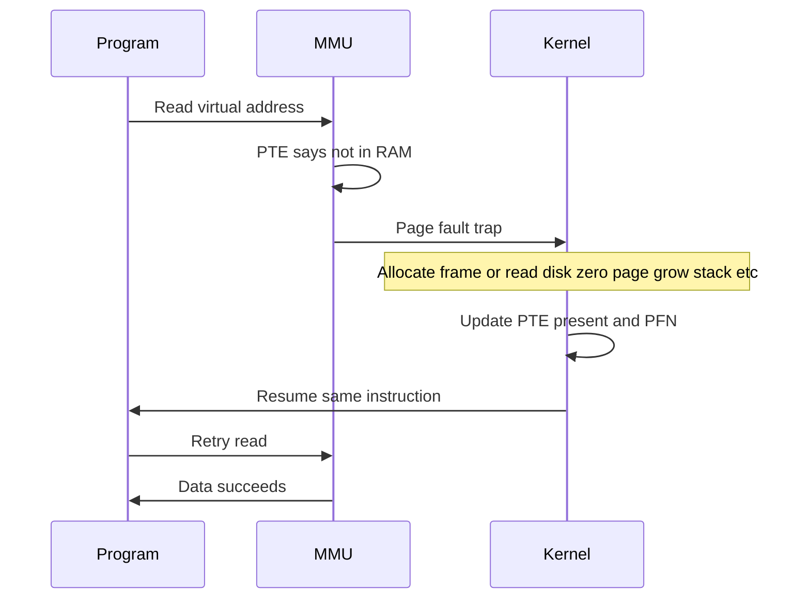
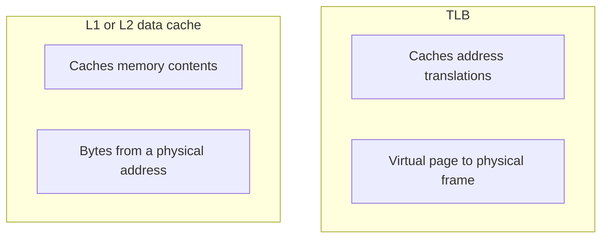
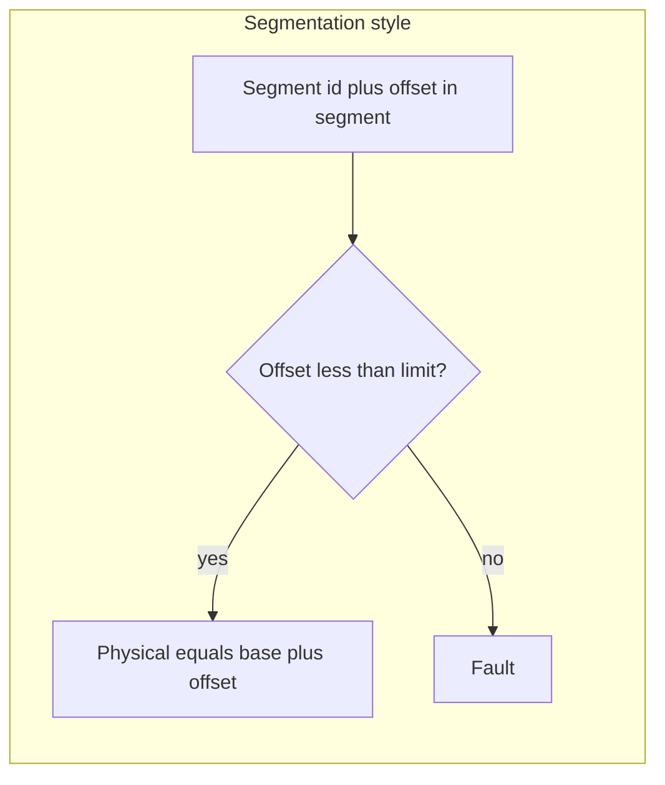
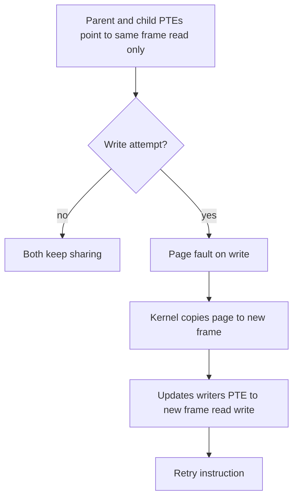

# Virtual memory, paging & segmentation

Notes for **OS / systems interviews**: how the machine turns the addresses your program uses into real bytes in RAM, what **paging** and **segmentation** mean, and common follow-up questions.

---

## Terms in plain English

Read this block once; the rest of the page reuses these words.

| Term | Plain meaning |
|------|----------------|
| **Virtual address** | The “house number” your **program** sees. Each process has its own numbering scheme; two programs can use the “same” number for **different** real memory. |
| **Physical address** | The real location in **RAM chips** (and memory-mapped devices). The whole machine shares one physical address space. |
| **MMU** (*memory management unit*) | Hardware in the CPU path that **translates** virtual → physical on every load/store. |
| **Page** | A **fixed-size** slice of a program’s virtual memory (often **4 KiB** on PCs). |
| **Frame** | A **same-sized** slice of physical RAM that can hold one page. |
| **Page table** | Data structures (in RAM) the **kernel** fills in. Each **entry** answers: “For this virtual page, which physical frame is it in (if any), and may we read/write/execute?” |
| **PTE** (*page table entry*) | One row in that idea: one virtual page’s mapping + permission bits. |
| **Page fault** | A **CPU trap** to the kernel: “this access does not match the current PTE.” The kernel may fix it (load from disk, allocate, copy-on-write) or **terminate** the program (e.g. segfault). |
| **TLB** (*translation lookaside buffer*) | A **small, fast cache** of recent translations (virtual page → physical frame). Avoids rereading page tables on every access. |
| **VPN / PFN** | **Virtual page number** (which page) and **physical frame number** (which frame). Interview shorthand; the low bits of the address are the **offset within** the page. |

**Overcommit** means the OS may let the **sum** of “I want this much virtual memory” exceed **installed RAM**, because not everyone touches every page at once; some pages live on **disk** (swap) until needed. **Toy:** three processes each **reserve** 2 GiB of virtual address space but each only **touches** 5 MiB of distinct pages — the machine might get by with **tens of MiB** of real frames for those touched pages, not 6 GiB of RAM.

---

## Big picture: who does what

Your code only ever names **virtual** addresses. The MMU turns that into a **physical** frame number + offset inside the page, using **page tables** (and the **TLB** as a shortcut).

- **TLB hit:** translation is already cached → fast path to DRAM.
- **TLB miss:** MMU **walks** page tables in memory → slower, then fills TLB.

### Example: same virtual page, two byte offsets

Take the [worked virtual address](#concrete-example-4-kib-pages) `0x12345678` (VPN `0x12345`, offset `0x678`). Another access to **`0x12345ABC`** uses the **same VPN** `0x12345` with a **different offset** `0xABC`. After the first miss, the TLB often holds **VPN `0x12345` → PFN `0xABCDE`**, so the second access is usually a **TLB hit** — the MMU reuses the cached translation and only combines PFN with the new offset. That is why “hot” loops in one page pay translation cost once.

---

## Splitting an address: page index + byte offset

Think of a virtual address in two parts: **which page** (index) and **which byte inside that page** (offset). The MMU looks up the page index in the page table to get a **frame**; the offset is copied through unchanged.

### Concrete example (4 KiB pages)

Assume **4 KiB** pages: \(4096 = 2^{12}\) bytes, so the **low 12 bits** are the **byte offset** inside the page and the **upper bits** are the **virtual page number (VPN)**.

Take one virtual address (32-bit style, easy to read in hex):

| | Hex | Decimal (optional) |
|---|-----|--------------------|
| **Virtual address** | `0x12345678` | `305,419,896` |

**Step 1 — offset** (low 12 bits = low **3** hex digits):

- `offset = 0x678` (= `1656` decimal)
- Formula: `virtual_address & 0xFFF` (mask keeps the bottom 12 bits).

**Step 2 — VPN** (everything above those 12 bits):

- `VPN = 0x12345` (= `74,565` decimal)
- Formula: `virtual_address >> 12` (same as dividing by 4096 and taking the integer part).

**Sanity check:** the page starts at `VPN × 4096 = 0x12345000`, and `0x12345000 + 0x678 = 0x12345678`. Good.

**Step 3 — page table** says which **physical frame** holds this virtual page. Suppose the PTE stores **PFN** `0xABCDE` (a made-up frame index for this example):

- Physical address = `PFN × page_size + offset` = `(0xABCDE << 12) | 0x678` = **`0xABCDE678`**.

So the **offset `0x678` is reused unchanged**; only the **upper physical bits** come from the frame number the OS installed in the PTE. Two different virtual pages in the same process could map to different PFNs; two **processes** could even map **different** VPNs to the **same** PFN (shared read-only library text — same bytes in RAM, two virtual addresses).

**Interview sound bite:** “For 4 KiB pages, **12 offset bits**; for 2 MiB huge pages you’d use **21** offset bits on x86-style sizing — always \(\log_2(\text{page size in bytes})\).”

---

## Demand paging (why “not in RAM” can be normal)

The OS does not have to put every page in RAM up front. A PTE can say **“not present.”** The first time the program **touches** that page, the CPU raises a **page fault**; the kernel allocates or loads data, updates the PTE, and the program continues. That lazy pattern is **demand paging**.

### Example: first read after `mmap`

You `mmap` a 64 KiB file read-only. The kernel may create PTEs with **“not in RAM yet”** instead of copying the whole file up front. The first `load` at virtual **`0x70001000`** faults; the handler reads the corresponding **4 KiB** file chunk into a free frame (say PFN **`0x2000`**), marks the PTE **present** with that PFN, and resumes. The faulting instruction runs again — this time **no fault** — and the load returns the file byte. Later loads in the same page usually avoid even that first fault’s work.

---

## Page faults are not always bugs

| Situation | What the kernel might do |
|-----------|---------------------------|
| First use of a **heap** page | Allocate a frame, often **zero-filled** (so you do not read old secrets), mark PTE present. |
| **Mapped file** (`mmap`) not yet read | Read the file into a frame (or attach cache), update PTE. |
| **Swap**: page was evicted | Read from swap back into a frame, update PTE. |
| **Copy-on-write** after `fork` | Parent and child shared a read-only copy; on **write**, copy the page, fix PTEs, retry. |
| **Invalid** address or **forbidden** write | Often **SIGSEGV** — this is the “real bug” case. |

**Demand-zero heap (tiny story):** `malloc` may extend the heap so a new virtual page exists but the PTE is **not present**. Your first `store` to **`0x405012`** (any address in that page) faults; the kernel grabs a frame **`0x88`**, **zeros** it (so you cannot read another process’s leftovers), sets **present + writable**, and retries the store.

---

## PTE flags (name a few in the interview)

Short labels only; exact bit names differ by CPU.

- **Present / valid** — Is there a frame in RAM for this page right now?
- **Read / write** — Can this page be written? Violation → fault.
- **User vs supervisor** — Can **application** code use this mapping, or only the kernel?
- **Accessed** — Hardware marks “someone touched this page” — helps **replacement** (which page to evict).
- **Dirty** — “This page was written” — must **write back** to disk or swap before reusing the frame.

**Eviction story:** If **dirty** is set when the kernel steals this frame for another virtual page, it must **flush** the frame to swap or the backing file first. If the page is **clean** (not dirty), RAM still matches disk and the frame can often be **reused without writing**.

---

## Why page tables are often “multi-level”

A single huge flat table for a large address space would waste enormous memory for **holes** (unused regions). **Tree-shaped** tables only allocate sub-tables for ranges that actually exist — **sparse** address spaces.

**Trade-off:** a TLB miss costs more pointer chases in RAM. The **TLB** exists partly to hide that cost.

**Sparseness in one sentence:** Your address space might have a **huge** unused hole (e.g. nothing mapped around `0x0000800000000000`). A multi-level table **allocates no inner tables** for that range until you map something there — unlike one giant array with one slot per page for the whole space.

When the kernel **changes** mappings (`munmap`, `mprotect`, context switch in some designs), it must **invalidate** stale TLB entries or two processes could see the wrong memory.

---

## TLB vs data cache (common “gotcha” question)

- **TLB:** “Which frame does this **virtual page** map to?”
- **Data cache:** “What are the **bytes** at this (often physical) location?”

They sit at different layers; both reduce latency.

**Same walkthrough, two questions:** Using the [translation above](#concrete-example-4-kib-pages), the **TLB** answers: “Virtual `0x12345678` → which PFN?” The **L1 data cache** answers: “What is the **value** at physical address **`0xABCDE678`**?” Translation first, then data fetch — two different caches.

---

## Segmentation (idea + how it differs from paging)

**Segmentation** groups memory into **logical chunks** of **different sizes** (code, data, stack). Each segment has a **base** (start in physical memory) and a **limit** (length). A **segmentation fault** originally meant “offset past limit”; today people say “segfault” for many **paging** protection errors too.

### Example: base + limit

**Code segment:** **base** = `0x00100000`, **limit** = `0x5000` (the segment spans `0x5000` bytes). Logical offset **`0x2000`** is in range → physical **`0x00100000 + 0x2000 = 0x00102000`**. Logical offset **`0x6000`** is **not** below `0x5000` → **fault** (no valid byte at “offset 0x6000 in this segment”).

| | **Paging** | **Segmentation** |
|---|------------|-------------------|
| **Chunk size** | Fixed (page size) | Variable per segment |
| **Waste inside a chunk** | Last page may be partly unused (**internal fragmentation**) | Less per chunk, but… |
| **Waste as holes in RAM** | Easier to pack fixed frames | Free memory can split into **many small gaps** (**external fragmentation**) — hard to place large segments |
| **Typical today** | **Dominates** Linux, macOS, Windows on common CPUs | Mostly **historical**; x86 still has segment **registers**, but user programs are usually a **flat** huge address space with **paging** doing the real work |

**Segmented paging** (hybrid): pick a segment first, then **page** inside that segment — gets logical grouping without requiring one giant contiguous physical chunk for the whole segment.

---

## Copy-on-write (COW) in one diagram

After `fork`, many pages can stay **shared** and **read-only** in both parent and child until one process **writes**.

### Example: two PTEs, one frame, then a write

Right after `fork`, suppose **parent and child** each have a PTE for **VPN `0x4000`** pointing to the **same PFN `0x9000`**, with **read-only** in both. A **read** in either process — no fault. The **child** does a **store** into that page → fault → kernel allocates **PFN `0x9001`**, copies the 4 KiB from `0x9000`, points the **child’s** PTE at **`0x9001`** read/write; the **parent’s** PTE still maps **`0x9000`** (often still read-only until the parent writes). Same VPN number in two address spaces can now refer to **different** physical frames.

---

## Thrashing (sound smart in one sentence)

If the process keeps **touching more pages than fit in RAM**, the kernel **evicts** pages constantly, then **faults** them back in — disk and table work dominate; CPU progress **stalls**. That is **thrashing**. Fixes: more RAM, fewer competing processes, smarter **replacement**, or tuning what the program touches (**working set**).

### Toy numbers

Your loop round-robins through **five** pages **A B C D E**, but the OS only gives this process **four** frames. Every time you touch **E**, something from **{A,B,C,D}** was evicted and faults back in on the next lap — useful fault rate explodes even though “total RAM” is not zero.

---

## Common interview questions (short answers)

**What is virtual memory?**  
Each process gets its own **virtual** addresses; the MMU maps them to **physical** frames using **page tables** so programs are **isolated**, can be **sparse**, and can use **more virtual size than RAM** with swap and demand loading.

**What is a page fault?**  
A trap to the kernel because the access does not match the PTE (not present, not writable, etc.). The kernel may **service** it (load, allocate, COW) or **kill** the process.

**Why fixed-size pages?**  
Simple hardware, simple **swap I/O**, and no **external fragmentation** of physical RAM the way variable segments had.

**Internal vs external fragmentation?**  
**Internal:** wasted space **inside** an allocated unit — e.g. a **100-byte** `malloc` lives alone in one **4 KiB** page: **4096 − 100 = 3996** bytes in that page are unused *inside* the “chunk” the allocator gave you. **External:** enough **total** free RAM, but not **one contiguous** block big enough for a **large segment** — a classic segmentation pain.

**Does 64-bit mean giant page tables?**  
No — **multi-level sparse** tables only allocate structure for used regions.

---

## Whiteboard sanity check

With **4 KiB** pages, the offset uses **12 bits** (because \(2^{12} = 4096\)). The **rest** of the virtual address indexes the page table hierarchy. The **number of possible pages** is huge; the OS does **not** store a full dense table for all of them. (Same rule as the [numeric example](#concrete-example-4-kib-pages): strip the low 12 bits for VPN, keep them for offset.)

---

## Further reading

- *OSTEP* — [Virtual Memory: The Basics](https://pages.cs.wisc.edu/~remzi/OSTEP/vm-paging.pdf) (free PDF chapter).

---

## Recap

**Virtual memory** gives each program its own address labels and strong **isolation**. **Paging** maps **fixed-size** virtual pages to physical **frames** using **page tables**; the **TLB** speeds repeat lookups; **page faults** let the OS **load**, **allocate**, or **copy-on-write** on demand. **Segmentation** is the variable-sized **logical** view; modern OSes still **talk** about segments, but **paging** carries most of the load.
